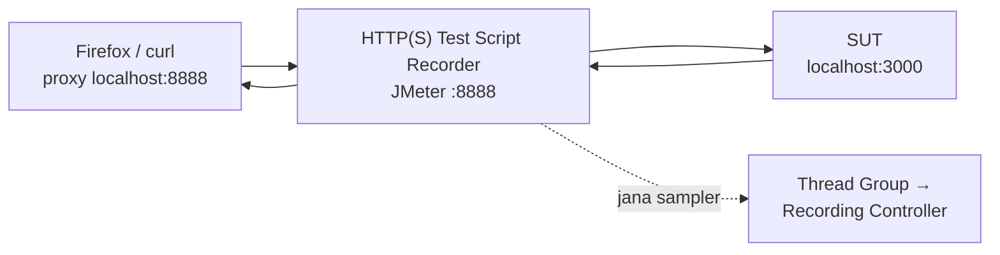

# Day 1 — Apache JMeter Fundamentals & Load Testing

[🧪 Day 1 Lab](./snippets/lab.md) · [🎤 Trainer Notes](./nota-penceramah.md) · [🎬 Record → Replay](./snippets/rakaman-e2e.md) · [🔒 HTTPS Recording](./snippets/rakaman-https-setup.md) · [🗂️ Reference test plans](./test-plans/) · [📄 Data dictionary](./data/README.md)

> Picture the last day before the road tax price goes up — thousands of citizens log in to the JPJ portal at the same time to renew their road tax. Can the system handle that surge? Today we learn to answer that question with **Apache JMeter**: building a **performance test** against the **eJPJ Portal (mock)**, sending HTTP requests, controlling load with a **Thread Group**, validating responses with **Assertions**, simulating user behaviour with **Timers** and a **CSV Data Set**, interpreting results in **Listeners**, and finally **recording** a real flow with the **HTTP(S) Test Script Recorder** — which will *fail* when replayed, and that failure opens the door to Day 2.

> ⚠️ **Ethics & the law:** Throughout this course we test **local copies** only (`sut/`, `http://localhost:3000`). Running a load test against a production/public system that you do **not** own, or without written permission, is illegal (equivalent to a **DoS** attack). All data is **synthetic** — not official JPJ data.

**What we will build today:**
- A first Test Plan that hits `/api/health` and `/`
- A 20-user load test against the road tax quotation endpoint
- Assertions (Response & Duration) + a Timer (think time)
- Parameterisation with **CSV Data Set Config** (each thread uses a different registration number)
- A recording of the login → vehicle list → pay road tax flow, and proof of why it fails on replay

---

## 🎯 Learning Objectives

By the end of today, participants will be able to:

| # | Objective (measurable) | Session | Evidence |
|---|------------------------|---------|----------|
| O1 | **Distinguish** the five types of performance test (Load, Stress, Spike, Soak, Scalability) and **state** the ethical conditions before generating load | S1 | Quiz S1; can name the course's legitimate target (`http://localhost:3000`) and what is required to test any other system (written permission + scope) |
| O2 | **Install** Java + JMeter (including `bin` on the **PATH** in Windows) and **run** the mock SUT | S1 | `jmeter -v` shows version 5.6.x from any folder; `http://localhost:3000/api/health` → `{"status":"ok",…}` |
| O3 | **Build** a first Test Plan (Thread Group → HTTP Request Defaults → HTTP Request → View Results Tree) | S2 | Exercise 1: View Results Tree green, code **200** |
| O4 | **Set** a load model (threads / ramp-up / loop) and **predict** the sample count before the run | S2 | Exercise 2: prediction 20 × 5 = **100** matches `# Samples` in the Summary Report |
| O5 | **Place** Config Elements, Assertions, Timers and Listeners in the correct position (**scope by position**) | S2 | Exercise 7 challenge: explain each element's scope to a colleague |
| O6 | **Interpret** Average, Median, 90/95/99% Line, Throughput and Error % in the Summary / Aggregate Report | S2 | Throughput, Average, Error % and 95% Line values recorded (Exercises 2 & 5) |
| O7 | **Add** a Response Assertion, Duration Assertion and Timer, and **explain** the effect of think time on throughput | S3 | Exercise 2 passes with 0% errors; Exercise 4: Error % rises when `ABC0000` (404) is injected |
| O8 | **Parameterise** requests with **CSV Data Set Config** and `${…}` variables | S3 | Exercise 3: View Results Tree shows a different registration number for each request |
| O9 | **Record** a flow with the **HTTP(S) Test Script Recorder** (+ CA certificate for HTTPS) and **explain** why replay fails (**401**) | S4 | Exercise 6: samplers recorded; replay of `04-rakaman-mentah.jmx` → 200 / 401 / 401; HTML report ~67% errors |

---

## 📅 Today's Schedule

| Time | Session | Activity | Focus |
|------|---------|----------|-------|
| 9.00 – 10.30 am | S1 | **Introduction to Performance Testing & Setup** | What & why of performance testing, 5 test types, ethics; install Java + JMeter (Windows PATH), run the SUT, get to know the GUI |
| 10.30 – 10.45 am | — | Break | |
| 10.45 am – 1.00 pm | S2 | **Test Plan Anatomy, Thread Group & Listeners** | Element tree & scope, first Test Plan, threads/ramp-up/loop, HTTP Request Defaults + Header Manager, View Results Tree / Summary / Aggregate Report |
| 1.00 – 2.00 pm | — | Lunch | |
| 2.00 – 3.30 pm | S3 | **Assertions, Timers & CSV Data Set** | Response + Duration Assertion, Constant / Uniform / Gaussian Timer, CSV Data Set Config (sharing mode, recycle), JPJ scenarios |
| 3.30 – 3.45 pm | — | Break | |
| 3.45 – 5.00 pm | S4 | **Recording a Test Plan: HTTP(S) Test Script Recorder** | Proxy 8888 + Firefox, CA certificate (HTTPS), failed replay (401), HTML report from a recording → bridge to Day 2 correlation |

---

## 🧭 Why today matters

Functional testing answers *"does it work?"*. Performance testing answers *"does it **hold up** when many people arrive at once?"*. Government systems such as the JPJ portal face predictable surges (road tax expiry dates, month-end, price announcements) — and a failure on that day is seen by the whole country.

| Without today | With today |
|---------------|------------|
| "The system is fast — I just tried it, it was quick." (1 user) | 20 → 200 virtual users with a controlled ramp-up |
| Code 200 = success | Assertions check **content** and **duration** — a wrong 200 still fails |
| Report the *average* response time | Report the **95th percentile** — that is what the SLA measures |
| Send `WXY1234` a thousand times (happy cache, fake numbers) | CSV feeds different data on each iteration |
| Type 30 samplers one by one | Record the real flow in 2 minutes — then correlate (Day 2) |
| "Let's just test the production system directly" | Test a mock / staging environment with **written permission** only |

---

## S1 — Introduction to Performance Testing & Setup (9.00 – 10.30 am)

### 1.1 What is performance testing

**Performance testing** measures how fast, stable and scalable a system is under a given load — not whether it *works* (that is functional testing), but whether it *holds up* when many users arrive at the same time.

> **Concept — Anatomy of a performance test:** Every test covers: **Load** (how many concurrent users & their arrival pattern), **Scenario** (the sequence of requests that mimics real users), **Metrics** (throughput, response time, error rate), and **Criteria** (SLA/NFR — pass/fail thresholds). Day 1 focuses on building Load + Scenario and reading basic Metrics.

**Our domain:** picture the last day before the road tax price goes up — thousands of citizens log in to the JPJ portal at once to renew their road tax. Can the system handle that surge? That is the question performance testing answers.

| Metric | Short meaning | Where we see it today |
|--------|---------------|-----------------------|
| **Response time** | Time from sending the request until the full response is received (ms) | Average, Median, 90/95/99% Line |
| **Throughput** | Number of requests completed per second (req/s) | Summary / Aggregate Report |
| **Error %** | Percentage of failed samples (HTTP 4xx/5xx, network errors, **or failed assertions**) | Summary / Aggregate Report |
| **Concurrency** | Number of virtual users active at the same time | Thread Group (threads) |

### 1.2 Types of performance test

| Type | Question | Load pattern |
|------|----------|--------------|
| **Load test** | Can the system handle the *expected* load? | Users held at normal/peak level |
| **Stress test** | Where does the system *break*? | Increase users until it fails |
| **Spike test** | What happens when load *surges* suddenly? | Sudden surge (e.g. road tax day) |
| **Soak / Endurance** | Is there a *memory leak* / long-term degradation? | Moderate load for hours/days |
| **Scalability** | Does the system *scale* when we add resources? | Same load, compare configurations |

> 💡 **JPJ examples:** "1,000 road tax renewals per hour on a normal day" = **Load**. "The last night before the price rise, 10× traffic within 5 minutes" = **Spike**. "Portal up for 72 hours over a long holiday without a restart" = **Soak**.

### 1.3 Ethics & the law — rule number one

JMeter is a **load generator**. From the server's point of view, 200 JMeter threads look exactly like 200 attackers. Therefore:

| ✅ Permitted | ❌ Prohibited |
|-------------|--------------|
| The course's local mock: `http://localhost:3000` (`sut/`) | The real JPJ portal / any public site without permission |
| A test/staging environment **owned by your organisation**, with **written permission** stating the scope, hosts, time window and load level | "Just a quick try" on production during office hours |
| Demo sites that openly allow testing (e.g. `blazedemo.com`, light load) | Using real personal data (IC numbers, citizens' registration numbers) in a CSV |

> ⚠️ Load testing without permission = a **denial-of-service (DoS) attack** in the eyes of the law, even if your intentions are good. In a government organisation, obtain written approval from the system owner **and** the infrastructure/security team, notify the monitoring team (NOC/SOC) before the run, and agree who is allowed to press "Stop".

> 💡 **Safe habit:** always confirm Server=`localhost`, Port=`3000` (HTTP Request Defaults) before pressing Start.

### 1.4 Install Java (JDK 11+, 17/21 LTS recommended)

JMeter runs on **Java**. Install **JDK 11 or newer** (JDK 17/21 LTS recommended).

```bash
java --version      # sahkan Java wujud
```

- **macOS:** `brew install openjdk@21` (or download from Adoptium/Temurin).
- **Windows:** download the installer from [adoptium.net](https://adoptium.net/), or `winget install EclipseAdoptium.Temurin.21.JDK`.
- **Linux:** `sudo apt install openjdk-21-jdk`.

### 1.5 Install Apache JMeter

- **macOS:** `brew install jmeter`, then run `jmeter`.
- **Manual (all OSes):** download the binary from [jmeter.apache.org/download_jmeter.cgi](https://jmeter.apache.org/download_jmeter.cgi), unzip it, and run:
  - `bin/jmeter` (macOS/Linux) or `bin\jmeter.bat` (Windows) — opens the **GUI**.

```bash
jmeter --version   # sahkan JMeter wujud
```

#### Windows: run `jmeter` from anywhere (add it to PATH)

By default, Windows only recognises `jmeter` when you are inside the `bin` folder. To type `jmeter` from **any** folder, add JMeter's `bin` folder to the **PATH**:

1. **Unzip** JMeter to a permanent location, e.g. `C:\apache-jmeter-5.6.3`.
2. Open **Start → type "environment variables" → "Edit the system environment variables" → Environment Variables…**
3. Under **User variables** (no admin required), select **Path → Edit → New**, and paste:
   ```
   C:\apache-jmeter-5.6.3\bin
   ```
   Click **OK** on every window.
4. **Close and reopen** Command Prompt/PowerShell (PATH changes only take effect in a new terminal).
5. Verify:
   ```powershell
   jmeter -v
   ```

**PowerShell method (no admin — user PATH):**
```powershell
[Environment]::SetEnvironmentVariable("Path", $env:Path + ";C:\apache-jmeter-5.6.3\bin", "User")
# tutup & buka semula terminal, kemudian:  jmeter -v
```

> **JMeter needs Java.** If `jmeter -v` complains that Java cannot be found: install **JDK 11+**, set **`JAVA_HOME`** to the JDK folder (e.g. `C:\Program Files\Eclipse Adoptium\jdk-21…`) and add `%JAVA_HOME%\bin` to the PATH in the same way. Verify: `java -version`.

> **Note:** On Windows, `jmeter` actually runs `jmeter.bat` in the `bin` folder. All commands in these notes (`jmeter -n -t … -l … -e -o …`) work the same way; just use backslashes for Windows paths (e.g. `hari-2\test-plans\06-ujian-beban-nogui.jmx`).

> ⚠️ **Common mistake:** Unzipping into a folder with **spaces or special characters** (e.g. `C:\Program Files\…` or `Downloads\apache-jmeter-5.6.3 (1)`), or running it directly from inside the `.zip` file without unzipping. Use a short path such as `C:\apache-jmeter-5.6.3`.

### 1.6 GUI vs non-GUI

> **Concept — GUI vs non-GUI:** The JMeter GUI is only for **building & debugging** plans. For **real load**, always run in **non-GUI** mode (`jmeter -n -t plan.jmx ...`) because the GUI uses a lot of memory and **slows down** the load generator. Today we build in the GUI; on Day 2 we run real load in non-GUI mode.

| Flag | Meaning |
|------|---------|
| `-n` | non-GUI |
| `-t plan.jmx` | Test Plan to run |
| `-l hasil.jtl` | Results file (CSV) |
| `-e -o folder/` | Generate the HTML dashboard report after the run (the folder must be empty / not yet exist) |

### 1.7 Run the System Under Test (SUT)

Open a terminal window and leave the mock server running for the whole workshop:

```bash
cd sut
node server.js
```

You should see `Portal eJPJ (TIRUAN) berjalan di  http://localhost:3000`. Open that URL in a browser to see the list of endpoints. (Requires **Node.js 18+**; no `npm install` needed.)

| Endpoint | Token required? | Response | Used in |
|----------|-----------------|----------|---------|
| `GET /api/health` | No | `{"status":"ok","masa":…}` | S2 — first Test Plan |
| `GET /api/kenderaan/:no/cukai` | No | `{no_pendaftaran, amaun, tempoh_bulan}`; **404** if not found | S2–S3 — load & CSV |
| `GET /api/saman?no_kp=` | No | `{no_kp, saman:[…]}` | S3 — scenarios |
| `POST /api/log-masuk` | — | Body `{no_kp, kata_laluan}` → `{token, csrf, nama, mesej}` | S4 — recording |
| `GET /api/kenderaan?no_kp=` | **Yes** (`Authorization: Bearer <token>`) | `{no_kp, kenderaan:[…]}`; **401** without a valid token | S4 — recording |
| `POST /api/kenderaan/:no/bayar-cukai` | **Yes** + `csrf` in the body | `{no_resit, …, status:"BERJAYA"}`; **401** / **403** / ~1% **500** | S4 — recording |

Synthetic users: `800101015500` (WXY1234, VAB88), `900202025600` (JQK7788), `850303035700` (BMT3030, PKL909). Any non-empty password is accepted.

**Tuning SUT behaviour** (for demos): `PORT` (default 3000), `LATENCY_MIN` / `LATENCY_MAX` (default 40–180 ms), `ERROR_RATE` (default `0.01` = 1% of payments fail with 500).

```bash
curl -s http://localhost:3000/api/health              # semakan pantas
LATENCY_MIN=300 LATENCY_MAX=900 node server.js        # SUT "lambat" (S3)
```

> 🪟 In Windows **Command Prompt**, set the variables first: `set LATENCY_MIN=300` then `set LATENCY_MAX=900` then `node server.js`. In **PowerShell**: `$env:LATENCY_MIN=300; $env:LATENCY_MAX=900; node server.js`.

### 1.8 Get to know the JMeter interface

| Area | Function |
|------|----------|
| **Menu / Toolbar** (top) | Open/Save `.jmx`, **Start (▶)** / **Stop** buttons, **Clear** results |
| **Test tree** (left) | Test Plan structure — right-click to **Add** elements |
| **Configuration panel** (right) | Settings of the selected element |
| **Log** (bottom, warning triangle icon) | JMeter errors & warnings |

Each Test Plan is saved as a single **`.jmx`** file (XML format).


> 💡 **GUI tip:** **Clear All** (double broom icon) empties every Listener before a new run — otherwise results from the old run get mixed in. The **Stop** button (square) stops immediately; **Shutdown** waits for threads to finish their current sample.

### 🎯 Quiz S1

1. On the last night before the road tax price goes up, portal traffic surges 10× within a few minutes. Which type of test is most suitable for simulating this situation?
   - [ ] Soak / Endurance test
   - [x] Spike test
   - [ ] Scalability test
   - [ ] Functional test
   > A spike test measures how the system responds to a **sudden surge**. A soak test applies moderate load over a long period; a scalability test compares resource configurations.

2. A colleague suggests "a quick test" of the real JPJ portal with 50 threads from the course laptop. What is the correct action?
   - [ ] Go ahead, because 50 threads is too small to affect the server
   - [ ] Go ahead, but at night so that no users are affected
   - [x] Refuse — test only the mock `http://localhost:3000`, or an environment covered by written permission with a clear scope
   > Without written permission, any load against a system you do not own is equivalent to a DoS attack — the size of the load or the time of day does not change its legal status.

3. Why is real load run in **non-GUI** mode (`jmeter -n`)?
   - [ ] GUI mode cannot run more than one thread
   - [x] The GUI uses a lot of memory and slows down the load generator, making the numbers inaccurate
   - [ ] Non-GUI mode sends requests using a faster protocol
   > The GUI is only for building & debugging. Under load, a JVM busy drawing the GUI and holding results in memory becomes the bottleneck — you end up measuring JMeter, not the SUT.

4. On Windows, you have just added `C:\apache-jmeter-5.6.3\bin` to Path, but `jmeter -v` in the same Command Prompt still gives *"'jmeter' is not recognized"*. What is the most likely cause?
   - [x] PATH changes only take effect in a **new** terminal — close it and reopen
   - [ ] JMeter does not support Windows
   - [ ] Path must be added under System variables with admin rights
   > A terminal that is already open keeps a copy of the old PATH. User variables are enough (no admin required).

---

## S2 — Test Plan Anatomy, Thread Group & Listeners (10.45 am – 1.00 pm)

### 2.1 Anatomy of a JMeter Test Plan

Before building, understand the main building blocks. Everything is arranged as a **tree** — an element's position determines its **scope**.

```
Test Plan
└── Thread Group            (berapa pengguna, ramp-up, gelung)
    ├── HTTP Request Defaults   (Config: server/port lalai)
    ├── HTTP Header Manager     (Config: header dikongsi)
    ├── HTTP Request            (Sampler: satu permintaan)
    │   ├── Response Assertion  (semak kandungan respons)
    │   └── JSON Extractor      (Post-Processor: ekstrak nilai)
    ├── Constant Timer          (Timer: think time)
    └── View Results Tree       (Listener: papar keputusan)
```

| Category | Role | Examples |
|----------|------|----------|
| **Thread Group** | Defines the virtual user population | number of threads, ramp-up, loops |
| **Sampler** | Sends one request | **HTTP Request**, JDBC, FTP |
| **Config Element** | Shared settings (not a request) | HTTP Request Defaults, Header/Cookie/Cache Manager, **CSV Data Set Config** |
| **Timer** | Pause between requests (think time) | Constant, Uniform Random, Gaussian |
| **Assertion** | Checks the response is correct | Response, Duration, JSON Assertion |
| **Pre/Post-Processor** | Runs before/after a sampler | JSON Extractor, JSR223 |
| **Listener** | Collects & displays results | View Results Tree, Summary/Aggregate Report |

> **Key concept — Scope by position:** **Config**, **Timer**, **Assertion** and **Listener** elements affect **all samplers at the same level or deeper** (siblings & children). Place an element under the Thread Group → it affects every sampler; place it as a **child** of one sampler → it affects **only** that sampler. Wrong placement is the most common source of bugs for beginners.

**Execution order** for each sampler (independent of the visual order in the tree, except among elements of the same type):

```
Config Elements → Pre-Processors → Timers → SAMPLER → Post-Processors → Assertions → Listeners
```

> 💡 This explains two things that surprise beginners: (1) a **Timer** runs **before** the sampler (pause first, then send), and (2) a Timer under a Thread Group with 3 samplers adds the pause **3 times** per iteration — once for each sampler in its scope.

### 2.2 Step 1 — Your first Test Plan

Let's build the simplest test — one user hitting `/api/health`.

1. Open JMeter. You already have an empty **Test Plan**.
2. **Right-click Test Plan → Add → Threads (Users) → Thread Group.**
3. On the Thread Group, set for now: **Number of Threads = 1**, **Ramp-up = 1**, **Loop Count = 1**.
4. **Right-click Thread Group → Add → Config Element → HTTP Request Defaults.** Fill in:
   - **Protocol:** `http` · **Server Name or IP:** `localhost` · **Port Number:** `3000`
5. **Right-click Thread Group → Add → Sampler → HTTP Request.** Fill in:
   - **Method:** `GET` · **Path:** `/api/health` (leave server/port empty — inherited from Defaults)
6. **Right-click Thread Group → Add → Listener → View Results Tree.**
7. Click **Save** (`.jmx`), then **Start (▶)**.

In View Results Tree, click the sample — you should see a **green** icon, code **200**, and the response body `{"status":"ok",...}`.

> **Concept — HTTP Request Defaults:** This Config sets **default values** (server, port, protocol) that are **inherited** by every HTTP Request beneath it. So when the SUT address changes (e.g. from `localhost` to a test server), you change it in **one place** only.

> 💡 **The three View Results Tree tabs:** **Sampler result** (code, time, size), **Request** (the URL + headers that were *actually* sent — check here when something looks odd), **Response data** (the response body; choose *JSON* in the dropdown for a pretty view).

**Add a second sampler:** repeat step 5 with **Path** `/` — the HTML info page that lists the endpoints. Your plan now hits `/api/health` and `/`.

> See the finished file: [`test-plans/01-hello-jpj.jmx`](./test-plans/01-hello-jpj.jmx).

### 2.3 Step 2 — Thread Group: the load model

The **Thread Group** is the heart of a load test — it defines the **virtual user population**.

| Field | Meaning | Example |
|-------|---------|---------|
| **Number of Threads (users)** | Number of concurrent virtual users | `20` |
| **Ramp-Up Period (seconds)** | Time taken to launch **all** threads | `10` (2 users/second) |
| **Loop Count** | How many times each thread repeats the scenario | `5` (or *Infinite*) |

> **Key concept — Ramp-up:** Do not launch all users at once (ramp-up = 0) unless it really is a spike test — it creates an unrealistic "shock". A gradual ramp-up (e.g. 20 users over 10s) mimics real user arrivals and gives the system time to *warm up*.

> **Concept — total requests:** Number of samples = **Threads × Loop Count** (with one sampler). 20 × 5 = **100** requests. Check this in the Summary Report to confirm the test ran in full.

**Calculate before you click Start:**

| Threads | Ramp-up | Loop | Samplers | Total samples | New thread every… |
|---------|---------|------|----------|---------------|-------------------|
| 1 | 1 | 1 | 2 (`/api/health`, `/`) | 2 | — |
| 20 | 10 | 5 | 1 | **100** | 0.5 s |
| 10 | 5 | 10 | 1 | **100** | 0.5 s |
| 50 | 20 | 1 | 1 | 50 | 0.4 s |

> ⚠️ **Common mistake:** "20 threads = 20 concurrent requests all the time." Not necessarily — if each thread finishes its loops before the last thread is launched (long ramp-up, short loops), the real concurrency is much lower. Look at the *Active Threads* chart in the HTML report (Day 2).

Other fields worth knowing: **Action to be taken after a Sampler error** (*Continue* is the default — carry on; *Start Next Thread Loop* — start a new iteration; *Stop Thread* / *Stop Test*), and **Specify Thread lifetime** (Duration/Startup delay — for time-based tests, Day 2).

Change your Thread Group to **20 / 10 / 5** for the next step.


### 2.4 Step 3 — HTTP Header Manager

Many APIs require **headers** (e.g. `Content-Type`, `Accept`, `Authorization`). The **HTTP Header Manager** sets headers shared by the samplers in its scope.

1. **Right-click Thread Group → Add → Config Element → HTTP Header Manager.**
2. Click **Add** and enter: Name `Accept`, Value `application/json`.

> **Concept — Other useful Config Elements:**
> - **HTTP Cookie Manager** — stores & re-sends cookies (needed for cookie-based sessions).
> - **HTTP Cache Manager** — mimics the browser cache (avoids reloading static resources).
> For our JSON API, the Header Manager is enough; we use a token (not cookies) on Day 2.

> 💡 **Header Managers can be nested:** one under the Thread Group (`Accept` for everything) + one as a child of a particular `POST` sampler (`Content-Type: application/json`). JMeter **merges** both for that sampler. This is the pattern you will see in the recording (S4).

### 2.5 Step 4 — Listeners: reading the results

A **Listener** collects & displays results. The three most important:

| Listener | Use | Warning |
|----------|-----|---------|
| **View Results Tree** | Debugging — see every request/response in full | **Very heavy** — for 1–2 users only, disable it under load |
| **Summary Report** | Summary per label: # samples, Average, Min/Max, Error %, Throughput | Lightweight — suitable under load |
| **Aggregate Report** | Like Summary + **Median**, **90/95/99 percentile** | Lightweight |

Add all three under the Thread Group. Run the test (20/10/5) and observe:

- **# Samples** = 100
- **Average** — mean response time (ms)
- **Throughput** — requests/second
- **Error %** — percentage of failed samples

**Column dictionary** (JMeter 5.6):

| Column | Meaning | Report |
|--------|---------|--------|
| `# Samples` | Number of samples for that label | Both |
| `Average` | Mean response time (ms) | Both |
| `Median` | 50% of samples completed within this time or less | Aggregate |
| `90% Line` / `95% Line` / `99% Line` | Percentile — 90/95/99% of samples completed within this time or less | Aggregate |
| `Min` / `Max` | Fastest / slowest sample | Both |
| `Std. Dev.` | Spread of response times — high = inconsistent | Summary |
| `Error %` | Percentage of failed samples | Both |
| `Throughput` | Samples per second (or per minute, check the `/sec` `/min` unit) | Both |
| `Received KB/sec` / `Sent KB/sec` | Bandwidth | Both |

> **Key concept — DO NOT use GUI listeners during real load.** View Results Tree keeps **every** response in memory → the load generator runs out of RAM and the numbers become inaccurate. For real load (Day 2), remove GUI listeners and write to a **`.jtl`** file via `-l` in non-GUI mode.

> **Concept — Averages can lie:** The mean hides peaks. Always look at the **percentiles** — "95th percentile = 800 ms" means 95% of requests completed in ≤ 800 ms (and 5% were worse). SLAs are usually written in percentiles, not averages.

> 💡 **Example:** 99 requests at 100 ms + 1 request at 10,000 ms → Average ≈ **199 ms** ("OK!"), but the 100th user waited 10 seconds. `99% Line` and `Max` reveal it.


### 🎯 Quiz S2

1. A Thread Group is set to **20 threads**, **ramp-up 10 s**, **loop 5**, with **one** HTTP Request. How many `# Samples` do you expect in the Summary Report?
   - [ ] 20
   - [ ] 25
   - [x] 100
   - [ ] 200
   > Total samples = Threads × Loop Count × number of samplers = 20 × 5 × 1 = 100. Ramp-up does not change the total — only the rate at which threads are launched.

2. A Response Assertion is placed as a **child** of sampler A. Sampler B is a sibling of A under the same Thread Group. Which sampler does the assertion check?
   - [x] Sampler A only
   - [ ] Samplers A and B
   - [ ] Every sampler in the Test Plan
   > Scope by position: a child of one sampler only affects that sampler. To check both A and B, place the assertion under the Thread Group (as a sibling of both).

3. A manager asks for the "95th percentile response time". Which listener shows it directly?
   - [ ] Summary Report
   - [x] Aggregate Report
   - [ ] View Results Tree
   > The Aggregate Report has `Median`, `90% Line`, `95% Line` and `99% Line` columns. The Summary Report only has Average, Min, Max and Std. Dev.

4. The SUT address changes from `localhost:3000` to another test server. Your plan has 15 HTTP Requests. What is the most correct way to update it?
   - [ ] Change the Server Name in each of the 15 samplers
   - [x] Change **HTTP Request Defaults** once; samplers with an empty Server inherit it
   - [ ] Add an HTTP Header Manager with a `Host` header
   > HTTP Request Defaults is a Config Element that supplies default values to every HTTP Request in its scope — one place to change (and one place to check from an ethics standpoint).

---

## S3 — Assertions, Timers & CSV Data Set (2.00 – 3.30 pm)

### 3.1 Step 5 — Assertions: confirm the response is correct

Code **200** does not necessarily mean the response is **correct**. An **Assertion** validates the content.

#### Response Assertion

1. **Right-click HTTP Request → Add → Assertions → Response Assertion.**
2. **Field to Test:** *Text Response* · **Pattern Matching Rules:** *Substring* · **Patterns to Test:** add `amaun`.

Now a sample only "passes" if the response body contains `amaun`.

| Pattern Matching Rule | Meaning | Example |
|-----------------------|---------|---------|
| **Contains** | Contains a **regex** match | `"amaun":\s*\d+` |
| **Matches** | The **entire** response matches the regex | rarely used for JSON |
| **Equals** | Exactly equal (text) | short fixed responses |
| **Substring** | Contains plain text (no regex) — the safest | `amaun`, `BERJAYA` |
| **Not** (checkbox) | Inverts — passes if there is **no** match | `ralat` |

> 💡 Another useful **Field to Test**: **Response Code** (e.g. `200`) — and the **Ignore Status** checkbox if you *want* to test that a 404 is returned (negative testing).

#### Duration Assertion

1. **Add → Assertions → Duration Assertion.**
2. **Duration in milliseconds:** `2000` — the sample fails if it takes longer than 2 seconds.

> **Concept — Assertions change the meaning of "failed":** Without assertions, only network/HTTP errors count as failures. With assertions, a response with the **wrong content** or that is **too slow** also counts as a failure → your **Error %** reflects real quality, not merely a successful connection.

Sampler `GET /api/kenderaan/WXY1234/cukai` with both assertions → see [`test-plans/02-cukai-beban.jmx`](./test-plans/02-cukai-beban.jmx) (Response Assertion *"Respons mengandungi 'amaun'"*, Duration Assertion *"Tempoh < 2000ms"*, Constant Timer *"Think Time 300ms"*, Header Manager `Accept: application/json`, Summary + Aggregate Report, and a View Results Tree labelled *"nyahaktif semasa beban"* (disable under load)).

> ⚠️ **Assertions have a cost too:** every assertion runs for every sample. Complex regexes over large responses can burden the load generator. Prefer **Substring** or a simple JSON Assertion.

### 3.2 Step 6 — Timers: think time

Real users do **not** fire requests back to back — they read, think and type. A **Timer** adds these pauses so the load is realistic.

| Timer | Behaviour | Fields |
|-------|-----------|--------|
| **Constant Timer** | Fixed pause (e.g. 300 ms) for each sampler | *Thread Delay* |
| **Uniform Random Timer** | Uniformly random pause (base + random range) | *Constant Delay Offset* + *Random Delay Maximum* — e.g. 500 + 1000 → 0.5–1.5 s |
| **Gaussian Random Timer** | Normally distributed random pause (most realistic) | *Constant Delay Offset* + *Deviation* — e.g. 1000 ± 300 ms |

1. **Right-click Thread Group → Add → Timer → Constant Timer.** Delay `300`.

> **Concept — think time affects throughput:** Adding think time **lowers** throughput (threads wait instead of sending). This is **correct** — throughput without think time is unrealistic and can put false load on the system. To reach a specific *requests/second* target, tune the **number of threads** and **think time** together, or use a **Throughput Controller / Timer** (Day 2).

> 💡 **Rough estimate:** throughput ≈ threads ÷ (response time + think time). 20 threads, ~0.1 s response, 0.3 s think time → ≈ 20 ÷ 0.4 = **~50 req/s** (once ramp-up is complete). Without a timer → ≈ 20 ÷ 0.1 = ~200 req/s.

> ⚠️ **Timer time is not counted** in the sample's response time (unless you use a Transaction Controller with certain options — Day 2). So the Average does not "go up" because of the timer; what goes down is throughput.

### 3.3 Step 7 — Parameterisation with CSV Data Set Config

Sending `WXY1234` a thousand times is unrealistic — it hits the cache and does not test data variety. **CSV Data Set Config** feeds different values to each thread/iteration.

The file [`data/kenderaan.csv`](./data/kenderaan.csv) (synthetic — see the [data dictionary](./data/README.md)):

```
no_pendaftaran,model
WXY1234,Perodua Myvi 1.5
VAB88,Honda Civic 1.8
JQK7788,Proton X50 1.5T
BMT3030,Toyota Hilux 2.4
PKL909,Perodua Axia 1.0
```

1. **Right-click Thread Group → Add → Config Element → CSV Data Set Config.**
2. Fill in:
   - **Filename:** `../data/kenderaan.csv` *(relative to the location of the `.jmx` file)*
   - **Variable Names:** `no_pendaftaran,model`
   - **Ignore first line:** `True` (header row) · **Recycle on EOF:** `True` · **Stop thread on EOF:** `False`
   - **Sharing mode:** `All threads`
3. Change the sampler path to: `/api/kenderaan/${no_pendaftaran}/cukai`.
4. Run it (10 users × 10 loops). In View Results Tree, confirm that each request uses a different number.

> **Concept — `${name}` is a JMeter variable:** The syntax `${no_pendaftaran}` substitutes the value from the CSV at run time. Values can come from a CSV, User Defined Variables, an Extractor (Day 2), or built-in functions such as `${__Random(1,100)}`.

> **Concept — Sharing mode:** *All threads* = one shared CSV queue (the next line goes to the next thread). *Current thread group* / *Current thread* keep separate queues. For unique-per-user data, use with care + `Recycle=False` + `Stop thread=True`.

| EOF combination | What happens after the last line | Suitable for |
|-----------------|----------------------------------|--------------|
| Recycle `True`, Stop thread `False` | Goes back to the first line | Reference data (road tax quotations) — **our choice** |
| Recycle `False`, Stop thread `True` | The thread stops when the data runs out | Each line must be used **once** only (e.g. unique accounts) |
| Recycle `False`, Stop thread `False` | The variable becomes `<EOF>` | Rare — usually a bug |

> ⚠️ **Common mistake:** *Ignore first line* = `False` while the file has a header row → the first iteration sends `/api/kenderaan/no_pendaftaran/cukai` → **404**. Another one: spaces in *Variable Names* (`no_pendaftaran, model`) make the variable name ` model` (with a space).

> The reference plan [`test-plans/03-csv-berparameter.jmx`](./test-plans/03-csv-berparameter.jmx) also uses a **Uniform Random Timer (0.5–1.5s)** — Constant Delay Offset 500 ms + Random Delay Maximum 1000 ms.


*(The image above is from Day 2 — the `pengguna.csv` file. For Day 1 use `../data/kenderaan.csv` and `no_pendaftaran,model`.)*

> See the finished file: [`test-plans/03-csv-berparameter.jmx`](./test-plans/03-csv-berparameter.jmx).

> 🧪 **Learn from failure:** add a fake line `ABC0000,Kereta Hantu` to the CSV → the endpoint returns **404** and the `amaun` Response Assertion fails → Error % rises. This is Exercise 4.

### 3.4 Real JPJ scenarios (use cases)

Connect the Day 1 skills to real operational questions. All of them use Day 1 tools only.

#### Case 1 — Basic system health
`GET /api/health` with 50 users, ramp 20s. **Question:** is throughput stable? Error % = 0?

#### Case 2 — Road tax lookup load
`GET /api/kenderaan/${no_pendaftaran}/cukai` parameterised with CSV, 30 users × 10 loops + Response Assertion. **Question:** what is the 95th percentile? (Use the Aggregate Report.)

#### Case 3 — Summons lookup
`GET /api/saman?no_kp=900202025600`, 20 users. Add a Response Assertion containing `saman`. **Question:** compare the latency with the road tax endpoint.

#### Case 4 — Effect of think time
Run Case 2 twice: (a) without a timer, (b) with a 1000 ms Constant Timer. **Question:** how do throughput & Average change? Why?

#### Case 5 — Effect of server latency
Restart the server with `LATENCY_MIN=300 LATENCY_MAX=900 node server.js`. Repeat Case 2. **Question:** which affects users more — throughput or percentiles?

> **🎯 Combined challenge:** Build one Test Plan with HTTP Request Defaults + Header Manager + CSV Data Set + 2 samplers (road tax & summons), each with a Response Assertion, a Constant Timer, and a Summary + Aggregate Report. Run 25 users × 8 loops and report the Error %, Average and 95th percentile to the class.

### 🎯 Quiz S3

1. An endpoint returns **HTTP 200** but its body is `{"ralat":"Sistem sibuk"}`. Without any assertion, how does JMeter count this sample?
   - [x] Passed — without assertions, only HTTP/network errors count as failures
   - [ ] Failed — JMeter detects the word "ralat" (error) automatically
   - [ ] Ignored and not counted in # Samples
   > That is why we add a Response Assertion (e.g. Substring `amaun`) — so that responses with the wrong content are counted in Error %.

2. You add a **1000 ms Constant Timer** to a 20-thread plan without changing anything else. What is the most noticeable effect?
   - [ ] The Average response time rises by about 1000 ms
   - [x] Throughput drops because each thread waits before every request
   - [ ] Error % rises because the Duration Assertion fails
   > Timer time is not counted in the sample's response time. A thread that is "thinking" is not sending, so requests per second drop — that is realistic, not a bug.

3. The **Filename** `../data/kenderaan.csv` in a CSV Data Set Config is interpreted relative to what?
   - [ ] The terminal's current folder where `jmeter` was started
   - [ ] JMeter's `bin` folder
   - [x] The location of the `.jmx` file
   > Relative paths are resolved from the Test Plan's folder. That is why the plan can be run from any working directory as long as the `test-plans/` and `data/` layout is kept.

4. Within the first 5 requests, View Results Tree shows one request to `/api/kenderaan/no_pendaftaran/cukai` that got a 404. What is the cause?
   - [ ] Sharing mode is set to *Current thread*
   - [x] *Ignore first line* = `False`, so the header row is read as data
   - [ ] Recycle on EOF = `True`
   > The first line `no_pendaftaran,model` is the header. Set *Ignore first line* = `True` when *Variable Names* is filled in manually.

---

## S4 — Recording a Test Plan: HTTP(S) Test Script Recorder (3.45 – 5.00 pm)

### 4.1 How the recorder works

Instead of building samplers one by one, JMeter can **record** real traffic through a **proxy** and turn it into samplers automatically. This is useful for long flows (many requests) so you do not have to type each one.

**How it works:** JMeter starts a **proxy** (default port `8888`). You set **Firefox** to go through that proxy; every request is **recorded** into a **Recording Controller**.



> **Why Firefox?** Firefox has its **own proxy settings** — you do not need to change the OS-wide proxy (which affects every other application). This makes it the cleanest & safest browser for recording.

### 4.2 A. Set up the recorder (in the JMeter GUI)

1. **Right-click Test Plan → Add → Non-Test Elements → HTTP(S) Test Script Recorder.**
2. **Right-click Thread Group → Add → Logic Controller → Recording Controller** (the recording destination). On the recorder, set **Target Controller → Test Plan > Thread Group > Recording Controller**.
3. **Requests Filtering → Excludes:** add the static asset regex `(?i).*\.(bmp|css|js|gif|ico|jpe?g|png|swf|eot|otf|ttf|mp4|woff|woff2)([?;].*)?` so that images/CSS/JS are not recorded.

> Or skip A1–A3: open [`test-plans/rakam-template.jmx`](./test-plans/rakam-template.jmx) — everything is already set up.

### 4.3 B. Configure Firefox for the proxy

4. Firefox → **Settings** → type "proxy" in the search box → **Network Settings → Settings…**
5. Choose **Manual proxy configuration**: **HTTP Proxy** `localhost`, **Port** `8888`; tick **Also use this proxy for HTTPS**.
6. **⚠️ Important:** **remove** `localhost, 127.0.0.1` from the **No proxy for** box — otherwise localhost traffic will **bypass** the proxy and **nothing will be recorded**. Click **OK**.
7. **For HTTPS targets only:** click **Start** (step C8) once first so that JMeter generates `ApacheJMeterTemporaryRootCA.crt` in the `bin/` folder, then in Firefox: **Settings → Privacy & Security → Certificates → View Certificates → Authorities → Import…** → choose that file → tick **Trust this CA to identify websites**. *(Our SUT is `http://`, so this certificate step is **not** needed.)*

### 4.4 C. Record

8. In JMeter, select **HTTP(S) Test Script Recorder** → click the green **Start** ▶.
9. In **Firefox**, browse to `http://localhost:3000` and perform the flow (log in → check vehicles → pay). Each request appears as a sampler in the **Recording Controller**.
   > Browser-free alternative (use `curl` through the JMeter proxy — handy for `POST`):
   > ```bash
   > curl -s -x http://localhost:8888 -H 'Content-Type: application/json' \
   >   -d '{"no_kp":"800101015500","kata_laluan":"rahsia123"}' \
   >   http://localhost:3000/api/log-masuk
   > ```
10. Click **Stop** ⏹. **Restore Firefox:** Network Settings → **Use system proxy settings** (or *No proxy*) so normal browsing works again.

> **Shortcut — ready-made recorder template:** Instead of building the recorder from scratch, open [`test-plans/rakam-template.jmx`](./test-plans/rakam-template.jmx) — the **HTTP(S) Test Script Recorder** (port 8888) + **Recording Controller** are already set up and targeted at `localhost`. Just click **Start**, browse in **Firefox** configured for the proxy (section B), and record. (For **HTTPS** targets, import the `ApacheJMeterTemporaryRootCA.crt` certificate into Firefox first — step B7.)

> 💡 Confirm the proxy is listening (in another terminal): `lsof -iTCP:8888 -sTCP:LISTEN -n -P` (macOS/Linux) or `netstat -ano | findstr :8888` (Windows).

### 4.5 HTTPS recording & the JMeter CA certificate

To record HTTPS, JMeter acts as a **man-in-the-middle (MITM)**: it decrypts the traffic, records it, then re-encrypts it to the server. The browser must **trust** JMeter's CA certificate.

| Item | Summary |
|------|---------|
| Certificate file | `<JMETER_HOME>/bin/ApacheJMeterTemporaryRootCA.crt` — generated when the recorder is **started** for the first time; valid for **7 days** |
| Firefox | Settings → Privacy & Security → Certificates → View Certificates → **Authorities → Import…** → **Trust this CA to identify websites** |
| Chrome / Edge (Windows) | Double-click the `.crt` → **Install Certificate** → **Current User** (not Local Machine) → *Trusted Root Certification Authorities* |
| **"cert not owner" / access denied** error | You are installing into the **Local Machine** store without admin rights — choose **Current User** |
| macOS (Chrome/Safari) | `sudo security add-trusted-cert -d -r trustRoot -k /Library/Keychains/System.keychain …/ApacheJMeterTemporaryRootCA.crt` |
| **When finished** | **Remove** the certificate (Windows: `certmgr.msc`; macOS: `security delete-certificate`) — never leave a MITM permanently trusted |

> **HTTPS recording (any permitted site):** use the generic template [`test-plans/rakam-https-template.jmx`](./test-plans/rakam-https-template.jmx) (no host filter) + the full CA certificate import guide in [`snippets/rakaman-https-setup.md`](./snippets/rakaman-https-setup.md). ⚠️ Record **only** systems you own or have **written permission** to test.

### 4.6 Recordings are not correlated — the proof

> **⚠️ Most important concept — recordings are NOT correlated automatically:** The recorder hard-codes the values it sees at recording time, including that session's **token** & **csrf**. When you replay, that session has already expired → requests pile up as **401/403**. Fixing this = **correlation** (Day 2).

**Try a replay (the proof):** open [`test-plans/04-rakaman-mentah.jmx`](./test-plans/04-rakaman-mentah.jmx) — a "raw" recording with hard-coded tokens (`Authorization: Bearer 4e6b9c2a-…-token-rakaman-luput`, `"csrf": "a1b2c3d4…-csrf-rakaman-luput"`):

```bash
node sut/server.js &     # pastikan SUT berjalan
jmeter -n -t hari-1/test-plans/04-rakaman-mentah.jmx -l /tmp/r04.jtl
# /api/log-masuk → 200 ; /api/kenderaan → 401 ; bayar-cukai → 401 (Assertion BERJAYA gagal)
```

The login succeeds, but the next two requests return **401** because the recorded token has expired. This plan is deliberately **broken** to show why correlation is needed — it is fixed in [`hari-2/test-plans/04-korelasi-log-masuk.jmx`](../hari-2/test-plans/04-korelasi-log-masuk.jmx).

| Sampler | Code | Reason |
|---------|------|--------|
| `POST /api/log-masuk` | **200** | Login always succeeds (any password) — a **new token** is issued, but nobody captures it |
| `GET /api/kenderaan` | **401** | Sends the hard-coded **old** token |
| `POST …/bayar-cukai` | **401** | Old token → rejected before `csrf` is even checked; the assertion *"Sepatutnya BERJAYA (akan GAGAL tanpa korelasi)"* (should succeed — will fail without correlation) fails |

> **Full exercise:** For a complete **record → generate samplers → replay → fail** flow, follow [`snippets/rakaman-e2e.md`](./snippets/rakaman-e2e.md).

### 4.7 HTML report from a recording

Add `-e -o <folder>` to generate an **HTML dashboard report** directly from the replay (from [`rakaman-e2e.md` Step 6](./snippets/rakaman-e2e.md#langkah-6--jana-laporan-html-dari-rakaman)):

```bash
# folder output MESTI kosong / belum wujud
jmeter -n -t hari-1/test-plans/04-rakaman-mentah.jmx \
  -l /tmp/rec.jtl -e -o /tmp/laporan-rakaman/
open /tmp/laporan-rakaman/index.html          # Windows: start /tmp\laporan-rakaman\index.html

# atau jana KEMUDIAN dari .jtl sedia ada:
jmeter -g /tmp/rec.jtl -o /tmp/laporan-rakaman/
```

| Recording | Error % | Reason |
|-----------|---------|--------|
| **Raw** (`04-rakaman-mentah.jmx`) | **~67%** (2 of 3 fail) | Hard-coded token/csrf → 401 during replay |
| **Correlated** (`hari-2/…/05-transaksi-penuh.jmx`) | **0%** | A JSON Extractor captures the token/csrf at run time |

> **Note:** a typical recording runs 1 user × 1 loop → few samples → a thin report. For a meaningful report, increase threads/loops or use [`hari-2/run/run-nogui.sh`](../hari-2/run/run-nogui.sh) (Day 2).

### 4.8 Post-recording clean-up tips

> **Post-recording clean-up tips:** Remove irrelevant asset/analytics requests, rename samplers meaningfully, add a **Header Manager**, **think time** and **CSV** — then **correlate** the dynamic values. A recording is a starting point, not a finished product.

| Checklist | Why |
|-----------|-----|
| Remove static asset / analytics samplers (`.css`, `.js`, statistics plugins, Google Analytics) | Not the load you want to measure — and they may send traffic to third parties |
| Rename samplers (`01 Log masuk`, `02 Senarai kenderaan`) | Meaningful report labels |
| Replace hard-coded host/port with **HTTP Request Defaults** | One place to change & check |
| Add a **Timer** | Recordings have no think time |
| Replace fixed data with **CSV** | Data variety |
| **Correlate** `token` & `csrf` | Without it, replay fails (Day 2) |

### 🎯 Quiz S4

1. On which port does the **HTTP(S) Test Script Recorder** proxy listen in `rakam-template.jmx` (and by JMeter default)?
   - [ ] 3000
   - [ ] 8080
   - [x] 8888
   > Port 3000 is the SUT. The browser/curl is pointed at the JMeter proxy on 8888, which then forwards the requests to 3000.

2. The recorder has been **started** and Firefox is set to the `localhost:8888` proxy, but no samplers appear while browsing `http://localhost:3000`. What is the most common cause?
   - [x] `localhost, 127.0.0.1` is still in Firefox's **No proxy for** box
   - [ ] The JMeter CA certificate has not been imported
   - [ ] The Recording Controller must be placed under the Test Plan, not the Thread Group
   > Traffic to localhost bypasses the proxy if it is listed in *No proxy for*. The CA certificate is only needed for **HTTPS**; our SUT is `http://`.

3. When replaying `04-rakaman-mentah.jmx`, `/api/log-masuk` returns 200 but `/api/kenderaan` returns **401**. Why?
   - [ ] The SUT does not support GET requests
   - [x] The `Authorization` header contains a token hard-coded from the recording session, which has expired
   - [ ] The recorder forgot to record the login request body
   > The login issues a **new** token, but the following sampler still sends the **old** one. Capturing the new token and reusing it = correlation (Day 2).

4. On Windows, importing `ApacheJMeterTemporaryRootCA.crt` fails with *"cert not owner"*. What is the fix?
   - [ ] Regenerate the certificate with a different port
   - [ ] Switch every site to an `http://` connection
   - [x] Install into the **Current User** store (not Local Machine) → *Trusted Root Certification Authorities*
   > The Local Machine store requires Administrator rights. Current User is enough for that user's Chrome/Edge — and remove the certificate when you are done.

---

## 📦 Deliverables for Today

- Java + JMeter installed; `jmeter -v` runs from any folder (Windows PATH)
- Mock SUT running: `node server.js` → `http://localhost:3000`
- First Test Plan (`/api/health` + `/`) — equivalent to [`01-hello-jpj.jmx`](./test-plans/01-hello-jpj.jmx)
- 20 / 10 / 5 load test with Header Manager, Response + Duration Assertion, Constant Timer, Summary + Aggregate Report — equivalent to [`02-cukai-beban.jmx`](./test-plans/02-cukai-beban.jmx)
- CSV-parameterised plan (`kenderaan.csv`) — equivalent to [`03-csv-berparameter.jmx`](./test-plans/03-csv-berparameter.jmx)
- Recording of the login → vehicles → pay road tax flow, and proof that replay fails (200 / 401 / 401) — [`04-rakaman-mentah.jmx`](./test-plans/04-rakaman-mentah.jmx)
- HTML report from the recording (`-e -o`) showing ~67% errors
- Able to explain: performance test types, load testing ethics, scope by position, threads × loop, percentile vs average, the effect of think time, CSV sharing mode, why recordings need correlation

> **Lab:** Complete [`snippets/lab.md`](./snippets/lab.md) — every exercise has a ✅ Checkpoint and is linked to a session quiz.

---

## 🧠 Self-check

1. Your Thread Group: 50 threads, ramp-up 25 s, loop 4, with **two** samplers. How many samples do you expect, and how often is a new thread launched?
   <details><summary>Answer</summary>50 × 4 × 2 = <b>400</b> samples. Ramp-up 25 s ÷ 50 threads = one new thread every <b>0.5 s</b>. Check <code># Samples</code> in the Summary Report (total of both labels) to confirm the test ran in full.</details>

2. You place a **300 ms Constant Timer** under a Thread Group that has 3 HTTP Requests. How long is the total pause per iteration, and when does the timer run?
   <details><summary>Answer</summary>About <b>900 ms</b> — a timer in the Thread Group's scope applies to <b>every</b> sampler (3 × 300 ms), and it runs <b>before</b> each sampler (order: Config → Pre-Processor → Timer → Sampler → Post-Processor → Assertion → Listener). For a single pause only, make the timer a child of one sampler.</details>

3. Aggregate Report: Average = 210 ms, 95% Line = 1,850 ms, Error % = 0%. The SLA reads "95% of requests complete within 1 second". Pass or fail? What do you report?
   <details><summary>Answer</summary><b>Fail.</b> The 95% Line (1,850 ms) exceeds 1,000 ms even though the Average looks good. Report the percentile, not the mean — the mean hides the slow tail. To automate this, add a 1000 ms Duration Assertion so slow samples are counted in Error % (see plan 07 on Day 2).</details>

4. Your colleague copies `03-csv-berparameter.jmx` to the Desktop and runs it. Every sample fails, with `${no_pendaftaran}` not substituted. What happened?
   <details><summary>Answer</summary>The Filename <code>../data/kenderaan.csv</code> is relative to the location of the <code>.jmx</code>. On the Desktop, <code>../data/</code> does not exist → the CSV is not read → the variable is undefined and JMeter sends the literal text <code>${no_pendaftaran}</code> (→ an error or 404). Keep the <code>test-plans/</code> + <code>data/</code> folder layout, or use an absolute path. Also check the Log (warning icon) for a "File not found" error.</details>

5. Explain in your own words why a recording that worked while being recorded fails when replayed, and what we will do on Day 2.
   <details><summary>Answer</summary>The recorder saves requests <b>exactly as it saw them</b> — including the <code>token</code> in the <code>Authorization</code> header and the <code>csrf</code> in the body, which are unique to that session. During replay, the login issues a new token but the following samplers still send the old one → <b>401</b>. Day 2: add a <b>JSON Extractor</b> to the login response to capture <code>token</code> and <code>csrf</code> into variables, then use <code>${token}</code> / <code>${csrf}</code> in the following samplers — <b>correlation</b>.</details>

6. Your team wants to test an internal staging portal of a department. List at least three things that must be in place before you click Start.
   <details><summary>Answer</summary>(1) <b>Written permission</b> from the system owner; (2) a clear <b>scope</b> — hosts/URLs, endpoints, maximum load level, time window; (3) notification to the infrastructure/monitoring teams (NOC/SOC) and a contact person who can stop the test; (4) <b>synthetic</b> data, not real personal data; (5) check that <b>HTTP Request Defaults</b> points only to the permitted host.</details>

---

## 🎓 Day quiz — Self-assessment Day 1

1. You download a `.jmx` file from a colleague. What is the **first** thing to check before clicking Start?
   - [ ] The number of Listeners in the plan
   - [x] The host/port in **HTTP Request Defaults** (and the samplers) — make sure it is a permitted target such as `localhost:3000`
   - [ ] The Java version used to save the file
   > A shared file may point to a real system. Load without permission = DoS. Check the target first, every time.

2. In a plan, an HTTP Header Manager is a **child** of the `POST log-masuk` sampler, while `GET kenderaan` is a sibling of that sampler. Does `GET kenderaan` send those headers?
   - [ ] Yes — Config Elements are always global
   - [x] No — a child of one sampler only affects that sampler
   - [ ] Yes, but only on the first iteration
   > Scope by position. To share it, place the Header Manager under the Thread Group.

3. The Summary Report shows Average = 180 ms, but users complain that they sometimes wait 5 seconds. Which column best helps confirm the complaint?
   - [ ] `# Samples`
   - [ ] `Throughput`
   - [x] `99% Line` / `Max` in the Aggregate Report
   > The mean hides the tail. High percentiles and Max reveal the worst user experience.

4. A `GET /api/kenderaan/WXY1234/cukai` sample takes **2,400 ms** and returns 200 with `amaun`. The plan has a Response Assertion `amaun` and a Duration Assertion `2000`. How is the sample counted?
   - [ ] Passed — code 200 and correct content
   - [x] Failed — the Duration Assertion exceeded 2000 ms, so it goes into Error %
   - [ ] Ignored because it exceeded the time limit
   > Any failed assertion makes the sample fail. "Too slow" is a legitimate failure from an SLA point of view.

5. Why is `04-rakaman-mentah.jmx` deliberately left "broken" in the course repo?
   - [ ] Because JMeter 5.6 does not support recording
   - [ ] Because the SUT rejects all POST requests
   - [x] To prove that recordings hard-code an expired `token`/`csrf` — the motivation for correlation on Day 2
   > Replay gives 200 / 401 / 401 (~67% errors). The version fixed with a JSON Extractor is `hari-2/test-plans/04-korelasi-log-masuk.jmx`.

---

## ➡️ Tomorrow: Day 2 — Correlation, Logic & Real Load

On **[Day 2](../hari-2/)**, we will:

- **Correlate** dynamic values (`token`, `csrf`) with a **JSON Extractor** — the reason a plain replay fails
- Use **Logic Controllers** (Transaction, If, Loop, Throughput)
- Write **JSR223 (Groovy)** scripts & use JMeter functions (`${__Random}`, `${__UUID}`, `${__P}`)
- Run real load in **non-GUI** mode + generate the **HTML dashboard report**
- Interpret advanced metrics (throughput, percentiles, error %) & set **SLA/NFR** targets
- Take a quick look at **distributed testing**, **CI/CD** and **Grafana** monitoring

Preparation:
- Make sure `jmeter -v` and `node --version` (18+) work on your machine.
- Replay `04-rakaman-mentah.jmx` once more and **remember** those two 401s — we will fix them on the morning of Day 2.
- Bring your Throughput / Average / 95% Line notes from Exercises 2 and 5 — we will compare them with the non-GUI run.

See you on Day 2!
