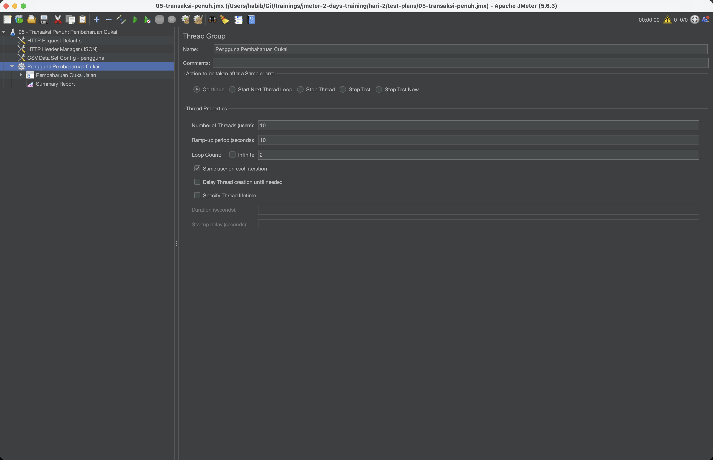
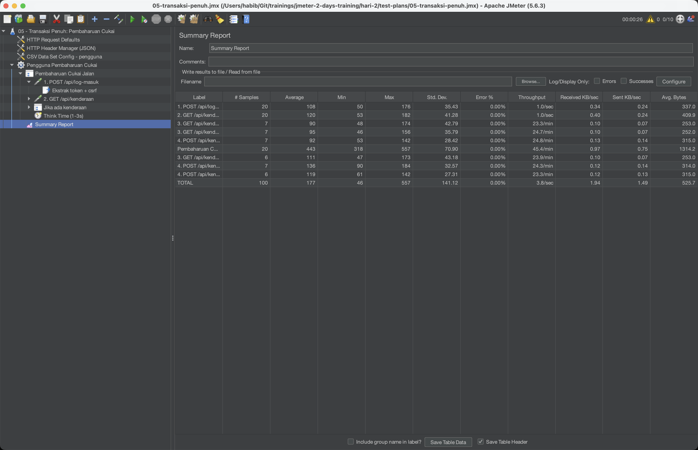
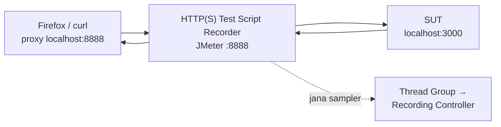

# Hari 1 — Asas Apache JMeter & Ujian Beban

[🧪 Lab Hari 1](./snippets/lab.md) · [🎤 Nota Penceramah](./nota-penceramah.md) · [🎬 Rakam → Main Balik](./snippets/rakaman-e2e.md) · [🔒 Rakaman HTTPS](./snippets/rakaman-https-setup.md) · [🗂️ Test plan rujukan](./test-plans/) · [📄 Kamus data](./data/README.md)

> Bayangkan hari terakhir sebelum cukai jalan naik harga — beribu rakyat log masuk ke portal JPJ serentak untuk memperbaharui cukai. Bolehkah sistem menampung lonjakan itu? Hari ini kita belajar menjawab soalan itu dengan **Apache JMeter**: membina ujian prestasi (**performance test**) terhadap **Portal eJPJ (tiruan)**, menghantar permintaan HTTP, mengawal beban dengan **Thread Group**, mengesahkan respons dengan **Assertion**, meniru tingkah laku pengguna dengan **Timer** dan **CSV Data Set**, mentafsir keputusan dalam **Listener**, dan akhirnya **merakam** aliran sebenar dengan **HTTP(S) Test Script Recorder** — yang akan *gagal* apabila dimain balik, dan kegagalan itu membuka pintu ke Hari 2.

> ⚠️ **Etika & undang-undang:** Sepanjang kursus kita menguji **salinan tempatan** (`sut/`, `http://localhost:3000`) sahaja. Menjalankan ujian beban terhadap sistem pengeluaran/awam yang anda **tidak** miliki atau tanpa kebenaran bertulis adalah menyalahi undang-undang (setara serangan **DoS**). Data adalah **sintetik** — bukan data rasmi JPJ.

**Apa yang akan dibina hari ini:**
- Test Plan pertama yang memukul `/api/health` dan `/`
- Ujian beban 20 pengguna terhadap endpoint sebut harga cukai
- Assertion (Response & Duration) + Timer (think time)
- Parameterisasi dengan **CSV Data Set Config** (setiap thread nombor pendaftaran berlainan)
- Rakaman aliran log masuk → senarai kenderaan → bayar cukai, dan bukti mengapa ia gagal dimain balik

---

## 🎯 Objektif Pembelajaran

Di akhir hari ini, peserta boleh:

| # | Objektif (boleh diukur) | Sesi | Bukti |
|---|------------------------|------|-------|
| O1 | **Membezakan** lima jenis ujian prestasi (Load, Stress, Spike, Soak, Scalability) dan **menyatakan** syarat etika sebelum menjana beban | S1 | Kuiz S1; boleh menamakan sasaran sah kursus (`http://localhost:3000`) dan apa yang diperlukan untuk menguji sistem lain (kebenaran bertulis + skop) |
| O2 | **Memasang** Java + JMeter (termasuk `bin` dalam **PATH** di Windows) dan **menjalankan** SUT tiruan | S1 | `jmeter -v` memaparkan versi 5.6.x dari mana-mana folder; `http://localhost:3000/api/health` → `{"status":"ok",…}` |
| O3 | **Membina** Test Plan pertama (Thread Group → HTTP Request Defaults → HTTP Request → View Results Tree) | S2 | Latihan 1: View Results Tree hijau, kod **200** |
| O4 | **Menetapkan** model beban (threads / ramp-up / loop) dan **meramal** bilangan sampel sebelum larian | S2 | Latihan 2: ramalan 20 × 5 = **100** sepadan dengan `# Samples` dalam Summary Report |
| O5 | **Meletakkan** Config Element, Assertion, Timer dan Listener pada kedudukan yang betul (**skop mengikut kedudukan**) | S2 | Cabaran Latihan 7: menerangkan skop setiap elemen kepada rakan |
| O6 | **Mentafsir** Average, Median, 90/95/99% Line, Throughput dan Error % dalam Summary / Aggregate Report | S2 | Nilai Throughput, Average, Error % dan 95% Line dicatat (Latihan 2 & 5) |
| O7 | **Menambah** Response Assertion, Duration Assertion dan Timer, dan **menerangkan** kesan think time terhadap throughput | S3 | Latihan 2 lulus 0% ralat; Latihan 4: Error % naik bila `ABC0000` (404) disuntik |
| O8 | **Memparameter** permintaan dengan **CSV Data Set Config** dan pembolehubah `${…}` | S3 | Latihan 3: View Results Tree menunjukkan nombor pendaftaran berlainan setiap permintaan |
| O9 | **Merakam** aliran dengan **HTTP(S) Test Script Recorder** (+ sijil CA untuk HTTPS) dan **menerangkan** mengapa main balik gagal (**401**) | S4 | Latihan 6: sampler dirakam; main balik `04-rakaman-mentah.jmx` → 200 / 401 / 401; laporan HTML ~67% ralat |

---

## 📅 Jadual Hari Ini

| Masa | Sesi | Aktiviti | Fokus |
|------|------|----------|-------|
| 9.00 – 10.30 pagi | S1 | **Pengenalan Ujian Prestasi & Persediaan** | Apa & kenapa ujian prestasi, 5 jenis ujian, etika; pasang Java + JMeter (PATH Windows), jalankan SUT, kenali GUI |
| 10.30 – 10.45 pagi | — | Rehat | |
| 10.45 – 1.00 tgh | S2 | **Anatomi Test Plan, Thread Group & Listeners** | Pokok elemen & skop, Test Plan pertama, threads/ramp-up/loop, HTTP Request Defaults + Header Manager, View Results Tree / Summary / Aggregate Report |
| 1.00 – 2.00 ptg | — | Makan tengah hari | |
| 2.00 – 3.30 ptg | S3 | **Assertions, Timers & CSV Data Set** | Response + Duration Assertion, Constant / Uniform / Gaussian Timer, CSV Data Set Config (sharing mode, recycle), senario JPJ |
| 3.30 – 3.45 ptg | — | Rehat | |
| 3.45 – 5.00 ptg | S4 | **Rakam Test Plan: HTTP(S) Test Script Recorder** | Proxy 8888 + Firefox, sijil CA (HTTPS), main balik gagal (401), laporan HTML dari rakaman → jambatan ke korelasi Hari 2 |

---

## 🧭 Kenapa hari ini penting

Ujian fungsian menjawab *"adakah ia berfungsi?"*. Ujian prestasi menjawab *"adakah ia **tahan** apabila ramai datang serentak?"*. Sistem kerajaan seperti portal JPJ menghadapi lonjakan yang boleh diramal (tarikh luput cukai, hujung bulan, pengumuman harga) — dan kegagalan pada hari itu dilihat oleh seluruh negara.

| Tanpa hari ini | Dengan hari ini |
|----------------|-----------------|
| "Sistem laju — saya cuba tadi, sekejap je." (1 pengguna) | 20 → 200 pengguna maya dengan ramp-up terkawal |
| Kod 200 = berjaya | Assertion menyemak **kandungan** dan **tempoh** — 200 yang salah tetap gagal |
| Laporkan *purata* masa respons | Laporkan **95th percentile** — itulah yang SLA ukur |
| Hantar `WXY1234` seribu kali (cache gembira, angka palsu) | CSV menyuap data berbeza setiap lelaran |
| Taip 30 sampler satu-satu | Rakam aliran sebenar dalam 2 minit — kemudian korelasi (Hari 2) |
| "Kita test sistem production terus lah" | Uji mock / staging dengan **kebenaran bertulis** sahaja |

---

## S1 — Pengenalan Ujian Prestasi & Persediaan (9.00 – 10.30 pagi)

### 1.1 Apa itu ujian prestasi (performance testing)

**Ujian prestasi** mengukur sejauh mana laju, stabil, dan berskala sesuatu sistem di bawah beban tertentu — bukan sama ada ia *berfungsi* (itu ujian fungsian), tetapi sama ada ia *tahan* apabila ramai pengguna datang serentak.

> **Konsep — Anatomi ujian prestasi:** Setiap ujian merangkumi: **Beban** (berapa pengguna serentak & corak kedatangan), **Senario** (urutan permintaan yang meniru pengguna sebenar), **Metrik** (throughput, response time, error rate), dan **Kriteria** (SLA/NFR — ambang lulus/gagal). Hari 1 fokus pada membina Beban + Senario + membaca Metrik asas.

**Domain kita:** bayangkan hari terakhir sebelum cukai jalan naik harga — beribu rakyat log masuk ke portal JPJ serentak untuk memperbaharui cukai. Bolehkah sistem menampung lonjakan itu? Itulah soalan yang ujian prestasi menjawab.

| Metrik | Maksud ringkas | Di mana dilihat hari ini |
|--------|----------------|--------------------------|
| **Response time** | Masa dari permintaan dihantar hingga respons lengkap diterima (ms) | Average, Median, 90/95/99% Line |
| **Throughput** | Bilangan permintaan yang disiapkan sesaat (req/s) | Summary / Aggregate Report |
| **Error %** | Peratus sampel gagal (HTTP 4xx/5xx, ralat rangkaian, **atau assertion gagal**) | Summary / Aggregate Report |
| **Concurrency** | Bilangan pengguna maya aktif serentak | Thread Group (threads) |

### 1.2 Jenis ujian prestasi

| Jenis | Soalan | Corak beban |
|-------|--------|-------------|
| **Load test** | Bolehkah sistem tampung beban *dijangka*? | Pengguna tetap pada paras normal/puncak |
| **Stress test** | Di mana sistem *pecah*? | Naikkan pengguna sehingga gagal |
| **Spike test** | Bagaimana bila beban *melonjak* mengejut? | Lonjakan mendadak (cth. hari cukai) |
| **Soak / Endurance** | Adakah *memory leak* / degradasi jangka panjang? | Beban sederhana untuk jam/hari |
| **Scalability** | Adakah sistem *berskala* bila kita tambah sumber? | Beban sama, bandingkan konfigurasi |

> 💡 **Contoh JPJ:** "1,000 pembaharuan cukai sejam pada hari biasa" = **Load**. "Malam terakhir sebelum harga naik, trafik 10× dalam 5 minit" = **Spike**. "Portal hidup 72 jam semasa cuti panjang tanpa restart" = **Soak**.

### 1.3 Etika & undang-undang — peraturan nombor satu

JMeter ialah **penjana beban**. Dari sudut pelayan, 200 thread JMeter kelihatan sama seperti 200 penyerang. Maka:

| ✅ Dibenarkan | ❌ Dilarang |
|--------------|------------|
| Mock tempatan kursus: `http://localhost:3000` (`sut/`) | Portal JPJ sebenar / mana-mana laman awam tanpa kebenaran |
| Persekitaran ujian/staging **milik organisasi anda**, dengan **kebenaran bertulis** yang menyatakan skop, hos, tetingkap masa dan paras beban | "Cuba sikit je" pada production waktu pejabat |
| Laman demo yang membenarkan ujian secara terbuka (cth. `blazedemo.com`, beban kecil) | Menggunakan data peribadi sebenar (No. KP, nombor pendaftaran rakyat) dalam CSV |

> ⚠️ Ujian beban tanpa kebenaran = **serangan penafian perkhidmatan (DoS)** dari sudut undang-undang, walaupun niat anda baik. Dalam organisasi kerajaan, dapatkan kelulusan bertulis daripada pemilik sistem **dan** pasukan infrastruktur/keselamatan, maklumkan pasukan pemantauan (NOC/SOC) sebelum larian, dan tetapkan siapa yang boleh menekan "Stop".

> 💡 **Tabiat selamat:** sentiasa sahkan Server=`localhost`, Port=`3000` (HTTP Request Defaults) sebelum Start.

### 1.4 Pasang Java (JDK 11+, disyorkan 17/21 LTS)

JMeter berjalan atas **Java**. Pasang **JDK 11 atau lebih baru** (disyorkan JDK 17/21 LTS).

```bash
java --version      # sahkan Java wujud
```

- **macOS:** `brew install openjdk@21` (atau muat turun dari Adoptium/Temurin).
- **Windows:** muat turun pemasang dari [adoptium.net](https://adoptium.net/), atau `winget install EclipseAdoptium.Temurin.21.JDK`.
- **Linux:** `sudo apt install openjdk-21-jdk`.

### 1.5 Pasang Apache JMeter

- **macOS:** `brew install jmeter`, kemudian jalankan `jmeter`.
- **Manual (semua OS):** muat turun binari dari [jmeter.apache.org/download_jmeter.cgi](https://jmeter.apache.org/download_jmeter.cgi), nyahzip, dan jalankan:
  - `bin/jmeter` (macOS/Linux) atau `bin\jmeter.bat` (Windows) — buka **GUI**.

```bash
jmeter --version   # sahkan JMeter wujud
```

#### Windows: jalankan `jmeter` dari mana-mana (tambah ke PATH)

Secara lalai, Windows hanya kenal `jmeter` jika anda berada dalam folder `bin`. Untuk taip `jmeter` dari **mana-mana** folder, tambah folder `bin` JMeter ke **PATH**:

1. **Nyahzip** JMeter ke lokasi tetap, cth. `C:\apache-jmeter-5.6.3`.
2. Buka **Start → taip "environment variables" → "Edit the system environment variables" → Environment Variables…**
3. Bawah **User variables** (tiada admin diperlukan), pilih **Path → Edit → New**, tampal:
   ```
   C:\apache-jmeter-5.6.3\bin
   ```
   Klik **OK** pada semua tetingkap.
4. **Tutup dan buka semula** Command Prompt/PowerShell (perubahan PATH hanya berkuat kuasa dalam terminal baharu).
5. Sahkan:
   ```powershell
   jmeter -v
   ```

**Cara PowerShell (tiada admin — PATH pengguna):**
```powershell
[Environment]::SetEnvironmentVariable("Path", $env:Path + ";C:\apache-jmeter-5.6.3\bin", "User")
# tutup & buka semula terminal, kemudian:  jmeter -v
```

> **JMeter perlu Java.** Jika `jmeter -v` mengadu Java tak dijumpai: pasang **JDK 11+**, dan set **`JAVA_HOME`** ke folder JDK (cth. `C:\Program Files\Eclipse Adoptium\jdk-21…`) serta tambah `%JAVA_HOME%\bin` ke PATH dengan cara yang sama. Sahkan: `java -version`.

> **Nota:** Pada Windows, `jmeter` sebenarnya menjalankan `jmeter.bat` dalam folder `bin`. Semua arahan dalam nota ini (`jmeter -n -t … -l … -e -o …`) berfungsi sama, cuma guna backslash untuk laluan Windows (cth. `hari-2\test-plans\06-ujian-beban-nogui.jmx`).

> ⚠️ **Kesilapan lazim:** Nyahzip ke folder yang ada **ruang kosong atau aksara khas** (cth. `C:\Program Files\…` atau `Downloads\apache-jmeter-5.6.3 (1)`) atau menjalankan terus dari dalam fail `.zip` tanpa nyahzip. Guna laluan ringkas seperti `C:\apache-jmeter-5.6.3`.

### 1.6 GUI vs non-GUI

> **Konsep — GUI vs non-GUI:** JMeter GUI hanya untuk **membina & menyahpepijat** plan. Untuk **beban sebenar**, sentiasa jalankan mod **non-GUI** (`jmeter -n -t plan.jmx ...`) kerana GUI menggunakan banyak memori dan **memperlahankan** penjana beban. Kita bina di GUI hari ini; kita larikan beban sebenar secara non-GUI pada Hari 2.

| Bendera | Maksud |
|---------|--------|
| `-n` | non-GUI |
| `-t plan.jmx` | Test Plan yang dijalankan |
| `-l hasil.jtl` | Fail keputusan (CSV) |
| `-e -o folder/` | Jana laporan dashboard HTML selepas larian (folder mesti kosong / belum wujud) |

### 1.7 Jalankan Sistem Under Test (SUT)

Buka satu tetingkap terminal dan biarkan pelayan tiruan berjalan sepanjang bengkel:

```bash
cd sut
node server.js
```

Anda sepatutnya nampak `Portal eJPJ (TIRUAN) berjalan di  http://localhost:3000`. Buka URL itu dalam pelayar untuk senarai endpoint. (Perlukan **Node.js 18+**; tiada `npm install` diperlukan.)

| Endpoint | Perlu token? | Respons | Digunakan |
|----------|--------------|---------|-----------|
| `GET /api/health` | Tidak | `{"status":"ok","masa":…}` | S2 — Test Plan pertama |
| `GET /api/kenderaan/:no/cukai` | Tidak | `{no_pendaftaran, amaun, tempoh_bulan}`; **404** jika tiada | S2–S3 — beban & CSV |
| `GET /api/saman?no_kp=` | Tidak | `{no_kp, saman:[…]}` | S3 — senario |
| `POST /api/log-masuk` | — | Badan `{no_kp, kata_laluan}` → `{token, csrf, nama, mesej}` | S4 — rakaman |
| `GET /api/kenderaan?no_kp=` | **Ya** (`Authorization: Bearer <token>`) | `{no_kp, kenderaan:[…]}`; **401** tanpa token sah | S4 — rakaman |
| `POST /api/kenderaan/:no/bayar-cukai` | **Ya** + `csrf` dalam badan | `{no_resit, …, status:"BERJAYA"}`; **401** / **403** / ~1% **500** | S4 — rakaman |

Pengguna sintetik: `800101015500` (WXY1234, VAB88), `900202025600` (JQK7788), `850303035700` (BMT3030, PKL909). Mana-mana kata laluan tidak kosong diterima.

**Laras tingkah laku SUT** (untuk demo): `PORT` (lalai 3000), `LATENCY_MIN` / `LATENCY_MAX` (lalai 40–180 ms), `ERROR_RATE` (lalai `0.01` = 1% bayaran gagal 500).

```bash
curl -s http://localhost:3000/api/health              # semakan pantas
LATENCY_MIN=300 LATENCY_MAX=900 node server.js        # SUT "lambat" (S3)
```

> 🪟 Pada Windows **Command Prompt**, set pembolehubah dahulu: `set LATENCY_MIN=300` kemudian `set LATENCY_MAX=900` kemudian `node server.js`. Dalam **PowerShell**: `$env:LATENCY_MIN=300; $env:LATENCY_MAX=900; node server.js`.

### 1.8 Kenali antara muka JMeter

| Bahagian | Fungsi |
|----------|--------|
| **Menu / Toolbar** (atas) | Buka/Simpan `.jmx`, butang **Start (▶)** / **Stop**, **Clear** hasil |
| **Pokok ujian** (kiri) | Struktur Test Plan — klik kanan untuk **Add** elemen |
| **Panel konfigurasi** (kanan) | Tetapan elemen yang dipilih |
| **Log** (bawah, ikon segi tiga amaran) | Ralat & amaran JMeter |

Setiap Test Plan disimpan sebagai satu fail **`.jmx`** (format XML).


> 💡 **Tip GUI:** **Clear All** (ikon penyapu berganda) mengosongkan semua Listener sebelum larian baharu — jika tidak, keputusan larian lama bercampur. Butang **Stop** (segi empat) menghentikan serta-merta; **Shutdown** menunggu thread menyelesaikan sampel semasa.

### 🎯 Kuiz S1

1. Malam terakhir sebelum harga cukai naik, trafik portal melonjak 10× dalam beberapa minit. Jenis ujian manakah paling sesuai untuk mensimulasikan keadaan ini?
   - [ ] Soak / Endurance test
   - [x] Spike test
   - [ ] Scalability test
   - [ ] Ujian fungsian
   > Spike test mengukur tindak balas sistem terhadap **lonjakan mendadak**. Soak menguji beban sederhana untuk tempoh panjang; Scalability membandingkan konfigurasi sumber.

2. Seorang rakan mencadangkan "uji sikit" portal JPJ sebenar dengan 50 thread dari laptop kursus. Apakah tindakan yang betul?
   - [ ] Teruskan kerana 50 thread terlalu kecil untuk menjejaskan pelayan
   - [ ] Teruskan tetapi pada waktu malam supaya tiada pengguna terjejas
   - [x] Tolak — uji hanya mock `http://localhost:3000`, atau persekitaran yang ada kebenaran bertulis dengan skop yang jelas
   > Tanpa kebenaran bertulis, sebarang beban terhadap sistem yang anda tidak miliki ialah setara serangan DoS — saiz beban atau waktu tidak mengubah status undang-undangnya.

3. Mengapakah beban sebenar dijalankan dalam mod **non-GUI** (`jmeter -n`)?
   - [ ] Mod GUI tidak boleh menjalankan lebih daripada satu thread
   - [x] GUI menggunakan banyak memori dan memperlahankan penjana beban, menjadikan angka tidak tepat
   - [ ] Mod non-GUI menghantar permintaan menggunakan protokol yang lebih laju
   > GUI hanya untuk membina & menyahpepijat. Semasa beban, JVM yang sibuk melukis GUI dan menyimpan keputusan dalam memori menjadi bottleneck — yang diukur ialah JMeter, bukan SUT.

4. Di Windows, anda baru menambah `C:\apache-jmeter-5.6.3\bin` ke Path, tetapi `jmeter -v` dalam Command Prompt yang sama masih memberi *"'jmeter' is not recognized"*. Apakah punca paling mungkin?
   - [x] Perubahan PATH hanya berkuat kuasa dalam terminal **baharu** — tutup dan buka semula
   - [ ] JMeter tidak menyokong Windows
   - [ ] Path mesti ditambah bawah System variables dengan hak admin
   > Terminal yang sudah terbuka menyimpan salinan PATH lama. User variables memadai (tiada admin diperlukan).

---

## S2 — Anatomi Test Plan, Thread Group & Listeners (10.45 – 1.00 tgh)

### 2.1 Anatomi Test Plan JMeter

Sebelum membina, fahami blok binaan utama. Semua tersusun sebagai **pokok** — kedudukan elemen menentukan **skop** (ruang lingkup)-nya.

```
Test Plan
└── Thread Group            (berapa pengguna, ramp-up, gelung)
    ├── HTTP Request Defaults   (Config: server/port lalai)
    ├── HTTP Header Manager     (Config: header dikongsi)
    ├── HTTP Request            (Sampler: satu permintaan)
    │   ├── Response Assertion  (semak kandungan respons)
    │   └── JSON Extractor      (Post-Processor: ekstrak nilai)
    ├── Constant Timer          (Timer: think time)
    └── View Results Tree       (Listener: papar keputusan)
```

| Kategori | Peranan | Contoh |
|----------|---------|--------|
| **Thread Group** | Mentakrif populasi pengguna maya | bilangan thread, ramp-up, gelung |
| **Sampler** | Menghantar satu permintaan | **HTTP Request**, JDBC, FTP |
| **Config Element** | Tetapan dikongsi (bukan permintaan) | HTTP Request Defaults, Header/Cookie/Cache Manager, **CSV Data Set Config** |
| **Timer** | Jeda antara permintaan (think time) | Constant, Uniform Random, Gaussian |
| **Assertion** | Semak respons betul | Response, Duration, JSON Assertion |
| **Pre/Post-Processor** | Jalan sebelum/selepas sampler | JSON Extractor, JSR223 |
| **Listener** | Kumpul & papar keputusan | View Results Tree, Summary/Aggregate Report |

> **Konsep penting — Skop mengikut kedudukan:** Elemen **Config**, **Timer**, **Assertion**, dan **Listener** memberi kesan kepada **semua sampler pada aras yang sama atau lebih dalam** (adik-beradik & anak). Letak elemen di bawah Thread Group → ia menyentuh semua sampler; letak sebagai **anak** satu sampler → ia menyentuh sampler itu **sahaja**. Salah letak = punca pepijat paling biasa untuk pemula.

**Susunan pelaksanaan** untuk setiap sampler (tidak bergantung pada susunan visual dalam pokok, kecuali sesama jenis):

```
Config Elements → Pre-Processors → Timers → SAMPLER → Post-Processors → Assertions → Listeners
```

> 💡 Ini menerangkan dua perkara yang mengejutkan pemula: (1) **Timer** berjalan **sebelum** sampler (jeda dahulu, kemudian hantar), dan (2) Timer di bawah Thread Group dengan 3 sampler menambah jeda **3 kali** setiap lelaran — sekali untuk setiap sampler dalam skopnya.

### 2.2 Langkah 1 — Test Plan pertama anda

Mari bina ujian paling ringkas — satu pengguna memukul `/api/health`.

1. Buka JMeter. Anda sudah ada **Test Plan** kosong.
2. **Klik kanan Test Plan → Add → Threads (Users) → Thread Group.**
3. Pada Thread Group, tetapkan buat sementara: **Number of Threads = 1**, **Ramp-up = 1**, **Loop Count = 1**.
4. **Klik kanan Thread Group → Add → Config Element → HTTP Request Defaults.** Isi:
   - **Protocol:** `http` · **Server Name or IP:** `localhost` · **Port Number:** `3000`
5. **Klik kanan Thread Group → Add → Sampler → HTTP Request.** Isi:
   - **Method:** `GET` · **Path:** `/api/health` (biarkan server/port kosong — diwarisi dari Defaults)
6. **Klik kanan Thread Group → Add → Listener → View Results Tree.**
7. Klik **Save** (`.jmx`), kemudian **Start (▶)**.

Dalam View Results Tree, klik sampel — anda sepatutnya nampak ikon **hijau**, kod **200**, dan badan respons `{"status":"ok",...}`.

> **Konsep — HTTP Request Defaults:** Config ini menetapkan **nilai lalai** (server, port, protokol) yang **diwarisi** oleh semua HTTP Request di bawahnya. Jadi bila alamat SUT berubah (cth. dari `localhost` ke pelayan ujian), anda tukar **satu tempat** sahaja.

> 💡 **Tiga tab View Results Tree:** **Sampler result** (kod, masa, saiz), **Request** (URL + header yang *betul-betul* dihantar — semak di sini bila pelik), **Response data** (badan respons; pilih *JSON* dalam dropdown untuk paparan cantik).

**Tambah sampler kedua:** salin langkah 5 dengan **Path** `/` — halaman info HTML yang menyenaraikan endpoint. Kini plan anda memukul `/api/health` dan `/`.

> Rujuk fail siap: [`test-plans/01-hello-jpj.jmx`](./test-plans/01-hello-jpj.jmx).

### 2.3 Langkah 2 — Thread Group: model beban

**Thread Group** ialah jantung ujian beban — ia mentakrif **populasi pengguna maya**.

| Medan | Maksud | Contoh |
|-------|--------|--------|
| **Number of Threads (users)** | Bilangan pengguna maya serentak | `20` |
| **Ramp-Up Period (seconds)** | Masa untuk melancarkan **semua** thread | `10` (2 pengguna/saat) |
| **Loop Count** | Berapa kali setiap thread ulang senario | `5` (atau *Infinite*) |

> **Konsep penting — Ramp-up:** Jangan lancar semua pengguna serentak (ramp-up = 0) melainkan itu memang spike test — ia mencipta "kejutan" tidak realistik. Ramp-up beransur (cth. 20 pengguna dalam 10s) meniru kedatangan pengguna sebenar dan memberi sistem masa memanaskan (*warm-up*).

> **Konsep — jumlah permintaan:** Bilangan sampel = **Threads × Loop Count** (jika satu sampler). 20 × 5 = **100** permintaan. Semak ini dalam Summary Report untuk sahkan ujian berjalan penuh.

**Kira sebelum klik Start:**

| Threads | Ramp-up | Loop | Sampler | Jumlah sampel | Thread baharu setiap… |
|---------|---------|------|---------|---------------|-----------------------|
| 1 | 1 | 1 | 2 (`/api/health`, `/`) | 2 | — |
| 20 | 10 | 5 | 1 | **100** | 0.5 s |
| 10 | 5 | 10 | 1 | **100** | 0.5 s |
| 50 | 20 | 1 | 1 | 50 | 0.4 s |

> ⚠️ **Kesilapan lazim:** "20 threads = 20 permintaan serentak sepanjang masa." Tidak semestinya — jika setiap thread siap gelungnya sebelum thread terakhir dilancarkan (ramp-up panjang, gelung pendek), concurrency sebenar jauh lebih rendah. Lihat lajur *Active Threads* dalam laporan HTML (Hari 2).

Medan lain yang patut dikenali: **Action to be taken after a Sampler error** (*Continue* lalai — teruskan; *Start Next Thread Loop* — mula lelaran baharu; *Stop Thread* / *Stop Test*), dan **Specify Thread lifetime** (Duration/Startup delay — untuk ujian berasaskan masa, Hari 2).

Ubah Thread Group anda kepada **20 / 10 / 5** untuk langkah seterusnya.



### 2.4 Langkah 3 — HTTP Header Manager

Banyak API memerlukan **header** (cth. `Content-Type`, `Accept`, `Authorization`). **HTTP Header Manager** menetapkan header yang dikongsi oleh sampler dalam skopnya.

1. **Klik kanan Thread Group → Add → Config Element → HTTP Header Manager.**
2. Klik **Add** dan masukkan: Name `Accept`, Value `application/json`.

> **Konsep — Config Element lain yang berguna:**
> - **HTTP Cookie Manager** — simpan & hantar semula cookie (perlu untuk sesi berasaskan cookie).
> - **HTTP Cache Manager** — meniru cache pelayar (elak muat semula sumber statik).
> Untuk API JSON kita, Header Manager sudah memadai; kita guna token (bukan cookie) pada Hari 2.

> 💡 **Header Manager boleh bersarang:** satu di bawah Thread Group (`Accept` untuk semua) + satu sebagai anak sampler `POST` tertentu (`Content-Type: application/json`). JMeter **menggabungkan** kedua-duanya untuk sampler itu. Ini corak yang anda akan lihat dalam rakaman (S4).

### 2.5 Langkah 4 — Listener: membaca keputusan

**Listener** mengumpul & memaparkan keputusan. Tiga yang paling penting:

| Listener | Guna | Amaran |
|----------|------|--------|
| **View Results Tree** | Nyahpepijat — lihat setiap permintaan/respons penuh | **Sangat berat** — untuk 1–2 pengguna sahaja, matikan semasa beban |
| **Summary Report** | Ringkasan setiap label: # sampel, Average, Min/Max, Error %, Throughput | Ringan — sesuai untuk beban |
| **Aggregate Report** | Seperti Summary + **Median**, **90/95/99 percentile** | Ringan |

Tambah ketiga-tiga di bawah Thread Group. Jalankan ujian (20/10/5) dan perhatikan:

- **# Samples** = 100
- **Average** — purata masa respons (ms)
- **Throughput** — permintaan/saat
- **Error %** — peratus sampel gagal

**Kamus lajur** (JMeter 5.6):

| Lajur | Maksud | Report |
|-------|--------|--------|
| `# Samples` | Bilangan sampel bagi label itu | Kedua-dua |
| `Average` | Purata masa respons (ms) | Kedua-dua |
| `Median` | 50% sampel siap dalam masa ini atau kurang | Aggregate |
| `90% Line` / `95% Line` / `99% Line` | Percentile — 90/95/99% sampel siap dalam masa ini atau kurang | Aggregate |
| `Min` / `Max` | Sampel paling laju / paling lambat | Kedua-dua |
| `Std. Dev.` | Sebaran masa respons — tinggi = tidak konsisten | Summary |
| `Error %` | Peratus sampel gagal | Kedua-dua |
| `Throughput` | Sampel sesaat (atau seminit, lihat unit `/sec` `/min`) | Kedua-dua |
| `Received KB/sec` / `Sent KB/sec` | Jalur lebar | Kedua-dua |

> **Konsep penting — JANGAN guna GUI listener semasa beban sebenar.** View Results Tree menyimpan **setiap** respons dalam memori → penjana beban kehabisan RAM dan angka menjadi tidak tepat. Untuk beban sebenar (Hari 2), buang GUI listener dan tulis ke fail **`.jtl`** melalui `-l` dalam mod non-GUI.

> **Konsep — Average boleh menipu:** Purata menyembunyikan puncak. Sentiasa lihat **percentile** — "95th percentile = 800 ms" bermakna 95% permintaan siap ≤ 800 ms (dan 5% lebih teruk). SLA biasanya ditulis dalam percentile, bukan purata.

> 💡 **Contoh:** 99 permintaan 100 ms + 1 permintaan 10,000 ms → Average ≈ **199 ms** ("OK!"), tetapi pengguna ke-100 menunggu 10 saat. `99% Line` dan `Max` mendedahkannya.



### 🎯 Kuiz S2

1. Thread Group ditetapkan **20 threads**, **ramp-up 10 s**, **loop 5**, dengan **satu** HTTP Request. Berapakah `# Samples` yang dijangka dalam Summary Report?
   - [ ] 20
   - [ ] 25
   - [x] 100
   - [ ] 200
   > Jumlah sampel = Threads × Loop Count × bilangan sampler = 20 × 5 × 1 = 100. Ramp-up tidak mengubah jumlah — hanya kadar thread dilancarkan.

2. Sebuah Response Assertion diletakkan sebagai **anak** kepada sampler A. Sampler B ialah adik-beradik A di bawah Thread Group yang sama. Sampler manakah yang disemak oleh assertion itu?
   - [x] Sampler A sahaja
   - [ ] Sampler A dan B
   - [ ] Semua sampler dalam Test Plan
   > Skop mengikut kedudukan: anak kepada satu sampler hanya menyentuh sampler itu. Untuk menyemak A dan B, letakkan assertion di bawah Thread Group (adik-beradik kepada kedua-duanya).

3. Pengurus meminta "95th percentile masa respons". Listener manakah memaparkannya secara terus?
   - [ ] Summary Report
   - [x] Aggregate Report
   - [ ] View Results Tree
   > Aggregate Report mempunyai lajur `Median`, `90% Line`, `95% Line`, `99% Line`. Summary Report hanya ada Average, Min, Max dan Std. Dev.

4. Alamat SUT bertukar dari `localhost:3000` ke pelayan ujian lain. Plan anda ada 15 HTTP Request. Cara paling betul untuk mengemas kini?
   - [ ] Ubah Server Name dalam setiap 15 sampler
   - [x] Ubah **HTTP Request Defaults** sekali; sampler dengan Server kosong mewarisinya
   - [ ] Tambah HTTP Header Manager dengan header `Host`
   > HTTP Request Defaults ialah Config Element yang memberi nilai lalai kepada semua HTTP Request dalam skopnya — satu tempat untuk diubah (dan satu tempat untuk disemak dari sudut etika).

---

## S3 — Assertions, Timers & CSV Data Set (2.00 – 3.30 ptg)

### 3.1 Langkah 5 — Assertion: sahkan respons betul

Kod **200** tidak semestinya bermakna respons **betul**. **Assertion** mengesahkan kandungan.

#### Response Assertion

1. **Klik kanan HTTP Request → Add → Assertions → Response Assertion.**
2. **Field to Test:** *Text Response* · **Pattern Matching Rules:** *Substring* · **Patterns to Test:** tambah `amaun`.

Kini sampel hanya "lulus" jika badan respons mengandungi `amaun`.

| Pattern Matching Rule | Maksud | Contoh |
|-----------------------|--------|--------|
| **Contains** | Mengandungi padanan **regex** | `"amaun":\s*\d+` |
| **Matches** | **Seluruh** respons padan regex | jarang digunakan untuk JSON |
| **Equals** | Sama persis (teks) | respons pendek tetap |
| **Substring** | Mengandungi teks biasa (tiada regex) — paling selamat | `amaun`, `BERJAYA` |
| **Not** (kotak tanda) | Songsangkan — lulus jika **tiada** padanan | `ralat` |

> 💡 **Field to Test** lain yang berguna: **Response Code** (cth. `200`) — dan kotak **Ignore Status** jika anda *mahu* menguji bahawa 404 dipulangkan (ujian negatif).

#### Duration Assertion

1. **Add → Assertions → Duration Assertion.**
2. **Duration in milliseconds:** `2000` — sampel gagal jika ambil lebih 2 saat.

> **Konsep — Assertion menukar makna "gagal":** Tanpa assertion, hanya ralat rangkaian/HTTP dikira gagal. Dengan assertion, respons yang **salah kandungan** atau **terlalu lambat** juga dikira gagal → **Error %** anda mencerminkan kualiti sebenar, bukan sekadar sambungan berjaya.

Sampler `GET /api/kenderaan/WXY1234/cukai` dengan kedua-dua assertion → rujuk [`test-plans/02-cukai-beban.jmx`](./test-plans/02-cukai-beban.jmx) (Response Assertion *"Respons mengandungi 'amaun'"*, Duration Assertion *"Tempoh < 2000ms"*, Constant Timer *"Think Time 300ms"*, Header Manager `Accept: application/json`, Summary + Aggregate Report, dan View Results Tree yang dilabel *"nyahaktif semasa beban"*).

> ⚠️ **Assertion juga ada kos:** setiap assertion dijalankan untuk setiap sampel. Regex yang kompleks atas respons besar boleh membebankan penjana beban. Utamakan **Substring** atau JSON Assertion yang ringkas.

### 3.2 Langkah 6 — Timer: think time

Pengguna sebenar **tidak** menghantar permintaan bertalu-talu — mereka membaca, berfikir, menaip. **Timer** menambah jeda ini supaya beban realistik.

| Timer | Kelakuan | Medan |
|-------|----------|-------|
| **Constant Timer** | Jeda tetap (cth. 300 ms) setiap sampler | *Thread Delay* |
| **Uniform Random Timer** | Jeda rawak seragam (asas + julat rawak) | *Constant Delay Offset* + *Random Delay Maximum* — cth. 500 + 1000 → 0.5–1.5 s |
| **Gaussian Random Timer** | Jeda rawak taburan normal (paling realistik) | *Constant Delay Offset* + *Deviation* — cth. 1000 ± 300 ms |

1. **Klik kanan Thread Group → Add → Timer → Constant Timer.** Delay `300`.

> **Konsep — think time menjejaskan throughput:** Menambah think time **menurunkan** throughput (thread menunggu, tidak menghantar). Ini **betul** — throughput tanpa think time tidak realistik dan boleh membebankan sistem secara palsu. Untuk mencapai sasaran *permintaan/saat* tertentu, laraskan **bilangan thread** dan **think time** bersama, atau guna **Throughput Controller / Timer** (Hari 2).

> 💡 **Anggaran kasar:** throughput ≈ threads ÷ (masa respons + think time). 20 thread, respons ~0.1 s, think time 0.3 s → ≈ 20 ÷ 0.4 = **~50 req/s** (selepas ramp-up selesai). Tanpa timer → ≈ 20 ÷ 0.1 = ~200 req/s.

> ⚠️ **Masa timer tidak dikira** dalam masa respons sampel (melainkan anda menggunakan Transaction Controller dengan pilihan tertentu — Hari 2). Jadi Average tidak "naik" kerana timer; yang turun ialah throughput.

### 3.3 Langkah 7 — Parameterisasi dengan CSV Data Set Config

Menghantar `WXY1234` seribu kali tidak realistik — ia mengenakan cache dan tidak menguji kepelbagaian data. **CSV Data Set Config** menyuap nilai berlainan ke setiap thread/lelaran.

Fail [`data/kenderaan.csv`](./data/kenderaan.csv) (sintetik — lihat [kamus data](./data/README.md)):

```
no_pendaftaran,model
WXY1234,Perodua Myvi 1.5
VAB88,Honda Civic 1.8
JQK7788,Proton X50 1.5T
BMT3030,Toyota Hilux 2.4
PKL909,Perodua Axia 1.0
```

1. **Klik kanan Thread Group → Add → Config Element → CSV Data Set Config.**
2. Isi:
   - **Filename:** `../data/kenderaan.csv` *(relatif kepada lokasi fail `.jmx`)*
   - **Variable Names:** `no_pendaftaran,model`
   - **Ignore first line:** `True` (baris tajuk) · **Recycle on EOF:** `True` · **Stop thread on EOF:** `False`
   - **Sharing mode:** `All threads`
3. Ubah path sampler kepada: `/api/kenderaan/${no_pendaftaran}/cukai`.
4. Jalankan (10 pengguna × 10 gelung). Dalam View Results Tree, sahkan setiap permintaan guna nombor berlainan.

> **Konsep — `${nama}` ialah pembolehubah JMeter:** Sintaks `${no_pendaftaran}` menggantikan nilai dari CSV pada masa larian. Nilai ini boleh datang dari CSV, User Defined Variables, Extractor (Hari 2), atau fungsi terbina seperti `${__Random(1,100)}`.

> **Konsep — Sharing mode:** *All threads* = satu barisan CSV dikongsi (baris seterusnya diberi kepada thread seterusnya). *Current thread group* / *Current thread* mengasingkan barisan. Untuk data unik-setiap-pengguna, gunakan dengan berhati-hati + `Recycle=False` + `Stop thread=True`.

| Gabungan EOF | Apa berlaku selepas baris terakhir | Sesuai untuk |
|--------------|------------------------------------|--------------|
| Recycle `True`, Stop thread `False` | Kembali ke baris pertama | Data rujukan (sebut harga cukai) — **pilihan kita** |
| Recycle `False`, Stop thread `True` | Thread berhenti bila data habis | Setiap baris mesti digunakan **sekali** sahaja (cth. akaun unik) |
| Recycle `False`, Stop thread `False` | Pembolehubah menjadi `<EOF>` | Jarang — biasanya pepijat |

> ⚠️ **Kesilapan lazim:** *Ignore first line* = `False` sedangkan fail ada baris tajuk → lelaran pertama menghantar `/api/kenderaan/no_pendaftaran/cukai` → **404**. Satu lagi: ruang kosong dalam *Variable Names* (`no_pendaftaran, model`) menjadikan nama pembolehubah ` model` (dengan ruang).

> Plan rujukan [`test-plans/03-csv-berparameter.jmx`](./test-plans/03-csv-berparameter.jmx) juga menggunakan **Uniform Random Timer (0.5–1.5s)** — Constant Delay Offset 500 ms + Random Delay Maximum 1000 ms.


*(Gambar di atas daripada Hari 2 — fail `pengguna.csv`. Untuk Hari 1 gunakan `../data/kenderaan.csv` dan `no_pendaftaran,model`.)*

> Rujuk fail siap: [`test-plans/03-csv-berparameter.jmx`](./test-plans/03-csv-berparameter.jmx).

> 🧪 **Belajar dari kegagalan:** tambah baris palsu `ABC0000,Kereta Hantu` ke CSV → endpoint pulangkan **404** dan Response Assertion `amaun` gagal → Error % naik. Inilah Latihan 4.

### 3.4 Senario sebenar JPJ (use cases)

Kaitkan kemahiran Hari 1 dengan soalan operasi sebenar. Semua guna alat Hari 1 sahaja.

#### Kes 1 — Kesihatan sistem asas
`GET /api/health` dengan 50 pengguna, ramp 20s. **Soalan:** adakah throughput stabil? Error % = 0?

#### Kes 2 — Beban semak cukai
`GET /api/kenderaan/${no_pendaftaran}/cukai` berparameter CSV, 30 pengguna × 10 gelung + Response Assertion. **Soalan:** apakah 95th percentile? (Guna Aggregate Report.)

#### Kes 3 — Semak saman
`GET /api/saman?no_kp=900202025600`, 20 pengguna. Tambah Response Assertion mengandungi `saman`. **Soalan:** bandingkan latensi dengan endpoint cukai.

#### Kes 4 — Kesan think time
Jalankan Kes 2 dua kali: (a) tanpa timer, (b) dengan Constant Timer 1000 ms. **Soalan:** bagaimana throughput & Average berubah? Mengapa?

#### Kes 5 — Kesan latensi pelayan
Mulakan semula pelayan dengan `LATENCY_MIN=300 LATENCY_MAX=900 node server.js`. Ulang Kes 2. **Soalan:** manakah lebih menjejaskan pengguna — throughput atau percentile?

> **🎯 Cabaran gabungan:** Bina satu Test Plan dengan HTTP Request Defaults + Header Manager + CSV Data Set + 2 sampler (cukai & saman), setiap satu dengan Response Assertion, Constant Timer, dan Summary + Aggregate Report. Jalankan 25 pengguna × 8 gelung dan laporkan Error %, Average, dan 95th percentile kepada kelas.

### 🎯 Kuiz S3

1. Sebuah endpoint memulangkan **HTTP 200** tetapi badannya `{"ralat":"Sistem sibuk"}`. Tanpa sebarang assertion, bagaimanakah JMeter mengira sampel ini?
   - [x] Lulus — hanya ralat HTTP/rangkaian dikira gagal tanpa assertion
   - [ ] Gagal — JMeter mengesan perkataan "ralat" secara automatik
   - [ ] Diabaikan dan tidak dikira dalam # Samples
   > Itulah sebabnya kita menambah Response Assertion (cth. Substring `amaun`) — supaya respons yang salah kandungan dikira dalam Error %.

2. Anda menambah **Constant Timer 1000 ms** pada plan 20 thread tanpa mengubah apa-apa lagi. Apakah kesan paling ketara?
   - [ ] Average masa respons naik kira-kira 1000 ms
   - [x] Throughput turun kerana setiap thread menunggu sebelum setiap permintaan
   - [ ] Error % naik kerana Duration Assertion gagal
   > Masa timer tidak dikira dalam masa respons sampel. Thread yang "berfikir" tidak menghantar, jadi permintaan sesaat menurun — itu realistik, bukan pepijat.

3. **Filename** `../data/kenderaan.csv` dalam CSV Data Set Config ditafsir relatif kepada apa?
   - [ ] Folder semasa terminal tempat `jmeter` dijalankan
   - [ ] Folder `bin` JMeter
   - [x] Lokasi fail `.jmx`
   > Laluan relatif diselesaikan dari folder Test Plan. Sebab itu plan boleh dijalankan dari mana-mana cwd selagi susunan `test-plans/` dan `data/` dikekalkan.

4. Dalam 5 permintaan pertama, View Results Tree menunjukkan satu permintaan ke `/api/kenderaan/no_pendaftaran/cukai` yang mendapat 404. Apakah puncanya?
   - [ ] Sharing mode ditetapkan *Current thread*
   - [x] *Ignore first line* = `False`, jadi baris tajuk dibaca sebagai data
   - [ ] Recycle on EOF = `True`
   > Baris pertama `no_pendaftaran,model` ialah tajuk. Tetapkan *Ignore first line* = `True` apabila *Variable Names* diisi secara manual.

---

## S4 — Rakam Test Plan: HTTP(S) Test Script Recorder (3.45 – 5.00 ptg)

### 4.1 Cara perakam berfungsi

Selain membina sampler satu-satu, JMeter boleh **merakam** trafik sebenar melalui **proxy** dan menjananya menjadi sampler secara automatik. Berguna untuk aliran panjang (banyak permintaan) supaya anda tidak menaip setiap satu.

**Cara ia berfungsi:** JMeter memasang satu **proxy** (lalai port `8888`). Anda tetapkan **Firefox** untuk melalui proxy itu; setiap permintaan **dirakam** ke dalam **Recording Controller**.



> **Mengapa Firefox?** Firefox ada **tetapan proxy tersendiri** — anda tak perlu ubah proxy seluruh OS (yang menjejaskan semua aplikasi lain). Ini menjadikannya pelayar paling bersih & selamat untuk merakam.

### 4.2 A. Sediakan perakam (di JMeter GUI)

1. **Klik kanan Test Plan → Add → Non-Test Elements → HTTP(S) Test Script Recorder.**
2. **Klik kanan Thread Group → Add → Logic Controller → Recording Controller** (destinasi rakaman). Pada perakam, set **Target Controller → Test Plan > Thread Group > Recording Controller**.
3. **Requests Filtering → Excludes:** tambah regex aset statik `(?i).*\.(bmp|css|js|gif|ico|jpe?g|png|swf|eot|otf|ttf|mp4|woff|woff2)([?;].*)?` supaya imej/CSS/JS tidak dirakam.

> Atau langkau A1–A3: buka [`test-plans/rakam-template.jmx`](./test-plans/rakam-template.jmx) — semuanya sudah dipasang.

### 4.3 B. Konfigur Firefox untuk proxy

4. Firefox → **Settings** → taip "proxy" dalam kotak carian → **Network Settings → Settings…**
5. Pilih **Manual proxy configuration**: **HTTP Proxy** `localhost`, **Port** `8888`; tandakan **Also use this proxy for HTTPS**.
6. **⚠️ Penting:** **kosongkan** `localhost, 127.0.0.1` dari kotak **No proxy for** — jika tidak, trafik localhost akan **memintas** proxy dan **tiada apa dirakam**. Klik **OK**.
7. **Untuk sasaran HTTPS sahaja:** klik **Start** (langkah C8) sekali dahulu supaya JMeter menjana `ApacheJMeterTemporaryRootCA.crt` dalam folder `bin/`, kemudian di Firefox: **Settings → Privacy & Security → Certificates → View Certificates → Authorities → Import…** → pilih fail itu → tandakan **Trust this CA to identify websites**. *(SUT kita `http://`, jadi langkah sijil ini **tidak** perlu.)*

### 4.4 C. Rakam

8. Di JMeter, pilih **HTTP(S) Test Script Recorder** → klik hijau **Start** ▶.
9. Dalam **Firefox**, layari `http://localhost:3000` dan lakukan aliran (log masuk → semak kenderaan → bayar). Setiap permintaan muncul sebagai sampler dalam **Recording Controller**.
   > Alternatif tanpa pelayar (guna `curl` melalui proxy JMeter — berguna untuk `POST`):
   > ```bash
   > curl -s -x http://localhost:8888 -H 'Content-Type: application/json' \
   >   -d '{"no_kp":"800101015500","kata_laluan":"rahsia123"}' \
   >   http://localhost:3000/api/log-masuk
   > ```
10. Klik **Stop** ⏹. **Pulihkan Firefox:** Network Settings → **Use system proxy settings** (atau *No proxy*) supaya pelayaran biasa berfungsi semula.

> **Pintasan — templat perakam siap sedia:** Daripada membina perakam dari awal, buka [`test-plans/rakam-template.jmx`](./test-plans/rakam-template.jmx) — **HTTP(S) Test Script Recorder** (port 8888) + **Recording Controller** sudah dipasang dan disasarkan ke `localhost`. Terus klik **Start**, layari dalam **Firefox** yang dikonfigur ke proxy (bahagian B), dan rakam. (Untuk sasaran **HTTPS**, import sijil `ApacheJMeterTemporaryRootCA.crt` ke Firefox dahulu — langkah B7.)

> 💡 Sahkan proxy hidup (terminal lain): `lsof -iTCP:8888 -sTCP:LISTEN -n -P` (macOS/Linux) atau `netstat -ano | findstr :8888` (Windows).

### 4.5 Rakaman HTTPS & sijil CA JMeter

Untuk merakam HTTPS, JMeter bertindak sebagai **man-in-the-middle (MITM)**: ia menyahsulit trafik, merakamnya, kemudian menyulit semula ke pelayan. Pelayar mesti **mempercayai** sijil CA JMeter.

| Perkara | Ringkasan |
|---------|-----------|
| Fail sijil | `<JMETER_HOME>/bin/ApacheJMeterTemporaryRootCA.crt` — dijana bila perakam **Start** kali pertama; sah **7 hari** |
| Firefox | Settings → Privacy & Security → Certificates → View Certificates → **Authorities → Import…** → **Trust this CA to identify websites** |
| Chrome / Edge (Windows) | Dwiklik `.crt` → **Install Certificate** → **Current User** (bukan Local Machine) → *Trusted Root Certification Authorities* |
| Ralat **"cert not owner" / access denied** | Anda memasang ke store **Local Machine** tanpa hak admin — pilih **Current User** |
| macOS (Chrome/Safari) | `sudo security add-trusted-cert -d -r trustRoot -k /Library/Keychains/System.keychain …/ApacheJMeterTemporaryRootCA.crt` |
| **Selepas selesai** | **Buang** sijil (Windows: `certmgr.msc`; macOS: `security delete-certificate`) — jangan biar MITM dipercayai kekal |

> **Rakaman HTTPS (mana-mana laman yang dibenarkan):** guna templat generik [`test-plans/rakam-https-template.jmx`](./test-plans/rakam-https-template.jmx) (tiada penapis hos) + panduan penuh import sijil CA di [`snippets/rakaman-https-setup.md`](./snippets/rakaman-https-setup.md). ⚠️ Rakam **hanya** sistem yang anda miliki atau ada **kebenaran bertulis** untuk uji.

### 4.6 Rakaman tidak korelasi — buktinya

> **⚠️ Konsep terpenting — rakaman TIDAK korelasi secara automatik:** Perakam mengeras-kod nilai yang dilihat pada masa rakaman, termasuk **token** & **csrf** sesi tersebut. Bila anda main balik, sesi itu sudah luput → permintaan berkumpul jadi **401/403**. Membaiki ini = **korelasi** (Hari 2).

**Cuba main balik (bukti):** buka [`test-plans/04-rakaman-mentah.jmx`](./test-plans/04-rakaman-mentah.jmx) — hasil rakaman "mentah" dengan token dikeras-kod (`Authorization: Bearer 4e6b9c2a-…-token-rakaman-luput`, `"csrf": "a1b2c3d4…-csrf-rakaman-luput"`):

```bash
node sut/server.js &     # pastikan SUT berjalan
jmeter -n -t hari-1/test-plans/04-rakaman-mentah.jmx -l /tmp/r04.jtl
# /api/log-masuk → 200 ; /api/kenderaan → 401 ; bayar-cukai → 401 (Assertion BERJAYA gagal)
```

Log masuk berjaya, tetapi dua permintaan seterusnya **401** kerana token rakaman sudah luput. Plan ini sengaja **rosak** untuk menunjukkan sebab korelasi diperlukan — dibaiki di [`hari-2/test-plans/04-korelasi-log-masuk.jmx`](../hari-2/test-plans/04-korelasi-log-masuk.jmx).

| Sampler | Kod | Sebab |
|---------|-----|-------|
| `POST /api/log-masuk` | **200** | Log masuk sentiasa berjaya (mana-mana kata laluan) — **token baharu** dikeluarkan, tetapi tiada siapa menangkapnya |
| `GET /api/kenderaan` | **401** | Menghantar token **lama** yang dikeras-kod |
| `POST …/bayar-cukai` | **401** | Token lama → ditolak sebelum `csrf` pun disemak; assertion *"Sepatutnya BERJAYA (akan GAGAL tanpa korelasi)"* gagal |

> **Latihan penuh:** Untuk satu aliran lengkap **rakam → jana sampler → main balik → gagal**, ikut [`snippets/rakaman-e2e.md`](./snippets/rakaman-e2e.md).

### 4.7 Laporan HTML dari rakaman

Tambah `-e -o <folder>` untuk menjana **laporan dashboard HTML** terus dari main balik (dari [`rakaman-e2e.md` Langkah 6](./snippets/rakaman-e2e.md#langkah-6--jana-laporan-html-dari-rakaman)):

```bash
# folder output MESTI kosong / belum wujud
jmeter -n -t hari-1/test-plans/04-rakaman-mentah.jmx \
  -l /tmp/rec.jtl -e -o /tmp/laporan-rakaman/
open /tmp/laporan-rakaman/index.html          # Windows: start /tmp\laporan-rakaman\index.html

# atau jana KEMUDIAN dari .jtl sedia ada:
jmeter -g /tmp/rec.jtl -o /tmp/laporan-rakaman/
```

| Rakaman | Error % | Sebab |
|---------|---------|-------|
| **Mentah** (`04-rakaman-mentah.jmx`) | **~67%** (2 daripada 3 gagal) | Token/csrf dikeras-kod → 401 semasa main balik |
| **Dikorelasi** (`hari-2/…/05-transaksi-penuh.jmx`) | **0%** | JSON Extractor tangkap token/csrf pada masa larian |

> **Nota:** rakaman biasa berjalan 1 pengguna × 1 gelung → sedikit sampel → laporan nipis. Untuk laporan bermakna, naikkan threads/loops atau guna [`hari-2/run/run-nogui.sh`](../hari-2/run/run-nogui.sh) (Hari 2).

### 4.8 Petua bersih-selepas-rakam

> **Petua bersih-selepas-rakam:** Buang permintaan aset/analitik yang tak berkaitan, namakan semula sampler dengan bermakna, tambah **Header Manager**, **think time**, dan **CSV** — kemudian **korelasikan** nilai dinamik. Rakaman ialah titik mula, bukan produk siap.

| Senarai semak | Mengapa |
|---------------|---------|
| Buang sampler aset statik / analitik (`.css`, `.js`, plugin statistik, Google Analytics) | Bukan beban yang anda mahu ukur — dan mungkin menghantar trafik ke pihak ketiga |
| Namakan semula sampler (`01 Log masuk`, `02 Senarai kenderaan`) | Label laporan yang bermakna |
| Gantikan hos/port keras dengan **HTTP Request Defaults** | Satu tempat untuk ditukar & disemak |
| Tambah **Timer** | Rakaman tiada think time |
| Gantikan data tetap dengan **CSV** | Kepelbagaian data |
| **Korelasi** `token` & `csrf` | Tanpanya, main balik gagal (Hari 2) |

### 🎯 Kuiz S4

1. Pada port manakah proxy **HTTP(S) Test Script Recorder** mendengar dalam `rakam-template.jmx` (dan lalai JMeter)?
   - [ ] 3000
   - [ ] 8080
   - [x] 8888
   > Port 3000 ialah SUT. Pelayar/curl dihalakan ke proxy JMeter di 8888, yang kemudian meneruskan permintaan ke 3000.

2. Perakam sudah **Start** dan Firefox ditetapkan ke proxy `localhost:8888`, tetapi tiada sampler muncul semasa melayari `http://localhost:3000`. Apakah punca paling biasa?
   - [x] `localhost, 127.0.0.1` masih dalam kotak **No proxy for** Firefox
   - [ ] Sijil CA JMeter belum diimport
   - [ ] Recording Controller mesti diletak di bawah Test Plan, bukan Thread Group
   > Trafik ke localhost memintas proxy jika tersenarai dalam *No proxy for*. Sijil CA hanya perlu untuk **HTTPS**; SUT kita `http://`.

3. Semasa main balik `04-rakaman-mentah.jmx`, `/api/log-masuk` memberi 200 tetapi `/api/kenderaan` memberi **401**. Mengapa?
   - [ ] SUT tidak menyokong permintaan GET
   - [x] Header `Authorization` mengandungi token yang dikeras-kod dari sesi rakaman yang sudah luput
   - [ ] Perakam lupa merakam badan permintaan log masuk
   > Log masuk mengeluarkan token **baharu**, tetapi sampler seterusnya masih menghantar token **lama**. Menangkap token baharu dan menggunakannya semula = korelasi (Hari 2).

4. Di Windows, import `ApacheJMeterTemporaryRootCA.crt` gagal dengan *"cert not owner"*. Apakah pembetulannya?
   - [ ] Jana semula sijil dengan port lain
   - [ ] Tukar ke sambungan `http://` untuk semua laman
   - [x] Pasang ke store **Current User** (bukan Local Machine) → *Trusted Root Certification Authorities*
   > Store Local Machine memerlukan hak Administrator. Current User memadai untuk Chrome/Edge pengguna itu — dan buang sijil selepas selesai.

---

## 📦 Hasil Hari Ini

- Java + JMeter dipasang; `jmeter -v` berjalan dari mana-mana folder (PATH Windows)
- SUT tiruan berjalan: `node server.js` → `http://localhost:3000`
- Test Plan pertama (`/api/health` + `/`) — setara [`01-hello-jpj.jmx`](./test-plans/01-hello-jpj.jmx)
- Ujian beban 20 / 10 / 5 dengan Header Manager, Response + Duration Assertion, Constant Timer, Summary + Aggregate Report — setara [`02-cukai-beban.jmx`](./test-plans/02-cukai-beban.jmx)
- Plan berparameter CSV (`kenderaan.csv`) — setara [`03-csv-berparameter.jmx`](./test-plans/03-csv-berparameter.jmx)
- Rakaman aliran log masuk → kenderaan → bayar cukai, dan bukti main balik gagal (200 / 401 / 401) — [`04-rakaman-mentah.jmx`](./test-plans/04-rakaman-mentah.jmx)
- Laporan HTML dari rakaman (`-e -o`) menunjukkan ~67% ralat
- Boleh menerangkan: jenis ujian prestasi, etika ujian beban, skop mengikut kedudukan, threads × loop, percentile vs average, kesan think time, sharing mode CSV, kenapa rakaman perlu dikorelasi

> **Lab:** Selesaikan [`snippets/lab.md`](./snippets/lab.md) — setiap latihan ada ✅ Checkpoint dan dikaitkan dengan kuiz sesi.

---

## 🧠 Semakan Kendiri

1. Thread Group anda: 50 threads, ramp-up 25 s, loop 4, dengan **dua** sampler. Berapa sampel dijangka, dan berapa kerap thread baharu dilancarkan?
   <details><summary>Jawapan</summary>50 × 4 × 2 = <b>400</b> sampel. Ramp-up 25 s ÷ 50 thread = satu thread baharu setiap <b>0.5 s</b>. Semak <code># Samples</code> dalam Summary Report (jumlah kedua-dua label) untuk mengesahkan ujian berjalan penuh.</details>

2. Anda meletakkan **Constant Timer 300 ms** di bawah Thread Group yang mempunyai 3 HTTP Request. Berapa lama jumlah jeda setiap lelaran, dan bila timer itu berjalan?
   <details><summary>Jawapan</summary>Kira-kira <b>900 ms</b> — timer dalam skop Thread Group dikenakan pada <b>setiap</b> sampler (3 × 300 ms), dan ia berjalan <b>sebelum</b> setiap sampler (susunan: Config → Pre-Processor → Timer → Sampler → Post-Processor → Assertion → Listener). Untuk jeda sekali sahaja, jadikan timer anak kepada satu sampler.</details>

3. Aggregate Report: Average = 210 ms, 95% Line = 1,850 ms, Error % = 0%. SLA berbunyi "95% permintaan siap dalam 1 saat". Lulus atau gagal? Apa yang anda laporkan?
   <details><summary>Jawapan</summary><b>Gagal.</b> 95% Line (1,850 ms) melebihi 1,000 ms walaupun Average kelihatan baik. Laporkan percentile, bukan purata — purata menyembunyikan ekor yang lambat. Untuk menjadikannya automatik, tambah Duration Assertion 1000 ms supaya sampel lambat dikira dalam Error % (lihat plan 07 Hari 2).</details>

4. Rakan anda menyalin `03-csv-berparameter.jmx` ke Desktop dan menjalankannya. Semua sampel gagal dengan nilai `${no_pendaftaran}` tidak berganti. Apa yang berlaku?
   <details><summary>Jawapan</summary>Filename <code>../data/kenderaan.csv</code> relatif kepada lokasi <code>.jmx</code>. Di Desktop, <code>../data/</code> tidak wujud → CSV tidak dibaca → pembolehubah tidak ditakrif dan JMeter menghantar teks literal <code>${no_pendaftaran}</code> (→ ralat atau 404). Kekalkan susunan folder <code>test-plans/</code> + <code>data/</code>, atau guna laluan mutlak. Semak juga Log (ikon amaran) untuk ralat "File not found".</details>

5. Terangkan dengan ayat sendiri mengapa rakaman yang berjaya semasa dirakam gagal apabila dimain balik, dan apa yang akan kita lakukan pada Hari 2.
   <details><summary>Jawapan</summary>Perakam menyimpan permintaan <b>sebagaimana ia dilihat</b> — termasuk <code>token</code> dalam header <code>Authorization</code> dan <code>csrf</code> dalam badan, yang unik untuk sesi itu. Semasa main balik, log masuk mengeluarkan token baharu tetapi sampler seterusnya masih menghantar token lama → <b>401</b>. Hari 2: tambah <b>JSON Extractor</b> pada respons log masuk untuk menangkap <code>token</code> dan <code>csrf</code> ke pembolehubah, kemudian guna <code>${token}</code> / <code>${csrf}</code> dalam sampler seterusnya — <b>korelasi</b>.</details>

6. Pasukan anda mahu menguji portal staging dalaman sebuah jabatan. Senaraikan sekurang-kurangnya tiga perkara yang mesti ada sebelum klik Start.
   <details><summary>Jawapan</summary>(1) <b>Kebenaran bertulis</b> pemilik sistem; (2) <b>skop</b> jelas — hos/URL, endpoint, paras beban maksimum, tetingkap masa; (3) makluman kepada pasukan infrastruktur/pemantauan (NOC/SOC) dan orang hubungan untuk menghentikan ujian; (4) data <b>sintetik</b>, bukan data peribadi sebenar; (5) semak <b>HTTP Request Defaults</b> menunjuk ke hos yang dibenarkan sahaja.</details>

---

## 🎓 Kuiz hari — Penilaian kendiri Hari 1

1. Anda memuat turun fail `.jmx` daripada rakan. Apakah perkara **pertama** yang perlu disemak sebelum klik Start?
   - [ ] Bilangan Listener dalam plan
   - [x] Hos/port dalam **HTTP Request Defaults** (dan sampler) — pastikan ia sasaran yang dibenarkan seperti `localhost:3000`
   - [ ] Versi Java yang digunakan untuk menyimpan fail
   > Fail yang dikongsi mungkin menunjuk ke sistem sebenar. Beban tanpa kebenaran = DoS. Semak sasaran dahulu, setiap kali.

2. Dalam sebuah plan, HTTP Header Manager ialah **anak** kepada sampler `POST log-masuk`, manakala `GET kenderaan` ialah adik-beradik sampler itu. Adakah `GET kenderaan` menghantar header tersebut?
   - [ ] Ya — Config Element sentiasa global
   - [x] Tidak — anak kepada satu sampler hanya menyentuh sampler itu
   - [ ] Ya, tetapi hanya pada lelaran pertama
   > Skop mengikut kedudukan. Untuk dikongsi, letakkan Header Manager di bawah Thread Group.

3. Summary Report menunjukkan Average = 180 ms, tetapi pengguna mengadu kadang-kadang menunggu 5 saat. Lajur manakah yang paling membantu mengesahkan aduan itu?
   - [ ] `# Samples`
   - [ ] `Throughput`
   - [x] `99% Line` / `Max` dalam Aggregate Report
   > Purata menyembunyikan ekor. Percentile tinggi dan Max mendedahkan pengalaman pengguna paling teruk.

4. Sampel `GET /api/kenderaan/WXY1234/cukai` mengambil **2,400 ms** dan memulangkan 200 dengan `amaun`. Plan mempunyai Response Assertion `amaun` dan Duration Assertion `2000`. Bagaimana sampel itu dikira?
   - [ ] Lulus — kod 200 dan kandungan betul
   - [x] Gagal — Duration Assertion melebihi 2000 ms, jadi ia masuk Error %
   - [ ] Diabaikan kerana melebihi had masa
   > Mana-mana assertion yang gagal menjadikan sampel gagal. "Terlalu lambat" ialah kegagalan yang sah dari sudut SLA.

5. Mengapakah `04-rakaman-mentah.jmx` sengaja dibiarkan "rosak" dalam repo kursus?
   - [ ] Kerana JMeter 5.6 tidak menyokong rakaman
   - [ ] Kerana SUT menolak semua permintaan POST
   - [x] Untuk membuktikan rakaman mengeras-kod `token`/`csrf` yang luput — motivasi korelasi pada Hari 2
   > Main balik memberi 200 / 401 / 401 (~67% ralat). Versi dibaiki dengan JSON Extractor ialah `hari-2/test-plans/04-korelasi-log-masuk.jmx`.

---

## ➡️ Esok: Hari 2 — Korelasi, Logik & Beban Sebenar

Pada **[Hari 2](../hari-2/)**, kita akan:

- **Korelasi** nilai dinamik (`token`, `csrf`) dengan **JSON Extractor** — sebab replay biasa gagal
- Guna **Logic Controllers** (Transaction, If, Loop, Throughput)
- Menulis skrip **JSR223 (Groovy)** & fungsi JMeter (`${__Random}`, `${__UUID}`, `${__P}`)
- Menjalankan beban sebenar **non-GUI** + menjana **laporan HTML dashboard**
- Mentafsir metrik lanjutan (throughput, percentile, error %) & menetapkan **SLA/NFR**
- Sekilas pandang **distributed testing**, **CI/CD**, dan pemantauan **Grafana**

Persediaan:
- Pastikan `jmeter -v` dan `node --version` (18+) berfungsi pada mesin anda.
- Main balik `04-rakaman-mentah.jmx` sekali lagi dan **ingat** dua 401 itu — kita akan membaikinya pada pagi Hari 2.
- Bawa catatan Throughput / Average / 95% Line dari Latihan 2 dan 5 — kita akan membandingkannya dengan larian non-GUI.

Jumpa di Hari 2!
