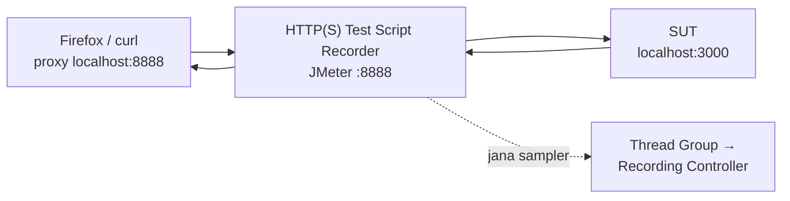

# Hari 1 — Asas Apache JMeter & Ujian Beban

[🧪 Lab Hari 1](./snippets/lab.md) · [🎤 Nota Penceramah](./nota-penceramah.md) · [🎬 Rakam → Replay](./snippets/rakaman-e2e.md) · [🔒 Recording HTTPS](./snippets/rakaman-https-setup.md) · [🗂️ Test plan rujukan](./test-plans/) · [📄 Kamus data](./data/README.md)

> Cuba bayangkan hari terakhir sebelum harga cukai jalan naik — beribu-ribu orang login ke portal JPJ serentak untuk renew cukai. Sistem boleh tahan ke tak? Hari ini kita belajar jawab soalan tu guna **Apache JMeter**: bina **performance test** untuk **Portal eJPJ (tiruan)**, hantar HTTP request, kawal load guna **Thread Group**, check response guna **Assertion**, tiru behaviour user sebenar guna **Timer** dan **CSV Data Set**, baca result dalam **Listener**, dan akhir sekali **record** flow sebenar guna **HTTP(S) Test Script Recorder** — yang akan *fail* bila kita replay, dan failure tu yang bawa kita ke Hari 2.

> ⚠️ **Etika & undang-undang:** Sepanjang kursus ini kita test **salinan local** (`sut/`, `http://localhost:3000`) sahaja. Run load test pada sistem production/awam yang anda **tidak** miliki, atau tanpa kebenaran bertulis, adalah salah di sisi undang-undang (sama macam serangan **DoS**). Semua data adalah **sintetik** — bukan data rasmi JPJ.

**Apa yang kita akan bina hari ini:**
- Test Plan pertama yang hit `/api/health` dan `/`
- Load test 20 users pada endpoint sebut harga cukai
- Assertion (Response & Duration) + Timer (think time)
- Parameterize guna **CSV Data Set Config** (setiap thread guna nombor pendaftaran lain)
- Recording flow login → senarai kenderaan → bayar cukai, dan bukti kenapa ia fail bila di-replay

---

## 🎯 Objektif Pembelajaran

Di akhir hari ini, peserta boleh:

| # | Objektif (boleh diukur) | Sesi | Bukti |
|---|------------------------|------|-------|
| O1 | **Bezakan** lima jenis performance test (Load, Stress, Spike, Soak, Scalability) dan **nyatakan** syarat etika sebelum jana load | S1 | Kuiz S1; boleh sebut target sah kursus (`http://localhost:3000`) dan apa yang perlu ada sebelum test sistem lain (kebenaran bertulis + skop) |
| O2 | **Install** Java + JMeter (termasuk `bin` dalam **PATH** di Windows) dan **run** SUT tiruan | S1 | `jmeter -v` keluar versi 5.6.x dari mana-mana folder; `http://localhost:3000/api/health` → `{"status":"ok",…}` |
| O3 | **Bina** Test Plan pertama (Thread Group → HTTP Request Defaults → HTTP Request → View Results Tree) | S2 | Latihan 1: View Results Tree hijau, kod **200** |
| O4 | **Set** model load (threads / ramp-up / loop) dan **jangka** jumlah sample sebelum run | S2 | Latihan 2: jangkaan 20 × 5 = **100** sama dengan `# Samples` dalam Summary Report |
| O5 | **Letak** Config Element, Assertion, Timer dan Listener pada kedudukan yang betul (**skop ikut kedudukan**) | S2 | Cabaran Latihan 7: terangkan skop setiap elemen kepada rakan |
| O6 | **Baca** Average, Median, 90/95/99% Line, Throughput dan Error % dalam Summary / Aggregate Report | S2 | Nilai Throughput, Average, Error % dan 95% Line dicatat (Latihan 2 & 5) |
| O7 | **Tambah** Response Assertion, Duration Assertion dan Timer, dan **terangkan** kesan think time pada throughput | S3 | Latihan 2 pass dengan 0% error; Latihan 4: Error % naik bila `ABC0000` (404) dimasukkan |
| O8 | **Parameterize** request guna **CSV Data Set Config** dan variable `${…}` | S3 | Latihan 3: View Results Tree tunjuk nombor pendaftaran lain untuk setiap request |
| O9 | **Record** flow guna **HTTP(S) Test Script Recorder** (+ certificate CA untuk HTTPS) dan **terangkan** kenapa replay fail (**401**) | S4 | Latihan 6: sampler berjaya di-record; replay `04-rakaman-mentah.jmx` → 200 / 401 / 401; report HTML ~67% error |

---

## 📅 Jadual Hari Ini

| Masa | Sesi | Aktiviti | Fokus |
|------|------|----------|-------|
| 9.00 – 10.30 pagi | S1 | **Pengenalan Ujian Prestasi & Persediaan** | Apa & kenapa performance test, 5 jenis test, etika; install Java + JMeter (PATH Windows), run SUT, kenal GUI |
| 10.30 – 10.45 pagi | — | Rehat | |
| 10.45 – 1.00 tgh | S2 | **Anatomi Test Plan, Thread Group & Listeners** | Tree elemen & skop, Test Plan pertama, threads/ramp-up/loop, HTTP Request Defaults + Header Manager, View Results Tree / Summary / Aggregate Report |
| 1.00 – 2.00 ptg | — | Makan tengah hari | |
| 2.00 – 3.30 ptg | S3 | **Assertions, Timers & CSV Data Set** | Response + Duration Assertion, Constant / Uniform / Gaussian Timer, CSV Data Set Config (sharing mode, recycle), senario JPJ |
| 3.30 – 3.45 ptg | — | Rehat | |
| 3.45 – 5.00 ptg | S4 | **Rakam Test Plan: HTTP(S) Test Script Recorder** | Proxy 8888 + Firefox, certificate CA (HTTPS), replay fail (401), report HTML dari recording → sambung ke correlation Hari 2 |

---

## 🧭 Kenapa hari ini penting

Functional test jawab soalan *"sistem ni jalan ke tak?"*. Performance test jawab *"sistem ni **tahan** ke bila ramai masuk serentak?"*. Sistem kerajaan macam portal JPJ ada peak yang kita boleh jangka (tarikh luput cukai, hujung bulan, pengumuman harga) — dan kalau sistem down hari tu, satu Malaysia nampak.

| Tanpa hari ini | Dengan hari ini |
|----------------|-----------------|
| "Sistem laju — saya cuba tadi, sekejap je." (1 user) | 20 → 200 virtual users dengan ramp-up terkawal |
| Kod 200 = berjaya | Assertion check **kandungan** dan **tempoh** — 200 yang salah tetap dikira fail |
| Report *average* response time | Report **95th percentile** — itu yang SLA ukur |
| Hantar `WXY1234` seribu kali (cache happy, angka palsu) | CSV bagi data berbeza setiap iteration |
| Taip 30 sampler satu-satu | Record flow sebenar dalam 2 minit — lepas tu buat correlation (Hari 2) |
| "Kita test sistem production terus lah" | Test mock / staging yang ada **kebenaran bertulis** sahaja |

---

## S1 — Pengenalan Ujian Prestasi & Persediaan (9.00 – 10.30 pagi)

### 1.1 Apa itu ujian prestasi (performance testing)

**Performance test** ukur sejauh mana sistem itu laju, stabil dan boleh scale bila diberi load tertentu — bukan sama ada ia *berfungsi* (itu functional test), tapi sama ada ia *tahan* bila ramai user masuk serentak.

> **Konsep — Anatomi performance test:** Setiap test ada empat benda: **Load** (berapa user serentak & corak kedatangan), **Senario** (urutan request yang tiru user sebenar), **Metrik** (throughput, response time, error rate), dan **Kriteria** (SLA/NFR — threshold pass/fail). Hari 1 fokus pada bina Load + Senario + baca Metrik asas.

**Domain kita:** cuba bayangkan hari terakhir sebelum harga cukai jalan naik — beribu-ribu orang login ke portal JPJ serentak untuk renew cukai. Sistem boleh tahan ke tak? Itulah soalan yang performance test jawab.

| Metrik | Maksud ringkas | Tengok di mana hari ini |
|--------|----------------|--------------------------|
| **Response time** | Masa dari request dihantar sampai response penuh diterima (ms) | Average, Median, 90/95/99% Line |
| **Throughput** | Jumlah request yang siap sesaat (req/s) | Summary / Aggregate Report |
| **Error %** | Peratus sample yang fail (HTTP 4xx/5xx, network error, **atau assertion fail**) | Summary / Aggregate Report |
| **Concurrency** | Jumlah virtual users yang aktif serentak | Thread Group (threads) |

### 1.2 Jenis ujian prestasi

| Jenis | Soalan | Corak load |
|-------|--------|-------------|
| **Load test** | Sistem boleh tahan load yang *dijangka*? | Users tetap pada paras normal/peak |
| **Stress test** | Bila sistem akan *pecah*? | Naikkan users sampai sistem fail (breaking point) |
| **Spike test** | Macam mana bila load *naik mendadak*? | Lonjakan tiba-tiba (contohnya hari cukai) |
| **Soak / Endurance** | Ada *memory leak* / prestasi merosot lama-lama? | Load sederhana selama berjam/berhari |
| **Scalability** | Sistem boleh *scale* bila kita tambah resource? | Load sama, bandingkan konfigurasi |

> 💡 **Contoh JPJ:** "1,000 renew cukai sejam pada hari biasa" = **Load**. "Malam terakhir sebelum harga naik, traffic 10× dalam 5 minit" = **Spike**. "Portal hidup 72 jam masa cuti panjang tanpa restart" = **Soak**.

### 1.3 Etika & undang-undang — peraturan nombor satu

JMeter ialah **load generator**. Dari sudut server, 200 thread JMeter nampak sama macam 200 penyerang. Jadi:

| ✅ Dibenarkan | ❌ Dilarang |
|--------------|------------|
| Mock local kursus: `http://localhost:3000` (`sut/`) | Portal JPJ sebenar / mana-mana laman awam tanpa kebenaran |
| Environment test/staging **milik organisasi anda**, dengan **kebenaran bertulis** yang nyatakan skop, host, slot masa dan paras load | "Cuba sikit je" pada production waktu pejabat |
| Laman demo yang memang benarkan orang test (contohnya `blazedemo.com`, load kecil) | Guna data peribadi sebenar (No. KP, nombor pendaftaran orang awam) dalam CSV |

> ⚠️ Load test tanpa kebenaran = **serangan DoS (denial of service)** dari segi undang-undang, walaupun niat anda baik. Dalam organisasi kerajaan, dapatkan kelulusan bertulis dari pemilik sistem **dan** team infra/security, maklumkan team monitoring (NOC/SOC) sebelum run, dan tetapkan siapa yang boleh tekan "Stop".

> 💡 **Tabiat selamat:** setiap kali sebelum Start, pastikan Server=`localhost`, Port=`3000` (HTTP Request Defaults).

### 1.4 Pasang Java (JDK 11+, disyorkan 17/21 LTS)

JMeter jalan atas **Java**. Install **JDK 11 atau lebih baru** (disyorkan JDK 17/21 LTS).

```bash
java --version      # sahkan Java wujud
```

- **macOS:** `brew install openjdk@21` (atau download dari Adoptium/Temurin).
- **Windows:** download installer dari [adoptium.net](https://adoptium.net/), atau `winget install EclipseAdoptium.Temurin.21.JDK`.
- **Linux:** `sudo apt install openjdk-21-jdk`.

### 1.5 Pasang Apache JMeter

- **macOS:** `brew install jmeter`, kemudian run `jmeter`.
- **Manual (semua OS):** download binary dari [jmeter.apache.org/download_jmeter.cgi](https://jmeter.apache.org/download_jmeter.cgi), extract (unzip), dan run:
  - `bin/jmeter` (macOS/Linux) atau `bin\jmeter.bat` (Windows) — ini buka **GUI**.

```bash
jmeter --version   # sahkan JMeter wujud
```

#### Windows: jalankan `jmeter` dari mana-mana (tambah ke PATH)

Secara default, Windows hanya kenal `jmeter` kalau anda berada dalam folder `bin`. Kalau nak taip `jmeter` dari **mana-mana** folder, tambah folder `bin` JMeter ke **PATH**:

1. **Extract** JMeter ke lokasi tetap, contohnya `C:\apache-jmeter-5.6.3`.
2. Buka **Start → taip "environment variables" → "Edit the system environment variables" → Environment Variables…**
3. Bawah **User variables** (tak perlu admin), pilih **Path → Edit → New**, paste:
   ```
   C:\apache-jmeter-5.6.3\bin
   ```
   Klik **OK** pada semua window.
4. **Tutup dan buka semula** Command Prompt/PowerShell (perubahan PATH hanya effect dalam terminal baru).
5. Sahkan:
   ```powershell
   jmeter -v
   ```

**Cara PowerShell (tak perlu admin — PATH user):**
```powershell
[Environment]::SetEnvironmentVariable("Path", $env:Path + ";C:\apache-jmeter-5.6.3\bin", "User")
# tutup & buka semula terminal, kemudian:  jmeter -v
```

> **JMeter perlukan Java.** Kalau `jmeter -v` complain Java tak jumpa: install **JDK 11+**, dan set **`JAVA_HOME`** ke folder JDK (contohnya `C:\Program Files\Eclipse Adoptium\jdk-21…`) dan tambah `%JAVA_HOME%\bin` ke PATH dengan cara yang sama. Sahkan: `java -version`.

> **Nota:** Di Windows, `jmeter` sebenarnya run `jmeter.bat` dalam folder `bin`. Semua command dalam nota ini (`jmeter -n -t … -l … -e -o …`) jalan sama, cuma guna backslash untuk path Windows (contohnya `hari-2\test-plans\06-ujian-beban-nogui.jmx`).

> ⚠️ **Silap biasa:** Extract ke folder yang ada **space atau simbol pelik** (contohnya `C:\Program Files\…` atau `Downloads\apache-jmeter-5.6.3 (1)`), atau run terus dari dalam file `.zip` tanpa extract. Guna path ringkas macam `C:\apache-jmeter-5.6.3`.

### 1.6 GUI vs non-GUI

> **Konsep — GUI vs non-GUI:** JMeter GUI hanya untuk **bina & debug** test plan. Untuk **load sebenar**, sentiasa run dalam mod **non-GUI** (`jmeter -n -t plan.jmx ...`) sebab GUI makan banyak memory dan **perlahankan** load generator. Hari ini kita bina dalam GUI; load sebenar kita run secara non-GUI pada Hari 2.

| Flag | Maksud |
|---------|--------|
| `-n` | non-GUI |
| `-t plan.jmx` | Test Plan yang nak di-run |
| `-l hasil.jtl` | File result (CSV) |
| `-e -o folder/` | Jana report dashboard HTML lepas run (folder mesti kosong / belum wujud) |

### 1.7 Jalankan Sistem Under Test (SUT)

Buka satu terminal dan biarkan server mock ini running sepanjang bengkel:

```bash
cd sut
node server.js
```

Anda patut nampak `Portal eJPJ (TIRUAN) berjalan di  http://localhost:3000`. Buka URL tu dalam browser untuk tengok senarai endpoint. (Perlukan **Node.js 18+**; tak perlu `npm install`.)

| Endpoint | Perlu token? | Response | Guna masa |
|----------|--------------|---------|-----------|
| `GET /api/health` | Tidak | `{"status":"ok","masa":…}` | S2 — Test Plan pertama |
| `GET /api/kenderaan/:no/cukai` | Tidak | `{no_pendaftaran, amaun, tempoh_bulan}`; **404** kalau tiada | S2–S3 — load & CSV |
| `GET /api/saman?no_kp=` | Tidak | `{no_kp, saman:[…]}` | S3 — senario |
| `POST /api/log-masuk` | — | Body `{no_kp, kata_laluan}` → `{token, csrf, nama, mesej}` | S4 — recording |
| `GET /api/kenderaan?no_kp=` | **Ya** (`Authorization: Bearer <token>`) | `{no_kp, kenderaan:[…]}`; **401** kalau token tak sah | S4 — recording |
| `POST /api/kenderaan/:no/bayar-cukai` | **Ya** + `csrf` dalam body | `{no_resit, …, status:"BERJAYA"}`; **401** / **403** / ~1% **500** | S4 — recording |

User sintetik: `800101015500` (WXY1234, VAB88), `900202025600` (JQK7788), `850303035700` (BMT3030, PKL909). Apa-apa password yang tak kosong diterima.

**Tune behaviour SUT** (untuk demo): `PORT` (default 3000), `LATENCY_MIN` / `LATENCY_MAX` (default 40–180 ms), `ERROR_RATE` (default `0.01` = 1% bayaran fail dengan 500).

```bash
curl -s http://localhost:3000/api/health              # semakan pantas
LATENCY_MIN=300 LATENCY_MAX=900 node server.js        # SUT "lambat" (S3)
```

> 🪟 Di Windows **Command Prompt**, set variable dulu: `set LATENCY_MIN=300` kemudian `set LATENCY_MAX=900` kemudian `node server.js`. Dalam **PowerShell**: `$env:LATENCY_MIN=300; $env:LATENCY_MAX=900; node server.js`.

### 1.8 Kenali antara muka JMeter

| Bahagian | Fungsi |
|----------|--------|
| **Menu / Toolbar** (atas) | Open/Save `.jmx`, button **Start (▶)** / **Stop**, **Clear** result |
| **Test tree** (kiri) | Struktur Test Plan — right-click untuk **Add** elemen |
| **Panel setting** (kanan) | Setting untuk elemen yang dipilih |
| **Log** (bawah, ikon segi tiga amaran) | Error & warning JMeter |

Setiap Test Plan disimpan sebagai satu file **`.jmx`** (format XML).


> 💡 **Tip GUI:** **Clear All** (ikon penyapu berganda) kosongkan semua Listener sebelum run baru — kalau tak, result run lama bercampur. Button **Stop** (segi empat) hentikan serta-merta; **Shutdown** tunggu thread habiskan sample semasa dulu.

### 🎯 Kuiz S1

1. Malam terakhir sebelum harga cukai naik, trafik portal melonjak 10× dalam beberapa minit. Jenis ujian manakah paling sesuai untuk mensimulasikan keadaan ini?
   - [ ] Soak / Endurance test
   - [x] Spike test
   - [ ] Scalability test
   - [ ] Ujian fungsian
   > Spike test mengukur tindak balas sistem terhadap **lonjakan mendadak**. Soak menguji beban sederhana untuk tempoh panjang; Scalability membandingkan konfigurasi sumber.

2. Seorang rakan mencadangkan "uji sikit" portal JPJ sebenar dengan 50 thread dari laptop kursus. Apakah tindakan yang betul?
   - [ ] Teruskan kerana 50 thread terlalu kecil untuk menjejaskan pelayan
   - [ ] Teruskan tetapi pada waktu malam supaya tiada pengguna terjejas
   - [x] Tolak — uji hanya mock `http://localhost:3000`, atau persekitaran yang ada kebenaran bertulis dengan skop yang jelas
   > Tanpa kebenaran bertulis, sebarang beban terhadap sistem yang anda tidak miliki ialah setara serangan DoS — saiz beban atau waktu tidak mengubah status undang-undangnya.

3. Mengapakah beban sebenar dijalankan dalam mod **non-GUI** (`jmeter -n`)?
   - [ ] Mod GUI tidak boleh menjalankan lebih daripada satu thread
   - [x] GUI menggunakan banyak memori dan memperlahankan penjana beban, menjadikan angka tidak tepat
   - [ ] Mod non-GUI menghantar permintaan menggunakan protokol yang lebih laju
   > GUI hanya untuk membina & menyahpepijat. Semasa beban, JVM yang sibuk melukis GUI dan menyimpan keputusan dalam memori menjadi bottleneck — yang diukur ialah JMeter, bukan SUT.

4. Di Windows, anda baru menambah `C:\apache-jmeter-5.6.3\bin` ke Path, tetapi `jmeter -v` dalam Command Prompt yang sama masih memberi *"'jmeter' is not recognized"*. Apakah punca paling mungkin?
   - [x] Perubahan PATH hanya berkuat kuasa dalam terminal **baharu** — tutup dan buka semula
   - [ ] JMeter tidak menyokong Windows
   - [ ] Path mesti ditambah bawah System variables dengan hak admin
   > Terminal yang sudah terbuka menyimpan salinan PATH lama. User variables memadai (tiada admin diperlukan).

---

## S2 — Anatomi Test Plan, Thread Group & Listeners (10.45 – 1.00 tgh)

### 2.1 Anatomi Test Plan JMeter

Sebelum mula bina, faham dulu building block utama. Semua elemen disusun dalam bentuk **tree** — kedudukan elemen yang tentukan **skop** (scope) dia.

```
Test Plan
└── Thread Group            (berapa pengguna, ramp-up, gelung)
    ├── HTTP Request Defaults   (Config: server/port lalai)
    ├── HTTP Header Manager     (Config: header dikongsi)
    ├── HTTP Request            (Sampler: satu permintaan)
    │   ├── Response Assertion  (semak kandungan respons)
    │   └── JSON Extractor      (Post-Processor: ekstrak nilai)
    ├── Constant Timer          (Timer: think time)
    └── View Results Tree       (Listener: papar keputusan)
```

| Kategori | Peranan | Contoh |
|----------|---------|--------|
| **Thread Group** | Tentukan populasi virtual users | jumlah thread, ramp-up, loop |
| **Sampler** | Hantar satu request | **HTTP Request**, JDBC, FTP |
| **Config Element** | Setting yang dikongsi (bukan request) | HTTP Request Defaults, Header/Cookie/Cache Manager, **CSV Data Set Config** |
| **Timer** | Jeda antara request (think time) | Constant, Uniform Random, Gaussian |
| **Assertion** | Check response betul ke tak | Response, Duration, JSON Assertion |
| **Pre/Post-Processor** | Jalan sebelum/lepas sampler | JSON Extractor, JSR223 |
| **Listener** | Kumpul & papar result | View Results Tree, Summary/Aggregate Report |

> **Konsep penting — Skop ikut kedudukan:** Elemen **Config**, **Timer**, **Assertion** dan **Listener** effect **semua sampler pada level yang sama atau lebih dalam** (adik-beradik & anak). Letak elemen bawah Thread Group → ia kena pada semua sampler; letak sebagai **anak** kepada satu sampler → ia kena pada sampler itu **sahaja**. Salah letak = punca bug paling biasa untuk beginner.

**Urutan execution** untuk setiap sampler (tak ikut susunan visual dalam tree, kecuali elemen yang sama jenis):

```
Config Elements → Pre-Processors → Timers → SAMPLER → Post-Processors → Assertions → Listeners
```

> 💡 Ini jelaskan dua benda yang selalu buat beginner terkejut: (1) **Timer** jalan **sebelum** sampler (jeda dulu, baru hantar), dan (2) Timer bawah Thread Group yang ada 3 sampler akan tambah jeda **3 kali** setiap iteration — sekali untuk setiap sampler dalam skop dia.

### 2.2 Langkah 1 — Test Plan pertama anda

Jom bina test paling ringkas — satu user hit `/api/health`.

1. Buka JMeter. Anda dah ada **Test Plan** kosong.
2. **Klik kanan Test Plan → Add → Threads (Users) → Thread Group.**
3. Pada Thread Group, set dulu buat sementara: **Number of Threads = 1**, **Ramp-up = 1**, **Loop Count = 1**.
4. **Klik kanan Thread Group → Add → Config Element → HTTP Request Defaults.** Isi:
   - **Protocol:** `http` · **Server Name or IP:** `localhost` · **Port Number:** `3000` *(Plan rujukan `01-hello-jpj.jmx` letak Defaults terus bawah **Test Plan** — kesan sama, sebab skop Test Plan merangkumi semua Thread Group.)*
5. **Klik kanan Thread Group → Add → Sampler → HTTP Request.** Isi:
   - **Method:** `GET` · **Path:** `/api/health` (biarkan server/port kosong — ambil dari Defaults)
6. **Klik kanan Thread Group → Add → Listener → View Results Tree.**
7. Klik **Save** (`.jmx`), kemudian **Start (▶)**.

Dalam View Results Tree, klik sample tu — anda patut nampak ikon **hijau**, kod **200**, dan response body `{"status":"ok",...}`.

> **Konsep — HTTP Request Defaults:** Config ini set **nilai default** (server, port, protocol) yang **diwarisi** oleh semua HTTP Request di bawahnya. Jadi bila alamat SUT berubah (contohnya dari `localhost` ke server test), anda tukar di **satu tempat** sahaja.

> 💡 **Tiga tab View Results Tree:** **Sampler result** (kod, masa, saiz), **Request** (URL + header yang *betul-betul* dihantar — check sini bila ada benda pelik), **Response data** (response body; pilih *JSON* dalam dropdown supaya lebih senang baca).

**Tambah sampler kedua:** ulang langkah 5 dengan **Path** `/` — page info HTML yang senaraikan semua endpoint. Sekarang plan anda hit `/api/health` dan `/`.

> Rujuk file siap: [`test-plans/01-hello-jpj.jmx`](./test-plans/01-hello-jpj.jmx).

### 2.3 Langkah 2 — Thread Group: model beban

**Thread Group** ialah jantung load test — ia tentukan **populasi virtual users**.

| Field | Maksud | Contoh |
|-------|--------|--------|
| **Number of Threads (users)** | Jumlah virtual users serentak | `20` |
| **Ramp-Up Period (seconds)** | Masa untuk start **semua** thread | `10` (2 users/saat) |
| **Loop Count** | Berapa kali setiap thread ulang senario | `5` (atau *Infinite*) |

> **Konsep penting — Ramp-up:** Jangan start semua user serentak (ramp-up = 0) kecuali memang nak buat spike test — ia cipta "kejutan" yang tak realistik. Ramp-up sikit-sikit (contohnya 20 users dalam 10s) tiru cara user sebenar masuk dan bagi sistem masa untuk *warm-up*.

> **Konsep — jumlah request:** Jumlah sample = **Threads × Loop Count** (kalau satu sampler). 20 × 5 = **100** request. Check dalam Summary Report untuk pastikan test run sampai habis.

**Kira dulu sebelum klik Start:**

| Threads | Ramp-up | Loop | Sampler | Jumlah sample | Thread baru setiap… |
|---------|---------|------|---------|---------------|-----------------------|
| 1 | 1 | 1 | 2 (`/api/health`, `/`) | 2 | — |
| 20 | 10 | 5 | 1 | **100** | 0.5 s |
| 10 | 5 | 10 | 1 | **100** | 0.5 s |
| 50 | 20 | 1 | 1 | 50 | 0.4 s |

> ⚠️ **Silap biasa:** "20 threads = 20 request serentak sepanjang masa." Tak semestinya — kalau setiap thread dah habis loop dia sebelum thread terakhir start (ramp-up panjang, loop pendek), concurrency sebenar jauh lebih rendah. Tengok column *Active Threads* dalam report HTML (Hari 2).

Field lain yang patut kenal: **Action to be taken after a Sampler error** (*Continue* ialah default — teruskan; *Start Next Thread Loop* — mula iteration baru; *Stop Thread* / *Stop Test*), dan **Specify Thread lifetime** (Duration/Startup delay — untuk test ikut masa, Hari 2).

Tukar Thread Group anda kepada **20 / 10 / 5** untuk langkah seterusnya.


### 2.4 Langkah 3 — HTTP Header Manager

Banyak API perlukan **header** (contohnya `Content-Type`, `Accept`, `Authorization`). **HTTP Header Manager** set header yang dikongsi oleh semua sampler dalam skop dia.

1. **Klik kanan Thread Group → Add → Config Element → HTTP Header Manager.** *(Plan rujukan `02-cukai-beban.jmx` letak ia bawah **Test Plan** — kesan sama.)*
2. Klik **Add** dan masukkan: Name `Accept`, Value `application/json`.

> **Konsep — Config Element lain yang berguna:**
> - **HTTP Cookie Manager** — simpan & hantar semula cookie (perlu untuk session yang guna cookie).
> - **HTTP Cache Manager** — tiru cache browser (elak download semula resource statik).
> Untuk API JSON kita, Header Manager dah cukup; pada Hari 2 kita guna token (bukan cookie).

> 💡 **Header Manager boleh nested:** satu bawah Thread Group (`Accept` untuk semua) + satu sebagai anak kepada sampler `POST` tertentu (`Content-Type: application/json`). JMeter akan **gabungkan** kedua-duanya untuk sampler tu. Corak ni anda akan nampak dalam recording (S4).

### 2.5 Langkah 4 — Listener: membaca keputusan

**Listener** kumpul & papar result. Tiga yang paling penting:

| Listener | Guna | Amaran |
|----------|------|--------|
| **View Results Tree** | Debug — tengok setiap request/response penuh | **Sangat berat** — untuk 1–2 users sahaja, disable masa load test |
| **Summary Report** | Ringkasan setiap label: # sample, Average, Min/Max, Error %, Throughput | Ringan — sesuai untuk load test |
| **Aggregate Report** | Macam Summary + **Median**, **90/95/99 percentile** | Ringan |

Tambah ketiga-tiga bawah Thread Group (**klik kanan Thread Group → Add → Listener → View Results Tree / Summary Report / Aggregate Report**). Run test (20/10/5) dan perhatikan:

- **# Samples** = 100
- **Average** — purata response time (ms)
- **Throughput** — request/saat
- **Error %** — peratus sample yang fail

**Kamus column** (JMeter 5.6):

| Column | Maksud | Report |
|-------|--------|--------|
| `# Samples` | Jumlah sample untuk label tu | Kedua-dua |
| `Average` | Purata response time (ms) | Kedua-dua |
| `Median` | 50% sample siap dalam masa ini atau kurang | Aggregate |
| `90% Line` / `95% Line` / `99% Line` | Percentile — 90/95/99% sample siap dalam masa ini atau kurang | Aggregate |
| `Min` / `Max` | Sample paling laju / paling lambat | Kedua-dua |
| `Std. Dev.` | Sebaran response time — tinggi = tak konsisten | Summary |
| `Error %` | Peratus sample yang fail | Kedua-dua |
| `Throughput` | Sample sesaat (atau seminit, tengok unit `/sec` `/min`) | Kedua-dua |
| `Received KB/sec` / `Sent KB/sec` | Bandwidth | Kedua-dua |

> **Konsep penting — JANGAN guna GUI listener masa load sebenar.** View Results Tree simpan **setiap** response dalam memory → load generator kehabisan RAM dan angka jadi tak tepat. Untuk load sebenar (Hari 2), buang GUI listener dan tulis result ke file **`.jtl`** guna `-l` dalam mod non-GUI.

> **Konsep — Average boleh menipu:** Purata sorok peak. Sentiasa tengok **percentile** — "95th percentile = 800 ms" maksudnya 95% request siap ≤ 800 ms (dan 5% lagi lebih teruk). SLA biasanya ditulis guna percentile, bukan purata.

> 💡 **Contoh:** 99 request 100 ms + 1 request 10,000 ms → Average ≈ **199 ms** ("OK!"), tapi user ke-100 tunggu 10 saat. `99% Line` dan `Max` yang tunjuk masalah tu.


### 🎯 Kuiz S2

1. Thread Group ditetapkan **20 threads**, **ramp-up 10 s**, **loop 5**, dengan **satu** HTTP Request. Berapakah `# Samples` yang dijangka dalam Summary Report?
   - [ ] 20
   - [ ] 25
   - [x] 100
   - [ ] 200
   > Jumlah sampel = Threads × Loop Count × bilangan sampler = 20 × 5 × 1 = 100. Ramp-up tidak mengubah jumlah — hanya kadar thread dilancarkan.

2. Sebuah Response Assertion diletakkan sebagai **anak** kepada sampler A. Sampler B ialah adik-beradik A di bawah Thread Group yang sama. Sampler manakah yang disemak oleh assertion itu?
   - [x] Sampler A sahaja
   - [ ] Sampler A dan B
   - [ ] Semua sampler dalam Test Plan
   > Skop mengikut kedudukan: anak kepada satu sampler hanya menyentuh sampler itu. Untuk menyemak A dan B, letakkan assertion di bawah Thread Group (adik-beradik kepada kedua-duanya).

3. Pengurus meminta "95th percentile masa respons". Listener manakah memaparkannya secara terus?
   - [ ] Summary Report
   - [x] Aggregate Report
   - [ ] View Results Tree
   > Aggregate Report mempunyai lajur `Median`, `90% Line`, `95% Line`, `99% Line`. Summary Report hanya ada Average, Min, Max dan Std. Dev.

4. Alamat SUT bertukar dari `localhost:3000` ke pelayan ujian lain. Plan anda ada 15 HTTP Request. Cara paling betul untuk mengemas kini?
   - [ ] Ubah Server Name dalam setiap 15 sampler
   - [x] Ubah **HTTP Request Defaults** sekali; sampler dengan Server kosong mewarisinya
   - [ ] Tambah HTTP Header Manager dengan header `Host`
   > HTTP Request Defaults ialah Config Element yang memberi nilai lalai kepada semua HTTP Request dalam skopnya — satu tempat untuk diubah (dan satu tempat untuk disemak dari sudut etika).

---

## S3 — Assertions, Timers & CSV Data Set (2.00 – 3.30 ptg)

### 3.1 Langkah 5 — Assertion: sahkan respons betul

Kod **200** tak semestinya maksud response tu **betul**. **Assertion** yang check kandungan.

#### Response Assertion

1. **Klik kanan HTTP Request → Add → Assertions → Response Assertion.**
2. **Field to Test:** *Text Response* · **Pattern Matching Rules:** *Substring* · **Patterns to Test:** tambah `amaun`.

Sekarang sample hanya "pass" kalau response body ada perkataan `amaun`.

| Pattern Matching Rule | Maksud | Contoh |
|-----------------------|--------|--------|
| **Contains** | Ada padanan **regex** | `"amaun":\s*\d+` |
| **Matches** | **Seluruh** response padan dengan regex | jarang guna untuk JSON |
| **Equals** | Sama sebiji (teks) | response pendek yang tetap |
| **Substring** | Ada teks biasa (tanpa regex) — paling selamat | `amaun`, `BERJAYA` |
| **Not** (checkbox) | Terbalikkan — pass kalau **tiada** padanan | `ralat` |

> 💡 **Field to Test** lain yang berguna: **Response Code** (contohnya `200`) — dan checkbox **Ignore Status** kalau anda *memang nak* test yang 404 dipulangkan (negative test).

#### Duration Assertion

1. **Klik kanan HTTP Request yang sama → Add → Assertions → Duration Assertion** (anak kepada sampler, sebelah Response Assertion — macam dalam `02-cukai-beban.jmx`).
2. **Duration in milliseconds:** `2000` — sample dikira fail kalau ambil masa lebih 2 saat.

> **Konsep — Assertion ubah maksud "fail":** Tanpa assertion, hanya network/HTTP error yang dikira fail. Dengan assertion, response yang **salah kandungan** atau **terlalu lambat** pun dikira fail → **Error %** anda tunjuk kualiti sebenar, bukan sekadar connection berjaya.

Sampler `GET /api/kenderaan/WXY1234/cukai` dengan kedua-dua assertion → rujuk [`test-plans/02-cukai-beban.jmx`](./test-plans/02-cukai-beban.jmx) (Response Assertion *"Respons mengandungi 'amaun'"*, Duration Assertion *"Tempoh < 2000ms"*, Constant Timer *"Think Time 300ms"*, Header Manager `Accept: application/json`, Summary + Aggregate Report, dan View Results Tree yang dilabel *"nyahaktif semasa beban"*).

> ⚠️ **Assertion pun ada kos:** setiap assertion jalan untuk setiap sample. Regex yang kompleks pada response besar boleh bebankan load generator. Utamakan **Substring** atau JSON Assertion yang ringkas.

### 3.2 Langkah 6 — Timer: think time

User sebenar **tak** hantar request bertubi-tubi — mereka baca, fikir, taip dulu. **Timer** tambah jeda ni supaya load lebih realistik.

| Timer | Behaviour | Field |
|-------|----------|-------|
| **Constant Timer** | Jeda tetap (contohnya 300 ms) setiap sampler | *Thread Delay* |
| **Uniform Random Timer** | Jeda rawak sekata (asas + julat rawak) | *Constant Delay Offset* + *Random Delay Maximum* — contohnya 500 + 1000 → 0.5–1.5 s |
| **Gaussian Random Timer** | Jeda rawak ikut taburan normal (paling realistik) | *Constant Delay Offset* + *Deviation* — contohnya 1000 ± 300 ms |

1. **Klik kanan Thread Group → Add → Timer → Constant Timer.** **Thread Delay (in milliseconds):** `300`.

> **Konsep — think time effect throughput:** Tambah think time akan **turunkan** throughput (thread tunggu, tak hantar request). Ini memang **betul** — throughput tanpa think time tak realistik dan boleh bagi load palsu pada sistem. Kalau nak capai target *request/saat* tertentu, adjust **jumlah thread** dan **think time** sekali, atau guna **Throughput Controller / Timer** (Hari 2).

> 💡 **Kiraan kasar:** throughput ≈ threads ÷ (response time + think time). 20 thread, response ~0.1 s, think time 0.3 s → ≈ 20 ÷ 0.4 = **~50 req/s** (lepas ramp-up habis). Tanpa timer → ≈ 20 ÷ 0.1 = ~200 req/s.

> ⚠️ **Masa timer tak dikira** dalam response time sample (kecuali anda guna Transaction Controller dengan option tertentu — Hari 2). Jadi Average tak "naik" sebab timer; yang turun ialah throughput.

### 3.3 Langkah 7 — Parameterisasi dengan CSV Data Set Config

Hantar `WXY1234` seribu kali memang tak realistik — ia kena cache dan tak test data yang pelbagai. **CSV Data Set Config** bagi nilai berbeza kepada setiap thread/iteration.

File [`data/kenderaan.csv`](./data/kenderaan.csv) (sintetik — tengok [kamus data](./data/README.md)):

```
no_pendaftaran,model
WXY1234,Perodua Myvi 1.5
VAB88,Honda Civic 1.8
JQK7788,Proton X50 1.5T
BMT3030,Toyota Hilux 2.4
PKL909,Perodua Axia 1.0
```

1. **Klik kanan Thread Group → Add → Config Element → CSV Data Set Config.** *(Plan rujukan `03-csv-berparameter.jmx` letak ia bawah **Test Plan** — kesan sama.)*
2. Isi:
   - **Filename:** `../data/kenderaan.csv` *(relatif kepada lokasi file `.jmx`)*
   - **Variable Names:** `no_pendaftaran,model`
   - **Ignore first line:** `True` (baris header) · **Recycle on EOF:** `True` · **Stop thread on EOF:** `False`
   - **Sharing mode:** `All threads`
3. Tukar path sampler kepada: `/api/kenderaan/${no_pendaftaran}/cukai`.
4. Tukar Thread Group kepada **10 / 5 / 10** (threads / ramp-up / loop — macam `03-csv-berparameter.jmx`), kemudian run (10 users × 10 loop = 100 sample). Dalam View Results Tree, pastikan setiap request guna nombor yang berbeza.

> **Konsep — `${nama}` ialah variable JMeter:** Syntax `${no_pendaftaran}` diganti dengan nilai dari CSV masa run. Nilai ni boleh datang dari CSV, User Defined Variables, Extractor (Hari 2), atau function built-in macam `${__Random(1,100)}`.

> **Konsep — Sharing mode:** *All threads* = satu queue CSV dikongsi semua (baris seterusnya diberi kepada thread seterusnya). *Current thread group* / *Current thread* asingkan queue. Untuk data yang mesti unik setiap user, guna dengan berhati-hati + `Recycle=False` + `Stop thread=True`.

| Kombinasi EOF | Apa jadi lepas baris terakhir | Sesuai untuk |
|--------------|------------------------------------|--------------|
| Recycle `True`, Stop thread `False` | Patah balik ke baris pertama | Data rujukan (sebut harga cukai) — **pilihan kita** |
| Recycle `False`, Stop thread `True` | Thread berhenti bila data habis | Setiap baris mesti guna **sekali** sahaja (contohnya akaun unik) |
| Recycle `False`, Stop thread `False` | Variable jadi `<EOF>` | Jarang — biasanya bug |

> ⚠️ **Silap biasa:** *Ignore first line* = `False` padahal file ada baris header → iteration pertama hantar `/api/kenderaan/no_pendaftaran/cukai` → **404**. Satu lagi: ada space dalam *Variable Names* (`no_pendaftaran, model`) buat nama variable jadi ` model` (dengan space).

> Plan rujukan [`test-plans/03-csv-berparameter.jmx`](./test-plans/03-csv-berparameter.jmx) juga guna **Uniform Random Timer (0.5–1.5s)** — Constant Delay Offset 500 ms + Random Delay Maximum 1000 ms.


*(Gambar di atas dari Hari 2 — file `pengguna.csv`. Untuk Hari 1 guna `../data/kenderaan.csv` dan `no_pendaftaran,model`.)*

> Rujuk file siap: [`test-plans/03-csv-berparameter.jmx`](./test-plans/03-csv-berparameter.jmx).

> 🧪 **Belajar dari failure:** tambah baris palsu `ABC0000,Kereta Hantu` dalam CSV → endpoint pulangkan **404** dan Response Assertion `amaun` fail → Error % naik. Inilah Latihan 4.

### 3.4 Senario sebenar JPJ (use cases)

Kaitkan skill Hari 1 dengan soalan operasi sebenar. Semua guna tool Hari 1 sahaja.

#### Kes 1 — Kesihatan sistem asas
`GET /api/health` dengan 50 users, ramp 20s. **Soalan:** throughput stabil ke? Error % = 0?

#### Kes 2 — Beban semak cukai
`GET /api/kenderaan/${no_pendaftaran}/cukai` guna parameter CSV, 30 users × 10 loop + Response Assertion. **Soalan:** berapa 95th percentile? (Guna Aggregate Report.)

#### Kes 3 — Semak saman
`GET /api/saman?no_kp=900202025600`, 20 users. Tambah Response Assertion yang check ada `saman`. **Soalan:** bandingkan latency dengan endpoint cukai.

#### Kes 4 — Kesan think time
Run Kes 2 dua kali: (a) tanpa timer, (b) dengan Constant Timer 1000 ms. **Soalan:** macam mana throughput & Average berubah? Kenapa?

#### Kes 5 — Kesan latensi pelayan
Restart server dengan `LATENCY_MIN=300 LATENCY_MAX=900 node server.js`. Ulang Kes 2. **Soalan:** mana yang lebih effect user — throughput atau percentile?

> **🎯 Cabaran gabungan:** Bina satu Test Plan dengan HTTP Request Defaults + Header Manager + CSV Data Set + 2 sampler (cukai & saman), setiap satu ada Response Assertion, Constant Timer, dan Summary + Aggregate Report. Run 25 users × 8 loop dan report Error %, Average, dan 95th percentile kepada kelas.

### 🎯 Kuiz S3

1. Sebuah endpoint memulangkan **HTTP 200** tetapi badannya `{"ralat":"Sistem sibuk"}`. Tanpa sebarang assertion, bagaimanakah JMeter mengira sampel ini?
   - [x] Lulus — hanya ralat HTTP/rangkaian dikira gagal tanpa assertion
   - [ ] Gagal — JMeter mengesan perkataan "ralat" secara automatik
   - [ ] Diabaikan dan tidak dikira dalam # Samples
   > Itulah sebabnya kita menambah Response Assertion (cth. Substring `amaun`) — supaya respons yang salah kandungan dikira dalam Error %.

2. Anda menambah **Constant Timer 1000 ms** pada plan 20 thread tanpa mengubah apa-apa lagi. Apakah kesan paling ketara?
   - [ ] Average masa respons naik kira-kira 1000 ms
   - [x] Throughput turun kerana setiap thread menunggu sebelum setiap permintaan
   - [ ] Error % naik kerana Duration Assertion gagal
   > Masa timer tidak dikira dalam masa respons sampel. Thread yang "berfikir" tidak menghantar, jadi permintaan sesaat menurun — itu realistik, bukan pepijat.

3. **Filename** `../data/kenderaan.csv` dalam CSV Data Set Config ditafsir relatif kepada apa?
   - [ ] Folder semasa terminal tempat `jmeter` dijalankan
   - [ ] Folder `bin` JMeter
   - [x] Lokasi fail `.jmx`
   > Laluan relatif diselesaikan dari folder Test Plan. Sebab itu plan boleh dijalankan dari mana-mana cwd selagi susunan `test-plans/` dan `data/` dikekalkan.

4. Dalam 5 permintaan pertama, View Results Tree menunjukkan satu permintaan ke `/api/kenderaan/no_pendaftaran/cukai` yang mendapat 404. Apakah puncanya?
   - [ ] Sharing mode ditetapkan *Current thread*
   - [x] *Ignore first line* = `False`, jadi baris tajuk dibaca sebagai data
   - [ ] Recycle on EOF = `True`
   > Baris pertama `no_pendaftaran,model` ialah tajuk. Tetapkan *Ignore first line* = `True` apabila *Variable Names* diisi secara manual.

---

## S4 — Rakam Test Plan: HTTP(S) Test Script Recorder (3.45 – 5.00 ptg)

### 4.1 Cara perakam berfungsi

Selain bina sampler satu-satu, JMeter boleh **record** traffic sebenar melalui **proxy** dan terus jana sampler secara automatik. Berguna untuk flow panjang (banyak request) supaya anda tak perlu taip satu-satu.

**Cara ia jalan:** JMeter buka satu **proxy** (default port `8888`). Anda set **Firefox** supaya lalu proxy tu; setiap request akan **di-record** masuk ke **Recording Controller**.



> **Kenapa Firefox?** Firefox ada **setting proxy sendiri** — anda tak perlu ubah proxy untuk seluruh OS (yang effect semua aplikasi lain). Jadi Firefox ialah browser paling bersih & selamat untuk recording.

### 4.2 A. Sediakan perakam (di JMeter GUI)

1. **Klik kanan Test Plan → Add → Non-Test Elements → HTTP(S) Test Script Recorder.**
2. **Klik kanan Test Plan → Add → Threads (Users) → Thread Group**, kemudian **klik kanan Thread Group → Add → Logic Controller → Recording Controller** (tempat simpan recording). Pada recorder, set **Target Controller → Test Plan > Thread Group > Recording Controller**.
3. Pada recorder, tab **Requests Filtering → URL Patterns to Exclude → Add:** tambah regex untuk static asset `(?i).*\.(bmp|css|js|gif|ico|jpe?g|png|swf|eot|otf|ttf|mp4|woff|woff2)([?;].*)?` supaya image/CSS/JS tak di-record.

> Atau skip A1–A3: buka [`test-plans/rakam-template.jmx`](./test-plans/rakam-template.jmx) — semua dah siap setup.

### 4.3 B. Konfigur Firefox untuk proxy

4. Firefox → **Settings** → taip "proxy" dalam kotak search → **Network Settings → Settings…**
5. Pilih **Manual proxy configuration**: **HTTP Proxy** `localhost`, **Port** `8888`; tick **Also use this proxy for HTTPS**.
6. **⚠️ Penting:** **buang** `localhost, 127.0.0.1` dari kotak **No proxy for** — kalau tak, traffic localhost akan **bypass** proxy dan **tiada apa yang di-record**. Klik **OK**.
7. **Untuk target HTTPS sahaja:** klik **Start** (langkah C8) sekali dulu supaya JMeter jana `ApacheJMeterTemporaryRootCA.crt` dalam folder `bin/`, kemudian di Firefox: **Settings → Privacy & Security → Certificates → View Certificates → Authorities → Import…** → pilih file tu → tick **Trust this CA to identify websites**. *(SUT kita guna `http://`, jadi langkah certificate ni **tak** perlu.)*

### 4.4 C. Rakam

8. Di JMeter, pilih **HTTP(S) Test Script Recorder** → klik **Start** ▶ hijau.
9. Dalam **Firefox**, buka `http://localhost:3000/portal` (portal web dengan borang log masuk) dan buat flow (login → check kenderaan → bayar). Setiap request akan muncul sebagai sampler dalam **Recording Controller**.
   > Alternatif tanpa browser (guna `curl` melalui proxy JMeter — berguna untuk `POST`):
   > ```bash
   > curl -s -x http://localhost:8888 -H 'Content-Type: application/json' \
   >   -d '{"no_kp":"800101015500","kata_laluan":"rahsia123"}' \
   >   http://localhost:3000/api/log-masuk
   > ```
10. Klik **Stop** ⏹. **Reset balik Firefox:** Network Settings → **Use system proxy settings** (atau *No proxy*) supaya browsing biasa jalan semula.

> **Shortcut — template recorder siap pakai:** Daripada setup recorder dari kosong, buka [`test-plans/rakam-template.jmx`](./test-plans/rakam-template.jmx) — **HTTP(S) Test Script Recorder** (port 8888) + **Recording Controller** dah siap setup dan target ke `localhost`. Terus klik **Start**, browse guna **Firefox** yang dah set proxy (bahagian B), dan record. (Untuk target **HTTPS**, import certificate `ApacheJMeterTemporaryRootCA.crt` ke Firefox dulu — langkah B7.)

> 💡 Check proxy dah up (dari terminal lain): `lsof -iTCP:8888 -sTCP:LISTEN -n -P` (macOS/Linux) atau `netstat -ano | findstr :8888` (Windows).

### 4.5 Rakaman HTTPS & sijil CA JMeter

Untuk record HTTPS, JMeter jadi **man-in-the-middle (MITM)**: ia decrypt traffic, record, kemudian encrypt semula ke server. Browser mesti **trust** certificate CA JMeter.

| Perkara | Ringkasan |
|---------|-----------|
| File certificate | `<JMETER_HOME>/bin/ApacheJMeterTemporaryRootCA.crt` — dijana bila recorder **Start** kali pertama; valid **7 hari** |
| Firefox | Settings → Privacy & Security → Certificates → View Certificates → **Authorities → Import…** → **Trust this CA to identify websites** |
| Chrome / Edge (Windows) | Double-click `.crt` → **Install Certificate** → **Current User** (bukan Local Machine) → *Trusted Root Certification Authorities* |
| Error **"cert not owner" / access denied** | Anda install ke store **Local Machine** tanpa admin rights — pilih **Current User** |
| macOS (Chrome/Safari) | `sudo security add-trusted-cert -d -r trustRoot -k /Library/Keychains/System.keychain …/ApacheJMeterTemporaryRootCA.crt` |
| **Lepas selesai** | **Buang** certificate (Windows: `certmgr.msc`; macOS: `security delete-certificate`) — jangan biar MITM di-trust selama-lamanya |

> **Recording HTTPS (mana-mana laman yang dibenarkan):** guna template generik [`test-plans/rakam-https-template.jmx`](./test-plans/rakam-https-template.jmx) (tiada filter host) + panduan penuh import certificate CA di [`snippets/rakaman-https-setup.md`](./snippets/rakaman-https-setup.md). ⚠️ Record **hanya** sistem yang anda miliki atau ada **kebenaran bertulis** untuk test.

### 4.6 Rakaman tidak korelasi — buktinya

> **⚠️ Konsep paling penting — recording TAK buat correlation secara automatik:** Recorder hardcode nilai yang dia nampak masa recording, termasuk **token** & **csrf** untuk session tu. Bila anda replay, session tu dah expired → request seterusnya dapat **401/403**. Cara betulkan = **correlation** (Hari 2).

**Cuba replay (buktinya):** buka [`test-plans/04-rakaman-mentah.jmx`](./test-plans/04-rakaman-mentah.jmx) — hasil recording "mentah" dengan token yang di-hardcode (`Authorization: Bearer 4e6b9c2a-…-token-rakaman-luput`, `"csrf": "a1b2c3d4…-csrf-rakaman-luput"`):

```bash
node sut/server.js &     # pastikan SUT berjalan
jmeter -n -t hari-1/test-plans/04-rakaman-mentah.jmx -l /tmp/r04.jtl
# /api/log-masuk → 200 ; /api/kenderaan → 401 ; bayar-cukai → 401 (Assertion BERJAYA gagal)
```

Login berjaya, tapi dua request seterusnya dapat **401** sebab token dari recording dah expired. Plan ni memang sengaja **rosak** untuk tunjuk kenapa correlation diperlukan — versi yang dah dibetulkan ada di [`hari-2/test-plans/04-korelasi-log-masuk.jmx`](../hari-2/test-plans/04-korelasi-log-masuk.jmx).

| Sampler | Kod | Sebab |
|---------|-----|-------|
| `POST /api/log-masuk` | **200** | Login sentiasa berjaya (apa-apa password) — **token baru** dikeluarkan, tapi tak ada siapa yang tangkap |
| `GET /api/kenderaan` | **401** | Hantar token **lama** yang di-hardcode |
| `POST …/bayar-cukai` | **401** | Token lama → terus ditolak sebelum `csrf` sempat di-check; assertion *"Sepatutnya BERJAYA (akan GAGAL tanpa korelasi)"* fail |

> **Latihan penuh:** Untuk satu flow lengkap **record → jana sampler → replay → fail**, ikut [`snippets/rakaman-e2e.md`](./snippets/rakaman-e2e.md).

### 4.7 Laporan HTML dari rakaman

Tambah `-e -o <folder>` untuk jana **report dashboard HTML** terus dari replay (dari [`rakaman-e2e.md` Langkah 6](./snippets/rakaman-e2e.md#langkah-6--jana-laporan-html-dari-rakaman)):

```bash
# folder output MESTI kosong / belum wujud
jmeter -n -t hari-1/test-plans/04-rakaman-mentah.jmx \
  -l /tmp/rec.jtl -e -o /tmp/laporan-rakaman/
open /tmp/laporan-rakaman/index.html          # Windows: start /tmp\laporan-rakaman\index.html

# atau jana KEMUDIAN dari .jtl sedia ada:
jmeter -g /tmp/rec.jtl -o /tmp/laporan-rakaman/
```

| Recording | Error % | Sebab |
|---------|---------|-------|
| **Mentah** (`04-rakaman-mentah.jmx`) | **~67%** (2 daripada 3 fail) | Token/csrf di-hardcode → 401 masa replay |
| **Dengan correlation** (`hari-2/…/05-transaksi-penuh.jmx`) | **0%** | JSON Extractor tangkap token/csrf masa run |

> **Nota:** recording biasanya run 1 user × 1 loop → sample sikit → report nipis. Untuk report yang bermakna, naikkan threads/loops atau guna [`hari-2/run/run-nogui.sh`](../hari-2/run/run-nogui.sh) (Hari 2).

### 4.8 Petua bersih-selepas-rakam

> **Tip cleanup lepas recording:** Buang request asset/analytics yang tak berkaitan, rename sampler supaya bermakna, tambah **Header Manager**, **think time**, dan **CSV** — lepas tu buat **correlation** untuk nilai dinamik. Recording cuma titik mula, bukan produk siap.

| Checklist | Kenapa |
|---------------|---------|
| Buang sampler static asset / analytics (`.css`, `.js`, plugin statistik, Google Analytics) | Bukan load yang anda nak ukur — dan mungkin hantar traffic ke pihak ketiga |
| Rename sampler (`01 Log masuk`, `02 Senarai kenderaan`) | Label report yang bermakna |
| Ganti host/port yang hardcode dengan **HTTP Request Defaults** | Satu tempat untuk tukar & check |
| Tambah **Timer** | Recording tiada think time |
| Ganti data tetap dengan **CSV** | Data lebih pelbagai |
| Buat **correlation** untuk `token` & `csrf` | Tanpa ni, replay akan fail (Hari 2) |

### 🎯 Kuiz S4

1. Pada port manakah proxy **HTTP(S) Test Script Recorder** mendengar dalam `rakam-template.jmx` (dan lalai JMeter)?
   - [ ] 3000
   - [ ] 8080
   - [x] 8888
   > Port 3000 ialah SUT. Pelayar/curl dihalakan ke proxy JMeter di 8888, yang kemudian meneruskan permintaan ke 3000.

2. Perakam sudah **Start** dan Firefox ditetapkan ke proxy `localhost:8888`, tetapi tiada sampler muncul semasa melayari `http://localhost:3000`. Apakah punca paling biasa?
   - [x] `localhost, 127.0.0.1` masih dalam kotak **No proxy for** Firefox
   - [ ] Sijil CA JMeter belum diimport
   - [ ] Recording Controller mesti diletak di bawah Test Plan, bukan Thread Group
   > Trafik ke localhost memintas proxy jika tersenarai dalam *No proxy for*. Sijil CA hanya perlu untuk **HTTPS**; SUT kita `http://`.

3. Semasa main balik `04-rakaman-mentah.jmx`, `/api/log-masuk` memberi 200 tetapi `/api/kenderaan` memberi **401**. Mengapa?
   - [ ] SUT tidak menyokong permintaan GET
   - [x] Header `Authorization` mengandungi token yang dikeras-kod dari sesi rakaman yang sudah luput
   - [ ] Perakam lupa merakam badan permintaan log masuk
   > Log masuk mengeluarkan token **baharu**, tetapi sampler seterusnya masih menghantar token **lama**. Menangkap token baharu dan menggunakannya semula = korelasi (Hari 2).

4. Di Windows, import `ApacheJMeterTemporaryRootCA.crt` gagal dengan *"cert not owner"*. Apakah pembetulannya?
   - [ ] Jana semula sijil dengan port lain
   - [ ] Tukar ke sambungan `http://` untuk semua laman
   - [x] Pasang ke store **Current User** (bukan Local Machine) → *Trusted Root Certification Authorities*
   > Store Local Machine memerlukan hak Administrator. Current User memadai untuk Chrome/Edge pengguna itu — dan buang sijil selepas selesai.

---

## 📦 Hasil Hari Ini

- Java + JMeter dah install; `jmeter -v` boleh run dari mana-mana folder (PATH Windows)
- SUT tiruan running: `node server.js` → `http://localhost:3000`
- Test Plan pertama (`/api/health` + `/`) — sama macam [`01-hello-jpj.jmx`](./test-plans/01-hello-jpj.jmx)
- Load test 20 / 10 / 5 dengan Header Manager, Response + Duration Assertion, Constant Timer, Summary + Aggregate Report — sama macam [`02-cukai-beban.jmx`](./test-plans/02-cukai-beban.jmx)
- Plan dengan parameter CSV (`kenderaan.csv`) — sama macam [`03-csv-berparameter.jmx`](./test-plans/03-csv-berparameter.jmx)
- Recording flow login → kenderaan → bayar cukai, dan bukti replay fail (200 / 401 / 401) — [`04-rakaman-mentah.jmx`](./test-plans/04-rakaman-mentah.jmx)
- Report HTML dari recording (`-e -o`) tunjuk ~67% error
- Boleh terangkan: jenis performance test, etika load test, skop ikut kedudukan, threads × loop, percentile vs average, kesan think time, sharing mode CSV, kenapa recording perlu correlation

> **Lab:** Siapkan [`snippets/lab.md`](./snippets/lab.md) — setiap latihan ada ✅ Checkpoint dan berkait dengan kuiz sesi.

---

## 🧠 Semakan Kendiri

1. Thread Group anda: 50 threads, ramp-up 25 s, loop 4, dengan **dua** sampler. Berapa sample dijangka, dan berapa kerap thread baru start?
   <details><summary>Jawapan</summary>50 × 4 × 2 = <b>400</b> sample. Ramp-up 25 s ÷ 50 thread = satu thread baru setiap <b>0.5 s</b>. Check <code># Samples</code> dalam Summary Report (jumlah kedua-dua label) untuk pastikan test run sampai habis.</details>

2. Anda letak **Constant Timer 300 ms** bawah Thread Group yang ada 3 HTTP Request. Berapa lama jumlah jeda setiap iteration, dan bila timer tu jalan?
   <details><summary>Jawapan</summary>Lebih kurang <b>900 ms</b> — timer dalam skop Thread Group kena pada <b>setiap</b> sampler (3 × 300 ms), dan ia jalan <b>sebelum</b> setiap sampler (urutan: Config → Pre-Processor → Timer → Sampler → Post-Processor → Assertion → Listener). Kalau nak jeda sekali sahaja, jadikan timer tu anak kepada satu sampler.</details>

3. Aggregate Report: Average = 210 ms, 95% Line = 1,850 ms, Error % = 0%. SLA kata "95% request siap dalam 1 saat". Pass atau fail? Apa yang anda report?
   <details><summary>Jawapan</summary><b>Fail.</b> 95% Line (1,850 ms) lebih dari 1,000 ms walaupun Average nampak OK. Report percentile, bukan purata — purata sorok request yang lambat di hujung (tail). Kalau nak automatik, tambah Duration Assertion 1000 ms supaya sample yang lambat masuk dalam Error % (tengok plan 07 Hari 2).</details>

4. Rakan anda copy `03-csv-berparameter.jmx` ke Desktop dan run. Semua sample fail dan nilai `${no_pendaftaran}` tak diganti. Apa yang jadi?
   <details><summary>Jawapan</summary>Filename <code>../data/kenderaan.csv</code> adalah relatif kepada lokasi <code>.jmx</code>. Di Desktop, <code>../data/</code> tak wujud → CSV tak dibaca → variable tak wujud dan JMeter hantar teks literal <code>${no_pendaftaran}</code> (→ error atau 404). Kekalkan susunan folder <code>test-plans/</code> + <code>data/</code>, atau guna absolute path. Check juga Log (ikon amaran) untuk error "File not found".</details>

5. Terangkan dengan ayat sendiri kenapa recording yang jalan elok masa record boleh fail bila di-replay, dan apa yang kita akan buat pada Hari 2.
   <details><summary>Jawapan</summary>Recorder simpan request <b>sebiji macam yang dia nampak</b> — termasuk <code>token</code> dalam header <code>Authorization</code> dan <code>csrf</code> dalam body, yang unik untuk session tu. Masa replay, login keluarkan token baru tapi sampler seterusnya masih hantar token lama → <b>401</b>. Hari 2: tambah <b>JSON Extractor</b> pada response login untuk tangkap <code>token</code> dan <code>csrf</code> ke dalam variable, kemudian guna <code>${token}</code> / <code>${csrf}</code> dalam sampler seterusnya — itulah <b>correlation</b>.</details>

6. Team anda nak test portal staging dalaman sebuah jabatan. Senaraikan sekurang-kurangnya tiga perkara yang mesti ada sebelum klik Start.
   <details><summary>Jawapan</summary>(1) <b>Kebenaran bertulis</b> dari pemilik sistem; (2) <b>skop</b> yang jelas — host/URL, endpoint, paras load maksimum, slot masa; (3) maklumkan team infra/monitoring (NOC/SOC) dan ada contact person untuk stop test; (4) data <b>sintetik</b>, bukan data peribadi sebenar; (5) check <b>HTTP Request Defaults</b> hanya point ke host yang dibenarkan.</details>

---

## 🎓 Kuiz hari — Penilaian kendiri Hari 1

1. Anda memuat turun fail `.jmx` daripada rakan. Apakah perkara **pertama** yang perlu disemak sebelum klik Start?
   - [ ] Bilangan Listener dalam plan
   - [x] Hos/port dalam **HTTP Request Defaults** (dan sampler) — pastikan ia sasaran yang dibenarkan seperti `localhost:3000`
   - [ ] Versi Java yang digunakan untuk menyimpan fail
   > Fail yang dikongsi mungkin menunjuk ke sistem sebenar. Beban tanpa kebenaran = DoS. Semak sasaran dahulu, setiap kali.

2. Dalam sebuah plan, HTTP Header Manager ialah **anak** kepada sampler `POST log-masuk`, manakala `GET kenderaan` ialah adik-beradik sampler itu. Adakah `GET kenderaan` menghantar header tersebut?
   - [ ] Ya — Config Element sentiasa global
   - [x] Tidak — anak kepada satu sampler hanya menyentuh sampler itu
   - [ ] Ya, tetapi hanya pada lelaran pertama
   > Skop mengikut kedudukan. Untuk dikongsi, letakkan Header Manager di bawah Thread Group.

3. Summary Report menunjukkan Average = 180 ms, tetapi pengguna mengadu kadang-kadang menunggu 5 saat. Lajur manakah yang paling membantu mengesahkan aduan itu?
   - [ ] `# Samples`
   - [ ] `Throughput`
   - [x] `99% Line` / `Max` dalam Aggregate Report
   > Purata menyembunyikan ekor. Percentile tinggi dan Max mendedahkan pengalaman pengguna paling teruk.

4. Sampel `GET /api/kenderaan/WXY1234/cukai` mengambil **2,400 ms** dan memulangkan 200 dengan `amaun`. Plan mempunyai Response Assertion `amaun` dan Duration Assertion `2000`. Bagaimana sampel itu dikira?
   - [ ] Lulus — kod 200 dan kandungan betul
   - [x] Gagal — Duration Assertion melebihi 2000 ms, jadi ia masuk Error %
   - [ ] Diabaikan kerana melebihi had masa
   > Mana-mana assertion yang gagal menjadikan sampel gagal. "Terlalu lambat" ialah kegagalan yang sah dari sudut SLA.

5. Mengapakah `04-rakaman-mentah.jmx` sengaja dibiarkan "rosak" dalam repo kursus?
   - [ ] Kerana JMeter 5.6 tidak menyokong rakaman
   - [ ] Kerana SUT menolak semua permintaan POST
   - [x] Untuk membuktikan rakaman mengeras-kod `token`/`csrf` yang luput — motivasi korelasi pada Hari 2
   > Main balik memberi 200 / 401 / 401 (~67% ralat). Versi dibaiki dengan JSON Extractor ialah `hari-2/test-plans/04-korelasi-log-masuk.jmx`.

---

## ➡️ Esok: Hari 2 — Korelasi, Logik & Beban Sebenar

Pada **[Hari 2](../hari-2/)**, kita akan:

- Buat **correlation** untuk nilai dinamik (`token`, `csrf`) guna **JSON Extractor** — sebab replay biasa fail
- Guna **Logic Controllers** (Transaction, If, Loop, Throughput)
- Tulis script **JSR223 (Groovy)** & function JMeter (`${__Random}`, `${__UUID}`, `${__P}`)
- Run load sebenar secara **non-GUI** + jana **report HTML dashboard**
- Baca metrik lanjutan (throughput, percentile, error %) & set **SLA/NFR**
- Sekilas pandang **distributed testing**, **CI/CD**, dan monitoring guna **Grafana**

Persediaan:
- Pastikan `jmeter -v` dan `node --version` (18+) jalan pada mesin anda.
- Replay `04-rakaman-mentah.jmx` sekali lagi dan **ingat** dua 401 tu — kita akan betulkan pada pagi Hari 2.
- Bawa catatan Throughput / Average / 95% Line dari Latihan 2 dan 5 — kita akan bandingkan dengan run non-GUI.

Jumpa di Hari 2!
