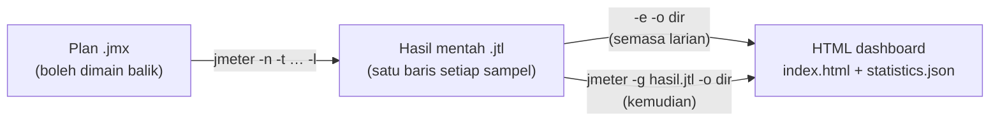
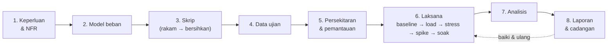

# Day 2 — Record & Playback, Performance Reports & Test Planning

[🧪 Day 2 Lab](./snippets/lab.md) · [🎤 Trainer Notes](./nota-penceramah.md) · [📋 Test Plan Template](./snippets/templat-pelan-ujian.md) · [📝 Test Report Template](./snippets/templat-laporan-ujian.md) · [🗂️ Test plans](./test-plans/) · [⬅️ Day 1](../hari-1/README.md)

> On Day 1 we built a plan by hand, recorded a simple flow, and watched the recording's playback **fail** (401). Today we follow a performance test engineer's work cycle from start to finish: **plan the user journey → record → play back → make it replayable → run → generate the report → read & interpret every number → write findings → plan the real test**. Main focus: **reports** (every section of the JMeter 5.6 HTML dashboard and its terminology) and **how to plan** a performance test. Today's outcome: your own replayable recorded plan, an HTML report you can explain line by line, three written findings, and one complete test plan.

> ⚠️ **Ethics — still localhost only.** JMeter is a load generator. Pointing it at a production/public system (including the real JPJ portal) **without written authorisation** = a DoS attack and against the law. Every recording and run today targets `http://localhost:3000` — the **eJPJ Portal (mock)** in `sut/`. All data is **synthetic**, not official JPJ data.

**What we will build:**
- A recording of the **log in → vehicle list → check road tax → pay road tax** flow, grouped by user action (Transaction Controller)
- Diagnosis of a failed playback (401/403) and the fix: **correlation**, **parameterisation**, sampler names, **think time**, **assertions** → a clean plan equivalent to `05-transaksi-penuh.jmx`
- An **HTML dashboard** from a run, read section by section, with a complete **glossary of terms**
- The peak scenario `07-beban-puncak-cukai.jmx` + SLA → **three findings** in the report template
- A **performance test plan** (NFRs, load model with **Little's Law**, transaction mix, criteria, monitoring, risks, authorisation)

---

## 🎯 Learning Objectives

By the end of today, participants can:

| # | Objective (measurable) | Session | Evidence |
|---|------------------------|------|-------|
| O1 | **Plan** a 4-step user journey and **record it** with the HTTP(S) Test Script Recorder (port 8888) into Transaction Controllers named by action | S1 | Lab 1: Recording Controller holds 4 `/api/...` samplers in 4 groups, no static assets |
| O2 | **Diagnose** a failed playback with View Results Tree and **distinguish** 401 (token) from 403 (csrf) | S1 | Lab 2: 200 / 401 / 200 / 401 after the SUT is restarted; experiment with only the token correlated → 403 |
| O3 | **Fix** the recording with `token` + `csrf` correlation (JSON Extractor) and CSV parameterisation from `pengguna.csv` | S2 | Lab 3: Debug Sampler shows `token` (UUID) + `csrf` (32 hex) for 3 different users |
| O4 | **Produce** a replayable plan (meaningful names, Transaction Controllers, think time, assertions) equivalent to `05-transaksi-penuh.jmx` | S2 | Lab 3: 10 users × 2 loops → 80 HTTP samples + 20 transaction rows in the Aggregate Report, Error % ≈ 0 |
| O5 | **Generate** the HTML dashboard with `-e -o` and `-g … -o`, and **tune** graph granularity/APDEX thresholds with `-J` | S3 | Lab 4: `index.html` opened; a second dashboard generated from the same `.jtl` |
| O6 | **Interpret** every dashboard section (APDEX, Statistics, Errors, Over Time, Throughput, Response Times) using the correct terminology | S3 | Lab 4: worksheet with actual values and an interpretation for each section |
| O7 | **Evaluate** a peak run against the SLA and **write** findings (evidence → impact → cause → recommendation) | S3 | Lab 5: three findings in `templat-laporan-ujian.md` (SLA 2000 vs 150 ms) |
| O8 | **Plan** a performance test: measurable NFRs, load model with **Little's Law** (N = X × (R + Z)), run types, entry/exit criteria, monitoring, risks, authorisation | S4 | Lab 6: `templat-pelan-ujian.md` filled in + N and pacing calculations |
| O9 | **Present** the test plan and one report finding in 3 minutes | S4 | Lab 7: mini presentation in pairs |

---

## 📅 Today's Schedule

| Time | Session | Activity | Focus |
|------|------|----------|-------|
| 9.00 – 10.30 am | S1 | **Record & play back (record → playback)** | Day 1 recap (10 min) · plan the user journey · `rakam-template.jmx` (proxy 8888, Recording Controller, groups → Transaction Controller, Excludes, think time `${T}`) · playback → 401/403 · Lab 1 & 2 |
| 10.30 – 10.45 am | — | Break | |
| 10.45 – 1.00 pm | S2 | **Make the recording replayable** | Correlation (JSON / Regex / Boundary) · CSV parameterisation · sampler names · Transaction Controller · think time · assertions · Summary & Aggregate Report · ⭐ ForEach / JSR223 · Lab 3 |
| 1.00 – 2.00 pm | — | Lunch | |
| 2.00 – 3.30 pm | S3 | **Reports & terminology (deep dive)** | `.jtl` → HTML dashboard · every JMeter 5.6 dashboard section · GUI listeners · glossary of terms · interpretation patterns · peak scenario `07` + SLA · Lab 4 & 5 |
| 3.30 – 3.45 pm | — | Break | |
| 3.45 – 5.00 pm | S4 | **Planning a performance test** | Test lifecycle · NFRs · load model & Little's Law · pacing · baseline/load/stress/spike/soak · criteria, monitoring, risks, ethics · Lab 6 & 7 · ⭐ CI, distributed, Grafana · wrap-up |

> 💡 The **course evaluation form** on pelatih.my opens at **2.00 pm** — see the S4 wrap-up.

---

## 🧭 Why today matters

The performance test report is the real **product** of your work — management does not read `.jmx` files, they read decisions: *"Can the portal cope with the road-tax price increase day?"* A misread report is more dangerous than no report at all.

| Without today | With today |
|----------------|-----------------|
| Recording played back → 401/403, the "test" only measures error pages | Recording cleaned up: **correlation**, **CSV**, **think time**, **assertions** |
| "Average 300 ms, OK!" | **95th percentile**, Error %, APDEX — and knowing when each one lies |
| Dashboard screenshots with no explanation | Every dashboard section read with the correct terminology |
| "The system looks OK" | Written **findings**: evidence → impact → cause → recommendation |
| "Try 1000 users" | Number of users **calculated** from business volume with **Little's Law** |
| Ad-hoc tests with no plan | A **test plan**: NFRs, load model, run types, criteria, monitoring, authorisation |

---

## 🧰 Setup

Make sure the mock server is running (from the repo root) — **Terminal A, keep it open all day**:

```bash
node sut/server.js
# Portal eJPJ (TIRUAN) berjalan di  http://localhost:3000
#   Latensi tiruan : 40-180 ms
#   Kadar ralat    : 1.0%
```

Check: open <http://localhost:3000/api/health> → `{"status":"ok",...}`. Open the JMeter GUI (`jmeter`).

| Plan | Used today for | Default load |
|------|---------------|-------------|
| [`hari-1/test-plans/rakam-template.jmx`](../hari-1/test-plans/rakam-template.jmx) | Recorder template (S1) — HTTP(S) Test Script Recorder port 8888 + Recording Controller | 1 user, 1 loop |
| [`hari-1/test-plans/04-rakaman-mentah.jmx`](../hari-1/test-plans/04-rakaman-mentah.jmx) | Backup "raw" recording (S1) — fails on purpose | 1 user, 1 loop |
| [`04-korelasi-log-masuk.jmx`](./test-plans/04-korelasi-log-masuk.jmx) | `token` + `csrf` correlation reference (S2) | 5 users, ramp 3s, 3 loops |
| [`05-transaksi-penuh.jmx`](./test-plans/05-transaksi-penuh.jmx) | **Answer key** for the cleaned-up recording (S2) + source of the first dashboard (S3) | 10 users, ramp 10s, 2 loops |
| [`06-ujian-beban-nogui.jmx`](./test-plans/06-ujian-beban-nogui.jmx) | Non-GUI load via `run/run-nogui.sh` (optional) | `${__P(pengguna,50)}`, `${__P(rampup,30)}`, `${__P(tempoh,120)}` s |
| [`07-beban-puncak-cukai.jmx`](./test-plans/07-beban-puncak-cukai.jmx) | Peak scenario + SLA `${__P(sla_ms,2000)}` (S3, S4) | `${__P(pengguna,300)}`, ramp 30s, 300s |
| [`08-foreach-kenderaan.jmx`](./test-plans/08-foreach-kenderaan.jmx) | ⭐ ForEach: pay road tax for **all** vehicles (S2 optional) | 3 users, ramp 3s, 1 loop |

> 💡 Today we run `07` with **`-Jpengguna=50 -Jrampup=10 -Jtempoh=60`** (≈ 1 minute) so it fits within class time and on a laptop. The default of 300 users × 300 s is meant for a more powerful machine.

---

## S1 — Record & Playback (9.00 – 10.30 am)

### 1.1 Day 1 recap (10 min)

Day 1 was taught on 21 Sep — let's warm our hands up again.

1. Open `hari-1/test-plans/04-rakaman-mentah.jmx`. **Before Start**, click **HTTP Request Defaults** → Server `localhost`, Port `3000`, Protocol `http`. (Class rule: for every plan you open — check the target first.)
2. Start ▶. In View Results Tree: `/api/log-masuk` green, `/api/kenderaan` and `…/bayar-cukai` red.

| Question | Short answer |
|--------|-----------------|
| JMeter recorder proxy port? | **8888** (the SUT is 3000) |
| Why does playback fail with 401? | The token in the `Authorization` header is the **old** value from the recording session |
| Average or percentile for an SLA? | **Percentile** (90/95/99) |
| Why no View Results Tree during a load test? | Storing every response in RAM → the load generator chokes, numbers become inaccurate |

### 1.2 Plan first, then record

A good recording starts **on paper**. Decide the user journey, the transaction names, and the data that will change — **before** pressing Start.

| Step | User action | HTTP request | Transaction name | Data expected to be dynamic |
|---------|-------------------|-----------------|----------------|----------------------------|
| 1 | Log in with IC No. | `POST /api/log-masuk` | `T01_LogMasuk` | Response: `token`, `csrf` (server-generated) · Input: `no_kp`, `kata_laluan` |
| 2 | View vehicle list | `GET /api/kenderaan?no_kp=…` | `T02_SenaraiKenderaan` | Header `Authorization: Bearer <token>` |
| 3 | Check road tax (quotation) | `GET /api/kenderaan/WXY1234/cukai` | `T03_SemakCukai` | `no_pendaftaran`, response `amaun`, `tempoh_bulan` |
| 4 | Pay road tax | `POST /api/kenderaan/WXY1234/bayar-cukai` | `T04_BayarCukai` | Token header + `csrf`, `amaun` in the body |

> **Concept — one user action = one transaction:** In a real portal, one click ("Log in") can generate 10–50 requests (HTML, API, images). Users do not care which request is slow — they feel **the time of that click**. So we group requests by action in a **Transaction Controller**, and name them with an easily sortable convention (`T01_…`, `T02_…`). In our SUT each action happens to be just one request.

> 💡 A good **naming convention**: step number + business action, with no odd spaces (`T03_SemakCukai`). These names will appear as **labels** in every report today.

### 1.3 Set up the recorder — `rakam-template.jmx`

**File → Open →** [`hari-1/test-plans/rakam-template.jmx`](../hari-1/test-plans/rakam-template.jmx). **File → Save As** → `hari-2/test-plans/latihan-01-rakaman.jmx` (so the original file stays unchanged, and the CSV path `../data/…` is valid in S2).

Test tree: **Thread Group → Recording Controller** (destination), **View Results Tree**, and **HTTP(S) Test Script Recorder** (port `8888`). Click the recorder and adjust:

| Tab / field | Setting | Why |
|-------------|---------|---------|
| **Test Plan Creation → Target Controller** | `Test Plan > Thread Group > Recording Controller` | Where samplers are recorded |
| **Test Plan Creation → Grouping** | **Put each group in a new transaction controller** | Each "click" (group of requests) becomes one Transaction Controller. Original template: *Add separators between groups* |
| **Create new transaction after request (ms)** | Leave empty (default property `proxy.pause` = **5000 ms**) | A gap of **≥ 5 s** between requests = a new group. So **wait > 5 s** between steps while recording |
| **Capture HTTP Headers** | Ticked | A Header Manager is added to every sampler |
| **Requests Filtering → URL Patterns to Exclude** | Already present: `(?i).*\.(bmp\|css\|js\|gif\|ico\|jpe?g\|png\|swf\|eot\|otf\|ttf\|mp4\|woff\|woff2)([?;].*)?` · Add (for real sites): `.*google-analytics.*`, `.*googletagmanager.*`, `.*/collect.*` | Static assets & analytics are not the load you are measuring — and analytics is a **third party** |
| **Requests Filtering → URL Patterns to Include** | Empty (or `localhost:3000.*` to record this host only) | If filled in, **only** matching URLs are recorded |

**Record think time (optional, recommended):** Right-click **HTTP(S) Test Script Recorder → Add → Timer → Constant Timer**, Thread Delay = **`${T}`**. During recording, JMeter copies this timer into the first sampler of each group and replaces `${T}` with the **actual time gap (ms) since the previous request**. You get the user's real think time — which we will then randomise in S2.

**Name transactions while recording:** After **Start**, a small **Recorder: Transactions Control** window appears (fields *Prefix*, *Naming scheme*, *Create new transaction after request (ms)*, *Counter start value*). Type a name (e.g. `T01_LogMasuk`) in the prefix field **before** each step — that prefix becomes the name of the group's Transaction Controller and the prefix of the sampler names. If you forget, rename the controllers after recording (select the element → edit the **Name** field).

> **Concept — HTTP Request Defaults while recording:** If you add **HTTP Request Defaults** (`localhost` / `3000`) under the Thread Group **before** recording, the recorder leaves the samplers' Server/Port fields **empty** (because the default values already exist). The result is a cleaner plan — one place to change the host.

> **HTTPS?** Our SUT is `http://`, so **no CA certificate is needed**. For HTTPS systems (that you are authorised to test) follow [`hari-1/snippets/rakaman-https-setup.md`](../hari-1/snippets/rakaman-https-setup.md) — `ApacheJMeterTemporaryRootCA.crt`, valid for 7 days, remove it when done.

### 1.4 Record the 4-step flow

1. Click **Start** ▶ on the recorder. Confirm the proxy is up: `lsof -iTCP:8888 -sTCP:LISTEN -n -P` (macOS/Linux) or `netstat -ano | findstr :8888` (Windows).
2. Generate traffic **through the proxy**. This SUT is an API (POST JSON), so we use `curl -x` (Windows: use **Git Bash**). Type/paste one block at a time and **wait > 5 s** between blocks (or use `sleep 6`):

```bash
P=http://localhost:8888          # proxy perakam JMeter
B=http://localhost:3000          # SUT tiruan

# --- T01_LogMasuk ---
R=$(curl -s -x $P -H 'Content-Type: application/json' \
  -d '{"no_kp":"800101015500","kata_laluan":"rahsia123"}' $B/api/log-masuk)
echo "$R"
TOKEN=$(echo "$R" | sed -E 's/.*"token":"([^"]+)".*/\1/')
CSRF=$(echo "$R"  | sed -E 's/.*"csrf":"([^"]+)".*/\1/')
sleep 6

# --- T02_SenaraiKenderaan ---
curl -s -x $P -H "Authorization: Bearer $TOKEN" "$B/api/kenderaan?no_kp=800101015500"; echo
sleep 6

# --- T03_SemakCukai ---
curl -s -x $P "$B/api/kenderaan/WXY1234/cukai"; echo
sleep 6

# --- T04_BayarCukai ---
curl -s -x $P -H "Authorization: Bearer $TOKEN" -H 'Content-Type: application/json' \
  -d "{\"csrf\":\"$CSRF\",\"tempoh_bulan\":12,\"amaun\":90}" \
  $B/api/kenderaan/WXY1234/bayar-cukai; echo
# respons terakhir: {"no_resit":"RJPJ…","status":"BERJAYA",…}
```

3. Click **Stop** ⏹. **File → Save**.

> **Why curl, not a browser?** The proxy records **any** HTTP client. A browser cannot produce these JSON POSTs to `/api/...` — HTML forms send `application/x-www-form-urlencoded`. (A browser version lives at <http://localhost:3000/portal>: login form → vehicles → pay, with cookie `SESI_EJPJ` + hidden `csrf` — for extra practice, it needs an **HTTP Cookie Manager**.) For a real web application, use Firefox with the proxy `localhost:8888` (Day 1 §4.3) — remove `localhost, 127.0.0.1` from *No proxy for*; for a `localhost` target, Firefox 67+ also needs `about:config` → `network.proxy.allow_hijacking_localhost` = `true`.

> ⚠️ `curl: (7) Failed to connect to localhost port 8888` = the recorder has not been **Started**. Nothing recorded even though curl succeeded = you forgot `-x $P`.

### 1.5 What the recorder produces

Expand the Recording Controller. You should see four groups (Transaction Controllers), each with one sampler:

| Item in the recording | Example | Why it matters |
|-----------------------|--------|----------------|
| Sampler name = **prefix + path + sequence number** (Naming scheme *Prefix*) | `T01_LogMasuk/api/log-masuk-1`; without a prefix: `/api/log-masuk-1`, `/api/kenderaan-2`, … | These names become report labels — we rename them in S2. (Naming scheme *Transaction name* gives `T01_LogMasuk-1`.) |
| **Header Manager** on every sampler | `Content-Type`, `Accept`, `User-Agent: curl/…` | The recorder captures the client's headers |
| Header **`Authorization: Bearer <token-rakaman>`** | The recording session's UUID value, **hard-coded** | For the `Bearer` scheme, JMeter 5.6 keeps this header with its literal value. (The `Cookie` header, on the other hand, is **always removed** — cookie-based applications need an **HTTP Cookie Manager**.) |
| **Literal** JSON body | `"no_kp": "800101015500"`, `"csrf": "<csrf-rakaman>"`, path `WXY1234` | All data is frozen — one user, one vehicle, one session |
| **Constant Timer** `${T}` → a number | e.g. `6012` ms | Your actual think time while recording |

> **Concept — a recording is a starting point, not a finished product.** The recorder does not know which values are dynamic. It copies what it sees.

### 1.6 Play back (playback)

1. Add **View Results Tree** (if not yet present) — it is already in the template.
2. **Expire the recording session first:** in Terminal A press **Ctrl+C**, then run `node sut/server.js` again. (The SUT keeps sessions in memory; restart = all old tokens become invalid, like a session timeout on a real system.)
3. **Start** ▶.

| Transaction / sampler | Code | Reason |
|---------------------|-----|-------|
| `T01_LogMasuk` — `POST /api/log-masuk` | **200** | Login always succeeds; the server issues a **new token** — but nobody captures it |
| `T02_SenaraiKenderaan` — `GET /api/kenderaan` | **401** | Sends the **recorded** token, which no longer exists → `Token tidak sah atau tamat tempoh` |
| `T03_SemakCukai` — `GET …/WXY1234/cukai` | **200** | The quotation endpoint does not require a token — **passes even though the script is broken** |
| `T04_BayarCukai` — `POST …/bayar-cukai` | **401** | The old token is rejected before `csrf` is even checked |

> ⚠️ **The "false pass" trap:** If you play back **without** restarting the SUT, all 4 steps may return **200** — because the recording session is still alive in the mock's memory. That is not success: 300 virtual users would share **one** session and one `csrf`. Real systems usually expire sessions after a few minutes, so this script would fail tomorrow morning. Green ≠ correct.

> **Backup evidence without the GUI:** `jmeter -n -t hari-1/test-plans/04-rakaman-mentah.jmx -l hasil/r04.jtl` → `summary = 3 … Err: 2 (66.67%)` — login 200, `/api/kenderaan` 401, `bayar-cukai` 401 (verified with JMeter 5.6.3).

### 1.7 Diagnosis: 401 vs 403 with View Results Tree

Click a red sampler in View Results Tree and read three tabs in order:

| Tab | What to look for | Example |
|-----|-----------------|--------|
| **Sampler result** | `Response code`, `Response message`, timings (`Load time`, `Latency`, `Connect Time`) | `Response code: 401` · `Response message: Unauthorized` |
| **Request** | What was **actually** sent — headers & body | `Authorization: Bearer <token-rakaman>` (not the new token from T01) |
| **Response data** | The server's error message | `{"ralat":"Token tidak sah atau tamat tempoh"}` |

**Experiment — separate the two causes:** After S2 you will correlate `token`. If **only** the token is correlated but `csrf` is still the recorded value, the payment changes from 401 to **403** `{"ralat":"Token CSRF tidak sah — sila log masuk semula"}` (verified against the SUT).

| Code | Meaning in the SUT | Cause in the script | Fix |
|-----|------------------|-------------------|-----------|
| **401** Unauthorized | *Who are you?* — token missing/invalid | `Authorization` header hard-coded/missing | Extract `token` → `Bearer ${token}` |
| **403** Forbidden | *Is this request legitimate?* — token valid but `csrf` wrong | `csrf` in the body hard-coded | Extract `csrf` → `"csrf": "${csrf}"` |
| **404** Not Found | Path/vehicle does not exist | Wrong path, or `${no_pendaftaran}` not substituted (`NONE`) | Check the extractor / CSV |

> **Concept — playback is a functional test first.** Before adding load, the plan must pass **1 user × 1 loop** with 0 errors (except expected errors). Load on a broken script only measures how fast the error pages are.

### 🎯 Quiz S1

1. You recorded with *Grouping = Put each group in a new transaction controller*, but all four requests went into **one** Transaction Controller. Most likely cause?
   - [ ] The recorder port is not 8888
   - [x] The gap between requests was less than 5 s (`proxy.pause`), so everything was treated as one "click"
   - [ ] The Recording Controller was placed under the Test Plan
   - [ ] Capture HTTP Headers was not ticked
   > The recorder starts a new group only if the gap ≥ `proxy.pause` (default 5000 ms). Wait > 5 s between steps, or name the transactions through the *Recorder: Transactions Control* dialog.

2. What is the purpose of a Constant Timer with value `${T}` under the HTTP(S) Test Script Recorder?
   - [ ] To limit the recording to T seconds
   - [x] To copy the timer into the recording with `${T}` replaced by the actual time gap since the previous request (user think time)
   - [ ] To add a Duration Assertion of T ms
   - [ ] To set the validity period of the CA certificate
   > This is how you record real think time. In S2 we replace it with a random timer so virtual users do not move in lockstep.

3. Playing back the recording **without** restarting the SUT gives 4 × 200. What is the correct conclusion?
   - [ ] The script is ready for load testing
   - [ ] Correlation is not needed for this SUT
   - [x] It is a "false pass" — the recording session is still alive; all virtual users would share one token/csrf that will expire
   - [ ] JMeter has correlated the token automatically
   > The recorder correlates nothing. Restart the SUT (or wait for the session to expire) to prove the script is truly independent of the recording session.

4. After `token` is correlated, `GET /api/kenderaan` becomes 200 but `bayar-cukai` returns **403**. What is still hard-coded?
   - [ ] `no_kp` in the query string
   - [ ] The `Content-Type` header
   - [x] The `csrf` value in the payment request body
   - [ ] The HTTP Request Defaults port
   > 403 in the SUT = token valid but `csrf` does not match the session. Extract `csrf` together with `token` from the login response.

---

## S2 — Making the Recording Replayable (10.45 – 1.00 pm)

### 2.1 The "clean up the recording" checklist

| # | Problem in the recording | Fix | JMeter element |
|---|----------------------|-----------|---------------|
| 1 | Host/port repeated in every sampler | One place for the target | **HTTP Request Defaults** (`localhost` / `3000`) |
| 2 | Name `/api/log-masuk-1` | Meaningful name = report label | Rename: `1. POST /api/log-masuk` |
| 3 | `token` & `csrf` hard-coded | **Correlation** | **JSON Extractor** (or Regex / Boundary) |
| 4 | Only one user, `800101015500` | **Parameterisation** | **CSV Data Set Config** `pengguna.csv` |
| 5 | Vehicle `WXY1234` hard-coded | Chained correlation from the list response | JSON Extractor `$.kenderaan[0].no_pendaftaran` |
| 6 | `"amaun": 90` hard-coded | Take it from the response | JSON Extractor (list or quote) |
| 7 | Timer `${T}` = your typing gap (e.g. 6012 ms, identical for every user) | Realistic **random** think time | **Uniform Random Timer** |
| 8 | No content check — a 200 with an error message counts as "passed" | **Assertion** | Response Assertion `BERJAYA` |
| 9 | Per-step groups | A full **business** transaction | **Transaction Controller** `Pembaharuan Cukai Jalan` |
| 10 | `User-Agent: curl/…` & `Accept` headers | Optional — no effect on this SUT | Remove or leave |

> The end result of this session is equivalent to [`test-plans/05-transaksi-penuh.jmx`](./test-plans/05-transaksi-penuh.jmx) — open it in another tab as the **answer key**.

### 2.2 Parameterisation vs correlation

| | Parameterisation | Correlation |
|-|----------------|----------|
| Data source | **You** (CSV, User Defined Variables) | **The server**, at run time |
| Example | `no_kp`, `kata_laluan` from `pengguna.csv` | `token`, `csrf` from the login response; `no_pendaftaran`, `amaun` from the list response |
| JMeter element | CSV Data Set Config | Post Processor: JSON / Regular Expression / Boundary Extractor |
| Known before the test? | Yes | No |

> **Concept:** You need both. `pengguna.csv` supplies **who** logs in; the extractor supplies that user's **session**.

### 2.3 Correlating `token` + `csrf`

1. **Right-click `T01_LogMasuk` → login sampler → Add → Post Processors → JSON Extractor** (`Ekstrak token + csrf`):
   - **Names of created variables:** `token;csrf`
   - **JSON Path expressions:** `$.token;$.csrf`
   - **Match No. (0 for Random):** `1;1` · **Default Values:** `TOKEN_TAK_JUMPA;CSRF_TAK_JUMPA`
2. In the **Header Manager** of the list and payment samplers: change the `Authorization` value to `Bearer ${token}`.
3. In the payment sampler body: `"csrf": "${csrf}"`.


| Extractor | When to use | Equivalent configuration for `token` |
|-----------|-----------|----------------------------------|
| **JSON Extractor** | JSON responses (modern APIs) — the cleanest | `$.token` |
| **Regular Expression Extractor** | Any text/HTML/header | Regular Expression `"token":"([^"]+)"` · Template `$1$` · Match No. `1` |
| **Boundary Extractor** | Clear left/right boundaries — the easiest to read | Left Boundary `"token":"` · Right Boundary `"` |

> **Concept — extractor scope:** Place the extractor as a **child** of the login sampler. Under the Thread Group, it runs after **every** sampler and overwrites `token` with the default value.

> **Concept — a conspicuous Default Value:** `TOKEN_TAK_JUMPA` in the **Request** tab = broken correlation, visible immediately. Debugging flow: (1) Login response data — does `token` exist? (2) View Results Tree → **JSON Path Tester** view → test `$.token`. (3) **Debug Sampler** (JMeter variables = True) → `token=…`, `csrf=…`. (4) The **Request** tab of the next sampler.

> **Concept — per-thread variables:** `${token}` is stored in the `vars` of **that thread only**. 300 virtual users = 300 different tokens — just like 300 real members of the public.

### 2.4 Chained correlation: vehicle & amount

The recording froze `WXY1234` and `90`. Other users do not own `WXY1234`. Take both from the list response:

- **Right-click the list sampler → Add → Post Processors → JSON Extractor** (`Ekstrak kenderaan pertama`): Names `no_pendaftaran;amaun` · Paths `$.kenderaan[0].no_pendaftaran;$.kenderaan[0].amaun_cukai` · Match No. `1;1` · Default `NONE;0`.
- Quote sampler path → `/api/kenderaan/${no_pendaftaran}/cukai`; payment path → `/api/kenderaan/${no_pendaftaran}/bayar-cukai`; body → `{ "csrf": "${csrf}", "tempoh_bulan": 12, "amaun": ${amaun} }`.

> 💡 Plan `07` takes `amaun` + `tempoh_bulan` from the **quote** (`$.amaun;$.tempoh_bulan`) — more realistic, because the user pays the amount displayed.

### 2.5 Parameterisation with CSV

**Right-click Thread Group → Add → Config Element → CSV Data Set Config**: Filename `../data/pengguna.csv`, Variable Names `no_kp,kata_laluan`, Ignore first line `True`, Recycle on EOF `True`, Sharing mode `All threads`. Then replace in the recording:

- Login body: `{ "no_kp": "${no_kp}", "kata_laluan": "${kata_laluan}" }`
- List parameter: `no_kp` = `${no_kp}`

> ⚠️ The CSV path is **relative to the `.jmx` file**. Save the plan in `hari-2/test-plans/` — otherwise `${no_kp}` is sent literally.

### 2.6 Sampler names & Transaction Controller

1. Rename the samplers: `1. POST /api/log-masuk`, `2. GET /api/kenderaan`, `3. GET /api/kenderaan/${no_pendaftaran}/cukai`, `4. POST /api/kenderaan/${no_pendaftaran}/bayar-cukai`.
2. **Right-click Thread Group → Add → Logic Controller → Transaction Controller** `Pembaharuan Cukai Jalan`, and drag all four samplers **into it**. The now-empty `T01…T04` group controllers can be deleted — or kept if you want one row per action (in a real web application each action is usually many requests, so this is very useful).

| Transaction Controller option | Effect in the report |
|--------------------------------|---------------------|
| **Generate parent sample** unticked (reference plan) | A transaction row **and** a row per sampler — best for finding the slow step |
| **Generate parent sample** ticked | Samplers become sub-samples; the report only shows the transaction row |
| **Include duration of timer and pre-post processors in generated sample** | If ticked, think time is included in the transaction time. The reference plan does **not** tick it — we measure system time, not the time the user spends thinking |

> **Concept — dynamic labels:** The name `4. POST /api/kenderaan/${no_pendaftaran}/bayar-cukai` produces **one row per vehicle** in the report (`…/WXY1234/…`, `…/JQK7788/…`, `…/BMT3030/…`). Good for per-data analysis; for management reports, use a static name (`4. POST bayar-cukai`) or read the **transaction** row.

### 2.7 Think time

Delete the recorded `${T}` Constant Timer (one under the first sampler of each group). **Right-click Transaction Controller `Pembaharuan Cukai Jalan` → Add → Timer → Uniform Random Timer** (`Think Time (1-3s)`): Constant Delay Offset `1000`, Random Delay Maximum `2000` → each pause is 1–3 s. The timer becomes a child of that TC, level with the samplers — same as in `05`.

> **Concept — timer scope:** A timer runs **before every sampler in its scope**. Under a Transaction Controller with 4 samplers → **4 pauses** per iteration (average 4 × 2 s = 8 s). We will use this fact in the Little's Law calculation (S4).

### 2.8 Assertion & If Controller

- **Right-click the payment sampler → Add → Assertions → Response Assertion**: Field to Test *Text Response*, Pattern Matching Rules *Substring*, pattern `BERJAYA`.
- **(Recommended)** Wrap samplers 3 & 4 in an **If Controller** `Jika ada kenderaan`, Condition `${__groovy(vars.get("no_pendaftaran") != "NONE" && vars.get("token") != "TOKEN_TAK_JUMPA")}` — so no bogus payment is sent when login fails or the user has no vehicle.

> **Concept — without an assertion, 200 = passed.** JMeter only marks a failure for 4xx/5xx codes and network errors. A 200 response with `{"status":"GAGAL"}` counts as successful — unless you add an assertion.

### 2.9 Run & read the Summary / Aggregate Report

Thread Group: Number of Threads `10`, Ramp-up `10`, Loop Count `2`. Add a **Summary Report** and an **Aggregate Report**; **disable** View Results Tree (right-click → Disable). Start.

Expected result (verified with `05-transaksi-penuh.jmx`, JMeter 5.6.3): **80 HTTP samples** (10 × 2 × 4) + **20 transaction rows** `Pembaharuan Cukai Jalan`, Error % 0 (occasionally 1 payment fails with 500 — the SUT's 1% `ERROR_RATE`). Transaction time ≈ the sum of the 4 steps (≈ 440 ms), **without** think time.

| Column | Summary Report | Aggregate Report |
|-------|:--------------:|:----------------:|
| `Label`, `# Samples`, `Average`, `Min`, `Max`, `Error %`, `Throughput`, `Received KB/sec`, `Sent KB/sec` | ✅ | ✅ |
| `Median`, `90% Line`, `95% Line`, `99% Line` | — | ✅ |
| `Std. Dev.`, `Avg. Bytes` | ✅ | — |

> 💡 Remember: the Aggregate Report says `90% Line`; the HTML dashboard says `90th pct`. Same concept — **percentile**.

### 2.10 ⭐ Optional: ForEach & JSR223 Groovy (a quick look)

- **ForEach** — pay the tax for **all** vehicles: JSON Extractor `$.kenderaan[*].no_pendaftaran`, **Match No. `-1`** (creates `no_pendaftaran_1`, `_2`, … `_matchNr`) → **ForEach Controller** (Input variable prefix `no_pendaftaran`, Output variable name `no_semasa`, **Add "_" before number?** ticked). See [`08-foreach-kenderaan.jmx`](./test-plans/08-foreach-kenderaan.jmx): 3 users → 5 payments, 16 HTTP samples, 0 errors.
- **JSR223 (Groovy)** — custom logic: use Groovy + tick **Cache compiled script if available**, read variables with `vars.get("token")` (not `${token}` inside the script). Ready-made example: [`snippets/jsr223-groovy.groovy`](./snippets/jsr223-groovy.groovy).
- **Useful functions:** `${__P(pengguna,50)}` (property from `-J`), `${__UUID}`, `${__Random(1,1000)}`, `${__time(yyyy-MM-dd)}`.

### 🎯 Quiz S2

1. Which values must be **correlated** (not parameterised from CSV) in the eJPJ recording?
   - [ ] `no_kp` and `kata_laluan`
   - [x] `token` and `csrf`
   - [ ] Port `3000`
   - [ ] The `Content-Type` header
   > `token` and `csrf` are generated by the server at every login; only an extractor can capture them at run time.

2. The JSON Extractor for `token` is placed directly under the Thread Group (not as a child of the login sampler). What is the effect?
   - [ ] No effect — extractor scope is always global
   - [x] It runs after every sampler and overwrites `token` with the default when another response has no `$.token`
   - [ ] JMeter refuses to save the plan
   - [ ] The token is extracted twice and concatenated
   > Scope follows position. A Post Processor that is a child of a sampler runs only after that sampler.

3. A Uniform Random Timer (offset 1000 ms, random maximum 2000 ms) is placed under a Transaction Controller containing 4 samplers. What is the average total think time per iteration?
   - [ ] 2 s
   - [ ] 3 s
   - [x] 8 s
   - [ ] 12 s
   > The timer runs before **every** sampler in scope: 4 × average (1000 + 2000/2) ms = 4 × 2 s = 8 s.

4. In the Aggregate Report, the `Pembaharuan Cukai Jalan` transaction row shows Average ≈ 440 ms even though think time is 1–3 s. Why?
   - [ ] Timers do not work inside a Transaction Controller
   - [x] *Include duration of timer and pre-post processors* is unticked, so the transaction time is only the sum of the 4 sampler times
   - [ ] The Aggregate Report discards slow samples
   - [ ] Think time only runs in non-GUI mode
   > That is a deliberate choice: we measure **system** time. Think time still happens between requests — it affects throughput, not the transaction response time.

---

## S3 — Reports & Terminology (2.00 – 3.30 pm)

### 3.1 From run to report



```bash
# (dari akar repo) folder induk untuk -o MESTI wujud dahulu
mkdir -p hasil                      # Windows: mkdir hasil

# Larian non-GUI + dashboard serta-merta (folder -o MESTI kosong / belum wujud)
jmeter -n -t hari-2/test-plans/05-transaksi-penuh.jmx -l hasil/r05.jtl -e -o hasil/laporan05

# Jana (semula) dashboard daripada .jtl sedia ada — tanpa menjalankan ujian
jmeter -g hasil/r05.jtl -o hasil/laporan05-b
```

| Flag | Meaning |
|---------|--------|
| `-n` | Non-GUI |
| `-t <plan.jmx>` | Test plan |
| `-l <fail.jtl>` | Raw results file (CSV) |
| `-e` | Generate the dashboard after the run |
| `-o <folder>` | Dashboard output folder — must be empty (otherwise: `Cannot write to '…' as folder is not empty`), and **its parent folder must exist** (otherwise: `… as folder does not exist and parent folder is not writable` — JMeter checks this **before** the test starts). `-l`, by contrast, creates its own folder |
| `-g <fail.jtl>` | Generate a dashboard from an existing `.jtl` (together with `-o`) |
| `-J<nama>=<nilai>` | Property — for `${__P()}` in the plan **and** for report generator settings |

**Useful report settings (verified with JMeter 5.6.3):**

| Property | Default | Use |
|----------|-------|------|
| `jmeter.reportgenerator.overall_granularity` | `60000` ms | Interval size of the *Over Time* & *Throughput* graphs. A 60 s run with the default = **only 1–2 points**! For class runs: `-Jjmeter.reportgenerator.overall_granularity=5000` (minimum 1000) |
| `jmeter.reportgenerator.apdex_satisfied_threshold` | `500` ms | APDEX T threshold |
| `jmeter.reportgenerator.apdex_tolerated_threshold` | `1500` ms | APDEX F threshold |
| `jmeter.reportgenerator.report_title` | `Apache JMeter Dashboard` | Report title |

```bash
# Contoh: jana semula dengan graf setiap 5 s dan APDEX 300/1000 ms
jmeter -g hasil/r07.jtl -o hasil/laporan07-5s \
  -Jjmeter.reportgenerator.overall_granularity=5000 \
  -Jjmeter.reportgenerator.apdex_satisfied_threshold=300 \
  -Jjmeter.reportgenerator.apdex_tolerated_threshold=1000
```

**Anatomy of a `.jtl` (CSV, JMeter 5.6):**

```
timeStamp,elapsed,label,responseCode,responseMessage,threadName,dataType,success,failureMessage,bytes,sentBytes,grpThreads,allThreads,URL,Latency,IdleTime,Connect
1791115262980,141,1. POST /api/log-masuk,200,OK,Pengguna Pembaharuan Cukai 1-1,text,true,,337,241,3,3,http://localhost:3000/api/log-masuk,140,0,10
```

| Column | Meaning |
|-------|--------|
| `timeStamp` | Sample start time (epoch ms) |
| `elapsed` | **Response time** (ms) |
| `label` | Sampler / transaction name — the key of every report row |
| `responseCode`, `responseMessage`, `success`, `failureMessage` | Result; `failureMessage` = the message of the failed assertion |
| `bytes`, `sentBytes` | Size received / sent |
| `grpThreads`, `allThreads` | Active threads (group / all) at the time of the sample |
| `Latency`, `Connect` | Time to first byte; connection time (ms) |
| `IdleTime` | "Idle" time within a transaction sample (e.g. think time that is not counted) |

> Transaction rows (Transaction Controller) in the `.jtl` have a `responseMessage` such as `Number of samples in transaction : 4, number of failing samples : 0` and `URL` = `null`.

### 3.2 Dashboard — main page

Open `index.html`. Left menu: **Dashboard**, **Charts** (Over Time · Throughput · Response Times), **Customs Graphs**.

#### a) Test and Report information

| Field | Content | Check |
|-------|-----|-------|
| **Source file** | `.jtl` name | The right report? |
| **Start Time / End Time** | Run duration | Same as the planned duration? A run that stopped early = warning |
| **Filter for display** | Label filter (usually empty) | If filled in, the report is incomplete |


*First screen of the HTML dashboard: run information, APDEX per label and the pass/fail breakdown (peak run `07`, 50 users).*

#### b) APDEX (Application Performance Index)

Columns: **Apdex** · **T (Toleration threshold)** · **F (Frustration threshold)** · **Label**.

```
APDEX = (Satisfied + Tolerating / 2) / Jumlah sampel
Satisfied  : masa ≤ T            (lalai T = 500 ms)
Tolerating : T < masa ≤ F        (lalai F = 1500 ms)
Frustrated : masa > F  — ATAU sampel GAGAL
```

| Score | Usual interpretation |
|------|----------------|
| ≥ 0.94 | Excellent |
| 0.85 – 0.93 | Good |
| 0.70 – 0.84 | Fair |
| < 0.70 | Poor |

> **Verified:** in JMeter, a **failed** sample counts as **Frustrated** even if it is fast. Our `07` run: `bayar-cukai` BMT3030 = 196 samples, 3 failed (500) → APDEX 193/196 = **0.985**.

> ⚠️ A 4-step transaction row (≈ 450 ms) is judged against the same T = 500 ms as a single request — our transaction APDEX is 0.862–0.875 even though the system is healthy. For transactions, set your own thresholds with `jmeter.reportgenerator.apdex_per_transaction`. Note also: the JMeter 5.6 APDEX **Total** row also counts transaction samples (the Statistics *Total* does not).

#### c) Requests Summary

A **PASS** / **FAIL** pie chart of all HTTP samples (transaction rows excluded). Run `07` with a 150 ms SLA: FAIL **5.37%**.

#### d) Statistics — the most important table

Columns are grouped under four headings: **Executions**, **Response Times (ms)**, **Throughput**, **Network (KB/sec)**.

| Column | Group | Meaning | How to read it |
|-------|----------|--------|-----------|
| **Label** | — | Sampler/transaction name; **Total** row at the top | Total = all **HTTP** samples (transaction rows not mixed in) |
| **#Samples** | Executions | Number of samples | Matches the expectation (threads × loops × samplers)? |
| **FAIL** | Executions | Number of failed samples | 4xx/5xx codes, network errors, **or failed assertions** |
| **Error %** | Executions | FAIL ÷ #Samples × 100 | Compare with the NFR (e.g. < 1%) |
| **Average** | Response Times | Mean | Easily skewed by extreme values |
| **Min** / **Max** | Response Times | Fastest / slowest | Max = a single sample only — never make it an SLA |
| **Median** | Response Times | 50% of samples ≤ this value | "The typical experience" |
| **90th pct** / **95th pct** / **99th pct** | Response Times | 90/95/99% of samples ≤ this value | **Basis for SLA/NFR**; a big gap Median→99th = long tail |
| **Transactions/s** | Throughput | Samples completed per second for that label | Transaction row = business transactions/s |
| **Received** / **Sent** | Network (KB/sec) | Bandwidth | A sudden rise = large responses / unnecessary resources |

`statistics.json` in the report folder contains the same data (machine-friendly): `sampleCount`, `errorCount`, `errorPct`, `meanResTime`, `medianResTime`, `minResTime`, `maxResTime`, `pct1ResTime` (90th), `pct2ResTime` (95th), `pct3ResTime` (99th), `throughput`, `receivedKBytesPerSec`, `sentKBytesPerSec`.


*Statistics table: read p90/p95/p99 and Error % first, then throughput.*

#### e) Errors

Columns: **Type of error** · **Number of errors** · **% in errors** · **% in all samples**.

| Example row (verified) | Meaning |
|-------------------------|--------|
| `401/Unauthorized` · 2 · 100% · 66.67% | Playback of `04-rakaman-mentah` — 2 of 3 samples |
| `500/Internal Server Error` | Server error (SUT: ~1% of payments) |
| `The operation lasted too long: It took 166 milliseconds, but should not have lasted longer than 150 milliseconds.` | **Duration Assertion** failed (HTTP code is still 200) |

> ⚠️ This table groups by **message text**. The Duration Assertion message contains the ms value, so every value becomes a separate row (our 150 ms SLA run: ~30 rows). Add them up, or read **Top 5 Errors by sampler**.

#### f) Top 5 Errors by sampler

Columns: **Sample** · **#Samples** · **#Errors** · then five **Error** / **#Errors** pairs. It answers: *"Which step failed, and why?"* Transaction rows are not included (default `jmeter.reportgenerator.exclude_tc_from_top5_errors_by_sampler=true`).

### 3.3 Charts — every graph

> The *Over Time* & *Throughput* graphs use the `overall_granularity` interval (default 60 s). For short runs, regenerate with `-Jjmeter.reportgenerator.overall_granularity=5000`.

**Charts → Over Time**

| Graph | Axes | Question answered | Warning sign |
|------|-------|---------------------|--------------|
| **Response Times Over Time** | Time · average ms per label (including transactions) | Is response time stable throughout the test? | A line that keeps rising (degradation / memory leak) |
| **Response Time Percentiles Over Time (successful responses)** | Time · Min, Median, 90th, 95th, 99th, Max for **successful** samples | Does the tail (p95/p99) widen at peak load? | p99 spikes while active threads are at maximum |
| **Active Threads Over Time** | Time · number of active threads per Thread Group | Did the load model (ramp-up → steady) happen as planned? | Threads dropping early = a test/generator problem |
| **Bytes Throughput Over Time** | Time · bytes received/sent per second | Is the network the limit? | Flat even as users increase |
| **Latencies Over Time** | Time · average latency (ms) | Time to first byte — server processing | Latency ≈ response time = slow server, not slow transfer |
| **Connect Time Over Time** | Time · average connect time | TCP/TLS connection problems? | Rising = server running out of connections / no keep-alive |


*Response Times Over Time: the transaction line sits above the individual requests.*

**Charts → Throughput**

| Graph | Axes | Question | Warning sign |
|------|-------|--------|--------------|
| **Hits Per Second** | Time · HTTP requests **sent** per second | How much load did JMeter generate? | Flat hits/s while threads rise |
| **Codes Per Second** | Time · responses per second by **HTTP code** (`200`, `500`, …) | When do server errors occur? | A 5xx series appears at the peak. Note: **assertion** failures are still `200` here |
| **Transactions Per Second** | Time · samples completed per second **per label**, split `-success` / `-failure` | Which label failed, and when? | A rising `-failure` series |
| **Total Transactions Per Second** | Time · total `Transaction-success` / `Transaction-failure` (all samples — HTTP **and** transaction rows) | Overall system throughput | Flattening while users rise = **saturation** |
| **Response Time Vs Request** | Global requests per second · **median** response time | Does response time rise as the rate rises? | A steeply rising curve = the knee point |
| **Latency Vs Request** | Global requests per second · **median** latency | The same, for latency | |

**Charts → Response Times**

| Graph | Axes | Question |
|------|-------|--------|
| **Response Time Percentiles** | Percentile 0–100 · ms | Shape of the full distribution; "at which percentile does time jump?" |
| **Response Time Overview** | 4 bars: `≤ 500ms`, `> 500ms and ≤ 1,500ms`, `> 1,500ms`, `Requests in error` | An APDEX-style summary for management (thresholds = APDEX T/F) |
| **Time Vs Threads** | Number of active threads · average ms | How response time changes with concurrency |
| **Response Time Distribution** | 100 ms buckets · number of responses | A unimodal distribution? Two peaks = two code paths (e.g. cache hit/miss) |

### 3.4 GUI listeners — when to use them

| Listener | Use | During load? |
|----------|-----|--------------|
| **View Results Tree** | Debugging: Request / Response data / JSON Path Tester | ❌ **No** — keeps every response in RAM |
| **Summary Report** | Summary per label (+ `Std. Dev.`) | Acceptable for small GUI runs; non-GUI + dashboard is better |
| **Aggregate Report** | Like Summary + Median, 90/95/99% Line | Same |
| **Simple Data Writer** | Writes results to a file (`.jtl`) without a display | ✅ if you need an extra file (non-GUI `-l` is usually enough) |

> **Why listeners are disabled during load:** GUI listeners process every sample inside the same JVM that generates the load — JMeter CPU/RAM goes up, and the measured response time includes "JMeter congestion". Non-GUI + `-l` writes the `.jtl` at minimal cost; analysis is done **after** the test.

### 3.5 Glossary of terms

| Term | Definition (as JMeter measures it) | eJPJ example |
|------|------------------------------------|--------------|
| **Response time / Elapsed** | From **just before** the request is sent until **just after** the **last** response byte is received. Excludes browser rendering or JavaScript time | `elapsed` = 141 ms for login |
| **Latency** | From just before the request is sent until just after the **first part** of the response is received (≈ time to first byte). **Includes** connect time | Latency 140 ms, elapsed 141 ms → small response, almost all the time is server processing |
| **Connect time** | Time to establish the connection (including the SSL/TLS handshake). Not subtracted from latency | 10 ms for the first connection, ~1 ms with keep-alive |
| **Throughput** | Number of requests ÷ total time (from the start of the first sample to the end of the last sample) | Total 41.29/s (run `07`) |
| **Hits/s** | HTTP requests **sent** per second (Hits Per Second graph) | 4 hits per renewal transaction |
| **TPS (Transactions per second)** | Samples **completed** per second; for a Transaction Controller = business transactions/s | 10.46 renewals/s |
| **Virtual user / thread** | One JMeter thread = one simulated user running the script repeatedly | 50 threads |
| **Concurrent users** | Users **currently in a session** at one point in time (including those thinking) | 600 citizens renewing road tax |
| **Active threads** | JMeter threads alive at a given second (Active Threads Over Time graph; `allThreads` column) | Rises 0 → 50 in 10 s, stays at 50 |
| **Ramp-up** | Time taken to start all threads | 10 s → 1 new thread every 0.2 s |
| **Steady state** | The stable-load period after ramp-up — **this is where** NFRs are assessed | Seconds 10–60 |
| **Ramp-down** | The period in which users stop. The standard Thread Group has no ramp-down (all stop when the duration ends); iterations cut off midway produce no transaction sample | 630 logins, 598 transactions |
| **Think time** | Pause between user actions (timer) | Uniform Random Timer 1–3 s |
| **Pacing** | Controls the **rate** of iterations (e.g. one transaction every 6 s per user), independent of response time | Constant Throughput Timer 600 samples/min |
| **Average (mean)** | Total ÷ count | Skewed by extreme values |
| **Median** | 50th percentile | |
| **Percentile (pNN)** | NN% of samples ≤ this value | p95 = 583 ms: 95% of transactions ≤ 583 ms |
| **Standard deviation** | Spread of response times (JMeter computes the **population** standard deviation). In Summary Report, not in the dashboard | High = inconsistent |
| **Error %** | Failed samples ÷ total samples × 100 (HTTP code, network, assertion) | 1.00% of transactions |
| **APDEX** | Satisfaction score 0–1: (Satisfied + Tolerating/2) ÷ total; failed = Frustrated | 0.971 |
| **Saturation** | A resource (CPU, DB connections, thread pool) is full — requests start to queue | Throughput flattens, response time rises |
| **Knee point** | The load at which response time starts to rise steeply | "Safe up to ~N users" |
| **Bottleneck** | The component that limits capacity | DB, payment service, network |
| **SLA** | Service Level **Agreement** — a contractual promise to users/clients | "99.5% availability; p95 < 3 s" |
| **SLO** | Service Level **Objective** — an internal target (usually stricter than the SLA) | "p95 < 2 s" |
| **NFR** | Non-Functional Requirement — a measurable performance requirement that is **tested** | "Transaction p95 ≤ 2000 ms at 10 trans/s" |
| **Baseline** | A reference run (low load / previous version) for comparison | 5-user run |
| **Benchmark** | A standard measurement to compare systems/configurations/versions | Version 1.2 vs 1.3 at the same load |
| **Workload model** | Who does what, how often, how many: transactions, mix, rate, think time | 70% renewals, 30% checks |
| **Open vs closed model** | Closed: a fixed N users, each waits for a response (normal Thread Group). Open: requests arrive at a fixed rate regardless of responses | Normal JMeter = closed; Precise Throughput Timer ≈ open |
| **Controller (master)** | The JMeter machine that sends the plan to the agents, starts/stops the test and collects samples into one `.jtl`; it does not generate load with `-R` | Central laptop runs `jmeter -n -R …` |
| **Agent (remote server)** | A `jmeter-server` process (`jmeter -s`) that runs the **whole** Thread Group and generates load; listens on RMI `server_port` (1099) | KL agent (1099), PENANG agent (1100) |
| **Sample sender** | How an agent sends samples to the controller (`mode=`). 5.6 default: **StrippedBatch** — no response data, batched | Console: `summary + 85`, then `+ 155` |
| **`-R`** | List of agents for this run (`host:port,…`); `-r` = all `remote_hosts` in properties | `-R 127.0.0.1:1099,127.0.0.1:1100` |
| **`-G` vs `-J`** | `-G` = property sent to **all** agents; `-J` = property local to that JMeter process only (on an agent: different per location) | `-Gpengguna=10` (controller), `-Jsite=KL` (KL agent) |

> **The average lies — example:** 99 requests at 100 ms + 1 request at 10,000 ms → Average ≈ **199 ms** ("OK!"), but the 99th pct = 10,000 ms and that user waited 10 seconds. NFRs are written as **percentiles**.

### 3.6 How to read & interpret

**5-minute reading order:** (1) Test and Report information — was the run correct & complete? (2) Statistics, **transaction** row — p95 & Error % vs NFR. (3) Errors / Top 5 — what failed? (4) Active Threads Over Time — did the load model happen? (5) Response Times / Percentiles Over Time — stable throughout the steady state? (6) Total Transactions Per Second — does throughput follow load?

| Pattern in the graph | Interpretation | Action |
|----------------------|----------------|--------|
| Threads rise, **throughput rises** with them, response time flat | Healthy — still below capacity | Increase load (stress) |
| Threads rise, **throughput flattens**, response time **rises** | **Saturation** — a resource is full, requests queue | Find the bottleneck (server metrics) |
| Errors start after N threads | Capacity limit / resource exhausted (connections, memory) | N = the limit; report it |
| Response time rises slowly under constant load | Degradation — memory leak, growing data | Soak test; monitor memory |
| Latency ≈ response time | Time is spent on the server (processing) | Profile code / DB |
| Small latency, large response time | Large response transfer / network | Response size, compression |
| Errors **flat** throughout the test, not following load | Functional/synthetic errors, not load | Compare with a 1–5 user baseline |
| Errors during ramp-up only | Warm-up (cold start, empty cache) | Exclude the warm-up period from analysis — state this in the report |

**Compare against a baseline, not against a feeling.** A single run means nothing on its own. Example (verified, plan `07`, 50 users, 60 s):

| Run | Change | Transactions/s | Transaction p95 | Transaction Error % | APDEX Total |
|-----|--------|---------------:|----------------:|--------------------:|------------:|
| R1 (baseline) | `-Jsla_ms=2000`, normal mock (40–180 ms) | 10.46 | 583 ms | 1.00% | 0.971 |
| R2 | `-Jsla_ms=150` — **same system** | 10.54 | 572 ms | **21.75%** | 0.901 |
| R3 | Slow mock (`LATENCY_MIN=500 LATENCY_MAX=1500`), SLA 2000 | **5.78** | **4969 ms** | 0.90% | **0.401** |

- R1 → R2: response time is the **same**; the only thing that changed is the **definition of "fast enough"** → Error % jumps. That is why NFRs must be agreed **before** the test.
- R1 → R3: same users (50), slower server → **throughput drops 45%**. In a closed model, each user waits for a response before the next iteration — this is Little's Law (S4) in action.

> **Mock limitation:** the mock SUT has no real capacity limit (latency is a random `setTimeout`), so it will not "saturate" like a real server. On a laptop, the limit you hit is usually the **laptop CPU** (JMeter + Node share the machine) — monitor Activity Monitor/Task Manager and state it in the report.

**Real example — slower server, more users** (200 users, mock 300–900 ms). This is a **healthy / not yet saturated** reference, not a knee point — the mock does not queue (see the limitation above):


*Same chart, slower server: all lines rise, transaction ~2.4 s.*


*Total TPS rises during ramp-up, then flattens once the user count stops growing — not saturation.*


*Time vs Threads: a flat line means the server is not yet saturated. A real bottleneck shows a rising curve.*

### 3.7 Peak scenario `07` + SLA — worked example

Plan [`07-beban-puncak-cukai.jmx`](./test-plans/07-beban-puncak-cukai.jmx) — "Road Tax Price Increase Day": Transaction Controller `Pembaharuan Cukai Jalan (Puncak)` → login (correlated) → list → If Controller → quote (extract `amaun` + `tempoh_bulan`) → pay + Response Assertion `BERJAYA` + **Duration Assertion** `SLA Bayaran < ${__P(sla_ms,2000)}ms` → Think Time Rush 0.5–1.5 s.

```bash
# R1 — SLA 2000 ms
jmeter -n -t hari-2/test-plans/07-beban-puncak-cukai.jmx \
  -Jpengguna=50 -Jrampup=10 -Jtempoh=60 -Jsla_ms=2000 \
  -l hasil/r07-sla2000.jtl -e -o hasil/laporan07-sla2000

# R2 — SLA 150 ms (sistem sama)
jmeter -n -t hari-2/test-plans/07-beban-puncak-cukai.jmx \
  -Jpengguna=50 -Jrampup=10 -Jtempoh=60 -Jsla_ms=150 \
  -l hasil/r07-sla150.jtl -e -o hasil/laporan07-sla150
```

The Duration Assertion marks samples that exceed the threshold as **failed** (the HTTP code stays 200) → SLA violations appear as **Error %**, in **Errors** (`The operation lasted too long…`) and in the `-failure` series of **Transactions Per Second** — but **not** in *Codes Per Second*.

> ⭐ **R3 (optional) without disturbing the main SUT:** run a second, slow mock on another port and point `07` at it with `-Jport`:
> ```bash
> PORT=3001 LATENCY_MIN=500 LATENCY_MAX=1500 node sut/server.js      # Terminal C
> jmeter -n -t hari-2/test-plans/07-beban-puncak-cukai.jmx -Jport=3001 \
>   -Jpengguna=50 -Jrampup=10 -Jtempoh=60 -l hasil/r07-perlahan.jtl -e -o hasil/laporan07-perlahan
> ```
> Windows PowerShell: `$env:PORT=3001; $env:LATENCY_MIN=500; $env:LATENCY_MAX=1500; node sut/server.js`.

### 3.8 Writing findings

One finding = **Evidence → Impact → Cause → Recommendation**, with a severity. Use [`snippets/templat-laporan-ujian.md`](./snippets/templat-laporan-ujian.md) — part B is a complete example with the real R1/R2/R3 figures.

| ❌ Weak | ✅ Strong |
|---------|----------|
| "The system is a bit slow." | "At 50 users (10.5 trans/s), the Pembaharuan Cukai Jalan transaction p95 = 583 ms (NFR ≤ 2000 ms ✅) — *Statistics*." |
| "There are errors." | "6 payments (1.00% of transactions) failed with `500/Internal Server Error`, scattered throughout the test (*Codes Per Second*) — not load-related; NFR < 1% failed. Recommendation: investigate the `bayar-cukai` logs." |
| "The graph goes up." | "On the slow mock, throughput dropped 45% (10.46 → 5.78 trans/s) at the same 50 users; p95 4969 ms violates the NFR." |

### 3.9 Reports from agents in several locations

JPJ scenario: load generators (agents) are placed in several **locations** (e.g. KL and PENANG) so that load comes from different networks. The reporting question: **one combined report** for the whole test, **and** a **per-location** comparison.

**Architecture (distributed testing):**

```
                 ┌───────────── Controller (jmeter -n -R …) ─────────────┐
                 │  hantar plan .jmx + property -G  │  terima sampel → semua.jtl → laporan
                 └──────────┬────────────────────────────────┬──────────┘
                    RMI 1099 (+4001)                  RMI 1100 (+4002)
                 ┌──────────▼──────────┐          ┌──────────▼──────────┐
                 │ Ejen KL             │          │ Ejen PENANG         │
                 │ jmeter-server       │          │ jmeter-server       │
                 │ -Jsite=KL -Jport=…  │          │ -Jsite=PENANG …     │
                 └──────────┬──────────┘          └──────────┬──────────┘
                            ▼ HTTP                           ▼ HTTP
                     Sistem sasaran                   Sistem sasaran
```

- The **Controller** (master/client) does not generate load; it sends the plan to each **agent** (remote server / `jmeter-server`), starts the test, and **receives the samples** back over RMI, then writes **one** `.jtl`.
- The **sample sender** determines how samples are sent back. The JMeter 5.6 default (`jmeter.properties`: *"default is MODE_STRIPPED_BATCH"*) = **StrippedBatch**: response data is dropped and samples are sent in batches (every 100 samples or 60 s). That is why the controller console shows samples in "bursts" — in our run: `summary + 85` … then `summary + 155`.
- **Load arithmetic:** each agent runs the **whole** Thread Group. Total users = threads × number of agents. Plan `09` with `-Gpengguna=10` on 2 agents = **20 users**; if you want 100 users overall across 4 locations, set 25 per agent.
- **Location-prefixed labels:** plan [`09-berbilang-lokasi.jmx`](./test-plans/09-berbilang-lokasi.jmx) = the `05` flow (login → vehicles → quote → pay, correlation + CSV + assertion) but every sampler **and** Transaction Controller is named `[${__P(site,LOKAL)}] …`. Each agent is started with its own `-Jsite=<LOKASI>` → labels `[KL] 1. POST /api/log-masuk`, `[PENANG] 1. POST /api/log-masuk`, etc.

**Run it (single-machine demo, localhost only):** the script [`run/run-berbilang-lokasi.sh`](./run/run-berbilang-lokasi.sh) (Windows: `run-berbilang-lokasi.bat`) does everything:

```bash
cd hari-2/run && ./run-berbilang-lokasi.sh          # ~45 s
```

Steps performed by the script (you can type them manually):

```bash
# (dari akar repo) ROOT=$PWD
# 1) Dua "lokasi" tiruan: PENANG sengaja lebih perlahan (meniru rangkaian jauh)
PORT=3000 node sut/server.js
PORT=3001 LATENCY_MIN=300 LATENCY_MAX=900 node sut/server.js

# 2) Dua ejen — skrip jmeter-server, setiap satu dalam folder sendiri (ia menulis ./jmeter-server.log)
#    macOS Homebrew: JS=$(brew --prefix jmeter)/libexec/bin/jmeter-server  (tidak dipautkan ke PATH)
#    Linux/zip: JS=$JMETER_HOME/bin/jmeter-server · Windows: %JMETER_HOME%\bin\jmeter-server.bat
mkdir -p hasil/ejen-KL hasil/ejen-PENANG
(cd hasil/ejen-KL && SERVER_PORT=1099 $JS -Jserver.rmi.ssl.disable=true -Jserver.rmi.localport=4001 \
  -Djava.rmi.server.hostname=127.0.0.1 -Jsite=KL -Jport=3000 -Jdata_dir=$ROOT/hari-2/data) &
(cd hasil/ejen-PENANG && SERVER_PORT=1100 $JS -Jserver.rmi.ssl.disable=true -Jserver.rmi.localport=4002 \
  -Djava.rmi.server.hostname=127.0.0.1 -Jsite=PENANG -Jport=3001 -Jdata_dir=$ROOT/hari-2/data) &
#    (setara tanpa skrip: jmeter -s -Dserver_port=1099 -j ejen-KL.log …)

# 3) Controller: -R = senarai ejen; -G = property untuk SEMUA ejen
jmeter -n -t hari-2/test-plans/09-berbilang-lokasi.jmx -R 127.0.0.1:1099,127.0.0.1:1100 \
  -Jserver.rmi.ssl.disable=true -Gpengguna=10 -Grampup=5 -Ggelung=3 \
  -l hasil/semua.jtl -e -o laporan/gabungan -Jjmeter.reportgenerator.overall_granularity=1000

# 4) Pecah JTL ikut awalan label → laporan per lokasi → jadual perbandingan
node hari-2/run/laporan-lokasi.js pisah hasil/semua.jtl hasil KL PENANG
jmeter -g hasil/KL.jtl -o laporan/KL ; jmeter -g hasil/PENANG.jtl -o laporan/PENANG
node hari-2/run/laporan-lokasi.js banding laporan KL PENANG
```

> **`-J` vs `-G`:** `-Jsite=KL` on an **agent** = a property local to that agent (different per location). `-Gpengguna=10` on the **controller** = sent to **all** agents (same load). `-J` on the controller affects only the controller.

**What changes in the combined report (`laporan/gabungan`)** — observed in a real run:

- **Statistics**: separate rows for `[KL] …` and `[PENANG] …` (5 labels × 2 locations). The **Total** row = 240 HTTP samples only (Transaction Controller rows are not counted in Total).
- **Active Threads Over Time**: **one series per agent** — `127.0.0.1:1099-Pengguna Pembaharuan Cukai` and `127.0.0.1:1100-Pengguna Pembaharuan Cukai`. The `threadName` column in the JTL is also prefixed with the agent's `host:port`. This is the quick way to confirm that **all agents actually ran**.
- Combined total: average **363 ms**, p95 **873 ms**, 6.90 TPS, 0% errors — this combined average **hides** the difference between locations (see the table below).

**Per-location reports — two ways (both verified):**

1. **Split the JTL by label prefix** (the script's way): `laporan-lokasi.js pisah` keeps the CSV header and selects the rows whose `label` column starts with `[KL]` (a real CSV parser — safe for fields containing commas/quotes; for example, Transaction Controller rows have the `responseMessage` `"Number of samples in transaction : 4, number of failing samples : 0"`). Then `jmeter -g hasil/KL.jtl -o laporan/KL`. A complete per-location report: Statistics, APDEX and all graphs for that location only.
2. **Filter while generating the report** (without splitting the file):
   ```bash
   # Statistics + graf hanya KL (penapis sampel, regex Java):
   jmeter -g hasil/semua.jtl -o laporan/KL-tapis -Jjmeter.reportgenerator.sample_filter='^\[KL\].*'
   # Hanya GRAF ditapis; jadual Statistics masih ada semua label:
   jmeter -g hasil/semua.jtl -o laporan/KL-graf -Jjmeter.reportgenerator.exporter.html.series_filter='^\\[KL\\]'
   ```
   ⚠️ `series_filter` is inserted into the dashboard JavaScript as a string, so backslashes must be **doubled**. With `'^\[KL\].*'` the regex in the browser becomes `^[KL].*` (a character class) and **no** series match — empty graphs. Verified in the generated `content/js/dashboard.js`.

**Location comparison table** (verified — JMeter 5.6.3, 10 users × 3 loops **per agent**, 2 agents = 20 users; printed by `laporan-lokasi.js banding` from `laporan/<LOKASI>/statistics.json`):

| Location | Label | Samples | Error % | Average ms | p90 ms | p95 ms | TPS |
|----------|-------|--------:|--------:|-----------:|-------:|-------:|----:|
| KL | 1. POST /api/log-masuk | 30 | 0.00 | 121 | 169 | 180 | 1.27 |
| KL | 2. GET /api/kenderaan | 30 | 0.00 | 111 | 161 | 175 | 1.30 |
| KL | 3. GET /api/kenderaan/{no}/cukai | 30 | 0.00 | 128 | 176 | 179 | 1.27 |
| KL | 4. POST /api/kenderaan/{no}/bayar-cukai | 30 | 0.00 | 116 | 171 | 179 | 1.29 |
| KL | **Pembaharuan Cukai Jalan** (transaction) | 30 | 0.00 | **476** | 598 | **640** | 1.30 |
| KL | TOTAL (HTTP samples) | 120 | 0.00 | 119 | 170 | 178 | 4.04 |
| PENANG | 1. POST /api/log-masuk | 30 | 0.00 | 621 | 877 | 896 | 1.17 |
| PENANG | 2. GET /api/kenderaan | 30 | 0.00 | 570 | 814 | 886 | 1.15 |
| PENANG | 3. GET /api/kenderaan/{no}/cukai | 30 | 0.00 | 666 | 879 | 894 | 1.20 |
| PENANG | 4. POST /api/kenderaan/{no}/bayar-cukai | 30 | 0.00 | 573 | 883 | 893 | 1.16 |
| PENANG | **Pembaharuan Cukai Jalan** (transaction) | 30 | 0.00 | **2430** | 2915 | **3000** | 1.06 |
| PENANG | TOTAL (HTTP samples) | 120 | 0.00 | 607 | 873 | 892 | 3.51 |

Your numbers will differ slightly (mock latency is random; the mock also has ~1% synthetic 500 errors on payment — in one of our MODE 2 runs, PENANG got 1 `bayar-cukai` error = 3.33% for that label). Note also: the combined TPS (6.90) ≠ KL + PENANG (4.04 + 3.51), because throughput is calculated over different time windows (combined = from the first to the last sample of **all** locations).

**Writing location findings (example):**

1. *"PENANG: the Pembaharuan Cukai Jalan transaction averaged **2430 ms** (p95 3000 ms) compared with KL **476 ms** (p95 640 ms) — ~5× slower. Each PENANG HTTP step took 570–670 ms vs KL 110–130 ms, with **0% errors** at both locations → the issue is **path latency to the location**, not an application failure. Recommendation: check the PENANG network/WAN path (traceroute, RTT) before tuning the server. — Per-location report, Statistics."*
2. *"The combined average of 363 ms looks 'OK' but hides PENANG. With an NFR of p95 ≤ 800 ms per step: **KL PASSES** (p95 175–180 ms), **PENANG FAILS** (p95 886–896 ms). Report results **per location**; do not rely on the combined average alone."*

**Mode 2 — each location runs on its own, then merge** (when RMI is not allowed across the network, or each location is tested by a different team):

```bash
./run-berbilang-lokasi.sh gabung
# setara manual:
jmeter -n -t 09-berbilang-lokasi.jmx -Jsite=KL     -Jport=3000 -l hasil/KL.jtl       # di lokasi KL
jmeter -n -t 09-berbilang-lokasi.jmx -Jsite=PENANG -Jport=3001 -l hasil/PENANG.jtl   # di lokasi PENANG
node laporan-lokasi.js gabung hasil/gabung.jtl hasil/KL.jtl hasil/PENANG.jtl         # header sekali; disusun ikut timeStamp
jmeter -g hasil/gabung.jtl -o laporan/gabung
```

Observed in the `laporan/gabung` report: Active Threads Over Time has only **one** series (`Pengguna Pembaharuan Cukai`), because without RMI there is no `host:port` prefix on `threadName` — both locations are mixed together. If you need per-location series in Mode 2, put `${__P(site)}` in the Thread Group name as well. Statistics rows stay separate because the labels are prefixed with `[LOKASI]`.

The `gabung` tool **rejects** files whose JTL headers differ (e.g. one location saves `Hostname` and the other does not) — mismatched headers would corrupt the report.

**Common pitfalls:**

| Pitfall | Effect | Remedy |
|---------|--------|--------|
| **Clocks not synchronised** (NTP) / different time zones | Each agent's `timeStamp` comes from the **agent's** clock → "over time" graphs are shifted, a Mode 2 merge looks scattered | Synchronise NTP on all machines; store time as epoch ms (JTL CSV default) |
| **The CSV must exist on every agent** | The CSV path is read on the **agent**, not the controller. Tested: an agent with `-Jdata_dir=/tiada` → agent log `Could not read file header line for file /tiada/pengguna.csv`, controller `summary = 0` | Copy the CSV to the same path on every agent (`-Jdata_dir`); **split the data** (a different file per location) so users do not overlap |
| **The controller becomes the bottleneck** | All samples go over RMI to a single controller JVM | Keep `mode=StrippedBatch` (default) or `StrippedAsynch`; do not use `Standard` for large loads; disable GUI listeners |
| **Firewall / RMI ports** | `Connection refused` | Open **1099** (`server_port`) **and** `server.rmi.localport` (we set 4001/4002) on the agents; the controller also receives callbacks (`client.rmi.localport`) |
| **`java.rmi.server.hostname`** | Tested without this setting: `Cannot start. <host> is a loopback address.` | Set `-Djava.rmi.server.hostname=<agent IP reachable by the controller>` |
| **SSL RMI (keystore)** | Tested: without `server.rmi.ssl.disable=true`, the agent fails with `FileNotFoundException: rmi_keystore.jks`; a controller that does not set it fails with `Failed to configure 127.0.0.1:1099` | Production: generate a keystore with `bin/create-rmi-keystore.sh` and copy it to **all** machines. Lab: `-Jserver.rmi.ssl.disable=true` on **both** the controller and the agents |
| **`jmeter-server` + `-j`** | Tested: the `jmeter-server` script already passes `-j jmeter-server.log`; adding another `-j` → `Duplicate options for -j/--jmeterlogfile found.` Two agents in the same folder share one log | Run each agent in its own folder; set the RMI port via `SERVER_PORT=1100`. Or use `jmeter -s -Dserver_port=1100 -j ejen-PENANG.log` |
| **Different versions** | Plan series fail / odd samples | Same JMeter, Java and **plugin** versions on all machines |
| **Result bandwidth** | Large samples flood the network to the controller | `Stripped*` modes (responses not sent); do not save `responseData` |
| **Mismatched JTL headers** (Mode 2) | Report fails / wrong columns | The same `jmeter.save.saveservice.*` settings at every location |

### 🎯 Quiz S3

1. Statistics shows the `Pembaharuan Cukai Jalan (Puncak)` transaction with **95th pct = 583 ms**. What does this mean?
   - [ ] The average transaction time is 583 ms
   - [x] 95% of transactions completed in 583 ms or less; 5% were slower
   - [ ] 95% of transactions failed after 583 ms
   - [ ] The slowest transaction took 583 ms
   > A percentile describes a distribution. Max is the slowest sample; Average is the mean. Good NFRs are written as percentiles.

2. With the default APDEX thresholds (T = 500 ms, F = 1500 ms), how does JMeter count a `bayar-cukai` sample that takes **120 ms** but fails with HTTP 500?
   - [ ] Satisfied — it is under 500 ms
   - [ ] Tolerating
   - [x] Frustrated — failed samples are counted as Frustrated regardless of time
   - [ ] Excluded from APDEX
   > Verified in the dashboard: 3 failures out of 196 samples give APDEX 193/196 = 0.985.

3. You generate a dashboard for a 60 s run and the *Response Times Over Time* graph shows only one or two points. What is the best fix?
   - [ ] Re-run the test for 1 hour
   - [x] Regenerate with `jmeter -g hasil.jtl -o folder-baru -Jjmeter.reportgenerator.overall_granularity=5000`
   - [ ] Add View Results Tree
   - [ ] Use `-e` without `-o`
   > The default granularity is 60000 ms (one point per minute). `-g` regenerates from the `.jtl` without running the test.

4. Active threads rise from 50 to 150, but **Total Transactions Per Second** stays flat and response time rises. What is the most accurate interpretation?
   - [ ] The system is getting faster
   - [ ] JMeter is not generating load
   - [x] The system is saturated — the extra requests queue rather than being processed faster
   - [ ] Error % must be 0
   > Flat throughput + rising response time = the classic sign of saturation/knee point. Find the bottleneck with server metrics; also check the load generator's CPU.

5. A distributed test with plan `09` (`-Gpengguna=10`) is run on 2 agents: KL and PENANG. The combined report shows a Total average of **363 ms**; the per-location reports show step p95 for KL ≈ 180 ms and PENANG ≈ 890 ms. Which statement is **correct**?
   - [ ] Total users is 10, because `-G` divides the threads between the agents
   - [ ] The combined average of 363 ms proves both locations meet the NFR of p95 ≤ 800 ms
   - [x] Total users is 20 (10 × 2 agents), and findings must be reported per location because the combined average hides PENANG violating the NFR
   - [ ] Per-location reports can only be generated if the test is re-run at each location
   > Each agent runs the whole Thread Group (threads × agents). `[LOKASI]`-prefixed labels allow the JTL to be split (or `sample_filter` to be used) to generate per-location reports from the same run.

---

## S4 — Planning a Performance Test (3.45 – 5.00 pm)

### 4.1 The performance testing life cycle



| Phase | Key question | Output | Today |
|------|--------------|-------|----------|
| 1. Requirements & NFRs | What does the business need? What counts as "fast enough"? | Table of measurable NFRs | §4.2 |
| 2. Load model | How many users, doing what, how often? | Target rate, mix, N users | §4.3–4.4 |
| 3. Script | A realistic, replayable user journey | `.jmx` | S1–S2 |
| 4. Data | Enough synthetic test accounts/vehicles | CSV | S2 |
| 5. Environment | Where? Production-equivalent? Who monitors? | Environment list + monitoring | §4.6 |
| 6. Execute | Run types in order | `.jtl` + dashboard | §4.5, S3 |
| 7. Analyse | Are NFRs met? Where is the limit? Why? | Findings | S3 |
| 8. Report | What is the decision and the action? | Test report | S3 §3.8 |

### 4.2 From requirements to NFRs

A good NFR is **SMART**: Specific (which transaction), Measurable (metric + percentile), Achievable, Relevant (to the business), Time-bound (how long the load runs).

| ❌ Vague | ✅ Testable |
|---------|---------------|
| "The portal must be fast." | "At **10 transactions/s** for **30 minutes**, the **Pembaharuan Cukai Jalan** transaction p95 ≤ **2000 ms**, Error % < **1%**." |
| "Handle many users." | "Support **600 concurrent users** (load model §4.3) with application server CPU < 75%." |
| "No errors." | "Error % < 1% per transaction; no sustained 5xx errors > 1 minute." |

> **SLA vs SLO vs NFR:** SLA = the contractual promise to users (the loosest); SLO = the internal operational target; NFR = the requirement we **test** before go-live. In JMeter, NFRs are enforced with a **Duration Assertion** (per sample) and evaluated on **percentiles** in the report.

### 4.3 Load model & Little's Law

```
N = X × (R + Z)

N = bilangan pengguna serentak (threads)
X = throughput (transaksi/s)
R = masa respons transaksi (s)
Z = think time sepanjang satu lelaran (s)
```

**eJPJ worked example (training assumptions — not official data):**

| Step | Calculation |
|---------|-----------|
| Peak-hour volume (last day before the price increase) | 36,000 renewals in 1 hour |
| Target rate X | 36,000 ÷ 3,600 = **10 transactions/s** |
| HTTP requests | 10 × 4 = **40 requests/s** (hits/s) |
| R (conservative estimate = NFR limit) | 2 s |
| Z (read list 15 s + check quotation 20 s + fill in payment 23 s) | 58 s |
| **N** | 10 × (2 + 58) = **600 concurrent users** |

**Verified in the lab:** plan `07` has Z ≈ 4 s (0.5–1.5 s × 4 samplers) and R ≈ 0.45 s. A 50-user run (ramp-up 10 s) → X = **10.46 transactions/s**. Little's Law: 10.46 × (0.45 + 4.0) ≈ **46** — the same as the average active threads (~46, because the first 10 s are ramp-up). The slow mock run: 5.78 × (3.95 + 4.0) ≈ **46** as well — **N stays the same, R goes up, X goes down.**

> **Concept — use it both ways:** (1) *Planning:* from target X → N threads. (2) *Checking a report:* if X × (R + Z) ≠ average active threads, something is wrong (timers not running, threads dying early, an overloaded load generator).

**Pacing — when you have fewer threads than N, or you want a fixed rate:**

| Timer | Key fields | Example for 10 transactions/s |
|-------|-------------|-----------------------------|
| **Constant Throughput Timer** | *Target throughput (in samples per minute)* · *Calculate Throughput based on* (`this thread only` / `all active threads` / `all active threads in current thread group` / `… (shared)`) | `600` · `all active threads in current thread group (shared)` |
| **Precise Throughput Timer** | *Target throughput (in samples per "throughput period")* · *Throughput period (seconds)* · *Test duration (seconds)* | `10` · `1` · `1800` |

> ⚠️ A throughput timer counts **the samples it affects**. Place it as a **child of the first sampler** (e.g. `1. POST /api/log-masuk`) so that it controls the **transaction** rate; if it is placed under a Transaction Controller with 4 samplers, the rate is calculated per sampler. **Verified:** Constant Throughput Timer `300` (shared, current thread group) as a child of the login sampler in a copy of `07` with 50 users → login **5.39/s** (≈ 300/min) even though 50 users could reach ~10/s.

> A throughput timer can only **slow things down**. If N is too small (N < X × (R + Z)), the target rate will never be reached — add threads.

### 4.4 Transaction mix & data

| Journey | % | Rate | JMeter implementation |
|------------|--:|-------|--------------------|
| Tax renewal (login → list → quotation → pay) | 70% | 7 /s | Plan `07` |
| Check only (no payment) | 30% | 3 /s | A **Throughput Controller** (Percent Executions) wrapping the payment step, or a separate Thread Group |

Data: enough **unique** test accounts (≈ N), synthetic and resettable — reusing the same data produces a "false cache" effect (results that look too good).

### 4.5 Run types & order

| # | Type | Question | JMeter configuration (lab) | What is reported |
|---|-------|--------|-----------------------------|---------------------|
| 1 | **Smoke** | Do the script & environment work? | 1–10 users, `05` (10 × 2) | 0 functional errors |
| 2 | **Baseline** | Low-load reference | `07` `-Jpengguna=5 -Jrampup=5 -Jtempoh=60` | Reference figures for all runs |
| 3 | **Load** | Does the expected peak load meet the NFRs? | `07` `-Jpengguna=50 -Jrampup=10 -Jtempoh=60` | NFR PASS/FAIL |
| 4 | **Stress** | Where is the limit (the knee point)? | Stepped: `-Jpengguna=50` → `100` → `150` … | Maximum N before NFRs are breached |
| 5 | **Spike** | A sudden surge? | `-Jpengguna=150 -Jrampup=1` | Errors during the surge, recovery time |
| 6 | **Soak** | Stable over the long term? | `-Jpengguna=35 -Jtempoh=1800` (real systems: hours) | Response time & memory trends |

> **Concept — always run a baseline first.** Without a baseline, you cannot tell whether a 1% error rate is caused by load or already exists at 1 user (e.g. our SUT's 1% `ERROR_RATE`).

### 4.6 Criteria, monitoring & risks

| Item | Example |
|---------|--------|
| **Entry criteria** | Script passes smoke; data ready; environment frozen; monitoring active; **written authorisation**; NOC/SOC informed |
| **Exit criteria** | All runs completed; analysed against NFRs; report submitted |
| **Suspend the test if** | Error % > 10% for 2 min; load generator CPU > 80%; system owner asks to stop |
| **Monitoring** | Load generator (CPU/RAM), JMeter (`.jtl`, ⭐ Grafana), application server (CPU, memory, threads), database (slow queries, connections) |
| **Risks** | Environment smaller than production; load generator becomes the bottleneck; data runs out; impact on shared systems; third parties (payment gateway) |

> Without server metrics, a report can only answer **what** happened — not **why**.

### 4.7 Ethics & written authorisation

| ✅ Mandatory before testing a real system | ❌ Not an excuse |
|---------------------------------------|----------------|
| **Written** authorisation from the system owner **and** the head of infrastructure/security | "It's only a small load" |
| Scope: hosts/URLs, endpoints, maximum load, **time window** | "It's night time, nobody will notice" |
| NOC/SOC informed; contact person & **STOP** procedure | "I work for this department" |
| A designated staging environment; synthetic data | "Use a VPN so it isn't detected" |

> Our client is JPJ: the reflex we want is *"who signed the authorisation for this test?"* — before anyone presses Start.

### 4.8 Workshop: test plan + mini presentation

1. **Lab 6 (pairs, 25 minutes):** fill in [`snippets/templat-pelan-ujian.md`](./snippets/templat-pelan-ujian.md) for a scenario of your choice (the eJPJ example is already filled in as a guide — change at least the volume, think time & NFRs). Calculate N with Little's Law and the pacing settings.
2. **Lab 7 (3 minutes per pair):** present (a) the key NFRs, (b) N & how you calculated it, (c) the run types, (d) **one finding** from the S3 report in the Evidence → Impact → Recommendation format.

### 4.9 ⭐ At a glance: CI, distributed, Grafana

- **SLA gate in CI:** `jmeter -n` exits with code **0** even when samples fail. Add a step that reads `statistics.json` and runs `exit 1` if an NFR is breached:
  ```bash
  STAT=hasil/laporan07-sla2000/statistics.json; L="Pembaharuan Cukai Jalan (Puncak)"
  P95=$(jq --arg l "$L" '.[$l].pct2ResTime' "$STAT"); ERR=$(jq --arg l "$L" '.[$l].errorPct' "$STAT")
  echo "p95=${P95} ms error=${ERR}%"
  awk -v p="$P95" -v e="$ERR" 'BEGIN { exit !(p < 2000 && e < 1) }' && echo "LULUS SLA" || { echo "GAGAL SLA"; exit 1; }
  ```
  (Our R1 run: p95 583 ms, error 1.0033% → **FAIL** — right on the limit, because of the synthetic 500s.) Alternatives: Taurus (`bzt`) `passfail`, the Jenkins Performance plugin.
- **Distributed testing:** one controller + several workers (`jmeter-server`); `jmeter -n -t plan.jmx -R w1,w2 -Gpengguna=100 …` — **each worker runs the whole Thread Group** (100 × 2 = 200), `-G` sends a property to the workers, and the CSV must exist on every worker. A complete example with combined + per-site reports, a comparison table and pitfalls: **[§3.9](#39-reports-from-agents-in-several-locations)** / Lab 8.
- **Grafana:** **Backend Listener** (`InfluxdbBackendListenerClient`) → InfluxDB → a dashboard **during** the test. HTML dashboard = post-mortem **afterwards**; Grafana = monitoring **during** the run.

### 4.10 Two-day summary & close

| Day 1 — Foundations | Day 2 — The full cycle |
|---------------|------------------------|
| Install Java + JMeter, mock SUT | Plan & record user journeys (Transaction Controller, `${T}`) |
| Test Plan anatomy, scope by position | Playback & diagnosing 401/403 |
| Thread Group: threads, ramp-up, loop | Correlation, parameterisation, think time, assertions → a replayable plan |
| HTTP Request Defaults, Header Manager | `.jtl` → HTML dashboard (`-e -o`, `-g`) |
| Listeners, Response & Duration Assertions | Every dashboard section + glossary of terms |
| Timers, CSV Data Set | Interpretation, baseline, written findings |
| HTTP(S) Test Script Recorder recording | Test plan: NFRs, Little's Law, pacing, run types, authorisation |

> 📝 **The course evaluation form opens at 2.00 pm; complete it before the end of the day.** In pelatih.my, open the **Borang penilaian** menu. Then submit the **Day quiz — Self-assessment Day 2** below. Certificates of attendance are handled by the organiser after the course.

### 🎯 Quiz S4

1. The target is 18,000 renewals per hour, R = 2 s, Z = 28 s. How many concurrent users are needed (Little's Law)?
   - [ ] 50
   - [ ] 100
   - [x] 150
   - [ ] 600
   > X = 18,000 ÷ 3,600 = 5 transactions/s. N = X × (R + Z) = 5 × (2 + 28) = 150.

2. You want exactly 10 transactions/s with a **Constant Throughput Timer**. Which setting is correct?
   - [ ] Target throughput `10`, as a child of the Thread Group
   - [x] Target throughput `600` (samples/minute), *all active threads in current thread group (shared)*, as a child of the login sampler
   - [ ] Target throughput `10`, *this thread only*, under the 4-sampler Transaction Controller
   - [ ] Target throughput `36000`
   > The timer's unit is **samples per minute**. As a child of one sampler per iteration, it controls the transaction rate; under 4 samplers, the target is shared by 4 samples per iteration.

3. Why is a **baseline** run executed before the load test?
   - [ ] To warm up the office network
   - [x] To get reference figures at low load, so the effect of load can be separated from errors/slowness that already exist
   - [ ] Because JMeter needs a first run to generate certificates
   - [ ] So that Error % is always 0
   > Example: the ~1% 500 errors in our SUT occur at any load — the baseline proves they are not caused by load.

4. Which is the best NFR?
   - [ ] "The system must be fast and stable"
   - [ ] "Average response time < 1 second"
   - [x] "At 10 transactions/s for 30 minutes, the p95 of the Pembaharuan Cukai Jalan transaction ≤ 2000 ms and Error % < 1%"
   - [ ] "No errors in a 5-user GUI test"
   > A good NFR states the transaction, load, duration, percentile and error threshold — all measurable in the dashboard.

---

## 🎓 Day quiz — Self-assessment Day 2

> A self-assessment, not an exam. Answer honestly after Lab 7. Submitting this quiz ticks the "Complete the Day 2 self-assessment" item in the lab.

1. Your recording is played back after the SUT is restarted: login 200, vehicle list 401, tax check 200, payment 401. What is the main fix?
   - [ ] Add a longer ramp-up
   - [x] Extract `token` (and `csrf`) from the login response and use `Bearer ${token}` / `"csrf": "${csrf}"` in the subsequent requests
   - [ ] Delete the tax check sampler
   - [ ] Change the recorder port to 3000
   > The recorder freezes the values from the recording session. Correlation captures fresh values on every login.

2. In the HTML dashboard, the **Total** row in the Statistics table for a plan with a Transaction Controller (Generate parent sample unticked)…
   - [ ] adds up the HTTP samples and the transaction samples
   - [x] counts HTTP samples only — the transaction row is shown separately
   - [ ] counts only the transaction rows
   - [ ] is not displayed
   > Verified with plan `05`: Total = 80 HTTP samples; the `Pembaharuan Cukai Jalan` row = 20 transactions.

3. A `07` run with `-Jsla_ms=150` shows a transaction Error % of 21.75% but *Codes Per Second* only shows `200` (and a few `500`). Why?
   - [ ] The dashboard is broken
   - [x] The Duration Assertion marks slow samples as failed, but the actual HTTP code is still 200
   - [ ] The server changes the code to 200 under high load
   - [ ] Codes Per Second only counts logins
   > Look at the assertion failures in *Errors*, *Top 5 Errors by sampler* and the `-failure` series in *Transactions Per Second*.

4. Throughput drops from 10.46 to 5.78 transactions/s when the server becomes slower, with the same 50 users. Which concept explains this?
   - [ ] APDEX
   - [x] Little's Law in a closed model: N is fixed, R goes up → X goes down
   - [ ] Duration Assertion
   - [ ] Connect time
   > N = X × (R + Z): 50 ≈ X × (R + 4). If R rises from 0.45 s to 3.95 s, X must fall.

5. Your team wants to test the **real** JPJ portal with plan `07` at 50 users. What is the correct step?
   - [ ] Run it at night so nobody notices
   - [ ] 50 users is too small to need authorisation
   - [x] Obtain written authorisation from the system owner and test the designated staging environment, with a scope, time window and stop procedure; without it, test only `localhost`/the mock
   - [ ] Use a VPN so the traffic is not detected
   > Load testing someone else's system without authorisation = a DoS attack and is against the law — the size of the load is irrelevant.

---

## 📦 Deliverables for Today

- `hari-2/test-plans/latihan-01-rakaman.jmx` — a 4-step recording in named Transaction Controllers (`T01_LogMasuk` … `T04_BayarCukai`)
- Evidence of the failed playback 200 / 401 / 200 / 401 and the 403 experiment (only the token correlated)
- A cleaned-up recorded plan (correlation, CSV, names, Transaction Controller, think time, assertions) — equivalent to `05-transaksi-penuh.jmx`, 80 HTTP samples + 20 transactions, Error % ≈ 0
- An HTML dashboard from your run + a second dashboard generated with `-g` (5 s granularity)
- The dashboard worksheet (Lab 4) — every section with real values and an interpretation
- Two (or three) `07` reports — SLA 2000 vs 150 ms (⭐ slow mock) — and **three findings** in `templat-laporan-ujian.md`
- `templat-pelan-ujian.md` filled in — NFRs, Little's Law load model, pacing, run types, criteria, monitoring, risks, authorisation
- A 3-minute mini presentation
- Quiz S1–S4 and the **Day quiz** submitted; course evaluation form completed

---

## 🧠 Self-check

1. Explain three recorder settings you changed before recording, and why.
   <details><summary>Answer</summary>(1) <b>Grouping = Put each group in a new transaction controller</b> — each user action becomes one transaction in the report (a gap of ≥ 5 s, <code>proxy.pause</code>, separates the groups). (2) <b>URL Patterns to Exclude</b> — drop static assets and third-party analytics so that only the application load is measured. (3) <b>Constant Timer <code>${T}</code></b> under the recorder — records the real think time. Also: Target Controller = Recording Controller; HTTP Request Defaults added first so the host/port is not repeated.</details>

2. Why can playback without restarting the SUT give a "false pass"? How does a real system differ?
   <details><summary>Answer</summary>The mock keeps sessions in memory with no expiry, so the recorded token and csrf are still valid — every step returns 200. But all virtual users would share <b>one</b> session, and on a real system sessions expire (or are invalidated after logout), so the script would fail later. Restart the SUT to prove the script does not depend on the recorded session.</details>

3. In the dashboard, what is the difference between *Hits Per Second*, *Transactions Per Second* and *Total Transactions Per Second*?
   <details><summary>Answer</summary><b>Hits Per Second</b> = HTTP requests sent per second (transactions not included). <b>Transactions Per Second</b> = completed samples per second for <b>each label</b>, split into <code>-success</code>/<code>-failure</code> (including Transaction Controller rows). <b>Total Transactions Per Second</b> = the overall total of <code>Transaction-success</code>/<code>Transaction-failure</code>. For the tax renewal, one business transaction = 4 hits.</details>

4. Report: Average 350 ms, 95th pct 2900 ms, Error % 0.4% at 150 users. NFR: "p95 < 1500 ms, Error % < 1%". Pass? What do you write?
   <details><summary>Answer</summary><b>Fail</b> — Error % passes, but the p95 of 2900 ms exceeds 1500 ms. The low Average hides a slow tail: at least 5% of users wait almost 3 seconds. Finding: evidence (p95, p99, Max from <i>Statistics</i>; <i>Response Time Percentiles Over Time</i> to see whether the tail exists throughout the test or only at the peak), impact on users, likely cause (server metrics needed), recommendation.</details>

5. Use Little's Law to check this run: 50 threads, average think time 4 s per iteration, transaction time 0.45 s. How many transactions/s are expected? What if the report shows 3 transactions/s?
   <details><summary>Answer</summary>X = N ÷ (R + Z) = 50 ÷ 4.45 ≈ <b>11.2 transactions/s</b> in the steady phase (our actual run: 10.46/s including ramp-up). If the report shows 3/s, something is wrong: threads dying early (check <i>Active Threads Over Time</i>), timers much longer than expected, R actually larger, or an overloaded load generator (CPU). Little's Law is a sanity-check tool for reports.</details>

6. List five things that must be in the test plan before the first load run against a department's staging environment.
   <details><summary>Answer</summary>(1) Measurable <b>NFRs</b> (transaction, load, percentile, error threshold, duration); (2) the <b>load model</b> — target rate, transaction mix, N from Little's Law, think time/pacing; (3) <b>entry/exit & suspension criteria</b>; (4) <b>monitoring</b> of the servers & load generator with clear owners; (5) <b>written authorisation</b> — scope, hosts, maximum load, time window, NOC/SOC informed, stop procedure. Also: synthetic data, risks & mitigations, the baseline → load → stress → spike → soak schedule.</details>

---

## ➡️ After the course

- Repeat today at home: `node sut/server.js` + record → clean up → `07` → report — everything runs without internet access.
- Record one **real web flow that you are authorised to test** (your own staging) with Firefox + proxy 8888 — notice how many requests each click makes, and why the Transaction Controller matters. Add an **HTTP Cookie Manager** for cookie-based applications.
- Use `templat-pelan-ujian.md` and `templat-laporan-ujian.md` for your first real project.
- Explore `jmeter.reportgenerator.apdex_per_transaction`, SLA gates in CI, and Backend Listener + Grafana.
- Before testing your organisation's real systems: **written authorisation**, staging, a time window, and an infrastructure team monitoring alongside you.
- Read [Generating Report Dashboard](https://jmeter.apache.org/usermanual/generating-dashboard.html), [Glossary](https://jmeter.apache.org/usermanual/glossary.html) and [Best Practices](https://jmeter.apache.org/usermanual/best-practices.html) in the official JMeter documentation.

Thank you for taking part in this course!
