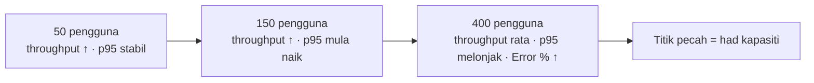

# Hari 2 — Korelasi, Logic Controllers, Non-GUI & Analisis SLA

[🧪 Lab Hari 2](./snippets/lab.md) · [🎤 Nota Penceramah](./nota-penceramah.md) · [🗂️ Test plans](./test-plans/) · [⬅️ Hari 1](../hari-1/README.md)

> Pada Hari 1 kita "memukul satu endpoint" dan melihat bahawa rakaman mentah **gagal** apabila dimain semula (401). Hari ini kita naik taraf kepada **senario pengguna sebenar penuh** yang tahan beban tinggi: **log masuk → semak kenderaan → sebut harga → bayar cukai**. Anda akan belajar **korelasi** (inti ujian beban berasaskan sesi), **Logic Controllers**, skrip **JSR223 Groovy**, menjalankan beban **non-GUI**, menjana **laporan HTML dashboard**, mentafsir keputusan terhadap **SLA**, dan melihat sekilas **distributed testing, CI/CD & Grafana**. Hasil hari ini: plan `07-beban-puncak-cukai.jmx` ("Hari Kenaikan Harga Cukai") yang anda boleh jalankan, baca dan pertahankan di hadapan pihak pengurusan.

> ⚠️ **Etika — masih localhost sahaja.** JMeter ialah penjana beban. Menghalakannya ke sistem pengeluaran/awam (termasuk portal JPJ sebenar) **tanpa kebenaran bertulis** = serangan DoS dan menyalahi undang-undang. Setiap plan hari ini menyasarkan `http://localhost:3000` — **Portal eJPJ (tiruan)** dalam `sut/`. Semua data **sintetik**, bukan data rasmi JPJ.

**Apa yang akan dibina:**
- Senario log masuk yang meng-**ekstrak** `token` + `csrf` dinamik dan menggunakannya semula
- Transaksi penuh dibungkus **Transaction Controller** + **If Controller**, dan **ForEach Controller** untuk semua kenderaan
- **JSR223 (Groovy)** untuk logik & pengesahan tersuai, serta fungsi JMeter (`__Random`, `__UUID`, `__P`, `__time`)
- Larian **non-GUI** + **laporan HTML dashboard** yang boleh dikongsi, dan **gerbang SLA** untuk CI

---

## 🎯 Objektif Pembelajaran

Di akhir hari ini, peserta boleh:

| # | Objektif (boleh diukur) | Sesi | Bukti |
|---|------------------------|------|-------|
| O1 | **Menerangkan** mengapa rakaman yang dimain semula gagal dan **membezakan** parameterisasi (data yang anda tahu) dengan korelasi (data yang hanya pelayan tahu) | S1 | `hari-1/test-plans/04-rakaman-mentah.jmx`: log masuk 200 → `/api/kenderaan` 401 → `bayar-cukai` 401, dan sebabnya dijelaskan |
| O2 | **Membina** korelasi `token` + `csrf` dengan **JSON Extractor**, dan **menulis** setara dengan Regular Expression / Boundary Extractor | S1 | Latihan 1: Debug Sampler menunjukkan `token` (UUID) + `csrf` (32 hex); bayaran `BERJAYA`, 0% ralat; `csrf` salah → **403** |
| O3 | **Membina** transaksi penuh dengan **Transaction Controller** dan **If Controller** (`${__groovy(...)}`) | S2 | Latihan 2: baris `Pembaharuan Cukai Jalan` muncul dalam Summary Report bagi larian 10 pengguna × 2 gelung |
| O4 | **Mengekstrak** pelbagai nilai (Match No. `-1`) dan **menggelung** dengan **ForEach Controller** | S2 | `08-foreach-kenderaan.jmx`: 3 pengguna → **5** bayaran `BERJAYA` (16 sampel HTTP, 0 ralat) |
| O5 | **Menulis** skrip **JSR223 Groovy** (dengan *Cache compiled script*) dan **menggunakan** fungsi `__Random`/`__UUID`/`__P`/`__time` | S2 | Latihan 3: sampel log masuk ditanda gagal dengan mesej tersuai; `no_rujukan` kelihatan dalam Debug Sampler |
| O6 | **Menjalankan** beban **non-GUI** dengan property `-Jpengguna/-Jrampup/-Jtempoh` dan **menjana** HTML dashboard | S3 | Latihan 4: `hasil/<cap-masa>/laporan/index.html` dibuka; Error % ≈ 0 |
| O7 | **Mentafsir** APDEX, throughput, 90/95/99th percentile & Error %, **merumus** NFR dan **mengenal pasti** titik pecah | S3 | Latihan 5: jadual 50/150/400 pengguna dengan 95th percentile + Error %, dan anggaran kapasiti |
| O8 | **Menguatkuasakan** SLA per-transaksi dengan **Duration Assertion** (`-Jsla_ms`) dalam senario puncak | S3 | Latihan 6: `-Jsla_ms=2000` → Error % ≈ 0; `-Jsla_ms=150` → Error % naik |
| O9 | **Menghuraikan** distributed testing, CI/CD, Grafana dan **membina** gerbang SLA yang boleh gagalkan *build* | S4 | Latihan 7: skrip gerbang membaca `statistics.json` dan keluar dengan kod `1` apabila NFR dilanggar |

---

## 📅 Jadual Hari Ini

| Masa | Sesi | Aktiviti | Fokus |
|------|------|----------|-------|
| 9.00 – 10.30 pagi | S1 | **Imbas kembali Hari 1 + Korelasi** | Warm-up 15 minit (`01-hello-jpj`, `03-csv-berparameter`) · mengapa replay gagal · JSON / Regex / Boundary Extractor · `token` + `csrf` · Lab 1 |
| 10.30 – 10.45 pagi | — | Rehat | |
| 10.45 pagi – 1.00 tgh | S2 | **Logic Controllers, ForEach & JSR223 Groovy** | Transaction / If / Loop / Throughput / Runtime Controller · Match No. `-1` + ForEach · JSR223 Groovy · fungsi JMeter · Lab 2 & 3 |
| 1.00 – 2.00 ptg | — | Makan tengah hari | |
| 2.00 – 3.30 ptg | S3 | **Non-GUI, HTML Dashboard & SLA** | `jmeter -n -t … -l … -e -o` · APDEX, throughput, percentile, Error % · titik pecah · senario puncak `07` + Duration Assertion · Lab 4, 5 & 6 |
| 3.30 – 3.45 ptg | — | Rehat | |
| 3.45 – 5.00 ptg | S4 | **Distributed, CI/CD, Grafana, Amalan Terbaik & Penutup** | Controller/worker · gerbang SLA CI · Backend Listener + Grafana · amalan terbaik · mini-demo capstone · rumusan 2 hari · Lab 7 |

> 💡 **Borang penilaian kursus** dalam pelatih.my dibuka **2.00 ptg** — lihat penutup S4.

---

## 🧭 Kenapa hari ini penting

Hari kenaikan harga cukai, tarikh akhir pembaharuan, atau pengumuman diskaun saman — semuanya mencipta **lonjakan** pengguna serentak pada portal. Ujian beban yang **tidak realistik** memberi keyakinan palsu.

| Tanpa hari ini | Dengan hari ini |
|----------------|-----------------|
| Rakaman dimain semula → 401/403, "ujian" hanya mengukur halaman ralat | **Korelasi** `token` + `csrf` — setiap pengguna maya log masuk dengan sesi sendiri |
| Laporan menunjukkan 4 endpoint berasingan | **Transaction Controller** — satu angka "berapa lama untuk memperbaharui cukai?" |
| Hanya kenderaan pertama dibayar | **ForEach** — semua kenderaan setiap pengguna |
| Beban dijalankan dalam GUI → penjana beban kehabisan RAM, angka tidak tepat | **Non-GUI** + `.jtl` + **HTML dashboard** |
| "Purata 300 ms, OK!" | **95th percentile** + Error % terhadap **NFR** bertulis |
| Ujian prestasi sekali-sekala sebelum pelancaran | **Gerbang SLA dalam CI** — regresi ditangkap setiap malam |

---

## 🧰 Persediaan

Pastikan pelayan tiruan berjalan (dari akar repo):

```bash
cd sut && node server.js
# Portal eJPJ (TIRUAN) berjalan di  http://localhost:3000
```

Semak: buka <http://localhost:3000/api/health> → `{"status":"ok",...}`. Buka JMeter GUI (`jmeter`). Kita **membina** di GUI, tetapi menjalankan beban sebenar secara **non-GUI**.

> 💡 Untuk keputusan lab yang "bersih" (tanpa ralat 500 sintetik ~1% pada `bayar-cukai`), anda boleh mulakan SUT dengan `ERROR_RATE=0 node server.js`. Untuk demo ralat/latensi: `LATENCY_MIN`, `LATENCY_MAX`, `ERROR_RATE`.

| Plan Hari 2 | Senario | Beban lalai |
|-------------|---------|-------------|
| [`04-korelasi-log-masuk.jmx`](./test-plans/04-korelasi-log-masuk.jmx) | Log masuk → senarai → bayar `WXY1234` (korelasi) | 5 pengguna, ramp 3s, 3 gelung |
| [`05-transaksi-penuh.jmx`](./test-plans/05-transaksi-penuh.jmx) | Transaction + If: log masuk → senarai → sebut harga → bayar | 10 pengguna, ramp 10s, 2 gelung |
| [`06-ujian-beban-nogui.jmx`](./test-plans/06-ujian-beban-nogui.jmx) | Beban non-GUI (dipakai `run-nogui.sh`) | `${__P(pengguna,50)}`, `${__P(rampup,30)}`, `${__P(tempoh,120)}` s |
| [`07-beban-puncak-cukai.jmx`](./test-plans/07-beban-puncak-cukai.jmx) | Hari Kenaikan Harga Cukai + SLA `${__P(sla_ms,2000)}` | `${__P(pengguna,300)}`, ramp 30s, 300s |
| [`08-foreach-kenderaan.jmx`](./test-plans/08-foreach-kenderaan.jmx) | ForEach: bayar cukai **semua** kenderaan | 3 pengguna, ramp 3s, 1 gelung |

---

## S1 — Imbas Kembali & Korelasi (9.00 – 10.30 pagi)

### 1.1 Imbas kembali Hari 1 (warm-up 15 minit)

Hari 1 diajar dua minggu lalu — mari panaskan semula tangan.

1. Buka `hari-1/test-plans/01-hello-jpj.jmx`. **Sebelum Start**, klik **HTTP Request Defaults** dan pastikan **Server Name or IP = `localhost`**, **Port Number = `3000`**, **Protocol = `http`**. (Peraturan kelas: setiap plan yang dibuka mesti disemak sasarannya dahulu.)
2. Jalankan (▶). Dalam Summary Report: berapa **# Samples**? (= Threads × Loop Count.)
3. Buka `hari-1/test-plans/03-csv-berparameter.jmx` — CSV Data Set `../data/kenderaan.csv` → `${no_pendaftaran}`. Jalankan; dalam View Results Tree / Summary Report sahkan lima nombor pendaftaran berlainan dipanggil.

Soalan pantas (jawab lisan):

| Soalan | Jawapan ringkas |
|--------|-----------------|
| Skop elemen ditentukan oleh…? | **Kedudukan** dalam pokok — anak sampler = sampler itu sahaja |
| Average atau percentile untuk SLA? | **Percentile** (90/95/99) |
| Mengapa tiada View Results Tree semasa beban? | Menyimpan setiap respons dalam RAM → penjana beban sesak |
| Apa yang berlaku apabila `04-rakaman-mentah.jmx` dimain semula? | Log masuk 200, tetapi `/api/kenderaan` & `bayar-cukai` **401** |

### 1.2 Mengapa replay biasa gagal

Pelayan mengeluarkan nilai **dinamik** setiap sesi (token sesi, **CSRF token**, view-state). Nilai yang dirakam semalam sudah **luput** — atau tidak pernah wujud dalam memori pelayan semasa larian. Anda mesti **menangkap** nilai itu dari respons **pada masa larian** dan menyuntiknya ke permintaan seterusnya. Inilah **korelasi**.

```bash
jmeter -n -t hari-1/test-plans/04-rakaman-mentah.jmx -l /tmp/r04.jtl
# /api/log-masuk → 200 ; /api/kenderaan → 401 ; bayar-cukai → 401 (Assertion BERJAYA gagal)
```

Dalam SUT kita, `POST /api/log-masuk` memulangkan:

```json
{ "token": "b3519618-...", "csrf": "cefa6be3...", "nama": "Pengguna 5500", "mesej": "Log masuk berjaya" }
```

- `token` (UUID) → mesti dihantar sebagai header `Authorization: Bearer <token>` pada permintaan berikutnya; tiada/salah → **401** `Token tidak sah atau tamat tempoh`.
- `csrf` (32 aksara hex) → mesti dihantar dalam badan `bayar-cukai`; salah/hilang → **403** `Token CSRF tidak sah — sila log masuk semula`.

### 1.3 Parameterisasi vs korelasi

| | Parameterisasi | Korelasi |
|-|----------------|----------|
| Sumber data | Anda (CSV, User Defined Variables) | **Pelayan**, pada masa larian |
| Contoh | `no_kp`, `kata_laluan` dari `pengguna.csv` | `token`, `csrf` dari respons log masuk |
| Elemen JMeter | CSV Data Set Config | Post Processor: JSON / Regular Expression / Boundary Extractor |
| Diketahui sebelum ujian? | Ya | Tidak |

> **Konsep penting:** Kedua-duanya diperlukan untuk senario realistik. `pengguna.csv` memberi **siapa** yang log masuk; extractor memberi **sesi** pengguna itu.

### 1.4 Tiga jenis Extractor

| Extractor | Bila guna | Contoh untuk `token` | Medan utama |
|-----------|-----------|----------------------|-------------|
| **JSON Extractor** | Respons JSON (API moden) | `$.token` | Names of created variables · JSON Path expressions · Match No. · Default Values |
| **Regular Expression Extractor** | Mana-mana teks/HTML | `"token":"([^"]+)"` | Name of created variable · Regular Expression · Template `$1$` · Match No. · Default Value |
| **Boundary Extractor** | Teks dengan sempadan kiri/kanan jelas | Kiri `"token":"` · Kanan `"` | Left Boundary · Right Boundary · Match No. · Default Value |

Untuk API JSON kita, **JSON Extractor** paling bersih dan paling tahan perubahan susunan medan. Regex lebih fleksibel (HTML, header) tetapi lebih rapuh; Boundary paling laju dan paling mudah dibaca bila sempadan jelas.

> **Match No.:** `1` = padanan pertama · `0` = rawak · `-1` = **semua** (mencipta `nama_1`, `nama_2`, … dan `nama_matchNr` — dipakai dalam S2 bersama ForEach).

### 1.5 Bina: ekstrak `token` + `csrf`

1. Thread Group → **HTTP Request Defaults** (`localhost` / `3000`) + **HTTP Header Manager** `Content-Type: application/json` + **CSV Data Set Config** `../data/pengguna.csv` (`no_kp,kata_laluan`). Simpan `.jmx` di `hari-2/test-plans/` supaya laluan relatif betul.
2. Sampler **POST `/api/log-masuk`** — tab **Body Data**:
   ```json
   { "no_kp": "${no_kp}", "kata_laluan": "${kata_laluan}" }
   ```
3. **Klik kanan sampler → Add → Post Processors → JSON Extractor.** Isi:
   - **Names of created variables:** `token;csrf`
   - **JSON Path expressions:** `$.token;$.csrf`
   - **Match No. (0 for Random):** `1;1` · **Default Values:** `TOKEN_TAK_JUMPA;CSRF_TAK_JUMPA`
4. Sampler **GET `/api/kenderaan`** dengan parameter `no_kp=${no_kp}` + **HTTP Header Manager (anak sampler)** `Authorization: Bearer ${token}`.
5. Sampler **POST `/api/kenderaan/WXY1234/bayar-cukai`** + Header Manager anak `Authorization: Bearer ${token}` + Body:
   ```json
   { "csrf": "${csrf}", "tempoh_bulan": 12, "amaun": 90 }
   ```
6. **Response Assertion** (anak sampler bayar) — *Text Response*, *Substring*, `BERJAYA`.
7. **Add → Sampler → Debug Sampler** selepas log masuk (JMeter variables = True) dan **View Results Tree**. Jalankan 5 pengguna.


> **Konsep — skop extractor:** Letak extractor sebagai **anak** sampler log masuk. Jika diletak di bawah Thread Group, ia berjalan selepas **setiap** sampler dan menimpa `token` dengan nilai default apabila respons lain tiada `$.token`.

> **Konsep — pembolehubah per-thread:** `${token}` disimpan dalam `vars` **thread itu sahaja**. 300 pengguna maya = 300 token berbeza — tepat seperti 300 pengguna sebenar.

> Rujuk: [`test-plans/04-korelasi-log-masuk.jmx`](./test-plans/04-korelasi-log-masuk.jmx) (5 pengguna, ramp 3s, 3 gelung, Think Time 500 ms).

### 1.6 Default Value & Debug Sampler — alat nyahpepijat

> **Konsep — Default Value yang ketara:** Tetapkan default seperti `TOKEN_TAK_JUMPA`, bukan kosong. Bila ekstrak gagal, permintaan seterusnya menunjukkan `Authorization: Bearer TOKEN_TAK_JUMPA` dalam tab **Request** View Results Tree — anda serta-merta tahu korelasi rosak, bukan tercari-cari sebab 401/403.

Aliran nyahpepijat korelasi:
1. View Results Tree → sampler log masuk → **Response data**: adakah `token` wujud?
2. Pilih paparan **JSON Path Tester** di View Results Tree, uji `$.token` pada respons sebenar.
3. **Debug Sampler** → senarai pembolehubah: `token=…`, `csrf=…`.
4. Sampler seterusnya → tab **Request** → adakah header/badan mengandungi nilai sebenar?

### 1.7 Eksperimen: buktikan korelasi wajib

Ganti `${csrf}` dalam badan bayar dengan teks tetap `abc123` → jalankan → **403 "Token CSRF tidak sah — sila log masuk semula"**. Pulihkan. Kemudian buang `Bearer ${token}` → **401**. Dua ralat berbeza, dua punca berbeza — inilah cara pelayan sebenar melindungi transaksi.

### 🎯 Kuiz S1

1. Plan `04-rakaman-mentah.jmx` dimain semula: log masuk 200, tetapi `/api/kenderaan` memulangkan 401. Apakah punca utamanya?
   - [ ] Pelayan tiruan tidak menyokong kaedah GET
   - [x] Token yang dikeras-kod semasa rakaman tidak wujud lagi dalam sesi pelayan; ia mesti diekstrak semula pada masa larian
   - [ ] Thread Group perlu ramp-up lebih panjang
   - [ ] CSV Data Set Config tiada fail `pengguna.csv`
   > Rakaman menyalin nilai dinamik secara literal. Setiap log masuk menjana `token` + `csrf` baharu, jadi nilai rakaman tidak sah — korelasi menangkap nilai semasa.

2. Respons log masuk ialah `{"token":"…","csrf":"…","nama":"…"}`. Apakah JSON Path expression yang betul untuk `csrf` dalam JSON Extractor?
   - [ ] `csrf`
   - [ ] `//csrf`
   - [x] `$.csrf`
   - [ ] `${csrf}`
   > JSON Path bermula dengan `$` (akar dokumen). `//csrf` ialah XPath; `${csrf}` ialah cara **menggunakan** pembolehubah, bukan mengekstraknya.

3. Anda mahu ekstrak `token` dengan **Regular Expression Extractor**. Konfigurasi manakah yang betul?
   - [x] Regular Expression `"token":"([^"]+)"`, Template `$1$`
   - [ ] Regular Expression `$.token`, Template `$0$`
   - [ ] Regular Expression `token`, Template kosong
   - [ ] Left Boundary `"token":"`, Right Boundary `"`
   > Kumpulan tangkapan `( )` menangkap nilai; Template `$1$` memilih kumpulan pertama. `$.token` ialah JSON Path; pilihan terakhir ialah konfigurasi **Boundary** Extractor, bukan Regex.

4. Mengapa Default Value JSON Extractor ditetapkan kepada `TOKEN_TAK_JUMPA` dan bukan dibiarkan kosong?
   - [ ] Supaya pelayan menerima permintaan walaupun token hilang
   - [x] Supaya kegagalan ekstrak kelihatan jelas dalam permintaan seterusnya ketika nyahpepijat
   - [ ] Kerana JSON Extractor gagal disimpan jika default kosong
   - [ ] Supaya If Controller tidak diperlukan
   > Nilai yang ketara muncul dalam header `Authorization` di tab Request. Ia juga boleh disemak oleh If Controller (S2) untuk melangkau langkah bayar apabila log masuk gagal.

---

## S2 — Logic Controllers, ForEach & JSR223 Groovy (10.45 pagi – 1.00 tgh)

### 2.1 Logic Controllers — mengawal *bila* dan *bagaimana*

| Controller | Fungsi | Contoh JPJ |
|------------|--------|------------|
| **Transaction Controller** | Kumpul beberapa sampler sebagai **satu transaksi** & ukur jumlah masanya | "Pembaharuan Cukai Jalan" (4 langkah) |
| **If Controller** | Jalankan anak hanya jika syarat benar | Bayar hanya jika ada kenderaan & token sah |
| **Loop Controller** | Ulang anak N kali | Semak status bayaran 3 kali |
| **ForEach Controller** | Gelung ke atas pembolehubah berindeks (`nama_1`, `nama_2`, …) | Bayar cukai **setiap** kenderaan |
| **Throughput Controller** | Jalankan anak untuk **% peratus** pelaksanaan (edaran beban) | 70% semak cukai, 30% bayar saman |
| **Runtime Controller** | Jalankan anak untuk tempoh saat tertentu | Semak saman berulang selama 60 s |
| **Once Only Controller** | Jalankan anak sekali per thread | Log masuk sekali, bayar banyak kali |

### 2.2 Transaction Controller

1. **Klik kanan Thread Group → Add → Logic Controller → Transaction Controller**, namakan `Pembaharuan Cukai Jalan`.
2. Seret 4 sampler (log masuk → senarai → sebut harga → bayar) **ke dalam** controller itu.

| Pilihan | Kesan |
|---------|-------|
| **Generate parent sample** (tidak ditanda — seperti plan rujukan) | Laporan memaparkan baris transaksi **dan** baris setiap langkah — baik untuk mencari langkah yang lambat |
| **Generate parent sample** (ditanda) | Langkah menjadi sub-sampel; laporan hanya memaparkan baris transaksi |
| **Include duration of timer and pre-post processors in generated sample** | Jika ditanda, think time dikira dalam masa transaksi. Plan rujukan **tidak** menandanya — kita ukur masa sistem, bukan masa pengguna berfikir |

> **Konsep — mengapa Transaction Controller:** Ia melaporkan satu metrik "Pembaharuan Cukai Jalan" yang merangkumi **keseluruhan perjalanan pengguna**. Ini padan dengan cara perniagaan berfikir: "berapa lama untuk **memperbaharui cukai**?", bukan "berapa lama endpoint `/bayar-cukai`". NFR biasanya ditulis pada aras transaksi.

### 2.3 Bina: transaksi penuh (plan `05`)

1. Dalam Transaction Controller: `1. POST /api/log-masuk` (+ JSON Extractor `token;csrf`) → `2. GET /api/kenderaan`.
2. Selepas sampler senarai, tambah **JSON Extractor** kedua (anak `2. GET /api/kenderaan`) untuk ambil kenderaan pertama:
   - Names: `no_pendaftaran;amaun` · Paths: `$.kenderaan[0].no_pendaftaran;$.kenderaan[0].amaun_cukai` · Match No.: `1;1` · Default: `NONE;0`
3. **Add → Logic Controller → If Controller**, namakan `Jika ada kenderaan`, dan alih ke dalamnya:
   - `3. GET /api/kenderaan/${no_pendaftaran}/cukai`
   - `4. POST /api/kenderaan/${no_pendaftaran}/bayar-cukai` dengan badan `{ "csrf": "${csrf}", "tempoh_bulan": 12, "amaun": ${amaun} }` + Response Assertion `BERJAYA`
4. Tambah **Uniform Random Timer** `Think Time (1-3s)`: Constant Delay Offset `1000` ms + Random Delay Maximum `2000` ms.
5. Thread Group 10 pengguna, ramp 10s, 2 gelung; **Summary Report**. Jalankan.

> Rujuk: [`test-plans/05-transaksi-penuh.jmx`](./test-plans/05-transaksi-penuh.jmx).

### 2.4 If Controller & fungsi `__groovy`

Syarat dalam plan rujukan:

```
${__groovy(vars.get("no_pendaftaran") != "NONE" && vars.get("token") != "TOKEN_TAK_JUMPA")}
```

- Dalam JMeter 5.x, **Interpret Condition as Variable Expression?** ditanda secara lalai — syarat mesti **menilai kepada `true`/`false`**, dan cara paling cekap ialah fungsi `${__groovy(...)}` atau `${__jexl3(...)}`.
- `__groovy` disyorkan (paling laju, sintaks Java/Groovy biasa). Setara JEXL3: `${__jexl3("${no_pendaftaran}" != "NONE")}`.
- **Evaluate for all children?** — biarkan tidak ditanda (syarat dinilai sekali sebelum anak berjalan).

> **Konsep:** If Controller di sini ialah **pengawal integriti senario** — jika log masuk gagal atau pengguna tiada kenderaan, kita **tidak** menghantar bayaran palsu yang pasti gagal dan mencemarkan Error %.

### 2.5 Pengekstrakan pelbagai-nilai + ForEach Controller (plan `08`)

Satu pengguna boleh ada **beberapa** kenderaan (`800101015500` → `WXY1234`, `VAB88`; `850303035700` → `BMT3030`, `PKL909`). Ekstrak **semua** kemudian gelung.

1. **JSON Extractor** pada `2. GET /api/kenderaan (semua)`: nama `no_pendaftaran`, path `$.kenderaan[*].no_pendaftaran`, **Match No. = `-1`**, default `NONE`. Ini mencipta `no_pendaftaran_1`, `no_pendaftaran_2`, … dan `no_pendaftaran_matchNr`.
2. **Add → Logic Controller → ForEach Controller** `ForEach — setiap kenderaan`:
   - **Input variable prefix:** `no_pendaftaran`
   - **Output variable name:** `no_semasa`
   - **Add "_" before number?** → **ditanda**
3. Dalam ForEach: `3. GET /api/kenderaan/${no_semasa}/cukai` (+ JSON Extractor `amaun;tempoh_bulan` ← `$.amaun;$.tempoh_bulan`, default `0;12`) → `4. POST /api/kenderaan/${no_semasa}/bayar-cukai` dengan badan `{ "csrf": "${csrf}", "tempoh_bulan": ${tempoh_bulan}, "amaun": ${amaun} }`.

> **Gotcha — "Add _ before number?":** JSON/Regex Extractor cipta `nama_1` (**ada** garis bawah). Jika kotak ini tidak ditanda, ForEach mencari `nama1` → **0 lelaran**, tiada ralat, tiada bayaran. Biarkan medan **Start index / End index kosong** di GUI.

> Rujuk: [`test-plans/08-foreach-kenderaan.jmx`](./test-plans/08-foreach-kenderaan.jmx) — disahkan: 3 pengguna → 5 kenderaan dibayar (16 sampel HTTP), 0 ralat.

### 2.6 JSR223 (Groovy)

Bila elemen terbina tidak cukup, tulis kod. Elemen **JSR223** (Sampler / PreProcessor / PostProcessor / Assertion) menjalankan skrip — guna **Groovy** dan tandakan **Cache compiled script if available** (skrip dikompil sekali, bukan setiap lelaran). Elakkan BeanShell untuk beban tinggi.

Contoh (lihat [`snippets/jsr223-groovy.groovy`](./snippets/jsr223-groovy.groovy)):

```groovy
// PreProcessor (anak sampler bayar-cukai): jana nilai unik sebelum permintaan
vars.put("no_rujukan", "REF-" + System.currentTimeMillis() + "-" + Thread.currentThread().getId())
def tempoh = (Math.random() < 0.5) ? 6 : 12
vars.put("tempoh_bulan", tempoh.toString())

// PostProcessor (anak sampler log-masuk): pengesahan JSON terperinci + tandakan gagal
import groovy.json.JsonSlurper
def kod = prev.getResponseCode()
if (kod == "200") {
    def json = new JsonSlurper().parseText(prev.getResponseDataAsString())
    if (!json.token) { prev.setSuccessful(false); prev.setResponseMessage("Log masuk 200 tetapi tiada token dalam respons") }
} else {
    prev.setSuccessful(false); prev.setResponseMessage("Log masuk mengembalikan kod " + kod)
}
```

| Objek terbina | Maksud |
|---------------|--------|
| `vars` | Pembolehubah thread (`vars.get("x")`, `vars.put("x", v)` — nilai **String**) |
| `props` | Property global JMeter (dikongsi semua thread) |
| `prev` | `SampleResult` sampler sebelumnya (dalam PostProcessor / Assertion) |
| `ctx` | `JMeterContext` — thread semasa, `ctx.getThreadNum()` |
| `log` | Pengelog (`log.info`, `log.warn`) → `jmeter.log` |
| `SampleResult` / `sampler` | Hasil sampel (JSR223 Sampler) / sampler semasa (PreProcessor) |

> **Amalan baik:** Dalam skrip Groovy, baca pembolehubah dengan `vars.get("token")`, **bukan** `${token}` di dalam kod — `${}` diganti sebelum kompil dan mematahkan cache. Biarkan medan *Parameters* untuk menghantar nilai jika perlu.

### 2.7 Fungsi JMeter yang biasa

| Fungsi | Hasil | Contoh guna |
|--------|-------|-------------|
| `${__Random(1,1000)}` | Integer rawak | ID rawak, pilih cabang |
| `${__RandomString(8,abcdef)}` | Rentetan rawak | Nama rujukan |
| `${__UUID}` | UUID unik | Header `X-Rujukan` / idempotency key |
| `${__time(yyyy-MM-dd)}` | Cap masa/tarikh terformat | Tarikh transaksi |
| `${__P(pengguna,50)}` | Baca **property** `pengguna` (lalai 50) | Saiz beban dari baris arahan |
| `${__threadNum}` | Nombor thread semasa | Log / data unik per thread |
| `${__groovy(...)}` / `${__jexl3(...)}` | Nilai ungkapan | Syarat If Controller |

> **Konsep — `__P` menjadikan plan boleh-guna-semula:** Daripada mengeras-kod 50 pengguna, guna `${__P(pengguna,50)}`. Kemudian pada baris arahan: `-Jpengguna=200`. Satu plan, banyak saiz beban — asas integrasi CI (S3, S4).

### 🎯 Kuiz S2

1. Apakah kelebihan utama Transaction Controller `Pembaharuan Cukai Jalan` dalam laporan?
   - [ ] Ia menjadikan setiap sampler berjalan lebih laju
   - [x] Ia melaporkan masa keseluruhan perjalanan pengguna (log masuk → bayar) sebagai satu metrik
   - [ ] Ia menggantikan keperluan untuk Response Assertion
   - [ ] Ia mengulang anak-anaknya beberapa kali
   > NFR ditulis pada aras transaksi perniagaan: "pembaharuan cukai < 1500 ms pada 95th percentile". Transaction Controller memberi angka itu secara terus.

2. Syarat If Controller manakah yang betul (dengan *Interpret Condition as Variable Expression* ditanda)?
   - [ ] `vars.get("no_pendaftaran") != "NONE"`
   - [x] `${__groovy(vars.get("no_pendaftaran") != "NONE")}`
   - [ ] `${no_pendaftaran} != NONE`
   - [ ] `if (no_pendaftaran != "NONE")`
   > Mod ungkapan pembolehubah memerlukan nilai akhir `true`/`false`. Fungsi `${__groovy(...)}` menilai ungkapan Groovy dan memulangkan `true`/`false`.

3. JSON Extractor (Match No. `-1`) menghasilkan `no_pendaftaran_1` dan `no_pendaftaran_2`, tetapi ForEach Controller berjalan **0 kali**. Punca paling mungkin?
   - [ ] Pelayan tiruan hanya memulangkan satu kenderaan
   - [ ] Output variable name mesti sama dengan input prefix
   - [x] Kotak **Add "_" before number?** tidak ditanda, jadi ForEach mencari `no_pendaftaran1`
   - [ ] ForEach hanya berfungsi dengan Regular Expression Extractor
   > Extractor mencipta nama dengan garis bawah (`_1`). Tanpa kotak itu, ForEach mencari nama tanpa garis bawah dan tidak menemui apa-apa.

4. Mengapa skrip JSR223 untuk beban tinggi patut menggunakan Groovy dengan **Cache compiled script if available**, dan membaca pembolehubah melalui `vars.get()`?
   - [x] Skrip dikompil sekali dan diguna semula; `${...}` dalam kod mengubah teks skrip setiap lelaran dan mematahkan cache
   - [ ] Groovy ialah satu-satunya bahasa yang boleh membaca JSON
   - [ ] `vars.get()` menghantar nilai ke pelayan secara automatik
   - [ ] Cache menyimpan respons pelayan supaya permintaan tidak dihantar
   > Kompil semula setiap lelaran memakan CPU penjana beban dan memesongkan keputusan. `vars.get("x")` membaca nilai semasa tanpa mengubah teks skrip.

---

## S3 — Non-GUI, HTML Dashboard & SLA (2.00 – 3.30 ptg)

### 3.1 Mengapa non-GUI

GUI ialah untuk **membina & nyahpepijat** (1–5 pengguna). Untuk **beban sebenar**, GUI dan listener seperti View Results Tree memakan RAM/CPU penjana beban — angka yang anda ukur menjadi angka **JMeter**, bukan angka **sistem**. Buang/matikan GUI listener dan jalankan dari terminal.

### 3.2 Arahan non-GUI

```bash
jmeter -n -t hari-2/test-plans/06-ujian-beban-nogui.jmx \
  -Jpengguna=100 -Jrampup=30 -Jtempoh=180 \
  -l results.jtl \
  -e -o laporan/
```

| Bendera | Maksud |
|---------|--------|
| `-n` | Mod non-GUI |
| `-t` | Fail Test Plan (`.jmx`) |
| `-l` | Fail hasil mentah (`.jtl`) |
| `-e -o <dir>` | Jana **laporan HTML dashboard** ke direktori (mesti **kosong / belum wujud**) |
| `-J<nama>=<nilai>` | Tetapkan **property** tempatan (dibaca oleh `${__P(...)}`) |
| `-j <fail>` | Fail log JMeter |
| `-g <jtl>` | Jana laporan daripada `.jtl` sedia ada (bersama `-o`) |

Plan `06` membaca model beban daripada property: `-Jpengguna` (lalai 50), `-Jrampup` (30), `-Jtempoh` (120 s, Thread Group dengan **Specify Thread lifetime**, Loop *Infinite*), `-Jhost` (localhost), `-Jport` (3000).

Atau guna skrip pembungkus (memetakan `PENGGUNA`/`RAMPUP`/`TEMPOH`/`HOST`/`PORT` kepada `-J…`):

```bash
cd hari-2/run
./run-nogui.sh                          # lalai 50 pengguna / ramp 30s / 120s
PENGGUNA=200 RAMPUP=60 TEMPOH=300 ./run-nogui.sh
# laporan: hari-2/run/hasil/<cap-masa>/laporan/index.html
```

Windows: `run-nogui.bat` (atau `set PENGGUNA=200 & set TEMPOH=300 & run-nogui.bat`).

> **Konsep — fail `.jtl`:** Hasil mentah CSV setiap sampel (`timeStamp, elapsed, label, responseCode, success, Latency, Connect, …`). Simpan `.jtl` — anda boleh jana laporan HTML **kemudian**: `jmeter -g results.jtl -o laporan/`.

### 3.3 Membaca HTML dashboard

Buka `laporan/index.html`:

| Bahagian dashboard | Apa yang dicari |
|--------------------|-----------------|
| **Dashboard → APDEX** | Skor 0–1 per label; ambang lalai *Satisfied* ≤ 500 ms, *Tolerating* ≤ 1500 ms |
| **Dashboard → Requests Summary** | Pai Pass/Fail |
| **Dashboard → Statistics** | # Samples, Average, Min/Max, **90th / 95th / 99th pct**, Throughput, Error % per label |
| **Dashboard → Errors / Top 5 Errors by sampler** | Kod ralat (500, 403, "operation lasted too long") |
| **Charts → Over Time** | Response Times Over Time, Active Threads Over Time, Transactions Per Second |
| **Charts → Throughput** | Hits/Transactions per second, Response Time vs Request |
| **Charts → Response Times** | Response Time Percentiles, Distribution |

| Metrik | Maksud | Pandangan sihat |
|--------|--------|-----------------|
| **APDEX** | `(Satisfied + Tolerating/2) / Jumlah` | Hampir 1.0 (≥ 0.94 sangat baik) |
| **Throughput** | Permintaan/transaksi selesai per saat | Naik seiring pengguna, kemudian stabil — **tidak menurun** |
| **Average / Median** | Masa respons purata / titik tengah | Median < ambang SLA |
| **90/95/99th percentile** | 95% permintaan ≤ nilai ini | Utama untuk SLA |
| **Error %** | Peratus sampel gagal | ≈ 0% (< 1% biasanya diterima) |
| **Response time vs Latency** | Jumlah masa vs masa ke bait pertama | Jurang besar = pemprosesan/penstriman lambat |

> **Konsep — response time ≠ latency ≠ connect time:** *Connect time* = masa jabat tangan TCP. *Latency* = masa sehingga **bait pertama** respons. *Response time (elapsed)* = masa sehingga respons **penuh**. Jurang antara latency & response time menunjukkan masa penstriman/pemprosesan.

> **Petua — label dinamik:** Sampler bernama `4. POST /api/kenderaan/${no_pendaftaran}/bayar-cukai` menghasilkan satu baris per kenderaan dalam Statistics. Baik untuk analisis per-kenderaan; untuk laporan pengurusan, namakan label statik (cth. `4. POST bayar-cukai`) atau bandingkan pada baris **transaksi**.

### 3.4 SLA / NFR ditulis dalam percentile

Contoh NFR untuk JPJ:

> *"Pada **200 pengguna serentak**, transaksi **Pembaharuan Cukai Jalan** mesti mencapai **95th percentile < 1500 ms**, **Error % < 1%**, dan throughput ≥ 20 transaksi/saat, selama 10 minit."*

Purata **tidak** sesuai untuk SLA kerana ia menyembunyikan ekor lambat (*tail latency*): purata 400 ms boleh wujud bersama 5% pengguna yang menunggu 6 saat.

### 3.5 Mencari titik pecah (breaking point)

Naikkan beban berperingkat (`PENGGUNA=50`, `150`, `400`) dengan SUT "perlahan" (`LATENCY_MIN=200 LATENCY_MAX=800 ERROR_RATE=0.05 node server.js`). Titik di mana **percentile melonjak**, **throughput berhenti naik**, atau **Error % naik mendadak** ialah **had kapasiti** — output paling berharga sesuatu stress test.



### 3.6 Senario puncak: Hari Kenaikan Harga Cukai (`07-beban-puncak-cukai.jmx`)

Menggabungkan semua yang di atas ke dalam satu **use case JPJ realistik** — lonjakan pembaharuan cukai jalan pada hari harga naik. Thread Group `Lonjakan Pembaharuan Cukai`, Transaction Controller `Pembaharuan Cukai Jalan (Puncak)`:

1. `1. POST /api/log-masuk` → ekstrak `token` + `csrf`
2. `2. GET /api/kenderaan` → ekstrak `no_pendaftaran` pertama (default `NONE`)
3. If Controller `Jika ada kenderaan & token sah` →
   `3. GET /api/kenderaan/${no_pendaftaran}/cukai (sebut harga)` → ekstrak `amaun` + `tempoh_bulan` dari **sebut harga** (bukan dikeras-kod)
4. `4. POST /api/kenderaan/${no_pendaftaran}/bayar-cukai` + Response Assertion `BERJAYA` + **Duration Assertion** `SLA Bayaran < ${__P(sla_ms,2000)}ms`
5. Think Time Rush (0.5–1.5 s)

Duration Assertion menguatkuasakan **SLA per-transaksi** — sampel yang melebihi ambang ditanda **gagal** ("The operation lasted too long"), jadi pelanggaran SLA muncul sebagai **Error %** dalam laporan, bukan hanya angka percentile.

```bash
jmeter -n -t hari-2/test-plans/07-beban-puncak-cukai.jmx \
  -Jpengguna=300 -Jrampup=30 -Jtempoh=300 -Jsla_ms=2000 \
  -l hari-2/run/hasil/r7.jtl -e -o hari-2/run/hasil/laporan7
```

> ℹ️ `run-nogui.sh` sentiasa menjalankan plan `06`. Untuk `07`, guna arahan `jmeter -n` di atas (atau salin skrip dan tukar `PLAN`).

Semua beban dikawal melalui property: `-Jpengguna` (lalai 300) `-Jrampup` (30) `-Jtempoh` (300) `-Jhost` `-Jport`, dan **ambang SLA** melalui `-Jsla_ms` (lalai `2000`). Turunkan `-Jsla_ms` (cth. `-Jsla_ms=150`) — dengan latensi SUT 40–180 ms, sebahagian bayaran kini "melanggar SLA" dan Error % naik. Itulah hubungan **ambang SLA ↔ Error %** dalam satu eksperimen.

> 💡 Untuk ujian pantas di kelas: `-Jpengguna=10 -Jrampup=2 -Jtempoh=8`.

### 🎯 Kuiz S3

1. Arahan manakah menjalankan plan secara non-GUI **dan** menjana HTML dashboard?
   - [ ] `jmeter -t plan.jmx -l hasil.jtl`
   - [x] `jmeter -n -t plan.jmx -l hasil.jtl -e -o laporan/`
   - [ ] `jmeter -n -t plan.jmx -o laporan/`
   - [ ] `jmeter -g plan.jmx -e`
   > `-n` non-GUI, `-t` plan, `-l` hasil mentah, `-e -o` jana dashboard ke direktori kosong. `-g` digunakan dengan fail `.jtl`, bukan `.jmx`.

2. Statistics menunjukkan transaksi `Pembaharuan Cukai Jalan` dengan **95th pct = 1200 ms**. Apakah maksudnya?
   - [ ] Purata masa transaksi ialah 1200 ms
   - [x] 95% transaksi selesai dalam 1200 ms atau kurang; 5% lebih lambat
   - [ ] 95% transaksi gagal selepas 1200 ms
   - [ ] Masa transaksi paling lama ialah 1200 ms
   > Percentile menerangkan taburan. Maksimum ialah `Max`; purata ialah `Average`. NFR yang baik ditulis pada percentile.

3. Dengan ambang APDEX lalai JMeter (*Satisfied* 500 ms, *Tolerating* 1500 ms), sampel 1200 ms dikira sebagai…
   - [ ] Satisfied
   - [x] Tolerating
   - [ ] Frustrated
   - [ ] Gagal (Error)
   > ≤ 500 ms = Satisfied; > 500 hingga ≤ 1500 ms = Tolerating (dikira separuh); > 1500 ms = Frustrated. APDEX tidak menanda sampel gagal — itu kerja assertion.

4. Plan `07` dijalankan semula dengan `-Jsla_ms=150` dan Error % naik, walaupun SUT tidak berubah. Mengapa?
   - [ ] Pelayan tiruan menolak permintaan apabila property berubah
   - [ ] `-Jsla_ms` mengurangkan bilangan pengguna
   - [x] Duration Assertion menanda bayaran yang mengambil masa lebih 150 ms sebagai gagal
   - [ ] Think time dimatikan apabila SLA diturunkan
   > Ambang `${__P(sla_ms,2000)}` ialah medan Duration Assertion. Sampel 200 OK yang melebihi ambang ditanda gagal — pelanggaran SLA kelihatan sebagai Error %.

---

## S4 — Distributed, CI/CD, Grafana & Penutup (3.45 – 5.00 ptg)

### 4.1 Distributed / remote testing (sekilas)

Satu mesin ada had (CPU, RAM, rangkaian, port). Untuk beban sangat tinggi, JMeter berjalan **teragih**: satu **controller** (master) mengarah beberapa **worker** (dahulu "slave") yang menjana beban.

```bash
# pada setiap worker
jmeter-server
# pada controller
jmeter -n -t plan.jmx -R worker1,worker2,worker3 -Gpengguna=100 -l results.jtl -e -o laporan/
```

| Perkara | Penting kerana |
|---------|----------------|
| Setiap worker menjalankan **seluruh** Thread Group | 100 thread × 3 worker = **300** pengguna |
| `-G<nama>=<nilai>` | Menghantar property ke **worker**; `-J` hanya tetapkan di controller |
| Fail CSV | Mesti wujud pada laluan yang sama di **setiap** worker |
| RMI | JMeter 5.x guna SSL untuk RMI secara lalai (jana keystore dengan `create-rmi-keystore`), atau `server.rmi.ssl.disable=true` untuk makmal tertutup sahaja |
| Rangkaian | Controller ↔ worker ↔ SUT dalam rangkaian yang sama; masa dan versi Java/JMeter seragam |

> **Petua:** Banyak pasukan kini guna **JMeter dalam kontena/awan** (cth. beberapa instance di CI, Kubernetes, atau perkhidmatan seperti Azure Load Testing) berbanding menyiapkan master-worker secara manual. Prinsip etika sama: hanya sasaran yang dibenarkan secara bertulis.

### 4.2 CI/CD — ujian prestasi sebagai gerbang

- Jalankan `jmeter -n …` dalam **Jenkins / GitHub Actions / GitLab CI** pada setiap PR atau setiap malam.
- ⚠️ `jmeter -n` **keluar dengan kod 0 walaupun ada sampel gagal** — anda mesti tambah **gerbang** yang membaca hasil dan gagalkan *build*.
- Dashboard menulis `laporan/statistics.json` — mudah dibaca mesin. `pct1ResTime` = 90th, `pct2ResTime` = 95th, `pct3ResTime` = 99th, `errorPct` = Error % (0–100).

```bash
# Gerbang SLA ringkas (Latihan 7) — gagal jika p95 transaksi >= 1500 ms atau Error % >= 1
STAT=hari-2/run/hasil/laporan7/statistics.json
P95=$(jq '."Pembaharuan Cukai Jalan (Puncak)".pct2ResTime' "$STAT")
ERR=$(jq '."Pembaharuan Cukai Jalan (Puncak)".errorPct' "$STAT")
echo "p95=${P95} ms  error=${ERR}%"
awk -v p="$P95" -v e="$ERR" 'BEGIN { exit !(p < 1500 && e < 1) }' && echo "LULUS SLA" || { echo "GAGAL SLA"; exit 1; }
```

- **Alternatif:** *Performance Plugin* (Jenkins), **Taurus (bzt)** — pembungkus YAML atas JMeter dengan kriteria `passfail` terbina, atau JMeter Maven/Gradle plugin.

> **Konsep — "shift-left performance":** Menjalankan ujian prestasi awal & automatik (setiap PR / setiap malam) menangkap regresi prestasi sebelum ia sampai ke pengeluaran — jauh lebih murah daripada menemuinya pada hari kenaikan harga cukai sebenar.

### 4.3 Pemantauan langsung: Backend Listener + InfluxDB + Grafana

- **Add → Listener → Backend Listener**, implementasi `org.apache.jmeter.visualizers.backend.influxdb.InfluxdbBackendListenerClient`, `influxdbUrl` → InfluxDB anda.
- Grafana membaca InfluxDB → papan pemuka **masa nyata** (throughput, percentile, ralat, thread aktif) semasa ujian berjalan — berguna untuk demo, ujian panjang (*soak*), dan menonton bersama pasukan infrastruktur.
- Gabungkan dengan metrik **pelayan** (CPU, memori, sambungan DB) — percentile naik + CPU 100% memberitahu **di mana** kesesakan.

> HTML dashboard = **bedah siasat selepas** ujian. Grafana = **pemantauan semasa** ujian. Anda biasanya perlukan kedua-duanya.

### 4.4 Amalan terbaik & kesilapan biasa

| ✅ Amalan baik | ❌ Elak |
|----------------|---------|
| Jalankan beban sebenar **non-GUI** | GUI + View Results Tree semasa beban |
| **Korelasi** semua nilai dinamik | Mengeras-kod token/csrf yang direkod |
| Tambah **think time** & ramp-up beransur | 1000 pengguna serentak, 0 think time |
| Ukur dengan **percentile** | Bergantung pada Average sahaja |
| **Parameter** data (CSV) | Data sama diulang → cache palsu |
| Guna `${__P()}` + non-GUI untuk CI | Edit `.jmx` setiap kali tukar beban |
| Groovy + *Cache compiled script* | BeanShell / `${}` dalam skrip JSR223 |
| **Panaskan** sistem sebelum ukur | Kira detik pertama (cold start) sebagai SLA |
| Pantau **penjana beban** (CPU < ~80%) | Menyalahkan SUT bila JMeter sendiri sesak |
| Simpan `.jtl` + `.jmx` + versi untuk setiap larian | Laporan tanpa konteks (beban? versi? tarikh?) |
| Uji **salinan/staging** yang anda dibenarkan secara bertulis | ❗ Uji pengeluaran/sistem awam tanpa kebenaran |

### 4.5 Mini-demo capstone (kumpulan / pasangan)

Setiap pasangan membentangkan **3 minit**:
1. Jalankan `08-foreach-kenderaan.jmx` (GUI, Summary Report) → tunjuk 5 bayaran `BERJAYA`.
2. Jalankan `07-beban-puncak-cukai.jmx` non-GUI (`-Jpengguna=50 -Jrampup=10 -Jtempoh=60`) → buka dashboard.
3. Nyatakan: **95th pct transaksi**, **Error %**, **APDEX**, dan **LULUS/GAGAL** terhadap NFR anda (Latihan 7).
4. Satu ayat: "Jika ini sistem sebenar, langkah seterusnya ialah…"

### 4.6 Rumusan 2 hari & penutup

| Hari 1 — Asas | Hari 2 — Lanjutan |
|---------------|-------------------|
| Pasang Java + JMeter, SUT tiruan | Korelasi `token` + `csrf` (JSON / Regex / Boundary Extractor) |
| Anatomi Test Plan, skop mengikut kedudukan | Transaction / If / ForEach Controller |
| Thread Group: threads, ramp-up, loop | JSR223 Groovy + fungsi `__P`, `__UUID`, `__Random`, `__time` |
| HTTP Request Defaults, Header Manager | Non-GUI + `.jtl` + HTML dashboard |
| Listener, Response & Duration Assertion | APDEX, throughput, percentile, Error %, NFR, titik pecah |
| Timer (think time), CSV Data Set | Senario puncak `07` + SLA `-Jsla_ms` |
| Rakaman HTTP(S) Test Script Recorder | Distributed, CI gate, Grafana, amalan terbaik |

> 📝 **Borang penilaian kursus dibuka 2.00 ptg; isi sebelum tamat.** Dalam pelatih.my, buka menu **Borang penilaian**. Kemudian hantar **Kuiz hari — Penilaian kendiri Hari 2** di bawah. Sijil penyertaan diuruskan oleh penganjur selepas kursus.

### 🎯 Kuiz S4

1. Plan dengan Thread Group 100 thread dijalankan secara teragih `-R worker1,worker2,worker3`. Berapa pengguna maya dijana?
   - [ ] 100
   - [ ] 33 setiap worker, jumlah 100
   - [x] 300
   - [ ] 400 (termasuk controller)
   > Setiap worker menjalankan **seluruh** Thread Group. Controller hanya mengarah dan mengumpul hasil (tidak menjana beban dalam mod `-R`).

2. Dalam ujian teragih, bagaimana menghantar property `pengguna=100` kepada **semua worker**?
   - [ ] `-Jpengguna=100`
   - [x] `-Gpengguna=100`
   - [ ] `-Rpengguna=100`
   - [ ] Edit `pengguna.csv` di controller sahaja
   > `-J` menetapkan property tempatan (controller). `-G` menghantar property global ke pelayan jauh, dibaca oleh `${__P(pengguna,…)}` di setiap worker.

3. Pipeline CI menjalankan `jmeter -n -t 07-beban-puncak-cukai.jmx …` dan Error % 12%, tetapi *build* tetap hijau. Mengapa, dan apa penyelesaiannya?
   - [ ] JMeter rosak; naik taraf versi
   - [x] `jmeter -n` keluar dengan kod 0 walaupun sampel gagal; tambah gerbang yang membaca `statistics.json`/`.jtl` (atau Taurus `passfail`) dan keluar dengan kod bukan-sifar
   - [ ] CI tidak menyokong mod non-GUI
   - [ ] Error % hanya dikira dalam GUI
   > Kegagalan sampel ialah **data**, bukan ralat proses. Gerbang SLA menukar data itu kepada keputusan lulus/gagal yang difahami CI.

4. Amalan manakah **paling tidak** wajar semasa ujian beban sebenar?
   - [ ] Ramp-up beransur dan think time realistik
   - [ ] Menyimpan `.jtl` dan menjana dashboard selepas larian
   - [x] Membiarkan View Results Tree aktif dalam GUI dengan 300 pengguna
   - [ ] Memantau CPU penjana beban
   > View Results Tree menyimpan setiap respons dalam memori — penjana beban sesak dan angka tidak lagi mewakili SUT.

---

## 🎓 Kuiz hari — Penilaian kendiri Hari 2

> Penilaian kendiri, bukan peperiksaan. Jawab dengan jujur selepas Lab 7. Penghantaran kuiz ini menandakan item "Isi penilaian kendiri Hari 2" dalam lab.

1. Manakah nilai yang perlu **dikorelasi** (bukan diparameter dari CSV) dalam Portal eJPJ (tiruan)?
   - [ ] `no_kp` dan `kata_laluan`
   - [x] `token` dan `csrf`
   - [ ] `no_pendaftaran` dalam `kenderaan.csv`
   - [ ] `tempoh_bulan = 12`
   > `token` dan `csrf` dijana oleh pelayan pada setiap log masuk; hanya korelasi (extractor) boleh menangkapnya.

2. Dalam plan `05`/`07`, apakah tugas If Controller `${__groovy(vars.get("no_pendaftaran") != "NONE" && vars.get("token") != "TOKEN_TAK_JUMPA")}`?
   - [ ] Mengulang bayaran sehingga berjaya
   - [x] Melangkau sebut harga + bayaran apabila tiada kenderaan atau log masuk gagal
   - [ ] Mengira masa transaksi
   - [ ] Menjana token baharu
   > Ia menghalang permintaan yang pasti gagal daripada mencemarkan Error % dan memesongkan analisis.

3. Mengapa `-Jpengguna=200` berfungsi pada plan `06` tanpa mengedit `.jmx`?
   - [ ] JMeter membaca semua `-J` sebagai bilangan thread
   - [x] Thread Group menggunakan `${__P(pengguna,50)}`, yang membaca property `pengguna` (lalai 50)
   - [ ] `run-nogui.sh` menulis semula fail `.jmx`
   - [ ] CSV `pengguna.csv` ada 200 baris
   > `__P` menjadikan satu plan boleh dipakai untuk banyak saiz beban — asas CI dan ujian titik pecah.

4. Manakah NFR yang paling baik?
   - [ ] "Sistem mesti laju"
   - [ ] "Average masa respons < 1 saat"
   - [x] "Pada 200 pengguna serentak, 95th percentile transaksi Pembaharuan Cukai Jalan < 1500 ms dan Error % < 1%"
   - [ ] "Tiada ralat 500 semasa ujian GUI 5 pengguna"
   > NFR yang baik boleh diukur: beban, transaksi, percentile, ambang ralat.

5. Pasukan anda mahu menguji portal JPJ **sebenar** dengan plan `07` pada 300 pengguna. Apakah langkah yang betul?
   - [ ] Jalankan pada waktu malam supaya tiada siapa perasan
   - [ ] Jalankan dengan 30 pengguna sahaja — beban kecil tidak memerlukan kebenaran
   - [x] Dapatkan kebenaran bertulis pemilik sistem dan uji persekitaran staging yang ditetapkan; tanpanya, hanya uji `localhost`/mock
   - [ ] Guna VPN supaya trafik tidak dikesan
   > Ujian beban tanpa kebenaran ke atas sistem awam = serangan DoS dan menyalahi undang-undang. Kebenaran bertulis + sasaran yang ditetapkan adalah syarat wajib.

---

## 📦 Hasil Hari Ini

- `04-korelasi-log-masuk.jmx` (atau binaan sendiri) berjalan dengan `token` + `csrf` dikorelasi, 0% ralat; eksperimen `csrf` salah → 403
- `05-transaksi-penuh.jmx` — baris transaksi `Pembaharuan Cukai Jalan` dalam Summary Report (10 pengguna × 2 gelung)
- `08-foreach-kenderaan.jmx` — 3 pengguna → 5 bayaran `BERJAYA`, 0 ralat
- JSR223 PostProcessor (Groovy, *Cache compiled script*) menanda log masuk gagal dengan mesej tersuai
- `hari-2/run/hasil/<cap-masa>/laporan/index.html` — dashboard non-GUI plan `06`
- Jadual titik pecah 50 / 150 / 400 pengguna (95th pct + Error %) dan anggaran kapasiti
- `07-beban-puncak-cukai.jmx` — `-Jsla_ms=2000` vs `-Jsla_ms=150`, perbezaan Error % diterangkan
- Skrip gerbang SLA (p95 + Error %) yang keluar dengan kod `1` apabila NFR dilanggar
- Kuiz S1–S4 dan **Kuiz hari** dihantar; borang penilaian kursus diisi

---

## 🧠 Semakan Kendiri

1. Terangkan, dengan merujuk SUT, mengapa `04-rakaman-mentah.jmx` gagal dan bagaimana `04-korelasi-log-masuk.jmx` membaikinya.
   <details><summary>Jawapan</summary>Rakaman menyimpan <code>token</code> dan <code>csrf</code> sesi rakaman secara literal. Pelayan menyimpan sesi dalam memori (<code>SESI</code>) dan menjana token baharu pada setiap <code>POST /api/log-masuk</code>, jadi token lama tidak dikenali → <code>/api/kenderaan</code> dan <code>bayar-cukai</code> memulangkan <b>401</b>. Plan <code>04-korelasi</code> menambah <b>JSON Extractor</b> (<code>$.token;$.csrf</code>) sebagai anak sampler log masuk, dan menggunakan <code>Authorization: Bearer ${token}</code> serta <code>"csrf": "${csrf}"</code> dalam permintaan seterusnya.</details>

2. Bayaran anda memulangkan **403** walaupun `/api/kenderaan` 200. Apakah yang anda semak, mengikut tertib?
   <details><summary>Jawapan</summary>403 bermaksud token sah tetapi <b>csrf</b> salah/hilang. Semak: (1) tab Request sampler bayar — adakah badan mengandungi <code>CSRF_TAK_JUMPA</code> atau teks tetap? (2) Debug Sampler — adakah <code>csrf</code> diekstrak? (3) JSON Extractor — <code>Names</code> dan <code>JSON Path expressions</code> sama bilangan, dipisah <code>;</code>, dan extractor ialah anak sampler log masuk. (4) Ejaan <code>${csrf}</code> dalam badan.</details>

3. Bila anda memilih Generate parent sample **ditanda** vs **tidak ditanda** pada Transaction Controller?
   <details><summary>Jawapan</summary><b>Tidak ditanda</b> (plan rujukan): laporan memaparkan baris transaksi dan baris setiap langkah — sesuai semasa analisis untuk mencari langkah yang lambat. <b>Ditanda</b>: langkah menjadi sub-sampel dan laporan hanya memaparkan transaksi — sesuai untuk laporan pengurusan yang ringkas. Dalam kedua-dua kes, think time tidak dikira kecuali pilihan "Include duration of timer…" ditanda.</details>

4. Laporan menunjukkan Average 350 ms, 95th pct 2900 ms, Error % 0.4% pada 150 pengguna. Adakah NFR "p95 < 1500 ms, Error % < 1%" lulus? Apa yang anda laporkan?
   <details><summary>Jawapan</summary><b>Gagal</b> — Error % lulus, tetapi p95 2900 ms melebihi 1500 ms. Average yang rendah menyembunyikan ekor lambat: sekurang-kurangnya 5% pengguna menunggu hampir 3 saat. Laporkan p95/p99 transaksi, beban, tempoh, dan graf <i>Response Times Over Time</i> untuk melihat sama ada ia berlaku sepanjang ujian atau hanya pada puncak.</details>

5. Anda mahu ujian `07` berjalan setiap malam dalam CI dan menggagalkan *build* bila SLA dilanggar. Senaraikan komponen minimum.
   <details><summary>Jawapan</summary>(1) SUT/staging yang dibenarkan; (2) <code>jmeter -n -t 07-beban-puncak-cukai.jmx -Jpengguna=… -Jtempoh=… -Jsla_ms=… -l r7.jtl -e -o laporan7</code>; (3) gerbang yang membaca <code>laporan7/statistics.json</code> (<code>pct2ResTime</code>, <code>errorPct</code> bagi transaksi) dan <code>exit 1</code> jika ambang dilanggar — atau Taurus <code>passfail</code>; (4) simpan <code>.jtl</code> + laporan sebagai artifak build untuk siasatan.</details>

6. Mengapa `${__P(pengguna,50)}` lebih baik daripada menaip `50` dalam Thread Group?
   <details><summary>Jawapan</summary>Satu <code>.jmx</code> boleh dijalankan pada banyak saiz beban (<code>-Jpengguna=50</code>, <code>150</code>, <code>400</code>) tanpa mengedit fail — sesuai untuk ujian titik pecah, CI, dan kawalan versi. Nilai <code>50</code> kekal sebagai lalai yang selamat jika property tidak diberi. Dalam ujian teragih, hantar dengan <code>-G</code>.</details>

---

## ➡️ Selepas kursus

- Ulang lab di rumah: `node sut/server.js` + plan `04`–`08` — semuanya berjalan tanpa internet.
- Dalami **Boundary Extractor** dan **Regular Expression Extractor** pada respons HTML (cth. borang dengan `<input name="csrf" value="…">`).
- Sediakan **pipeline CI** yang menjalankan `06-ujian-beban-nogui.jmx` setiap malam dengan gerbang SLA (Latihan 7).
- Terokai **Backend Listener + InfluxDB + Grafana** untuk papan pemuka masa nyata.
- Sebelum menguji sistem sebenar organisasi anda: **kebenaran bertulis**, persekitaran staging, tetingkap masa yang dipersetujui, dan pasukan infrastruktur yang memantau bersama.
- Baca [dokumentasi rasmi JMeter](https://jmeter.apache.org/usermanual/index.html) dan [Best Practices](https://jmeter.apache.org/usermanual/best-practices.html).

Terima kasih kerana menyertai kursus ini!
