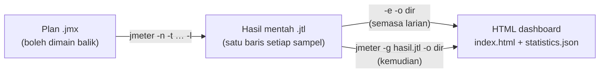
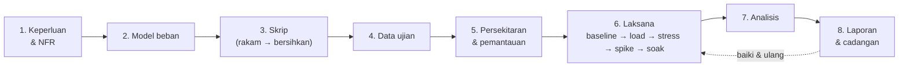

# Hari 2 — Rakam & Main Balik, Laporan Prestasi & Merancang Ujian

[🧪 Lab Hari 2](./snippets/lab.md) · [🎤 Nota Penceramah](./nota-penceramah.md) · [📋 Templat Pelan Ujian](./snippets/templat-pelan-ujian.md) · [📝 Templat Laporan Ujian](./snippets/templat-laporan-ujian.md) · [🗂️ Test plans](./test-plans/) · [⬅️ Hari 1](../hari-1/README.md)

> Pada Hari 1 kita membina plan dengan tangan, merakam satu aliran ringkas, dan melihat main balik rakaman **gagal** (401). Hari ini kita mengikut kitaran kerja seorang jurutera ujian prestasi dari awal hingga akhir: **rancang perjalanan pengguna → rakam → main balik → jadikan boleh dimain balik → jalankan → jana laporan → baca & tafsir setiap angka → tulis dapatan → rancang ujian sebenar**. Fokus utama: **laporan** (setiap bahagian HTML dashboard JMeter 5.6 dan istilahnya) dan **cara merancang** ujian prestasi. Hasil hari ini: plan rakaman anda sendiri yang boleh dimain balik, laporan HTML yang anda boleh terangkan baris demi baris, tiga dapatan bertulis, dan satu pelan ujian lengkap.

> ⚠️ **Etika — masih localhost sahaja.** JMeter ialah penjana beban. Menghalakannya ke sistem pengeluaran/awam (termasuk portal JPJ sebenar) **tanpa kebenaran bertulis** = serangan DoS dan menyalahi undang-undang. Setiap rakaman dan larian hari ini menyasarkan `http://localhost:3000` — **Portal eJPJ (tiruan)** dalam `sut/`. Semua data **sintetik**, bukan data rasmi JPJ.

**Apa yang akan dibina:**
- Rakaman aliran **log masuk → senarai kenderaan → semak cukai → bayar cukai**, dikumpul mengikut tindakan pengguna (Transaction Controller)
- Diagnosis main balik yang gagal (401/403) dan pembaikan: **korelasi**, **parameterisasi**, nama sampler, **think time**, **assertion** → plan bersih setara `05-transaksi-penuh.jmx`
- **HTML dashboard** daripada larian, dibaca bahagian demi bahagian, dengan **glosari istilah** yang lengkap
- Senario puncak `07-beban-puncak-cukai.jmx` + SLA → **tiga dapatan** dalam templat laporan
- **Pelan ujian prestasi** (NFR, model beban dengan **Little's Law**, campuran transaksi, kriteria, pemantauan, risiko, kebenaran)

---

## 🎯 Objektif Pembelajaran

Di akhir hari ini, peserta boleh:

| # | Objektif (boleh diukur) | Sesi | Bukti |
|---|------------------------|------|-------|
| O1 | **Merancang** perjalanan pengguna 4 langkah dan **merakamnya** dengan HTTP(S) Test Script Recorder (port 8888) ke dalam Transaction Controller bernama mengikut tindakan | S1 | Latihan 1: Recording Controller mengandungi 4 sampler `/api/...` dalam 4 kumpulan, tiada aset statik |
| O2 | **Mendiagnosis** main balik yang gagal dengan View Results Tree dan **membezakan** 401 (token) dengan 403 (csrf) | S1 | Latihan 2: 200 / 401 / 200 / 401 selepas SUT dimulakan semula; eksperimen token sahaja dikorelasi → 403 |
| O3 | **Membaiki** rakaman dengan korelasi `token` + `csrf` (JSON Extractor) dan parameterisasi CSV `pengguna.csv` | S2 | Latihan 3: Debug Sampler menunjukkan `token` (UUID) + `csrf` (32 hex) bagi 3 pengguna berbeza |
| O4 | **Menghasilkan** plan boleh dimain balik (nama bermakna, Transaction Controller, think time, assertion) setara `05-transaksi-penuh.jmx` | S2 | Latihan 3: 10 pengguna × 2 gelung → 80 sampel HTTP + 20 baris transaksi dalam Aggregate Report, Error % ≈ 0 |
| O5 | **Menjana** HTML dashboard dengan `-e -o` dan `-g … -o`, serta **melaras** butiran graf/ambang APDEX dengan `-J` | S3 | Latihan 4: `index.html` dibuka; dashboard kedua dijana daripada `.jtl` yang sama |
| O6 | **Mentafsir** setiap bahagian dashboard (APDEX, Statistics, Errors, Over Time, Throughput, Response Times) menggunakan istilah yang betul | S3 | Latihan 4: lembaran kerja dengan nilai sebenar dan tafsiran bagi setiap bahagian |
| O7 | **Menilai** larian puncak terhadap SLA dan **menulis** dapatan (bukti → kesan → punca → cadangan) | S3 | Latihan 5: tiga dapatan dalam `templat-laporan-ujian.md` (SLA 2000 vs 150 ms) |
| O8 | **Merancang** ujian prestasi: NFR boleh diukur, model beban dengan **Little's Law** (N = X × (R + Z)), jenis larian, kriteria masuk/keluar, pemantauan, risiko, kebenaran | S4 | Latihan 6: `templat-pelan-ujian.md` diisi + pengiraan N dan pacing |
| O9 | **Membentangkan** pelan ujian dan satu dapatan laporan dalam 3 minit | S4 | Latihan 7: pembentangan mini berpasangan |

---

## 📅 Jadual Hari Ini

| Masa | Sesi | Aktiviti | Fokus |
|------|------|----------|-------|
| 9.00 – 10.30 pagi | S1 | **Rakam & main balik (record → playback)** | Imbas kembali Hari 1 (10 minit) · rancang perjalanan pengguna · `rakam-template.jmx` (proxy 8888, Recording Controller, kumpulan → Transaction Controller, Excludes, think time `${T}`) · main balik → 401/403 · Lab 1 & 2 |
| 10.30 – 10.45 pagi | — | Rehat | |
| 10.45 – 1.00 tgh | S2 | **Jadikan rakaman boleh dimain balik** | Korelasi (JSON / Regex / Boundary) · parameterisasi CSV · nama sampler · Transaction Controller · think time · assertion · Summary & Aggregate Report · ⭐ ForEach / JSR223 · Lab 3 |
| 1.00 – 2.00 ptg | — | Makan tengah hari | |
| 2.00 – 3.30 ptg | S3 | **Laporan & istilah (deep dive)** | `.jtl` → HTML dashboard · setiap bahagian dashboard JMeter 5.6 · GUI listeners · glosari istilah · corak tafsiran · senario puncak `07` + SLA · Lab 4 & 5 |
| 3.30 – 3.45 ptg | — | Rehat | |
| 3.45 – 5.00 ptg | S4 | **Merancang ujian prestasi** | Kitaran hayat ujian · NFR · model beban & Little's Law · pacing · baseline/load/stress/spike/soak · kriteria, pemantauan, risiko, etika · Lab 6 & 7 · ⭐ CI, distributed, Grafana · penutup |

> 💡 **Borang penilaian kursus** dalam pelatih.my dibuka **2.00 ptg** — lihat penutup S4.

---

## 🧭 Kenapa hari ini penting

Laporan ujian prestasi ialah **produk** sebenar kerja anda — pengurusan tidak membaca `.jmx`, mereka membaca keputusan: *"Bolehkah portal menampung hari kenaikan harga cukai?"* Laporan yang salah dibaca lebih berbahaya daripada tiada laporan.

| Tanpa hari ini | Dengan hari ini |
|----------------|-----------------|
| Rakaman dimain balik → 401/403, "ujian" hanya mengukur halaman ralat | Rakaman dibersihkan: **korelasi**, **CSV**, **think time**, **assertion** |
| "Purata 300 ms, OK!" | **95th percentile**, Error %, APDEX — dan tahu bila setiap satu menipu |
| Tangkap layar dashboard tanpa penjelasan | Setiap bahagian dashboard dibaca dengan istilah yang betul |
| "Sistem nampak OK" | **Dapatan** bertulis: bukti → kesan → punca → cadangan |
| "Cuba 1000 pengguna" | Bilangan pengguna **dikira** daripada volum perniagaan dengan **Little's Law** |
| Ujian sekali-sekala tanpa pelan | **Pelan ujian**: NFR, model beban, jenis larian, kriteria, pemantauan, kebenaran |

---

## 🧰 Persediaan

Pastikan pelayan tiruan berjalan (dari akar repo) — **Terminal A, jangan tutup sepanjang hari**:

```bash
node sut/server.js
# Portal eJPJ (TIRUAN) berjalan di  http://localhost:3000
#   Latensi tiruan : 40-180 ms
#   Kadar ralat    : 1.0%
```

Semak: buka <http://localhost:3000/api/health> → `{"status":"ok",...}`. Buka JMeter GUI (`jmeter`).

| Plan | Guna hari ini | Beban lalai |
|------|---------------|-------------|
| [`hari-1/test-plans/rakam-template.jmx`](../hari-1/test-plans/rakam-template.jmx) | Templat perakam (S1) — HTTP(S) Test Script Recorder port 8888 + Recording Controller | 1 pengguna, 1 gelung |
| [`hari-1/test-plans/04-rakaman-mentah.jmx`](../hari-1/test-plans/04-rakaman-mentah.jmx) | Rakaman "mentah" sandaran (S1) — sengaja gagal | 1 pengguna, 1 gelung |
| [`04-korelasi-log-masuk.jmx`](./test-plans/04-korelasi-log-masuk.jmx) | Rujukan korelasi `token` + `csrf` (S2) | 5 pengguna, ramp 3s, 3 gelung |
| [`05-transaksi-penuh.jmx`](./test-plans/05-transaksi-penuh.jmx) | **Kunci jawapan** rakaman yang dibersihkan (S2) + sumber dashboard pertama (S3) | 10 pengguna, ramp 10s, 2 gelung |
| [`06-ujian-beban-nogui.jmx`](./test-plans/06-ujian-beban-nogui.jmx) | Beban non-GUI melalui `run/run-nogui.sh` (pilihan) | `${__P(pengguna,50)}`, `${__P(rampup,30)}`, `${__P(tempoh,120)}` s |
| [`07-beban-puncak-cukai.jmx`](./test-plans/07-beban-puncak-cukai.jmx) | Senario puncak + SLA `${__P(sla_ms,2000)}` (S3, S4) | `${__P(pengguna,300)}`, ramp 30s, 300s |
| [`08-foreach-kenderaan.jmx`](./test-plans/08-foreach-kenderaan.jmx) | ⭐ ForEach: bayar cukai **semua** kenderaan (S2 pilihan) | 3 pengguna, ramp 3s, 1 gelung |

> 💡 Hari ini kita menjalankan `07` dengan **`-Jpengguna=50 -Jrampup=10 -Jtempoh=60`** (≈ 1 minit) supaya muat dalam masa kelas dan laptop. Lalai 300 pengguna × 300 s adalah untuk mesin yang lebih kuat.

---

## S1 — Rakam & Main Balik (9.00 – 10.30 pagi)

### 1.1 Imbas kembali Hari 1 (10 minit)

Hari 1 diajar pada 21 Sep — mari panaskan semula tangan.

1. Buka `hari-1/test-plans/04-rakaman-mentah.jmx`. **Sebelum Start**, klik **HTTP Request Defaults** → Server `localhost`, Port `3000`, Protocol `http`. (Peraturan kelas: setiap plan yang dibuka — semak sasaran dahulu.)
2. Start ▶. Dalam View Results Tree: `/api/log-masuk` hijau, `/api/kenderaan` dan `…/bayar-cukai` merah.

| Soalan | Jawapan ringkas |
|--------|-----------------|
| Port proxy perakam JMeter? | **8888** (SUT ialah 3000) |
| Kenapa main balik gagal 401? | Token dalam header `Authorization` ialah nilai **lama** dari sesi rakaman |
| Average atau percentile untuk SLA? | **Percentile** (90/95/99) |
| Kenapa tiada View Results Tree semasa beban? | Menyimpan setiap respons dalam RAM → penjana beban sesak, angka tidak tepat |

### 1.2 Rancang dahulu, baru rakam

Rakaman yang baik bermula **di atas kertas**. Tentukan perjalanan pengguna, nama transaksi, dan data yang akan berubah — **sebelum** menekan Start.

| Langkah | Tindakan pengguna | Permintaan HTTP | Nama transaksi | Data yang dijangka dinamik |
|---------|-------------------|-----------------|----------------|----------------------------|
| 1 | Log masuk dengan No. KP | `POST /api/log-masuk` | `T01_LogMasuk` | Respons: `token`, `csrf` (dijana pelayan) · Input: `no_kp`, `kata_laluan` |
| 2 | Lihat senarai kenderaan | `GET /api/kenderaan?no_kp=…` | `T02_SenaraiKenderaan` | Header `Authorization: Bearer <token>` |
| 3 | Semak cukai (sebut harga) | `GET /api/kenderaan/WXY1234/cukai` | `T03_SemakCukai` | `no_pendaftaran`, respons `amaun`, `tempoh_bulan` |
| 4 | Bayar cukai | `POST /api/kenderaan/WXY1234/bayar-cukai` | `T04_BayarCukai` | Header token + badan `csrf`, `amaun` |

> **Konsep — satu tindakan pengguna = satu transaksi:** Dalam portal sebenar, satu klik ("Log masuk") boleh menjana 10–50 permintaan (HTML, API, imej). Pengguna tidak peduli permintaan mana yang lambat — mereka rasa **masa klik itu**. Maka kita kumpulkan permintaan mengikut tindakan dalam **Transaction Controller**, dan namakan dengan konvensyen yang mudah diisih (`T01_…`, `T02_…`). Dalam SUT kita setiap tindakan kebetulan hanya satu permintaan.

> 💡 **Konvensyen nama** yang baik: nombor langkah + tindakan perniagaan, tanpa ruang pelik (`T03_SemakCukai`). Nama ini akan muncul sebagai **label** dalam setiap laporan hari ini.

### 1.3 Sediakan perakam — `rakam-template.jmx`

**File → Open →** [`hari-1/test-plans/rakam-template.jmx`](../hari-1/test-plans/rakam-template.jmx). **File → Save As** → `hari-2/test-plans/latihan-01-rakaman.jmx` (supaya fail asal tidak berubah, dan laluan CSV `../data/…` sah pada S2).

Pokok ujian: **Thread Group → Recording Controller** (destinasi), **View Results Tree**, dan **HTTP(S) Test Script Recorder** (port `8888`). Klik perakam dan laras:

| Tab / medan | Tetapan | Mengapa |
|-------------|---------|---------|
| **Test Plan Creation → Target Controller** | `Test Plan > Thread Group > Recording Controller` | Di mana sampler dirakam |
| **Test Plan Creation → Grouping** | **Put each group in a new transaction controller** | Setiap "klik" (kumpulan permintaan) menjadi satu Transaction Controller. Templat asal: *Add separators between groups* |
| **Create new transaction after request (ms)** | Biarkan kosong (lalai property `proxy.pause` = **5000 ms**) | Jurang **≥ 5 s** antara permintaan = kumpulan baharu. Maka **tunggu > 5 s** antara langkah semasa merakam |
| **Capture HTTP Headers** | Ditanda | Header Manager ditambah pada setiap sampler |
| **Requests Filtering → URL Patterns to Exclude** | Sudah ada: `(?i).*\.(bmp\|css\|js\|gif\|ico\|jpe?g\|png\|swf\|eot\|otf\|ttf\|mp4\|woff\|woff2)([?;].*)?` · Tambah (untuk laman sebenar): `.*google-analytics.*`, `.*googletagmanager.*`, `.*/collect.*` | Aset statik & analitik bukan beban yang anda ukur — dan analitik ialah **pihak ketiga** |
| **Requests Filtering → URL Patterns to Include** | Kosong (atau `localhost:3000.*` untuk merakam hos ini sahaja) | Jika diisi, **hanya** URL yang padan dirakam |

**Rakam think time (pilihan, disyorkan):** Klik kanan **HTTP(S) Test Script Recorder → Add → Timer → Constant Timer**, Thread Delay = **`${T}`**. Semasa rakaman, JMeter menyalin timer ini ke dalam sampler pertama setiap kumpulan dan menggantikan `${T}` dengan **jurang masa sebenar (ms) sejak permintaan sebelumnya**. Anda dapat think time sebenar pengguna — yang kemudian kita jadikan rawak pada S2.

**Namakan transaksi semasa merakam:** Selepas **Start**, tetingkap kecil **Recorder: Transactions Control** muncul (medan *Prefix*, *Naming scheme*, *Create new transaction after request (ms)*, *Counter start value*). Taip nama (cth. `T01_LogMasuk`) dalam medan prefix **sebelum** setiap langkah — prefix itu menjadi nama Transaction Controller kumpulan tersebut dan awalan nama sampler. Jika terlupa, namakan semula controller selepas rakaman (pilih elemen → edit medan **Name**).

> **Konsep — HTTP Request Defaults semasa merakam:** Jika anda menambah **HTTP Request Defaults** (`localhost` / `3000`) di bawah Thread Group **sebelum** merakam, perakam membiarkan medan Server/Port sampler **kosong** (kerana nilai lalai sudah ada). Hasilnya plan yang lebih bersih — satu tempat untuk menukar hos.

> **HTTPS?** SUT kita `http://`, jadi **sijil CA tidak diperlukan**. Untuk sistem HTTPS (yang anda dibenarkan) ikut [`hari-1/snippets/rakaman-https-setup.md`](../hari-1/snippets/rakaman-https-setup.md) — `ApacheJMeterTemporaryRootCA.crt`, sah 7 hari, buang selepas selesai.

### 1.4 Rakam aliran 4 langkah

1. Klik **Start** ▶ pada perakam. Sahkan proxy hidup: `lsof -iTCP:8888 -sTCP:LISTEN -n -P` (macOS/Linux) atau `netstat -ano | findstr :8888` (Windows).
2. Jana trafik **melalui proxy**. SUT ini ialah API (POST JSON), jadi kita guna `curl -x` (Windows: guna **Git Bash**). Taip/tampal satu blok pada satu masa dan **tunggu > 5 s** di antara blok (atau guna `sleep 6`):

```bash
P=http://localhost:8888          # proxy perakam JMeter
B=http://localhost:3000          # SUT tiruan

# --- T01_LogMasuk ---
R=$(curl -s -x $P -H 'Content-Type: application/json' \
  -d '{"no_kp":"800101015500","kata_laluan":"rahsia123"}' $B/api/log-masuk)
echo "$R"
TOKEN=$(echo "$R" | sed -E 's/.*"token":"([^"]+)".*/\1/')
CSRF=$(echo "$R"  | sed -E 's/.*"csrf":"([^"]+)".*/\1/')
sleep 6

# --- T02_SenaraiKenderaan ---
curl -s -x $P -H "Authorization: Bearer $TOKEN" "$B/api/kenderaan?no_kp=800101015500"; echo
sleep 6

# --- T03_SemakCukai ---
curl -s -x $P "$B/api/kenderaan/WXY1234/cukai"; echo
sleep 6

# --- T04_BayarCukai ---
curl -s -x $P -H "Authorization: Bearer $TOKEN" -H 'Content-Type: application/json' \
  -d "{\"csrf\":\"$CSRF\",\"tempoh_bulan\":12,\"amaun\":90}" \
  $B/api/kenderaan/WXY1234/bayar-cukai; echo
# respons terakhir: {"no_resit":"RJPJ…","status":"BERJAYA",…}
```

3. Klik **Stop** ⏹. **File → Save**.

> **Kenapa curl, bukan pelayar?** Proxy merakam **mana-mana** klien HTTP. Halaman `http://localhost:3000` SUT hanya halaman info (tiada borang log masuk), jadi pelayar tidak boleh menghasilkan POST JSON ini. Untuk aplikasi web sebenar, guna Firefox dengan proxy `localhost:8888` (Hari 1 §4.3) — dan ingat kosongkan `localhost, 127.0.0.1` dari *No proxy for*.

> ⚠️ `curl: (7) Failed to connect to localhost port 8888` = perakam belum **Start**. Tiada apa dirakam walaupun curl berjaya = anda terlupa `-x $P`.

### 1.5 Apa yang perakam hasilkan

Kembangkan Recording Controller. Anda sepatutnya nampak empat kumpulan (Transaction Controller), setiap satu dengan satu sampler:

| Perkara dalam rakaman | Contoh | Kenapa penting |
|-----------------------|--------|----------------|
| Nama sampler = **prefix + path + nombor turutan** (Naming scheme *Prefix*) | `T01_LogMasuk/api/log-masuk-1`; tanpa prefix: `/api/log-masuk-1`, `/api/kenderaan-2`, … | Nama ini menjadi label laporan — kita namakan semula pada S2. (Naming scheme *Transaction name* memberi `T01_LogMasuk-1`.) |
| **Header Manager** setiap sampler | `Content-Type`, `Accept`, `User-Agent: curl/…` | Perakam menangkap header klien |
| Header **`Authorization: Bearer <token-rakaman>`** | Nilai UUID sesi rakaman, **dikeras-kod** | Untuk skema `Bearer`, JMeter 5.6 mengekalkan header ini dengan nilai literal. (Header `Cookie` pula **sentiasa dibuang** — aplikasi berasaskan cookie memerlukan **HTTP Cookie Manager**.) |
| Badan JSON **literal** | `"no_kp": "800101015500"`, `"csrf": "<csrf-rakaman>"`, path `WXY1234` | Semua data dibekukan — satu pengguna, satu kenderaan, satu sesi |
| **Constant Timer** `${T}` → nombor | cth. `6012` ms | Think time sebenar anda semasa merakam |

> **Konsep — rakaman ialah titik mula, bukan produk siap.** Perakam tidak tahu nilai mana yang dinamik. Ia menyalin apa yang dilihat.

### 1.6 Main balik (playback)

1. Tambah **View Results Tree** (jika belum) — sudah ada dalam templat.
2. **Luputkan sesi rakaman dahulu:** di Terminal A tekan **Ctrl+C**, kemudian `node sut/server.js` semula. (SUT menyimpan sesi dalam memori; restart = semua token lama tidak sah, seperti tamat tempoh sesi pada sistem sebenar.)
3. **Start** ▶.

| Transaksi / sampler | Kod | Sebab |
|---------------------|-----|-------|
| `T01_LogMasuk` — `POST /api/log-masuk` | **200** | Log masuk sentiasa berjaya; pelayan mengeluarkan **token baharu** — tetapi tiada siapa menangkapnya |
| `T02_SenaraiKenderaan` — `GET /api/kenderaan` | **401** | Menghantar token **rakaman** yang sudah tidak wujud → `Token tidak sah atau tamat tempoh` |
| `T03_SemakCukai` — `GET …/WXY1234/cukai` | **200** | Endpoint sebut harga tidak memerlukan token — **lulus walaupun skrip rosak** |
| `T04_BayarCukai` — `POST …/bayar-cukai` | **401** | Token lama ditolak sebelum `csrf` pun disemak |

> ⚠️ **Perangkap "lulus palsu":** Jika anda main balik **tanpa** memulakan semula SUT, semua 4 langkah mungkin **200** — kerana sesi rakaman masih hidup dalam memori mock. Itu bukan kejayaan: 300 pengguna maya akan berkongsi **satu** sesi dan satu `csrf`. Sistem sebenar biasanya menamatkan sesi selepas beberapa minit, jadi skrip ini akan gagal esok pagi. Hijau ≠ betul.

> **Bukti sandaran tanpa GUI:** `jmeter -n -t hari-1/test-plans/04-rakaman-mentah.jmx -l hasil/r04.jtl` → `summary = 3 … Err: 2 (66.67%)` — log masuk 200, `/api/kenderaan` 401, `bayar-cukai` 401 (disahkan dengan JMeter 5.6.3).

### 1.7 Diagnosis: 401 vs 403 dengan View Results Tree

Klik sampler merah dalam View Results Tree dan baca tiga tab mengikut tertib:

| Tab | Apa yang dicari | Contoh |
|-----|-----------------|--------|
| **Sampler result** | `Response code`, `Response message`, masa (`Load time`, `Latency`, `Connect Time`) | `Response code: 401` · `Response message: Unauthorized` |
| **Request** | Apa **sebenarnya** dihantar — header & badan | `Authorization: Bearer <token-rakaman>` (bukan token baharu dari T01) |
| **Response data** | Mesej ralat pelayan | `{"ralat":"Token tidak sah atau tamat tempoh"}` |

**Eksperimen — pisahkan dua punca:** Selepas S2 anda akan mengkorelasi `token`. Jika **hanya** token dikorelasi tetapi `csrf` masih nilai rakaman, bayaran berubah daripada 401 kepada **403** `{"ralat":"Token CSRF tidak sah — sila log masuk semula"}` (disahkan terhadap SUT).

| Kod | Maksud dalam SUT | Punca dalam skrip | Pembaikan |
|-----|------------------|-------------------|-----------|
| **401** Unauthorized | *Siapa anda?* — token tiada/tidak sah | Header `Authorization` dikeras-kod/hilang | Ekstrak `token` → `Bearer ${token}` |
| **403** Forbidden | *Adakah permintaan ini sah?* — token sah tetapi `csrf` salah | Badan `csrf` dikeras-kod | Ekstrak `csrf` → `"csrf": "${csrf}"` |
| **404** Not Found | Laluan/kenderaan tidak wujud | Path salah, atau `${no_pendaftaran}` tidak diganti (`NONE`) | Semak extractor / CSV |

> **Konsep — main balik ialah ujian fungsian dahulu.** Sebelum menambah beban, plan mesti lulus **1 pengguna × 1 gelung** dengan 0 ralat (kecuali ralat yang dijangka). Beban pada skrip rosak hanya mengukur kelajuan halaman ralat.

### 🎯 Kuiz S1

1. Anda merakam dengan *Grouping = Put each group in a new transaction controller*, tetapi keempat-empat permintaan masuk ke dalam **satu** Transaction Controller. Punca paling mungkin?
   - [ ] Port perakam bukan 8888
   - [x] Jurang antara permintaan kurang daripada 5 s (`proxy.pause`), jadi semuanya dianggap satu "klik"
   - [ ] Recording Controller diletak di bawah Test Plan
   - [ ] Capture HTTP Headers tidak ditanda
   > Perakam memulakan kumpulan baharu hanya jika jurang ≥ `proxy.pause` (lalai 5000 ms). Tunggu > 5 s antara langkah, atau namakan transaksi melalui dialog *Recorder: Transactions Control*.

2. Apakah tujuan Constant Timer bernilai `${T}` di bawah HTTP(S) Test Script Recorder?
   - [ ] Mengehadkan rakaman kepada T saat
   - [x] Menyalin timer ke rakaman dengan `${T}` digantikan oleh jurang masa sebenar sejak permintaan sebelumnya (think time pengguna)
   - [ ] Menambah Duration Assertion T ms
   - [ ] Menetapkan tempoh sah sijil CA
   > Ini cara merakam think time sebenar. Pada S2 kita menggantikannya dengan timer rawak supaya pengguna maya tidak bergerak serentak.

3. Main balik rakaman **tanpa** memulakan semula SUT memberi 4 × 200. Apakah kesimpulan yang betul?
   - [ ] Skrip sedia untuk ujian beban
   - [ ] Korelasi tidak diperlukan untuk SUT ini
   - [x] Ia "lulus palsu" — sesi rakaman masih hidup; semua pengguna maya akan berkongsi satu token/csrf yang akan tamat tempoh
   - [ ] JMeter telah mengkorelasi token secara automatik
   > Perakam tidak mengkorelasi apa-apa. Mulakan semula SUT (atau tunggu sesi tamat) untuk membuktikan skrip benar-benar bebas daripada sesi rakaman.

4. Selepas `token` dikorelasi, `GET /api/kenderaan` menjadi 200 tetapi `bayar-cukai` memulangkan **403**. Apakah yang masih dikeras-kod?
   - [ ] `no_kp` dalam query string
   - [ ] Header `Content-Type`
   - [x] Nilai `csrf` dalam badan permintaan bayar
   - [ ] Port HTTP Request Defaults
   > 403 dalam SUT = token sah tetapi `csrf` tidak sepadan dengan sesi. Ekstrak `csrf` bersama `token` dari respons log masuk.

---

## S2 — Jadikan Rakaman Boleh Dimain Balik (10.45 – 1.00 tgh)

### 2.1 Senarai semak "bersihkan rakaman"

| # | Masalah dalam rakaman | Pembaikan | Elemen JMeter |
|---|----------------------|-----------|---------------|
| 1 | Hos/port berulang dalam setiap sampler | Satu tempat untuk sasaran | **HTTP Request Defaults** (`localhost` / `3000`) |
| 2 | Nama `/api/log-masuk-1` | Nama bermakna = label laporan | Rename: `1. POST /api/log-masuk` |
| 3 | `token` & `csrf` dikeras-kod | **Korelasi** | **JSON Extractor** (atau Regex / Boundary) |
| 4 | Satu pengguna `800101015500` sahaja | **Parameterisasi** | **CSV Data Set Config** `pengguna.csv` |
| 5 | Kenderaan `WXY1234` dikeras-kod | Korelasi berantai dari respons senarai | JSON Extractor `$.kenderaan[0].no_pendaftaran` |
| 6 | `"amaun": 90` dikeras-kod | Ambil dari respons | JSON Extractor (senarai atau sebut harga) |
| 7 | Timer `${T}` = jurang menaip anda (cth. 6012 ms, sama setiap pengguna) | Think time **rawak** realistik | **Uniform Random Timer** |
| 8 | Tiada semakan kandungan — 200 dengan mesej ralat dikira "lulus" | **Assertion** | Response Assertion `BERJAYA` |
| 9 | Kumpulan per-langkah | Transaksi **perniagaan** penuh | **Transaction Controller** `Pembaharuan Cukai Jalan` |
| 10 | Header `User-Agent: curl/…` & `Accept` | Pilihan — tidak menjejaskan SUT ini | Buang atau biarkan |

> Hasil akhir sesi ini setara dengan [`test-plans/05-transaksi-penuh.jmx`](./test-plans/05-transaksi-penuh.jmx) — buka ia di tab lain sebagai **kunci jawapan**.

### 2.2 Parameterisasi vs korelasi

| | Parameterisasi | Korelasi |
|-|----------------|----------|
| Sumber data | **Anda** (CSV, User Defined Variables) | **Pelayan**, pada masa larian |
| Contoh | `no_kp`, `kata_laluan` dari `pengguna.csv` | `token`, `csrf` dari respons log masuk; `no_pendaftaran`, `amaun` dari respons senarai |
| Elemen JMeter | CSV Data Set Config | Post Processor: JSON / Regular Expression / Boundary Extractor |
| Diketahui sebelum ujian? | Ya | Tidak |

> **Konsep:** Kedua-duanya diperlukan. `pengguna.csv` memberi **siapa** yang log masuk; extractor memberi **sesi** pengguna itu.

### 2.3 Korelasi `token` + `csrf`

1. **Klik kanan `T01_LogMasuk` → sampler log masuk → Add → Post Processors → JSON Extractor** (`Ekstrak token + csrf`):
   - **Names of created variables:** `token;csrf`
   - **JSON Path expressions:** `$.token;$.csrf`
   - **Match No. (0 for Random):** `1;1` · **Default Values:** `TOKEN_TAK_JUMPA;CSRF_TAK_JUMPA`
2. Dalam **Header Manager** sampler senarai dan bayar: tukar nilai `Authorization` kepada `Bearer ${token}`.
3. Dalam badan sampler bayar: `"csrf": "${csrf}"`.


| Extractor | Bila guna | Konfigurasi setara untuk `token` |
|-----------|-----------|----------------------------------|
| **JSON Extractor** | Respons JSON (API moden) — paling bersih | `$.token` |
| **Regular Expression Extractor** | Mana-mana teks/HTML/header | Regular Expression `"token":"([^"]+)"` · Template `$1$` · Match No. `1` |
| **Boundary Extractor** | Sempadan kiri/kanan jelas — paling mudah dibaca | Left Boundary `"token":"` · Right Boundary `"` |

> **Konsep — skop extractor:** Letak extractor sebagai **anak** sampler log masuk. Di bawah Thread Group, ia berjalan selepas **setiap** sampler dan menimpa `token` dengan nilai default.

> **Konsep — Default Value yang ketara:** `TOKEN_TAK_JUMPA` dalam tab **Request** = korelasi rosak, serta-merta kelihatan. Aliran nyahpepijat: (1) Response data log masuk — adakah `token` wujud? (2) View Results Tree → paparan **JSON Path Tester** → uji `$.token`. (3) **Debug Sampler** (JMeter variables = True) → `token=…`, `csrf=…`. (4) Tab **Request** sampler seterusnya.

> **Konsep — pembolehubah per-thread:** `${token}` disimpan dalam `vars` **thread itu sahaja**. 300 pengguna maya = 300 token berbeza — seperti 300 rakyat sebenar.

### 2.4 Korelasi berantai: kenderaan & amaun

Rakaman membekukan `WXY1234` dan `90`. Pengguna lain tidak memiliki `WXY1234`. Ambil kedua-duanya dari respons senarai:

- **Klik kanan sampler senarai → Add → Post Processors → JSON Extractor** (`Ekstrak kenderaan pertama`): Names `no_pendaftaran;amaun` · Paths `$.kenderaan[0].no_pendaftaran;$.kenderaan[0].amaun_cukai` · Match No. `1;1` · Default `NONE;0`.
- Path sampler sebut harga → `/api/kenderaan/${no_pendaftaran}/cukai`; path bayar → `/api/kenderaan/${no_pendaftaran}/bayar-cukai`; badan → `{ "csrf": "${csrf}", "tempoh_bulan": 12, "amaun": ${amaun} }`.

> 💡 Plan `07` mengambil `amaun` + `tempoh_bulan` dari **sebut harga** (`$.amaun;$.tempoh_bulan`) — lebih realistik, kerana pengguna membayar amaun yang dipaparkan.

### 2.5 Parameterisasi dengan CSV

**Klik kanan Thread Group → Add → Config Element → CSV Data Set Config**: Filename `../data/pengguna.csv`, Variable Names `no_kp,kata_laluan`, Ignore first line `True`, Recycle on EOF `True`, Sharing mode `All threads`. Kemudian ganti dalam rakaman:

- Badan log masuk: `{ "no_kp": "${no_kp}", "kata_laluan": "${kata_laluan}" }`
- Parameter senarai: `no_kp` = `${no_kp}`

> ⚠️ Laluan CSV **relatif kepada fail `.jmx`**. Simpan plan dalam `hari-2/test-plans/` — jika tidak, `${no_kp}` dihantar secara literal.

### 2.6 Nama sampler & Transaction Controller

1. Namakan semula sampler: `1. POST /api/log-masuk`, `2. GET /api/kenderaan`, `3. GET /api/kenderaan/${no_pendaftaran}/cukai`, `4. POST /api/kenderaan/${no_pendaftaran}/bayar-cukai`.
2. **Klik kanan Thread Group → Add → Logic Controller → Transaction Controller** `Pembaharuan Cukai Jalan`, seret keempat-empat sampler **ke dalamnya**. Controller kumpulan `T01…T04` yang kosong boleh dipadam — atau dikekalkan jika anda mahu satu baris setiap tindakan (dalam aplikasi web sebenar, setiap tindakan biasanya banyak permintaan, jadi ia sangat berguna).

| Pilihan Transaction Controller | Kesan dalam laporan |
|--------------------------------|---------------------|
| **Generate parent sample** tidak ditanda (plan rujukan) | Baris transaksi **dan** baris setiap sampler — terbaik untuk mencari langkah lambat |
| **Generate parent sample** ditanda | Sampler menjadi sub-sampel; laporan hanya memaparkan baris transaksi |
| **Include duration of timer and pre-post processors in generated sample** | Jika ditanda, think time termasuk dalam masa transaksi. Plan rujukan **tidak** menandanya — kita mengukur masa sistem, bukan masa pengguna berfikir |

> **Konsep — label dinamik:** Nama `4. POST /api/kenderaan/${no_pendaftaran}/bayar-cukai` menghasilkan **satu baris per kenderaan** dalam laporan (`…/WXY1234/…`, `…/JQK7788/…`, `…/BMT3030/…`). Baik untuk analisis per-data; untuk laporan pengurusan, guna nama statik (`4. POST bayar-cukai`) atau baca baris **transaksi**.

### 2.7 Think time

Padam Constant Timer `${T}` hasil rakaman. **Klik kanan Transaction Controller → Add → Timer → Uniform Random Timer** (`Think Time (1-3s)`): Constant Delay Offset `1000`, Random Delay Maximum `2000` → setiap jeda 1–3 s.

> **Konsep — skop timer:** Timer berjalan **sebelum setiap sampler dalam skopnya**. Di bawah Transaction Controller dengan 4 sampler → **4 jeda** setiap lelaran (purata 4 × 2 s = 8 s). Kita akan guna fakta ini dalam pengiraan Little's Law (S4).

### 2.8 Assertion & If Controller

- **Klik kanan sampler bayar → Add → Assertions → Response Assertion**: Field to Test *Text Response*, Pattern Matching Rules *Substring*, pattern `BERJAYA`.
- **(Disyorkan)** Bungkus sampler 3 & 4 dalam **If Controller** `Jika ada kenderaan`, Condition `${__groovy(vars.get("no_pendaftaran") != "NONE" && vars.get("token") != "TOKEN_TAK_JUMPA")}` — supaya tiada bayaran palsu dihantar apabila log masuk gagal atau pengguna tiada kenderaan.

> **Konsep — tanpa assertion, 200 = lulus.** JMeter hanya menanda gagal untuk kod 4xx/5xx/ralat rangkaian. Respons 200 dengan `{"status":"GAGAL"}` dikira berjaya — kecuali anda menambah assertion.

### 2.9 Jalankan & baca Summary / Aggregate Report

Thread Group: Number of Threads `10`, Ramp-up `10`, Loop Count `2`. Tambah **Summary Report** dan **Aggregate Report**; **nyahdayakan** View Results Tree (klik kanan → Disable). Start.

Keputusan dijangka (disahkan dengan `05-transaksi-penuh.jmx`, JMeter 5.6.3): **80 sampel HTTP** (10 × 2 × 4) + **20 baris transaksi** `Pembaharuan Cukai Jalan`, Error % 0 (sekali-sekala 1 bayaran gagal 500 — `ERROR_RATE` 1% SUT). Masa transaksi ≈ jumlah 4 langkah (≈ 440 ms), **tanpa** think time.

| Lajur | Summary Report | Aggregate Report |
|-------|:--------------:|:----------------:|
| `Label`, `# Samples`, `Average`, `Min`, `Max`, `Error %`, `Throughput`, `Received KB/sec`, `Sent KB/sec` | ✅ | ✅ |
| `Median`, `90% Line`, `95% Line`, `99% Line` | — | ✅ |
| `Std. Dev.`, `Avg. Bytes` | ✅ | — |

> 💡 Ingat: Aggregate Report menyebut `90% Line`; HTML dashboard menyebut `90th pct`. Konsep sama — **percentile**.

### 2.10 ⭐ Pilihan: ForEach & JSR223 Groovy (sekilas)

- **ForEach** — bayar cukai **semua** kenderaan: JSON Extractor `$.kenderaan[*].no_pendaftaran`, **Match No. `-1`** (mencipta `no_pendaftaran_1`, `_2`, … `_matchNr`) → **ForEach Controller** (Input variable prefix `no_pendaftaran`, Output variable name `no_semasa`, **Add "_" before number?** ditanda). Rujuk [`08-foreach-kenderaan.jmx`](./test-plans/08-foreach-kenderaan.jmx): 3 pengguna → 5 bayaran, 16 sampel HTTP, 0 ralat.
- **JSR223 (Groovy)** — logik tersuai: guna Groovy + tanda **Cache compiled script if available**, baca pembolehubah dengan `vars.get("token")` (bukan `${token}` dalam skrip). Contoh siap: [`snippets/jsr223-groovy.groovy`](./snippets/jsr223-groovy.groovy).
- **Fungsi berguna:** `${__P(pengguna,50)}` (property dari `-J`), `${__UUID}`, `${__Random(1,1000)}`, `${__time(yyyy-MM-dd)}`.

### 🎯 Kuiz S2

1. Manakah nilai yang mesti **dikorelasi** (bukan diparameter dari CSV) dalam rakaman eJPJ?
   - [ ] `no_kp` dan `kata_laluan`
   - [x] `token` dan `csrf`
   - [ ] Port `3000`
   - [ ] Header `Content-Type`
   > `token` dan `csrf` dijana oleh pelayan pada setiap log masuk; hanya extractor yang boleh menangkapnya pada masa larian.

2. JSON Extractor untuk `token` diletak terus di bawah Thread Group (bukan anak sampler log masuk). Apakah kesannya?
   - [ ] Tiada kesan — skop extractor sentiasa global
   - [x] Ia berjalan selepas setiap sampler dan menimpa `token` dengan default apabila respons lain tiada `$.token`
   - [ ] JMeter enggan menyimpan plan
   - [ ] Token diekstrak dua kali dan digabungkan
   > Skop mengikut kedudukan. Post Processor anak sampler hanya berjalan selepas sampler itu.

3. Uniform Random Timer (offset 1000 ms, maksimum rawak 2000 ms) diletak di bawah Transaction Controller yang mengandungi 4 sampler. Berapa purata jumlah think time setiap lelaran?
   - [ ] 2 s
   - [ ] 3 s
   - [x] 8 s
   - [ ] 12 s
   > Timer berjalan sebelum **setiap** sampler dalam skop: 4 × purata (1000 + 2000/2) ms = 4 × 2 s = 8 s.

4. Dalam Aggregate Report, baris transaksi `Pembaharuan Cukai Jalan` menunjukkan Average ≈ 440 ms walaupun think time 1–3 s. Mengapa?
   - [ ] Timer tidak berfungsi dalam Transaction Controller
   - [x] *Include duration of timer and pre-post processors* tidak ditanda, jadi masa transaksi hanya jumlah masa 4 sampler
   - [ ] Aggregate Report membuang sampel yang lambat
   - [ ] Think time hanya berjalan dalam mod non-GUI
   > Itulah pilihan yang disengajakan: kita mengukur masa **sistem**. Think time masih berlaku antara permintaan — ia mempengaruhi throughput, bukan masa respons transaksi.

---

## S3 — Laporan & Istilah (2.00 – 3.30 ptg)

### 3.1 Dari larian ke laporan



```bash
# (dari akar repo) folder induk untuk -o MESTI wujud dahulu
mkdir -p hasil                      # Windows: mkdir hasil

# Larian non-GUI + dashboard serta-merta (folder -o MESTI kosong / belum wujud)
jmeter -n -t hari-2/test-plans/05-transaksi-penuh.jmx -l hasil/r05.jtl -e -o hasil/laporan05

# Jana (semula) dashboard daripada .jtl sedia ada — tanpa menjalankan ujian
jmeter -g hasil/r05.jtl -o hasil/laporan05-b
```

| Bendera | Maksud |
|---------|--------|
| `-n` | Non-GUI |
| `-t <plan.jmx>` | Test plan |
| `-l <fail.jtl>` | Fail hasil mentah (CSV) |
| `-e` | Jana dashboard selepas larian |
| `-o <folder>` | Folder output dashboard — mesti kosong (jika tidak: `Cannot write to '…' as folder is not empty`), dan **folder induknya mesti wujud** (jika tidak: `… as folder does not exist and parent folder is not writable` — JMeter menyemak ini **sebelum** ujian bermula). `-l` pula mencipta foldernya sendiri |
| `-g <fail.jtl>` | Jana dashboard daripada `.jtl` sedia ada (bersama `-o`) |
| `-J<nama>=<nilai>` | Property — untuk `${__P()}` dalam plan **dan** untuk tetapan penjana laporan |

**Tetapan laporan yang berguna (disahkan dengan JMeter 5.6.3):**

| Property | Lalai | Guna |
|----------|-------|------|
| `jmeter.reportgenerator.overall_granularity` | `60000` ms | Saiz selang graf *Over Time* & *Throughput*. Larian 60 s dengan lalai = **1–2 titik sahaja**! Untuk larian kelas: `-Jjmeter.reportgenerator.overall_granularity=5000` (minimum 1000) |
| `jmeter.reportgenerator.apdex_satisfied_threshold` | `500` ms | Ambang T APDEX |
| `jmeter.reportgenerator.apdex_tolerated_threshold` | `1500` ms | Ambang F APDEX |
| `jmeter.reportgenerator.report_title` | `Apache JMeter Dashboard` | Tajuk laporan |

```bash
# Contoh: jana semula dengan graf setiap 5 s dan APDEX 300/1000 ms
jmeter -g hasil/r07.jtl -o hasil/laporan07-5s \
  -Jjmeter.reportgenerator.overall_granularity=5000 \
  -Jjmeter.reportgenerator.apdex_satisfied_threshold=300 \
  -Jjmeter.reportgenerator.apdex_tolerated_threshold=1000
```

**Anatomi `.jtl` (CSV, JMeter 5.6):**

```
timeStamp,elapsed,label,responseCode,responseMessage,threadName,dataType,success,failureMessage,bytes,sentBytes,grpThreads,allThreads,URL,Latency,IdleTime,Connect
1791115262980,141,1. POST /api/log-masuk,200,OK,Pengguna Pembaharuan Cukai 1-1,text,true,,337,241,3,3,http://localhost:3000/api/log-masuk,140,0,10
```

| Lajur | Maksud |
|-------|--------|
| `timeStamp` | Masa mula sampel (epoch ms) |
| `elapsed` | **Response time** (ms) |
| `label` | Nama sampler / transaksi — kunci setiap baris laporan |
| `responseCode`, `responseMessage`, `success`, `failureMessage` | Keputusan; `failureMessage` = mesej assertion yang gagal |
| `bytes`, `sentBytes` | Saiz diterima / dihantar |
| `grpThreads`, `allThreads` | Thread aktif (kumpulan / semua) ketika sampel |
| `Latency`, `Connect` | Masa ke bait pertama; masa sambungan (ms) |
| `IdleTime` | Masa "tidak aktif" dalam sampel transaksi (cth. think time yang tidak dikira) |

> Baris transaksi (Transaction Controller) dalam `.jtl` mempunyai `responseMessage` seperti `Number of samples in transaction : 4, number of failing samples : 0` dan `URL` = `null`.

### 3.2 Dashboard — halaman utama

Buka `index.html`. Menu kiri: **Dashboard**, **Charts** (Over Time · Throughput · Response Times), **Customs Graphs**.

#### a) Test and Report information

| Medan | Isi | Semak |
|-------|-----|-------|
| **Source file** | Nama `.jtl` | Laporan yang betul? |
| **Start Time / End Time** | Tempoh larian | Sama dengan tempoh dirancang? Larian yang berhenti awal = amaran |
| **Filter for display** | Penapis label (biasanya kosong) | Jika diisi, laporan tidak lengkap |


*Skrin pertama dashboard HTML: maklumat larian, APDEX setiap label dan pecahan lulus/gagal (larian puncak `07`, 50 pengguna).*

#### b) APDEX (Application Performance Index)

Lajur: **Apdex** · **T (Toleration threshold)** · **F (Frustration threshold)** · **Label**.

```
APDEX = (Satisfied + Tolerating / 2) / Jumlah sampel
Satisfied  : masa ≤ T            (lalai T = 500 ms)
Tolerating : T < masa ≤ F        (lalai F = 1500 ms)
Frustrated : masa > F  — ATAU sampel GAGAL
```

| Skor | Tafsiran biasa |
|------|----------------|
| ≥ 0.94 | Sangat baik |
| 0.85 – 0.93 | Baik |
| 0.70 – 0.84 | Sederhana |
| < 0.70 | Lemah |

> **Disahkan:** dalam JMeter, sampel **gagal** dikira **Frustrated** walaupun laju. Larian `07` kami: `bayar-cukai` BMT3030 = 196 sampel, 3 gagal (500) → APDEX 193/196 = **0.985**.

> ⚠️ Baris transaksi 4 langkah (≈ 450 ms) dinilai dengan T = 500 ms yang sama seperti satu permintaan — APDEX transaksi kami 0.862–0.875 walaupun sistem sihat. Untuk transaksi, tetapkan ambang sendiri dengan `jmeter.reportgenerator.apdex_per_transaction`. Perhatikan juga: baris **Total** APDEX JMeter 5.6 turut mengira sampel transaksi (Statistics *Total* tidak).

#### c) Requests Summary

Carta pai **PASS** / **FAIL** bagi semua sampel HTTP (tidak termasuk baris transaksi). Larian `07` SLA 150 ms: FAIL **5.37%**.

#### d) Statistics — jadual paling penting

Lajur dikumpul di bawah empat tajuk: **Executions**, **Response Times (ms)**, **Throughput**, **Network (KB/sec)**.

| Lajur | Kumpulan | Maksud | Cara baca |
|-------|----------|--------|-----------|
| **Label** | — | Nama sampler/transaksi; baris **Total** di atas | Total = semua sampel **HTTP** (baris transaksi tidak dicampur) |
| **#Samples** | Executions | Bilangan sampel | Sama dengan jangkaan (threads × gelung × sampler)? |
| **FAIL** | Executions | Bilangan sampel gagal | Kod 4xx/5xx, ralat rangkaian, **atau assertion gagal** |
| **Error %** | Executions | FAIL ÷ #Samples × 100 | Bandingkan dengan NFR (cth. < 1%) |
| **Average** | Response Times | Purata | Mudah dipesongkan oleh nilai ekstrem |
| **Min** / **Max** | Response Times | Paling laju / paling lambat | Max = satu sampel sahaja — jangan jadikan SLA |
| **Median** | Response Times | 50% sampel ≤ nilai ini | "Pengalaman biasa" |
| **90th pct** / **95th pct** / **99th pct** | Response Times | 90/95/99% sampel ≤ nilai ini | **Asas SLA/NFR**; jurang besar Median→99th = ekor panjang |
| **Transactions/s** | Throughput | Sampel siap sesaat bagi label itu | Baris transaksi = transaksi perniagaan/s |
| **Received** / **Sent** | Network (KB/sec) | Jalur lebar | Naik mendadak = respons besar / sumber tidak diperlukan |

`statistics.json` dalam folder laporan mengandungi data yang sama (mesra mesin): `sampleCount`, `errorCount`, `errorPct`, `meanResTime`, `medianResTime`, `minResTime`, `maxResTime`, `pct1ResTime` (90th), `pct2ResTime` (95th), `pct3ResTime` (99th), `throughput`, `receivedKBytesPerSec`, `sentKBytesPerSec`.


*Jadual Statistics: baca p90/p95/p99 dan Error % dahulu, kemudian throughput.*

#### e) Errors

Lajur: **Type of error** · **Number of errors** · **% in errors** · **% in all samples**.

| Contoh baris (disahkan) | Maksud |
|-------------------------|--------|
| `401/Unauthorized` · 2 · 100% · 66.67% | Main balik `04-rakaman-mentah` — 2 daripada 3 sampel |
| `500/Internal Server Error` | Ralat pelayan (SUT: ~1% bayaran) |
| `The operation lasted too long: It took 166 milliseconds, but should not have lasted longer than 150 milliseconds.` | **Duration Assertion** gagal (kod HTTP tetap 200) |

> ⚠️ Jadual ini mengumpul mengikut **teks mesej**. Mesej Duration Assertion mengandungi nilai ms, jadi setiap nilai menjadi baris berasingan (larian SLA 150 ms kami: ~30 baris). Jumlahkan, atau baca **Top 5 Errors by sampler**.

#### f) Top 5 Errors by sampler

Lajur: **Sample** · **#Samples** · **#Errors** · kemudian lima pasangan **Error** / **#Errors**. Menjawab: *"Langkah mana yang gagal, dan kenapa?"* Baris transaksi tidak dimasukkan (lalai `jmeter.reportgenerator.exclude_tc_from_top5_errors_by_sampler=true`).

### 3.3 Charts — setiap graf

> Graf *Over Time* & *Throughput* menggunakan selang `overall_granularity` (lalai 60 s). Untuk larian pendek, jana semula dengan `-Jjmeter.reportgenerator.overall_granularity=5000`.

**Charts → Over Time**

| Graf | Paksi | Soalan yang dijawab | Tanda amaran |
|------|-------|---------------------|--------------|
| **Response Times Over Time** | Masa · purata ms setiap label (termasuk transaksi) | Adakah masa respons stabil sepanjang ujian? | Garis naik berterusan (degradasi / kebocoran memori) |
| **Response Time Percentiles Over Time (successful responses)** | Masa · Min, Median, 90th, 95th, 99th, Max bagi sampel **berjaya** | Adakah ekor (p95/p99) melebar pada beban puncak? | p99 melonjak semasa thread aktif maksimum |
| **Active Threads Over Time** | Masa · bilangan thread aktif setiap Thread Group | Adakah model beban (ramp-up → stabil) berlaku seperti dirancang? | Thread jatuh awal = ujian/penjana bermasalah |
| **Bytes Throughput Over Time** | Masa · bait diterima/dihantar sesaat | Rangkaian menjadi had? | Rata walaupun pengguna bertambah |
| **Latencies Over Time** | Masa · purata latency (ms) | Masa ke bait pertama — pemprosesan pelayan | Latency ≈ response time = pelayan lambat, bukan pemindahan |
| **Connect Time Over Time** | Masa · purata connect time | Masalah sambungan TCP/TLS? | Naik = pelayan kehabisan sambungan / tiada keep-alive |


*Response Times Over Time: garis transaksi berada di atas permintaan individu.*

**Charts → Throughput**

| Graf | Paksi | Soalan | Tanda amaran |
|------|-------|--------|--------------|
| **Hits Per Second** | Masa · permintaan HTTP **dihantar** sesaat | Berapa beban yang JMeter jana? | Hits/s rata sedangkan thread naik |
| **Codes Per Second** | Masa · respons sesaat mengikut **kod HTTP** (`200`, `500`, …) | Bila ralat pelayan berlaku? | Siri 5xx muncul pada puncak. Nota: kegagalan **assertion** masih `200` di sini |
| **Transactions Per Second** | Masa · sampel siap sesaat **setiap label**, dipisah `-success` / `-failure` | Label mana yang gagal, dan bila? | Siri `-failure` naik |
| **Total Transactions Per Second** | Masa · jumlah `Transaction-success` / `Transaction-failure` | Throughput keseluruhan sistem | Mendatar sedangkan pengguna naik = **tepu** |
| **Response Time Vs Request** | Permintaan sesaat global · **median** response time | Adakah masa respons naik bila kadar naik? | Lengkung naik curam = titik lutut |
| **Latency Vs Request** | Permintaan sesaat global · **median** latency | Sama, untuk latency | |

**Charts → Response Times**

| Graf | Paksi | Soalan |
|------|-------|--------|
| **Response Time Percentiles** | Percentile 0–100 · ms | Bentuk taburan penuh; "di percentile berapa masa melonjak?" |
| **Response Time Overview** | 4 bar: `≤ 500ms`, `> 500ms and ≤ 1,500ms`, `> 1,500ms`, `Requests in error` | Ringkasan ala-APDEX untuk pengurusan (ambang = T/F APDEX) |
| **Time Vs Threads** | Bilangan thread aktif · purata ms | Bagaimana masa respons berubah dengan konkurensi |
| **Response Time Distribution** | Baldi 100 ms · bilangan respons | Taburan unimodal? Dua puncak = dua laluan kod (cth. cache hit/miss) |

### 3.4 GUI listeners — bila guna

| Listener | Guna | Semasa beban? |
|----------|------|---------------|
| **View Results Tree** | Nyahpepijat: Request / Response data / JSON Path Tester | ❌ **Tidak** — simpan setiap respons dalam RAM |
| **Summary Report** | Ringkasan per label (+ `Std. Dev.`) | Boleh untuk larian GUI kecil; lebih baik non-GUI + dashboard |
| **Aggregate Report** | Seperti Summary + Median, 90/95/99% Line | Sama |
| **Simple Data Writer** | Tulis hasil ke fail (`.jtl`) tanpa paparan | ✅ jika perlu fail tambahan (non-GUI `-l` biasanya memadai) |

> **Mengapa listener dimatikan semasa beban:** Listener GUI memproses setiap sampel dalam JVM yang sama yang menjana beban — CPU/RAM JMeter naik, masa respons yang diukur termasuk "kesesakan JMeter". Non-GUI + `-l` menulis `.jtl` dengan kos minimum; analisis dibuat **selepas** ujian.

### 3.5 Glosari istilah

| Istilah | Definisi (seperti JMeter mengukurnya) | Contoh eJPJ |
|---------|----------------------------------------|-------------|
| **Response time / Elapsed** | Dari **sejurus sebelum** permintaan dihantar hingga **sejurus selepas** respons **terakhir** diterima. Tidak termasuk masa render pelayar atau JavaScript | `elapsed` = 141 ms bagi log masuk |
| **Latency** | Dari sejurus sebelum permintaan dihantar hingga sejurus selepas **bahagian pertama** respons diterima (≈ time to first byte). **Termasuk** connect time | Latency 140 ms, elapsed 141 ms → respons kecil, hampir semua masa ialah pemprosesan pelayan |
| **Connect time** | Masa membina sambungan (termasuk jabat tangan SSL/TLS). Tidak ditolak dari latency | 10 ms sambungan pertama, ~1 ms jika keep-alive |
| **Throughput** | Bilangan permintaan ÷ jumlah masa (dari mula sampel pertama hingga tamat sampel terakhir) | Total 41.29/s (larian `07`) |
| **Hits/s** | Permintaan HTTP **dihantar** sesaat (graf Hits Per Second) | 4 hits setiap transaksi pembaharuan |
| **TPS (Transactions per second)** | Sampel **siap** sesaat; untuk Transaction Controller = transaksi perniagaan/s | 10.46 pembaharuan/s |
| **Virtual user / thread** | Satu thread JMeter = satu pengguna simulasi yang menjalankan skrip berulang kali | 50 threads |
| **Concurrent users** | Pengguna yang **sedang dalam sesi** pada satu masa (termasuk yang sedang berfikir) | 600 rakyat sedang memperbaharui cukai |
| **Active threads** | Thread JMeter yang hidup pada satu saat (graf Active Threads Over Time; lajur `allThreads`) | Naik 0 → 50 dalam 10 s, kekal 50 |
| **Ramp-up** | Tempoh untuk memulakan semua thread | 10 s → 1 thread baharu setiap 0.2 s |
| **Steady state** | Tempoh beban stabil selepas ramp-up — **di sinilah** NFR dinilai | Saat 10–60 |
| **Ramp-down** | Tempoh pengguna berhenti. Thread Group standard tiada ramp-down (semua berhenti apabila tempoh tamat); lelaran separuh jalan tidak menghasilkan sampel transaksi | 630 log masuk, 598 transaksi |
| **Think time** | Jeda antara tindakan pengguna (timer) | Uniform Random Timer 1–3 s |
| **Pacing** | Mengawal **kadar** lelaran (cth. satu transaksi setiap 6 s setiap pengguna), tidak bergantung pada masa respons | Constant Throughput Timer 600 sampel/min |
| **Average (mean)** | Jumlah ÷ bilangan | Dipesongkan oleh nilai ekstrem |
| **Median** | 50th percentile | |
| **Percentile (pNN)** | NN% sampel ≤ nilai ini | p95 = 583 ms: 95% transaksi ≤ 583 ms |
| **Standard deviation** | Sebaran masa respons (JMeter mengira sisihan piawai **populasi**). Dalam Summary Report, tiada dalam dashboard | Tinggi = tidak konsisten |
| **Error %** | Sampel gagal ÷ jumlah sampel × 100 (kod HTTP, rangkaian, assertion) | 1.00% transaksi |
| **APDEX** | Skor kepuasan 0–1: (Satisfied + Tolerating/2) ÷ jumlah; gagal = Frustrated | 0.971 |
| **Saturation (tepu)** | Sumber (CPU, sambungan DB, thread pool) penuh — permintaan mula beratur | Throughput mendatar, response time naik |
| **Knee point (titik lutut)** | Beban di mana response time mula naik curam | "Selamat sehingga ~N pengguna" |
| **Bottleneck** | Komponen yang menghadkan kapasiti | DB, servis bayaran, rangkaian |
| **SLA** | Service Level **Agreement** — janji kontrak kepada pengguna/klien | "99.5% ketersediaan; p95 < 3 s" |
| **SLO** | Service Level **Objective** — sasaran dalaman (biasanya lebih ketat daripada SLA) | "p95 < 2 s" |
| **NFR** | Non-Functional Requirement — keperluan prestasi yang **diuji**, boleh diukur | "p95 transaksi ≤ 2000 ms pada 10 trans/s" |
| **Baseline** | Larian rujukan (beban rendah / versi sebelum) untuk perbandingan | Larian 5 pengguna |
| **Benchmark** | Ukuran piawai untuk membandingkan sistem/konfigurasi/versi | Versi 1.2 vs 1.3 pada beban sama |
| **Workload model** | Siapa buat apa, berapa kerap, berapa ramai: transaksi, campuran, kadar, think time | 70% pembaharuan, 30% semak |
| **Open vs closed model** | Closed: N pengguna tetap, tunggu respons (Thread Group biasa). Open: permintaan tiba pada kadar tetap tanpa mengira respons | JMeter biasa = closed; Precise Throughput Timer ≈ open |
| **Controller (master)** | Mesin JMeter yang menghantar plan kepada ejen, memulakan/menghentikan ujian dan mengumpul sampel ke satu `.jtl`; tidak menjana beban dengan `-R` | Laptop pusat menjalankan `jmeter -n -R …` |
| **Ejen (agent / remote server)** | Proses `jmeter-server` (`jmeter -s`) yang menjalankan **seluruh** Thread Group dan menjana beban; dengar pada RMI `server_port` (1099) | Ejen KL (1099), ejen PENANG (1100) |
| **Sample sender** | Cara ejen menghantar sampel ke controller (`mode=`). Lalai 5.6: **StrippedBatch** — tanpa data respons, berkelompok | Konsol: `summary + 85`, kemudian `+ 155` |
| **`-R`** | Senarai ejen untuk larian ini (`host:port,…`); `-r` = semua `remote_hosts` dalam properties | `-R 127.0.0.1:1099,127.0.0.1:1100` |
| **`-G` vs `-J`** | `-G` = property dihantar kepada **semua** ejen; `-J` = property tempatan bagi proses JMeter itu sahaja (pada ejen: berbeza setiap lokasi) | `-Gpengguna=10` (controller), `-Jsite=KL` (ejen KL) |

> **Average menipu — contoh:** 99 permintaan 100 ms + 1 permintaan 10,000 ms → Average ≈ **199 ms** ("OK!"), tetapi 99th pct = 10,000 ms dan pengguna itu menunggu 10 saat. NFR ditulis dalam **percentile**.

### 3.6 Cara membaca & mentafsir

**Tertib bacaan 5 minit:** (1) Test and Report information — larian betul & lengkap? (2) Statistics baris **transaksi** — p95 & Error % vs NFR. (3) Errors / Top 5 — apa yang gagal? (4) Active Threads Over Time — model beban berlaku? (5) Response Times / Percentiles Over Time — stabil sepanjang steady state? (6) Total Transactions Per Second — throughput ikut beban?

| Corak dalam graf | Tafsiran | Tindakan |
|------------------|----------|----------|
| Thread naik, **throughput naik** seiring, response time rata | Sihat — masih bawah kapasiti | Naikkan beban (stress) |
| Thread naik, **throughput mendatar**, response time **naik** | **Tepu (saturation)** — sumber penuh, permintaan beratur | Cari bottleneck (metrik pelayan) |
| Ralat bermula selepas N thread | Had kapasiti / sumber habis (sambungan, memori) | N = had; laporkan |
| Response time naik perlahan sepanjang beban tetap | Degradasi — kebocoran memori, data bertambah | Soak test; pantau memori |
| Latency ≈ response time | Masa dihabiskan di pelayan (pemprosesan) | Profil kod / DB |
| Latency kecil, response time besar | Pemindahan respons besar / rangkaian | Saiz respons, mampatan |
| Ralat **rata** sepanjang ujian, tidak ikut beban | Ralat fungsian/sintetik, bukan beban | Bandingkan dengan baseline 1–5 pengguna |
| Ralat semasa ramp-up sahaja | Pemanasan (cold start, cache kosong) | Abaikan tempoh pemanasan dalam analisis — nyatakan dalam laporan |

**Bandingkan dengan baseline, bukan dengan perasaan.** Satu larian sahaja tidak bermakna. Contoh (disahkan, plan `07`, 50 pengguna, 60 s):

| Larian | Perubahan | Transaksi/s | p95 transaksi | Error % transaksi | APDEX Total |
|--------|-----------|------------:|--------------:|------------------:|------------:|
| R1 (baseline) | `-Jsla_ms=2000`, mock biasa (40–180 ms) | 10.46 | 583 ms | 1.00% | 0.971 |
| R2 | `-Jsla_ms=150` — **sistem sama** | 10.54 | 572 ms | **21.75%** | 0.901 |
| R3 | Mock perlahan (`LATENCY_MIN=500 LATENCY_MAX=1500`), SLA 2000 | **5.78** | **4969 ms** | 0.90% | **0.401** |

- R1 → R2: masa respons **sama**; yang berubah hanya **definisi "cukup laju"** → Error % melonjak. Itulah sebab NFR mesti dipersetujui **sebelum** ujian.
- R1 → R3: pengguna sama (50), pelayan lebih lambat → **throughput jatuh 45%**. Dalam model tertutup, setiap pengguna menunggu respons sebelum lelaran seterusnya — inilah Little's Law (S4) dalam tindakan.

> **Batasan mock:** SUT tiruan tidak mempunyai had kapasiti sebenar (latensi ialah `setTimeout` rawak), jadi ia tidak akan "tepu" seperti pelayan sebenar. Pada laptop, had yang anda jumpa biasanya **CPU laptop** (JMeter + Node berkongsi mesin) — pantau Activity Monitor/Task Manager dan nyatakannya dalam laporan.

**Contoh sebenar — pelayan lebih perlahan, lebih ramai pengguna** (200 pengguna, mock 300–900 ms). Ini rujukan **sihat / belum tepu**, bukan titik lutut — mock tidak beratur (lihat batasan di atas):


*Carta sama, pelayan lebih perlahan: semua garis naik, transaksi ~2.4 s.*


*Jumlah TPS naik semasa ramp-up, kemudian mendatar apabila bilangan pengguna berhenti bertambah — bukan tepu.*


*Time vs Threads: garis mendatar bermaksud pelayan belum tepu. Kesesakan sebenar menunjukkan lengkung yang naik.*

### 3.7 Senario puncak `07` + SLA — contoh kerja

Plan [`07-beban-puncak-cukai.jmx`](./test-plans/07-beban-puncak-cukai.jmx) — "Hari Kenaikan Harga Cukai": Transaction Controller `Pembaharuan Cukai Jalan (Puncak)` → log masuk (korelasi) → senarai → If Controller → sebut harga (ekstrak `amaun` + `tempoh_bulan`) → bayar + Response Assertion `BERJAYA` + **Duration Assertion** `SLA Bayaran < ${__P(sla_ms,2000)}ms` → Think Time Rush 0.5–1.5 s.

```bash
# R1 — SLA 2000 ms
jmeter -n -t hari-2/test-plans/07-beban-puncak-cukai.jmx \
  -Jpengguna=50 -Jrampup=10 -Jtempoh=60 -Jsla_ms=2000 \
  -l hasil/r07-sla2000.jtl -e -o hasil/laporan07-sla2000

# R2 — SLA 150 ms (sistem sama)
jmeter -n -t hari-2/test-plans/07-beban-puncak-cukai.jmx \
  -Jpengguna=50 -Jrampup=10 -Jtempoh=60 -Jsla_ms=150 \
  -l hasil/r07-sla150.jtl -e -o hasil/laporan07-sla150
```

Duration Assertion menanda sampel yang melebihi ambang sebagai **gagal** (kod HTTP kekal 200) → pelanggaran SLA muncul sebagai **Error %**, dalam **Errors** (`The operation lasted too long…`) dan dalam siri `-failure` **Transactions Per Second** — tetapi **tidak** dalam *Codes Per Second*.

> ⭐ **R3 (pilihan) tanpa mengganggu SUT utama:** jalankan mock kedua yang perlahan pada port lain dan halakan `07` kepadanya dengan `-Jport`:
> ```bash
> PORT=3001 LATENCY_MIN=500 LATENCY_MAX=1500 node sut/server.js      # Terminal C
> jmeter -n -t hari-2/test-plans/07-beban-puncak-cukai.jmx -Jport=3001 \
>   -Jpengguna=50 -Jrampup=10 -Jtempoh=60 -l hasil/r07-perlahan.jtl -e -o hasil/laporan07-perlahan
> ```
> Windows PowerShell: `$env:PORT=3001; $env:LATENCY_MIN=500; $env:LATENCY_MAX=1500; node sut/server.js`.

### 3.8 Menulis dapatan (findings)

Satu dapatan = **Bukti → Kesan → Punca → Cadangan**, dengan keterukan. Guna [`snippets/templat-laporan-ujian.md`](./snippets/templat-laporan-ujian.md) — bahagian B ialah contoh lengkap dengan angka sebenar R1/R2/R3.

| ❌ Lemah | ✅ Kuat |
|---------|--------|
| "Sistem agak perlahan." | "Pada 50 pengguna (10.5 trans/s), p95 transaksi Pembaharuan Cukai Jalan = 583 ms (NFR ≤ 2000 ms ✅) — *Statistics*." |
| "Ada ralat." | "6 bayaran (1.00% transaksi) gagal dengan `500/Internal Server Error`, bertaburan sepanjang ujian (*Codes Per Second*) — tidak berkait beban; NFR < 1% gagal. Cadangan: siasat log `bayar-cukai`." |
| "Graf naik." | "Pada mock perlahan, throughput jatuh 45% (10.46 → 5.78 trans/s) pada 50 pengguna yang sama; p95 4969 ms melanggar NFR." |

### 3.9 Laporan daripada ejen di beberapa lokasi

Senario JPJ: penjana beban (ejen) diletakkan di beberapa **lokasi** (cth. KL dan PENANG) supaya beban datang dari rangkaian yang berbeza. Persoalan pelaporan: **satu laporan gabungan** untuk keseluruhan ujian, **dan** perbandingan **per lokasi**.

**Seni bina (distributed testing):**

```
                 ┌───────────── Controller (jmeter -n -R …) ─────────────┐
                 │  hantar plan .jmx + property -G  │  terima sampel → semua.jtl → laporan
                 └──────────┬────────────────────────────────┬──────────┘
                    RMI 1099 (+4001)                  RMI 1100 (+4002)
                 ┌──────────▼──────────┐          ┌──────────▼──────────┐
                 │ Ejen KL             │          │ Ejen PENANG         │
                 │ jmeter-server       │          │ jmeter-server       │
                 │ -Jsite=KL -Jport=…  │          │ -Jsite=PENANG …     │
                 └──────────┬──────────┘          └──────────┬──────────┘
                            ▼ HTTP                           ▼ HTTP
                     Sistem sasaran                   Sistem sasaran
```

- **Controller** (master/client) tidak menjana beban; ia menghantar plan kepada setiap **ejen** (agent / remote server / `jmeter-server`), memulakan ujian, dan **menerima sampel** semula melalui RMI lalu menulis **satu** `.jtl`.
- **Sample sender** menentukan cara sampel dihantar balik. Lalai JMeter 5.6 (`jmeter.properties`: *"default is MODE_STRIPPED_BATCH"*) = **StrippedBatch**: data respons dibuang, sampel dihantar berkelompok (setiap 100 sampel atau 60 s). Itu sebabnya konsol controller memaparkan sampel secara "berlonggok" — dalam larian kami: `summary + 85` … kemudian `summary + 155`.
- **Matematik beban:** setiap ejen menjalankan **seluruh** Thread Group. Jumlah pengguna = threads × bilangan ejen. Plan `09` dengan `-Gpengguna=10` pada 2 ejen = **20 pengguna**; jika anda mahu 100 pengguna keseluruhan di 4 lokasi, tetapkan 25 per ejen.
- **Label berawalan lokasi:** plan [`09-berbilang-lokasi.jmx`](./test-plans/09-berbilang-lokasi.jmx) = aliran `05` (log masuk → kenderaan → sebut harga → bayar, korelasi + CSV + assertion) tetapi setiap sampler **dan** Transaction Controller dinamakan `[${__P(site,LOKAL)}] …`. Setiap ejen dimulakan dengan `-Jsite=<LOKASI>` tersendiri → label `[KL] 1. POST /api/log-masuk`, `[PENANG] 1. POST /api/log-masuk`, dsb.

**Jalankan (demo satu mesin, localhost sahaja):** skrip [`run/run-berbilang-lokasi.sh`](./run/run-berbilang-lokasi.sh) (Windows: `run-berbilang-lokasi.bat`) melakukan semuanya:

```bash
cd hari-2/run && ./run-berbilang-lokasi.sh          # ~45 s
```

Langkah yang dilakukan oleh skrip (boleh ditaip secara manual):

```bash
# (dari akar repo) ROOT=$PWD
# 1) Dua "lokasi" tiruan: PENANG sengaja lebih perlahan (meniru rangkaian jauh)
PORT=3000 node sut/server.js
PORT=3001 LATENCY_MIN=300 LATENCY_MAX=900 node sut/server.js

# 2) Dua ejen — skrip jmeter-server, setiap satu dalam folder sendiri (ia menulis ./jmeter-server.log)
#    macOS Homebrew: JS=$(brew --prefix jmeter)/libexec/bin/jmeter-server  (tidak dipautkan ke PATH)
#    Linux/zip: JS=$JMETER_HOME/bin/jmeter-server · Windows: %JMETER_HOME%\bin\jmeter-server.bat
mkdir -p hasil/ejen-KL hasil/ejen-PENANG
(cd hasil/ejen-KL && SERVER_PORT=1099 $JS -Jserver.rmi.ssl.disable=true -Jserver.rmi.localport=4001 \
  -Djava.rmi.server.hostname=127.0.0.1 -Jsite=KL -Jport=3000 -Jdata_dir=$ROOT/hari-2/data) &
(cd hasil/ejen-PENANG && SERVER_PORT=1100 $JS -Jserver.rmi.ssl.disable=true -Jserver.rmi.localport=4002 \
  -Djava.rmi.server.hostname=127.0.0.1 -Jsite=PENANG -Jport=3001 -Jdata_dir=$ROOT/hari-2/data) &
#    (setara tanpa skrip: jmeter -s -Dserver_port=1099 -j ejen-KL.log …)

# 3) Controller: -R = senarai ejen; -G = property untuk SEMUA ejen
jmeter -n -t hari-2/test-plans/09-berbilang-lokasi.jmx -R 127.0.0.1:1099,127.0.0.1:1100 \
  -Jserver.rmi.ssl.disable=true -Gpengguna=10 -Grampup=5 -Ggelung=3 \
  -l hasil/semua.jtl -e -o laporan/gabungan -Jjmeter.reportgenerator.overall_granularity=1000

# 4) Pecah JTL ikut awalan label → laporan per lokasi → jadual perbandingan
node hari-2/run/laporan-lokasi.js pisah hasil/semua.jtl hasil KL PENANG
jmeter -g hasil/KL.jtl -o laporan/KL ; jmeter -g hasil/PENANG.jtl -o laporan/PENANG
node hari-2/run/laporan-lokasi.js banding laporan KL PENANG
```

> **`-J` vs `-G`:** `-Jsite=KL` pada **ejen** = property tempatan ejen itu (berbeza setiap lokasi). `-Gpengguna=10` pada **controller** = dihantar kepada **semua** ejen (beban sama). `-J` pada controller hanya memberi kesan kepada controller.

**Apa yang berubah dalam laporan gabungan (`laporan/gabungan`)** — diperhatikan dalam larian sebenar:

- **Statistics**: baris berasingan bagi `[KL] …` dan `[PENANG] …` (5 label × 2 lokasi). Baris **Total** = 240 sampel HTTP sahaja (baris Transaction Controller tidak dikira dalam Total).
- **Active Threads Over Time**: **satu siri bagi setiap ejen** — `127.0.0.1:1099-Pengguna Pembaharuan Cukai` dan `127.0.0.1:1100-Pengguna Pembaharuan Cukai`. Lajur `threadName` dalam JTL juga diawali `host:port` ejen. Inilah cara pantas mengesahkan **semua ejen benar-benar berjalan**.
- Total gabungan: purata **363 ms**, p95 **873 ms**, 6.90 TPS, 0% ralat — purata gabungan ini **menyembunyikan** perbezaan antara lokasi (lihat jadual di bawah).

**Laporan per lokasi — dua cara (kedua-duanya disahkan):**

1. **Pecah JTL ikut awalan label** (cara skrip): `laporan-lokasi.js pisah` mengekalkan header CSV dan memilih baris yang lajur `label`-nya bermula dengan `[KL]` (pengurai CSV sebenar — selamat untuk medan yang mengandungi koma/petikan; contohnya baris Transaction Controller mempunyai `responseMessage` `"Number of samples in transaction : 4, number of failing samples : 0"`). Kemudian `jmeter -g hasil/KL.jtl -o laporan/KL`. Laporan per lokasi lengkap: Statistics, APDEX dan semua graf hanya untuk lokasi itu.
2. **Penapis semasa menjana laporan** (tanpa memecah fail):
   ```bash
   # Statistics + graf hanya KL (penapis sampel, regex Java):
   jmeter -g hasil/semua.jtl -o laporan/KL-tapis -Jjmeter.reportgenerator.sample_filter='^\[KL\].*'
   # Hanya GRAF ditapis; jadual Statistics masih ada semua label:
   jmeter -g hasil/semua.jtl -o laporan/KL-graf -Jjmeter.reportgenerator.exporter.html.series_filter='^\\[KL\\]'
   ```
   ⚠️ `series_filter` dimasukkan ke dalam JavaScript dashboard sebagai rentetan, jadi backslash mesti **digandakan**. Dengan `'^\[KL\].*'` regex dalam pelayar menjadi `^[KL].*` (kelas aksara) dan **tiada** siri yang padan — graf kosong. Disahkan dalam `content/js/dashboard.js` yang dijana.

**Jadual perbandingan lokasi** (disahkan — JMeter 5.6.3, 10 pengguna × 3 gelung **setiap ejen**, 2 ejen = 20 pengguna; dicetak oleh `laporan-lokasi.js banding` daripada `laporan/<LOKASI>/statistics.json`):

| Lokasi | Label | Sampel | Ralat % | Purata ms | p90 ms | p95 ms | TPS |
|--------|-------|-------:|--------:|----------:|-------:|-------:|----:|
| KL | 1. POST /api/log-masuk | 30 | 0.00 | 121 | 169 | 180 | 1.27 |
| KL | 2. GET /api/kenderaan | 30 | 0.00 | 111 | 161 | 175 | 1.30 |
| KL | 3. GET /api/kenderaan/{no}/cukai | 30 | 0.00 | 128 | 176 | 179 | 1.27 |
| KL | 4. POST /api/kenderaan/{no}/bayar-cukai | 30 | 0.00 | 116 | 171 | 179 | 1.29 |
| KL | **Pembaharuan Cukai Jalan** (transaksi) | 30 | 0.00 | **476** | 598 | **640** | 1.30 |
| KL | TOTAL (sampel HTTP) | 120 | 0.00 | 119 | 170 | 178 | 4.04 |
| PENANG | 1. POST /api/log-masuk | 30 | 0.00 | 621 | 877 | 896 | 1.17 |
| PENANG | 2. GET /api/kenderaan | 30 | 0.00 | 570 | 814 | 886 | 1.15 |
| PENANG | 3. GET /api/kenderaan/{no}/cukai | 30 | 0.00 | 666 | 879 | 894 | 1.20 |
| PENANG | 4. POST /api/kenderaan/{no}/bayar-cukai | 30 | 0.00 | 573 | 883 | 893 | 1.16 |
| PENANG | **Pembaharuan Cukai Jalan** (transaksi) | 30 | 0.00 | **2430** | 2915 | **3000** | 1.06 |
| PENANG | TOTAL (sampel HTTP) | 120 | 0.00 | 607 | 873 | 892 | 3.51 |

Nombor anda akan sedikit berbeza (latensi mock rawak; mock juga ada ~1% ralat 500 sintetik pada bayaran — dalam satu larian MOD 2 kami, PENANG mendapat 1 ralat `bayar-cukai` = 3.33% bagi label itu). Perhatikan juga: TPS gabungan (6.90) ≠ KL + PENANG (4.04 + 3.51), kerana throughput dikira atas tetingkap masa yang berbeza (gabungan = dari sampel pertama hingga terakhir **semua** lokasi).

**Menulis dapatan lokasi (contoh):**

1. *"PENANG: transaksi Pembaharuan Cukai Jalan purata **2430 ms** (p95 3000 ms) berbanding KL **476 ms** (p95 640 ms) — ~5× lebih perlahan. Setiap langkah HTTP PENANG 570–670 ms vs KL 110–130 ms, dan **ralat 0%** di kedua-dua lokasi → isunya **kependaman laluan ke lokasi**, bukan kegagalan aplikasi. Cadangan: semak laluan rangkaian/WAN PENANG (traceroute, RTT) sebelum menala pelayan. — Laporan per lokasi, Statistics."*
2. *"Purata gabungan 363 ms kelihatan 'OK' tetapi menyembunyikan PENANG. Dengan NFR p95 ≤ 800 ms setiap langkah: **KL LULUS** (p95 175–180 ms), **PENANG GAGAL** (p95 886–896 ms). Laporkan keputusan **per lokasi**; jangan bergantung pada purata gabungan sahaja."*

**Mod 2 — setiap lokasi berjalan sendiri, kemudian gabung** (bila RMI tidak dibenarkan merentas rangkaian, atau setiap lokasi diuji oleh pasukan berbeza):

```bash
./run-berbilang-lokasi.sh gabung
# setara manual:
jmeter -n -t 09-berbilang-lokasi.jmx -Jsite=KL     -Jport=3000 -l hasil/KL.jtl       # di lokasi KL
jmeter -n -t 09-berbilang-lokasi.jmx -Jsite=PENANG -Jport=3001 -l hasil/PENANG.jtl   # di lokasi PENANG
node laporan-lokasi.js gabung hasil/gabung.jtl hasil/KL.jtl hasil/PENANG.jtl         # header sekali; disusun ikut timeStamp
jmeter -g hasil/gabung.jtl -o laporan/gabung
```

Diperhatikan dalam laporan `laporan/gabung`: Active Threads Over Time hanya ada **satu** siri (`Pengguna Pembaharuan Cukai`), kerana tanpa RMI tiada awalan `host:port` pada `threadName` — kedua-dua lokasi bercampur. Jika anda perlukan siri per lokasi dalam Mod 2, letakkan `${__P(site)}` juga dalam nama Thread Group. Baris Statistics tetap terpisah kerana label berawalan `[LOKASI]`.

Alat `gabung` **menolak** fail jika header JTL berbeza (cth. satu lokasi menyimpan `Hostname`, satu lagi tidak) — header yang tidak sepadan akan merosakkan laporan.

**Perangkap lazim (pitfalls):**

| Perangkap | Kesan | Langkah |
|-----------|-------|---------|
| **Jam tidak segerak** (NTP) / zon waktu berbeza | `timeStamp` setiap ejen datang dari jam **ejen** → graf "over time" tergeser, gabungan Mod 2 nampak berselerak | Segerakkan NTP pada semua mesin; simpan masa dalam epoch ms (lalai JTL CSV) |
| **CSV mesti wujud pada setiap ejen** | Laluan CSV dibaca pada **ejen**, bukan controller. Diuji: ejen dengan `-Jdata_dir=/tiada` → log ejen `Could not read file header line for file /tiada/pengguna.csv`, controller `summary = 0` | Salin CSV ke laluan sama pada setiap ejen (`-Jdata_dir`); **pecahkan data** (fail berbeza setiap lokasi) supaya pengguna tidak bertindih |
| **Controller menjadi bottleneck** | Semua sampel melalui RMI ke satu JVM controller | Kekalkan `mode=StrippedBatch` (lalai) atau `StrippedAsynch`; jangan guna `Standard` untuk beban besar; matikan listener GUI |
| **Firewall / port RMI** | `Connection refused` | Buka **1099** (`server_port`) **dan** `server.rmi.localport` (kami tetapkan 4001/4002) pada ejen; controller juga menerima panggilan balik (`client.rmi.localport`) |
| **`java.rmi.server.hostname`** | Diuji tanpa tetapan ini: `Cannot start. <host> is a loopback address.` | Tetapkan `-Djava.rmi.server.hostname=<IP ejen yang boleh dicapai controller>` |
| **SSL RMI (keystore)** | Diuji: tanpa `server.rmi.ssl.disable=true`, ejen gagal `FileNotFoundException: rmi_keystore.jks`; controller yang tidak menetapkannya pula gagal `Failed to configure 127.0.0.1:1099` | Produksi: jana keystore dengan `bin/create-rmi-keystore.sh` dan salin ke **semua** mesin. Makmal: `-Jserver.rmi.ssl.disable=true` pada **kedua-dua** controller dan ejen |
| **`jmeter-server` + `-j`** | Diuji: skrip `jmeter-server` sudah menghantar `-j jmeter-server.log`; menambah `-j` lagi → `Duplicate options for -j/--jmeterlogfile found.` Dua ejen dalam folder sama berkongsi satu log | Jalankan setiap ejen dalam folder sendiri; port RMI melalui `SERVER_PORT=1100`. Atau guna `jmeter -s -Dserver_port=1100 -j ejen-PENANG.log` |
| **Versi berbeza** | Siri plan gagal / sampel pelik | Versi JMeter, Java dan **plugin** sama pada semua mesin |
| **Lebar jalur keputusan** | Sampel besar membanjiri rangkaian ke controller | Mod `Stripped*` (respons tidak dihantar); jangan simpan `responseData` |
| **Header JTL tidak sepadan** (Mod 2) | Laporan gagal / lajur salah | `jmeter.save.saveservice.*` yang sama pada setiap lokasi |

### 🎯 Kuiz S3

1. Statistics menunjukkan transaksi `Pembaharuan Cukai Jalan (Puncak)` dengan **95th pct = 583 ms**. Apakah maksudnya?
   - [ ] Purata masa transaksi ialah 583 ms
   - [x] 95% transaksi selesai dalam 583 ms atau kurang; 5% lebih lambat
   - [ ] 95% transaksi gagal selepas 583 ms
   - [ ] Transaksi paling lambat ialah 583 ms
   > Percentile menerangkan taburan. Max ialah sampel paling lambat; Average ialah purata. NFR yang baik ditulis pada percentile.

2. Dengan ambang APDEX lalai (T = 500 ms, F = 1500 ms), bagaimana JMeter mengira sampel `bayar-cukai` yang mengambil **120 ms** tetapi gagal dengan HTTP 500?
   - [ ] Satisfied — ia di bawah 500 ms
   - [ ] Tolerating
   - [x] Frustrated — sampel gagal dikira Frustrated tanpa mengira masa
   - [ ] Diabaikan daripada APDEX
   > Disahkan dalam dashboard: 3 kegagalan daripada 196 sampel memberi APDEX 193/196 = 0.985.

3. Anda menjana dashboard untuk larian 60 s dan graf *Response Times Over Time* hanya menunjukkan satu atau dua titik. Apakah pembetulan terbaik?
   - [ ] Jalankan semula ujian selama 1 jam
   - [x] Jana semula dengan `jmeter -g hasil.jtl -o folder-baru -Jjmeter.reportgenerator.overall_granularity=5000`
   - [ ] Tambah View Results Tree
   - [ ] Guna `-e` tanpa `-o`
   > Butiran lalai ialah 60000 ms (satu titik seminit). `-g` menjana semula dari `.jtl` tanpa menjalankan ujian.

4. Thread aktif naik dari 50 ke 150, tetapi **Total Transactions Per Second** kekal mendatar dan response time naik. Apakah tafsiran paling tepat?
   - [ ] Sistem semakin pantas
   - [ ] JMeter tidak menjana beban
   - [x] Sistem telah tepu (saturation) — permintaan tambahan beratur, bukan diproses lebih cepat
   - [ ] Error % pasti 0
   > Throughput mendatar + response time naik = tanda klasik tepu/titik lutut. Cari bottleneck dengan metrik pelayan; semak juga CPU penjana beban.

5. Ujian teragih dengan plan `09` (`-Gpengguna=10`) dijalankan pada 2 ejen: KL dan PENANG. Laporan gabungan menunjukkan purata Total **363 ms**; laporan per lokasi menunjukkan p95 langkah KL ≈ 180 ms dan PENANG ≈ 890 ms. Pernyataan manakah yang **betul**?
   - [ ] Jumlah pengguna ialah 10, kerana `-G` membahagikan thread antara ejen
   - [ ] Purata gabungan 363 ms membuktikan kedua-dua lokasi memenuhi NFR p95 ≤ 800 ms
   - [x] Jumlah pengguna ialah 20 (10 × 2 ejen), dan dapatan mesti dilaporkan per lokasi kerana purata gabungan menyembunyikan PENANG yang melanggar NFR
   - [ ] Laporan per lokasi hanya boleh dijana jika ujian dijalankan semula pada setiap lokasi
   > Setiap ejen menjalankan seluruh Thread Group (threads × ejen). Label berawalan `[LOKASI]` membolehkan JTL dipecah (atau `sample_filter`) untuk menjana laporan per lokasi daripada larian yang sama.

---

## S4 — Merancang Ujian Prestasi (3.45 – 5.00 ptg)

### 4.1 Kitaran hayat ujian prestasi



| Fasa | Soalan utama | Hasil | Hari ini |
|------|--------------|-------|----------|
| 1. Keperluan & NFR | Apa yang perniagaan perlukan? Apa itu "cukup laju"? | Jadual NFR boleh diukur | §4.2 |
| 2. Model beban | Berapa ramai, buat apa, berapa kerap? | Kadar sasaran, campuran, N pengguna | §4.3–4.4 |
| 3. Skrip | Perjalanan pengguna yang realistik & boleh dimain balik | `.jmx` | S1–S2 |
| 4. Data | Akaun/kenderaan ujian yang cukup & sintetik | CSV | S2 |
| 5. Persekitaran | Di mana? Setara pengeluaran? Siapa memantau? | Senarai persekitaran + pemantauan | §4.6 |
| 6. Laksana | Jenis larian mengikut tertib | `.jtl` + dashboard | §4.5, S3 |
| 7. Analisis | NFR lulus? Di mana had? Kenapa? | Dapatan | S3 |
| 8. Laporan | Apa keputusan & tindakan? | Laporan ujian | S3 §3.8 |

### 4.2 Daripada keperluan kepada NFR

NFR yang baik **SMART**: Spesifik (transaksi apa), boleh diukur (metrik + percentile), boleh dicapai, relevan (perniagaan), bertempoh (beban berapa lama).

| ❌ Kabur | ✅ Boleh diuji |
|---------|---------------|
| "Portal mesti laju." | "Pada **10 transaksi/s** selama **30 minit**, transaksi **Pembaharuan Cukai Jalan** p95 ≤ **2000 ms**, Error % < **1%**." |
| "Tahan ramai pengguna." | "Menampung **600 pengguna serentak** (model beban §4.3) dengan CPU pelayan aplikasi < 75%." |
| "Tiada ralat." | "Error % < 1% per transaksi; tiada ralat 5xx berterusan > 1 minit." |

> **SLA vs SLO vs NFR:** SLA = janji kontrak kepada pengguna (paling longgar); SLO = sasaran dalaman operasi; NFR = keperluan yang kita **uji** sebelum pelancaran. Dalam JMeter, NFR dikuatkuasakan dengan **Duration Assertion** (per sampel) dan dinilai pada **percentile** dalam laporan.

### 4.3 Model beban & Little's Law

```
N = X × (R + Z)

N = bilangan pengguna serentak (threads)
X = throughput (transaksi/s)
R = masa respons transaksi (s)
Z = think time sepanjang satu lelaran (s)
```

**Contoh kerja eJPJ (andaian latihan — bukan data rasmi):**

| Langkah | Pengiraan |
|---------|-----------|
| Volum jam puncak (hari terakhir sebelum harga naik) | 36,000 pembaharuan dalam 1 jam |
| Kadar sasaran X | 36,000 ÷ 3,600 = **10 transaksi/s** |
| Permintaan HTTP | 10 × 4 = **40 permintaan/s** (hits/s) |
| R (anggaran konservatif = had NFR) | 2 s |
| Z (baca senarai 15 s + semak sebut harga 20 s + isi bayaran 23 s) | 58 s |
| **N** | 10 × (2 + 58) = **600 pengguna serentak** |

**Disahkan dengan makmal:** plan `07` mempunyai Z ≈ 4 s (0.5–1.5 s × 4 sampler) dan R ≈ 0.45 s. Larian 50 pengguna (ramp-up 10 s) → X = **10.46 transaksi/s**. Little's Law: 10.46 × (0.45 + 4.0) ≈ **46** — sama dengan purata thread aktif (~46, kerana 10 s pertama ialah ramp-up). Larian mock perlahan: 5.78 × (3.95 + 4.0) ≈ **46** juga — **N tetap, R naik, X turun.**

> **Konsep — gunakannya dua arah:** (1) *Merancang:* dari X sasaran → N threads. (2) *Menyemak laporan:* jika X × (R + Z) ≠ purata thread aktif, ada sesuatu yang tidak kena (timer tidak berjalan, thread mati awal, penjana beban sesak).

**Pacing — apabila threads anda kurang daripada N, atau anda mahu kadar tetap:**

| Timer | Medan utama | Contoh untuk 10 transaksi/s |
|-------|-------------|-----------------------------|
| **Constant Throughput Timer** | *Target throughput (in samples per minute)* · *Calculate Throughput based on* (`this thread only` / `all active threads` / `all active threads in current thread group` / `… (shared)`) | `600` · `all active threads in current thread group (shared)` |
| **Precise Throughput Timer** | *Target throughput (in samples per "throughput period")* · *Throughput period (seconds)* · *Test duration (seconds)* | `10` · `1` · `1800` |

> ⚠️ Timer throughput mengira **sampel yang dipengaruhinya**. Letakkan sebagai **anak sampler pertama** (cth. `1. POST /api/log-masuk`) supaya ia mengawal kadar **transaksi**; jika diletak di bawah Transaction Controller 4 sampler, kadar dikira bagi setiap sampler. **Disahkan:** Constant Throughput Timer `300` (shared, current thread group) sebagai anak log masuk dalam salinan `07` dengan 50 pengguna → log masuk **5.39/s** (≈ 300/min) walaupun 50 pengguna boleh mencapai ~10/s.

> Timer throughput hanya boleh **memperlahankan**. Jika N terlalu kecil (N < X × (R + Z)), kadar sasaran tidak akan dicapai — tambah threads.

### 4.4 Campuran transaksi & data

| Perjalanan | % | Kadar | Pelaksanaan JMeter |
|------------|--:|-------|--------------------|
| Pembaharuan cukai (log masuk → senarai → sebut harga → bayar) | 70% | 7 /s | Plan `07` |
| Semak sahaja (tanpa bayar) | 30% | 3 /s | **Throughput Controller** (Percent Executions) membungkus langkah bayar, atau Thread Group berasingan |

Data: akaun ujian **unik** yang cukup (≈ N), sintetik, dan boleh di-reset — data yang sama diulang menghasilkan "cache palsu" (keputusan terlalu baik).

### 4.5 Jenis larian & tertib

| # | Jenis | Soalan | Konfigurasi JMeter (makmal) | Apa yang dilaporkan |
|---|-------|--------|-----------------------------|---------------------|
| 1 | **Smoke** | Skrip & persekitaran berfungsi? | 1–10 pengguna, `05` (10 × 2) | 0 ralat fungsian |
| 2 | **Baseline** | Rujukan beban rendah | `07` `-Jpengguna=5 -Jrampup=5 -Jtempoh=60` | Angka rujukan semua larian |
| 3 | **Load** | Beban puncak dijangka lulus NFR? | `07` `-Jpengguna=50 -Jrampup=10 -Jtempoh=60` | LULUS/GAGAL NFR |
| 4 | **Stress** | Di mana had (titik lutut)? | Berperingkat: `-Jpengguna=50` → `100` → `150` … | N maksimum sebelum NFR dilanggar |
| 5 | **Spike** | Lonjakan mengejut? | `-Jpengguna=150 -Jrampup=1` | Ralat semasa lonjakan, masa pulih |
| 6 | **Soak** | Stabil jangka panjang? | `-Jpengguna=35 -Jtempoh=1800` (sistem sebenar: jam) | Trend response time & memori |

> **Konsep — sentiasa baseline dahulu.** Tanpa baseline, anda tidak tahu sama ada 1% ralat disebabkan beban atau sudah wujud pada 1 pengguna (cth. `ERROR_RATE` 1% SUT kita).

### 4.6 Kriteria, pemantauan & risiko

| Perkara | Contoh |
|---------|--------|
| **Kriteria masuk** | Skrip lulus smoke; data sedia; persekitaran dibekukan; pemantauan aktif; **kebenaran bertulis**; NOC/SOC dimaklumkan |
| **Kriteria keluar** | Semua larian selesai; dianalisis vs NFR; laporan diserahkan |
| **Gantung ujian jika** | Error % > 10% selama 2 min; CPU penjana beban > 80%; pemilik sistem minta henti |
| **Pemantauan** | Penjana beban (CPU/RAM), JMeter (`.jtl`, ⭐ Grafana), pelayan aplikasi (CPU, memori, thread), pangkalan data (query perlahan, sambungan) |
| **Risiko** | Persekitaran lebih kecil daripada pengeluaran; penjana beban menjadi bottleneck; data habis; kesan kepada sistem dikongsi; pihak ketiga (gerbang bayaran) |

> Tanpa metrik pelayan, laporan hanya boleh menjawab **apa** yang berlaku — bukan **kenapa**.

### 4.7 Etika & kebenaran bertulis

| ✅ Wajib sebelum menguji sistem sebenar | ❌ Bukan alasan |
|---------------------------------------|----------------|
| Kebenaran **bertulis** pemilik sistem **dan** ketua infrastruktur/keselamatan | "Beban kecil sahaja" |
| Skop: hos/URL, endpoint, beban maksimum, **tetingkap masa** | "Waktu malam, tiada siapa perasan" |
| NOC/SOC dimaklumkan; orang hubungan & prosedur **STOP** | "Saya pekerja jabatan ini" |
| Persekitaran staging yang ditetapkan; data sintetik | "Guna VPN supaya tidak dikesan" |

> Klien kita ialah JPJ: refleks yang kita mahu ialah *"siapa yang menandatangani kebenaran ujian ini?"* — sebelum sesiapa menekan Start.

### 4.8 Bengkel: pelan ujian + pembentangan mini

1. **Latihan 6 (pasangan, 25 minit):** isi [`snippets/templat-pelan-ujian.md`](./snippets/templat-pelan-ujian.md) untuk senario pilihan (contoh eJPJ sudah diisi sebagai panduan — tukar sekurang-kurangnya volum, think time & NFR). Kira N dengan Little's Law dan tetapan pacing.
2. **Latihan 7 (3 minit setiap pasangan):** bentangkan (a) NFR utama, (b) N & cara pengiraan, (c) jenis larian, (d) **satu dapatan** daripada laporan S3 dalam format Bukti → Kesan → Cadangan.

### 4.9 ⭐ Sekilas: CI, distributed, Grafana

- **Gerbang SLA dalam CI:** `jmeter -n` keluar dengan kod **0** walaupun sampel gagal. Tambah langkah yang membaca `statistics.json` dan `exit 1` jika NFR dilanggar:
  ```bash
  STAT=hasil/laporan07-sla2000/statistics.json; L="Pembaharuan Cukai Jalan (Puncak)"
  P95=$(jq --arg l "$L" '.[$l].pct2ResTime' "$STAT"); ERR=$(jq --arg l "$L" '.[$l].errorPct' "$STAT")
  echo "p95=${P95} ms error=${ERR}%"
  awk -v p="$P95" -v e="$ERR" 'BEGIN { exit !(p < 2000 && e < 1) }' && echo "LULUS SLA" || { echo "GAGAL SLA"; exit 1; }
  ```
  (Larian R1 kami: p95 583 ms, error 1.0033% → **GAGAL** — tepat pada had, kerana 500 sintetik.) Alternatif: Taurus (`bzt`) `passfail`, plugin Jenkins Performance.
- **Distributed testing:** satu controller + beberapa worker (`jmeter-server`); `jmeter -n -t plan.jmx -R w1,w2 -Gpengguna=100 …` — **setiap worker menjalankan seluruh Thread Group** (100 × 2 = 200), `-G` menghantar property ke worker, CSV mesti wujud pada setiap worker. Contoh lengkap dengan laporan gabungan + per lokasi, jadual perbandingan dan perangkap: **[§3.9](#39-laporan-daripada-ejen-di-beberapa-lokasi)** / Latihan 8.
- **Grafana:** **Backend Listener** (`InfluxdbBackendListenerClient`) → InfluxDB → papan pemuka **semasa** ujian. HTML dashboard = bedah siasat **selepas**; Grafana = pemantauan **semasa**.

### 4.10 Rumusan 2 hari & penutup

| Hari 1 — Asas | Hari 2 — Kitaran penuh |
|---------------|------------------------|
| Pasang Java + JMeter, SUT tiruan | Rancang & rakam perjalanan pengguna (Transaction Controller, `${T}`) |
| Anatomi Test Plan, skop mengikut kedudukan | Main balik & diagnosis 401/403 |
| Thread Group: threads, ramp-up, loop | Korelasi, parameterisasi, think time, assertion → plan boleh dimain balik |
| HTTP Request Defaults, Header Manager | `.jtl` → HTML dashboard (`-e -o`, `-g`) |
| Listener, Response & Duration Assertion | Setiap bahagian dashboard + glosari istilah |
| Timer, CSV Data Set | Tafsiran, baseline, dapatan bertulis |
| Rakaman HTTP(S) Test Script Recorder | Pelan ujian: NFR, Little's Law, pacing, jenis larian, kebenaran |

> 📝 **Borang penilaian kursus dibuka 2.00 ptg; isi sebelum tamat.** Dalam pelatih.my, buka menu **Borang penilaian**. Kemudian hantar **Kuiz hari — Penilaian kendiri Hari 2** di bawah. Sijil penyertaan diuruskan oleh penganjur selepas kursus.

### 🎯 Kuiz S4

1. Sasaran 18,000 pembaharuan sejam, R = 2 s, Z = 28 s. Berapa pengguna serentak diperlukan (Little's Law)?
   - [ ] 50
   - [ ] 100
   - [x] 150
   - [ ] 600
   > X = 18,000 ÷ 3,600 = 5 transaksi/s. N = X × (R + Z) = 5 × (2 + 28) = 150.

2. Anda mahu tepat 10 transaksi/s dengan **Constant Throughput Timer**. Tetapan mana yang betul?
   - [ ] Target throughput `10`, sebagai anak Thread Group
   - [x] Target throughput `600` (sampel/minit), *all active threads in current thread group (shared)*, sebagai anak sampler log masuk
   - [ ] Target throughput `10`, *this thread only*, di bawah Transaction Controller 4 sampler
   - [ ] Target throughput `36000`
   > Unit timer ialah **sampel seminit**. Sebagai anak satu sampler setiap lelaran, ia mengawal kadar transaksi; di bawah 4 sampler, sasaran dikongsi oleh 4 sampel setiap lelaran.

3. Mengapa larian **baseline** dijalankan sebelum load test?
   - [ ] Untuk memanaskan rangkaian pejabat
   - [x] Untuk mendapat angka rujukan pada beban rendah, supaya kesan beban boleh dibezakan daripada ralat/kelambatan yang sudah sedia ada
   - [ ] Kerana JMeter memerlukan larian pertama untuk menjana sijil
   - [ ] Supaya Error % sentiasa 0
   > Contoh: ~1% ralat 500 dalam SUT kita wujud pada beban apa pun — baseline membuktikannya bukan akibat beban.

4. Manakah NFR yang paling baik?
   - [ ] "Sistem mesti laju dan stabil"
   - [ ] "Average masa respons < 1 saat"
   - [x] "Pada 10 transaksi/s selama 30 minit, p95 transaksi Pembaharuan Cukai Jalan ≤ 2000 ms dan Error % < 1%"
   - [ ] "Tiada ralat dalam ujian GUI 5 pengguna"
   > NFR yang baik menyatakan transaksi, beban, tempoh, percentile dan ambang ralat — semuanya boleh diukur dalam dashboard.

---

## 🎓 Kuiz hari — Penilaian kendiri Hari 2

> Penilaian kendiri, bukan peperiksaan. Jawab dengan jujur selepas Lab 7. Penghantaran kuiz ini menandakan item "Isi penilaian kendiri Hari 2" dalam lab.

1. Rakaman anda dimain balik selepas SUT dimulakan semula: log masuk 200, senarai kenderaan 401, semak cukai 200, bayar 401. Apakah pembaikan utama?
   - [ ] Tambah ramp-up yang lebih panjang
   - [x] Ekstrak `token` (dan `csrf`) dari respons log masuk dan gunakan `Bearer ${token}` / `"csrf": "${csrf}"` dalam permintaan seterusnya
   - [ ] Padam sampler semak cukai
   - [ ] Tukar port perakam kepada 3000
   > Perakam membekukan nilai sesi rakaman. Korelasi menangkap nilai baharu setiap kali log masuk.

2. Dalam HTML dashboard, baris **Total** dalam jadual Statistics bagi plan dengan Transaction Controller (Generate parent sample tidak ditanda)…
   - [ ] menjumlahkan sampel HTTP dan sampel transaksi
   - [x] mengira sampel HTTP sahaja — baris transaksi dipaparkan berasingan
   - [ ] hanya mengira baris transaksi
   - [ ] tidak dipaparkan
   > Disahkan dengan plan `05`: Total = 80 sampel HTTP; baris `Pembaharuan Cukai Jalan` = 20 transaksi.

3. Larian `07` dengan `-Jsla_ms=150` menunjukkan Error % transaksi 21.75% tetapi *Codes Per Second* hanya menunjukkan `200` (dan sedikit `500`). Mengapa?
   - [ ] Dashboard rosak
   - [x] Duration Assertion menanda sampel lambat sebagai gagal, tetapi kod HTTP sebenar tetap 200
   - [ ] Pelayan menukar kod kepada 200 apabila beban tinggi
   - [ ] Codes Per Second hanya mengira log masuk
   > Lihat kegagalan assertion dalam *Errors*, *Top 5 Errors by sampler* dan siri `-failure` dalam *Transactions Per Second*.

4. Throughput jatuh dari 10.46 kepada 5.78 transaksi/s apabila pelayan menjadi lebih perlahan, dengan 50 pengguna yang sama. Konsep manakah yang menerangkannya?
   - [ ] APDEX
   - [x] Little's Law dalam model tertutup: N tetap, R naik → X turun
   - [ ] Duration Assertion
   - [ ] Connect time
   > N = X × (R + Z): 50 ≈ X × (R + 4). Jika R naik dari 0.45 s ke 3.95 s, X mesti turun.

5. Pasukan anda mahu menguji portal JPJ **sebenar** dengan plan `07` pada 50 pengguna. Apakah langkah yang betul?
   - [ ] Jalankan pada waktu malam supaya tiada siapa perasan
   - [ ] 50 pengguna terlalu kecil untuk memerlukan kebenaran
   - [x] Dapatkan kebenaran bertulis pemilik sistem dan uji persekitaran staging yang ditetapkan, dengan skop, tetingkap masa dan prosedur henti; tanpanya, hanya uji `localhost`/mock
   - [ ] Guna VPN supaya trafik tidak dikesan
   > Ujian beban tanpa kebenaran ke atas sistem orang lain = serangan DoS dan menyalahi undang-undang — saiz beban tidak relevan.

---

## 📦 Hasil Hari Ini

- `hari-2/test-plans/latihan-01-rakaman.jmx` — rakaman 4 langkah dalam Transaction Controller bernama (`T01_LogMasuk` … `T04_BayarCukai`)
- Bukti main balik gagal 200 / 401 / 200 / 401 dan eksperimen 403 (token sahaja dikorelasi)
- Plan rakaman yang dibersihkan (korelasi, CSV, nama, Transaction Controller, think time, assertion) — setara `05-transaksi-penuh.jmx`, 80 sampel HTTP + 20 transaksi, Error % ≈ 0
- HTML dashboard daripada larian anda + dashboard kedua dijana dengan `-g` (butiran 5 s)
- Lembaran kerja dashboard (Latihan 4) — setiap bahagian dengan nilai sebenar dan tafsiran
- Dua (atau tiga) laporan `07` — SLA 2000 vs 150 ms (⭐ mock perlahan) — dan **tiga dapatan** dalam `templat-laporan-ujian.md`
- `templat-pelan-ujian.md` diisi — NFR, model beban Little's Law, pacing, jenis larian, kriteria, pemantauan, risiko, kebenaran
- Pembentangan mini 3 minit
- Kuiz S1–S4 dan **Kuiz hari** dihantar; borang penilaian kursus diisi

---

## 🧠 Semakan Kendiri

1. Terangkan tiga tetapan perakam yang anda ubah sebelum merakam, dan kenapa.
   <details><summary>Jawapan</summary>(1) <b>Grouping = Put each group in a new transaction controller</b> — setiap tindakan pengguna menjadi satu transaksi dalam laporan (jurang ≥ 5 s, <code>proxy.pause</code>, memisahkan kumpulan). (2) <b>URL Patterns to Exclude</b> — buang aset statik dan analitik pihak ketiga supaya hanya beban aplikasi diukur. (3) <b>Constant Timer <code>${T}</code></b> di bawah perakam — merakam think time sebenar. Juga: Target Controller = Recording Controller; HTTP Request Defaults ditambah dahulu supaya hos/port tidak berulang.</details>

2. Kenapa main balik tanpa memulakan semula SUT boleh memberi keputusan "lulus palsu"? Bagaimana sistem sebenar berbeza?
   <details><summary>Jawapan</summary>Mock menyimpan sesi dalam memori tanpa tamat tempoh, jadi token dan csrf rakaman masih sah — semua langkah 200. Tetapi semua pengguna maya akan berkongsi <b>satu</b> sesi, dan pada sistem sebenar sesi tamat tempoh (atau dibatalkan selepas log keluar), jadi skrip akan gagal kemudian. Mulakan semula SUT untuk membuktikan skrip tidak bergantung pada sesi rakaman.</details>

3. Dalam dashboard, apakah beza antara *Hits Per Second*, *Transactions Per Second* dan *Total Transactions Per Second*?
   <details><summary>Jawapan</summary><b>Hits Per Second</b> = permintaan HTTP yang dihantar sesaat (tidak termasuk transaksi). <b>Transactions Per Second</b> = sampel siap sesaat bagi <b>setiap label</b>, dipisah <code>-success</code>/<code>-failure</code> (termasuk baris Transaction Controller). <b>Total Transactions Per Second</b> = jumlah keseluruhan <code>Transaction-success</code>/<code>Transaction-failure</code>. Untuk pembaharuan cukai, satu transaksi perniagaan = 4 hits.</details>

4. Laporan: Average 350 ms, 95th pct 2900 ms, Error % 0.4% pada 150 pengguna. NFR: "p95 < 1500 ms, Error % < 1%". Lulus? Apa yang anda tulis?
   <details><summary>Jawapan</summary><b>Gagal</b> — Error % lulus, tetapi p95 2900 ms melebihi 1500 ms. Average yang rendah menyembunyikan ekor lambat: sekurang-kurangnya 5% pengguna menunggu hampir 3 saat. Dapatan: bukti (p95, p99, Max dari <i>Statistics</i>; <i>Response Time Percentiles Over Time</i> untuk melihat sama ada ekor wujud sepanjang ujian atau hanya semasa puncak), kesan kepada pengguna, punca berkemungkinan (perlu metrik pelayan), cadangan.</details>

5. Gunakan Little's Law untuk menyemak larian ini: 50 threads, think time purata 4 s setiap lelaran, masa transaksi 0.45 s. Berapa transaksi/s dijangka? Bagaimana jika laporan menunjukkan 3 transaksi/s?
   <details><summary>Jawapan</summary>X = N ÷ (R + Z) = 50 ÷ 4.45 ≈ <b>11.2 transaksi/s</b> pada fasa stabil (larian sebenar kami: 10.46/s termasuk ramp-up). Jika laporan menunjukkan 3/s, sesuatu tidak kena: thread mati awal (semak <i>Active Threads Over Time</i>), timer jauh lebih panjang daripada dijangka, R sebenarnya lebih besar, atau penjana beban sesak (CPU). Little's Law ialah alat semakan kewarasan laporan.</details>

6. Senaraikan lima perkara yang mesti ada dalam pelan ujian sebelum larian load pertama terhadap staging sebuah jabatan.
   <details><summary>Jawapan</summary>(1) <b>NFR</b> boleh diukur (transaksi, beban, percentile, ambang ralat, tempoh); (2) <b>model beban</b> — kadar sasaran, campuran transaksi, N dari Little's Law, think time/pacing; (3) <b>kriteria masuk/keluar & gantung</b>; (4) <b>pemantauan</b> pelayan & penjana beban dengan pemilik yang jelas; (5) <b>kebenaran bertulis</b> — skop, hos, beban maksimum, tetingkap masa, NOC/SOC dimaklumkan, prosedur henti. Juga: data sintetik, risiko & mitigasi, jadual baseline → load → stress → spike → soak.</details>

---

## ➡️ Selepas kursus

- Ulang hari ini di rumah: `node sut/server.js` + rakam → bersihkan → `07` → laporan — semuanya berjalan tanpa internet.
- Rakam satu aliran web **sebenar yang anda dibenarkan** (staging sendiri) dengan Firefox + proxy 8888 — perhatikan berapa banyak permintaan setiap klik, dan kenapa Transaction Controller penting. Tambah **HTTP Cookie Manager** untuk aplikasi berasaskan cookie.
- Gunakan `templat-pelan-ujian.md` dan `templat-laporan-ujian.md` untuk projek sebenar pertama anda.
- Terokai `jmeter.reportgenerator.apdex_per_transaction`, gerbang SLA dalam CI, dan Backend Listener + Grafana.
- Sebelum menguji sistem sebenar organisasi anda: **kebenaran bertulis**, staging, tetingkap masa, dan pasukan infrastruktur yang memantau bersama.
- Baca [Generating Report Dashboard](https://jmeter.apache.org/usermanual/generating-dashboard.html), [Glossary](https://jmeter.apache.org/usermanual/glossary.html) dan [Best Practices](https://jmeter.apache.org/usermanual/best-practices.html) dalam dokumentasi rasmi JMeter.

Terima kasih kerana menyertai kursus ini!
