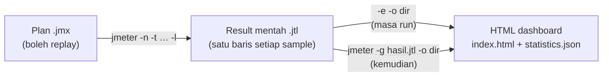
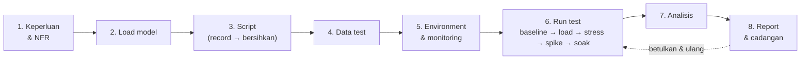

# Hari 2 — Rakam & Main Balik, Laporan Prestasi & Merancang Ujian

[🧪 Lab Hari 2](./snippets/lab.md) · [🎤 Nota Penceramah](./nota-penceramah.md) · [📋 Templat Pelan Ujian](./snippets/templat-pelan-ujian.md) · [📝 Templat Laporan Ujian](./snippets/templat-laporan-ujian.md) · [🗂️ Test plans](./test-plans/) · [⬅️ Hari 1](../hari-1/README.md)

> Hari 1 kita dah bina plan secara manual, record satu flow ringkas, dan tengok replay recording tu **gagal** (401). Hari ini kita ikut kitaran kerja sebenar seorang performance tester dari mula sampai habis: **rancang user journey → record → replay → betulkan sampai boleh replay → run → generate report → baca & tafsir setiap angka → tulis findings → rancang test sebenar**. Fokus utama: **report** (setiap bahagian HTML dashboard JMeter 5.6 dan istilahnya) dan **cara merancang** performance test. Hasil hari ini: plan recording anda sendiri yang boleh replay, HTML report yang anda boleh terangkan baris demi baris, tiga findings bertulis, dan satu test plan yang lengkap.

> ⚠️ **Etika — masih localhost sahaja.** JMeter ni load generator. Kalau anda halakan ke sistem production/awam (termasuk portal JPJ sebenar) **tanpa kebenaran bertulis**, itu dikira serangan DoS dan salah di sisi undang-undang. Semua recording dan run hari ini target `http://localhost:3000` — **Portal eJPJ (tiruan)** dalam `sut/`. Semua data **sintetik**, bukan data rasmi JPJ.

**Apa yang akan dibina:**
- Recording flow **log masuk → senarai kenderaan → semak cukai → bayar cukai**, dikumpul ikut tindakan user (Transaction Controller)
- Diagnose replay yang gagal (401/403) dan betulkan: **correlation**, **parameterization**, nama sampler, **think time**, **assertion** → plan bersih setara `05-transaksi-penuh.jmx`
- **HTML dashboard** daripada run, dibaca bahagian demi bahagian, dengan **glosari istilah** yang lengkap
- Senario peak (puncak) `07-beban-puncak-cukai.jmx` + SLA → **tiga findings** dalam templat report
- **Test plan prestasi** (NFR, load model dengan **Little's Law**, transaction mix, kriteria, monitoring, risiko, kebenaran)

---

## 🎯 Objektif Pembelajaran

Di akhir hari ini, peserta boleh:

| # | Objektif (boleh diukur) | Sesi | Bukti |
|---|------------------------|------|-------|
| O1 | **Rancang** user journey 4 langkah dan **record** guna HTTP(S) Test Script Recorder (port 8888) ke dalam Transaction Controller yang dinamakan ikut tindakan | S1 | Latihan 1: Recording Controller ada 4 sampler `/api/...` dalam 4 kumpulan, tiada static asset |
| O2 | **Diagnose** replay yang gagal guna View Results Tree dan **bezakan** 401 (token) dengan 403 (csrf) | S1 | Latihan 2: 200 / 401 / 200 / 401 selepas restart SUT; eksperimen correlate token sahaja → 403 |
| O3 | **Betulkan** recording dengan correlation `token` + `csrf` (JSON Extractor) dan parameterization CSV `pengguna.csv` | S2 | Latihan 3: Debug Sampler tunjuk `token` (UUID) + `csrf` (32 hex) untuk 3 users berbeza |
| O4 | **Hasilkan** plan yang boleh replay (nama bermakna, Transaction Controller, think time, assertion) setara `05-transaksi-penuh.jmx` | S2 | Latihan 3: 10 users × 2 loop → 80 sample HTTP + 20 baris transaksi dalam Aggregate Report, Error % ≈ 0 |
| O5 | **Generate** HTML dashboard dengan `-e -o` dan `-g … -o`, dan **tune** granularity graf/threshold APDEX guna `-J` | S3 | Latihan 4: `index.html` dibuka; dashboard kedua di-generate daripada `.jtl` yang sama |
| O6 | **Tafsir** setiap bahagian dashboard (APDEX, Statistics, Errors, Over Time, Throughput, Response Times) guna istilah yang betul | S3 | Latihan 4: lembaran kerja dengan nilai sebenar dan tafsiran untuk setiap bahagian |
| O7 | **Nilai** run peak berbanding SLA dan **tulis** findings (bukti → kesan → punca → cadangan) | S3 | Latihan 5: tiga findings dalam `templat-laporan-ujian.md` (SLA 2000 vs 150 ms) |
| O8 | **Rancang** performance test: NFR yang boleh diukur, load model dengan **Little's Law** (N = X × (R + Z)), jenis run, entry/exit criteria, monitoring, risiko, kebenaran | S4 | Latihan 6: `templat-pelan-ujian.md` diisi + kiraan N dan pacing |
| O9 | **Present** test plan dan satu finding daripada report dalam 3 minit | S4 | Latihan 7: mini presentation secara berpasangan |

---

## 📅 Jadual Hari Ini

| Masa | Sesi | Aktiviti | Fokus |
|------|------|----------|-------|
| 9.00 – 10.30 pagi | S1 | **Record & replay (record → playback)** | Recap Hari 1 (10 minit) · rancang user journey · `rakam-template.jmx` (proxy 8888, Recording Controller, kumpulan → Transaction Controller, Excludes, think time `${T}`) · replay → 401/403 · Lab 1 & 2 |
| 10.30 – 10.45 pagi | — | Rehat | |
| 10.45 – 1.00 tgh | S2 | **Betulkan recording sampai boleh replay** | Correlation (JSON / Regex / Boundary) · parameterization CSV · nama sampler · Transaction Controller · think time · assertion · Summary & Aggregate Report · ⭐ ForEach / JSR223 · Lab 3 |
| 1.00 – 2.00 ptg | — | Makan tengah hari | |
| 2.00 – 3.30 ptg | S3 | **Report & istilah (deep dive)** | `.jtl` → HTML dashboard · setiap bahagian dashboard JMeter 5.6 · GUI listeners · glosari istilah · cara tafsir · senario peak `07` + SLA · Lab 4 & 5 |
| 3.30 – 3.45 ptg | — | Rehat | |
| 3.45 – 5.00 ptg | S4 | **Rancang performance test** | Kitaran hayat test · NFR · load model & Little's Law · pacing · baseline/load/stress/spike/soak · kriteria, monitoring, risiko, etika · Lab 6 & 7 · ⭐ CI, distributed, Grafana · penutup |

> 💡 **Borang penilaian kursus** dalam pelatih.my dibuka **2.00 ptg** — tengok bahagian penutup S4.

---

## 🧭 Kenapa hari ini penting

Report performance test ialah **produk** sebenar kerja anda — pengurusan tak baca `.jmx`, mereka baca keputusan: *"Portal boleh tahan tak masa hari kenaikan harga cukai?"* Report yang salah dibaca lebih bahaya daripada tak ada report langsung.

| Tanpa hari ini | Dengan hari ini |
|----------------|-----------------|
| Recording di-replay → 401/403, "test" cuma ukur page error | Recording dibersihkan: **correlation**, **CSV**, **think time**, **assertion** |
| "Purata 300 ms, OK!" | **95th percentile**, Error %, APDEX — dan tahu bila setiap satu boleh mengelirukan |
| Screenshot dashboard tanpa penjelasan | Setiap bahagian dashboard dibaca dengan istilah yang betul |
| "Sistem nampak OK" | **Findings** bertulis: bukti → kesan → punca → cadangan |
| "Cuba 1000 users" | Bilangan users **dikira** daripada volum bisnes guna **Little's Law** |
| Test sekali-sekala tanpa plan | **Test plan**: NFR, load model, jenis run, kriteria, monitoring, kebenaran |

---

## 🧰 Persediaan

Pastikan mock server dah running (dari root repo) — **Terminal A, jangan tutup sepanjang hari**:

```bash
node sut/server.js
# Portal eJPJ (TIRUAN) berjalan di  http://localhost:3000
#   Latensi tiruan : 40-180 ms
#   Kadar ralat    : 1.0%
```

Semak: buka <http://localhost:3000/api/health> → `{"status":"ok",...}`. Buka JMeter GUI (`jmeter`).

| Plan | Guna hari ini | Load default |
|------|---------------|-------------|
| [`hari-1/test-plans/rakam-template.jmx`](../hari-1/test-plans/rakam-template.jmx) | Templat recorder (S1) — HTTP(S) Test Script Recorder port 8888 + Recording Controller | 1 user, 1 loop |
| [`hari-1/test-plans/04-rakaman-mentah.jmx`](../hari-1/test-plans/04-rakaman-mentah.jmx) | Recording "mentah" backup (S1) — memang sengaja gagal | 1 user, 1 loop |
| [`04-korelasi-log-masuk.jmx`](./test-plans/04-korelasi-log-masuk.jmx) | Rujukan correlation `token` + `csrf` (S2) | 5 users, ramp 3s, 3 loop |
| [`05-transaksi-penuh.jmx`](./test-plans/05-transaksi-penuh.jmx) | **Answer key** recording yang dah dibersihkan (S2) + sumber dashboard pertama (S3) | 10 users, ramp 10s, 2 loop |
| [`06-ujian-beban-nogui.jmx`](./test-plans/06-ujian-beban-nogui.jmx) | Load test non-GUI guna `run/run-nogui.sh` (pilihan) | `${__P(pengguna,50)}`, `${__P(rampup,30)}`, `${__P(tempoh,120)}` s |
| [`07-beban-puncak-cukai.jmx`](./test-plans/07-beban-puncak-cukai.jmx) | Senario peak + SLA `${__P(sla_ms,2000)}` (S3, S4) | `${__P(pengguna,300)}`, ramp 30s, 300s |
| [`08-foreach-kenderaan.jmx`](./test-plans/08-foreach-kenderaan.jmx) | ⭐ ForEach: bayar cukai **semua** kenderaan (S2 pilihan) | 3 users, ramp 3s, 1 loop |

> 💡 Hari ini kita run `07` dengan **`-Jpengguna=50 -Jrampup=10 -Jtempoh=60`** (≈ 1 minit) supaya muat dalam masa kelas dan laptop. Default 300 users × 300 s tu untuk mesin yang lebih power.

---

## S1 — Rakam & Main Balik (9.00 – 10.30 pagi)

### 1.1 Imbas kembali Hari 1 (10 minit)

Hari 1 dah diajar pada 21 Sep — jom panaskan tangan semula.

1. Buka `hari-1/test-plans/04-rakaman-mentah.jmx`. **Sebelum Start**, klik **HTTP Request Defaults** → Server `localhost`, Port `3000`, Protocol `http`. (Peraturan kelas: setiap kali buka plan — semak target dulu.)
2. Start ▶. Dalam View Results Tree: `/api/log-masuk` hijau, `/api/kenderaan` dan `…/bayar-cukai` merah.

| Soalan | Jawapan ringkas |
|--------|-----------------|
| Port proxy recorder JMeter? | **8888** (SUT pula 3000) |
| Kenapa replay gagal 401? | Token dalam header `Authorization` tu nilai **lama** dari session recording |
| Average atau percentile untuk SLA? | **Percentile** (90/95/99) |
| Kenapa tak guna View Results Tree masa load test? | Dia simpan setiap response dalam RAM → load generator jadi sesak, angka tak tepat |

### 1.2 Rancang dahulu, baru rakam

Recording yang baik bermula **atas kertas**. Tentukan user journey, nama transaksi, dan data yang akan berubah — **sebelum** tekan Start.

| Langkah | Tindakan user | HTTP request | Nama transaksi | Data yang dijangka dinamik |
|---------|-------------------|-----------------|----------------|----------------------------|
| 1 | Log masuk dengan No. KP | `POST /api/log-masuk` | `T01_LogMasuk` | Response: `token`, `csrf` (di-generate server) · Input: `no_kp`, `kata_laluan` |
| 2 | Lihat senarai kenderaan | `GET /api/kenderaan?no_kp=…` | `T02_SenaraiKenderaan` | Header `Authorization: Bearer <token>` |
| 3 | Semak cukai (sebut harga) | `GET /api/kenderaan/WXY1234/cukai` | `T03_SemakCukai` | `no_pendaftaran`, response `amaun`, `tempoh_bulan` |
| 4 | Bayar cukai | `POST /api/kenderaan/WXY1234/bayar-cukai` | `T04_BayarCukai` | Header token + body `csrf`, `amaun` |

> **Konsep — satu tindakan user = satu transaksi:** Dalam portal sebenar, satu klik ("Log masuk") boleh hantar 10–50 request (HTML, API, imej). User tak kisah request mana yang lambat — yang mereka rasa ialah **masa untuk klik tu**. Jadi kita kumpul request ikut tindakan dalam **Transaction Controller**, dan namakan dengan konvensyen yang senang disusun (`T01_…`, `T02_…`). Dalam SUT kita, kebetulan setiap tindakan cuma satu request.

> 💡 **Konvensyen nama** yang baik: nombor langkah + tindakan bisnes, tanpa space atau simbol pelik (`T03_SemakCukai`). Nama ni akan keluar sebagai **label** dalam setiap report hari ini.

### 1.3 Sediakan perakam — `rakam-template.jmx`

**File → Open →** [`hari-1/test-plans/rakam-template.jmx`](../hari-1/test-plans/rakam-template.jmx). **File → Save As** → `hari-2/test-plans/latihan-01-rakaman.jmx` (supaya file asal tak berubah, dan path CSV `../data/…` betul masa S2).

Test tree: **Thread Group → Recording Controller** (destinasi), **View Results Tree**, dan **HTTP(S) Test Script Recorder** (port `8888`). Klik recorder dan configure:

| Tab / field | Setting | Kenapa |
|-------------|---------|---------|
| **Test Plan Creation → Target Controller** | `Test Plan > Thread Group > Recording Controller` | Tempat sampler akan di-record |
| **Test Plan Creation → Grouping** | **Put each group in a new transaction controller** | Setiap "klik" (kumpulan request) jadi satu Transaction Controller. Templat asal: *Add separators between groups* |
| **Create new transaction after request (ms)** | Biar kosong (default property `proxy.pause` = **5000 ms**) | Gap **≥ 5 s** antara request = kumpulan baru. Jadi **tunggu > 5 s** antara langkah masa record |
| **Capture HTTP Headers** | Ditanda (tick) | Header Manager ditambah pada setiap sampler |
| **Requests Filtering → URL Patterns to Exclude** | Dah ada: `(?i).*\.(bmp\|css\|js\|gif\|ico\|jpe?g\|png\|swf\|eot\|otf\|ttf\|mp4\|woff\|woff2)([?;].*)?` · Tambah (untuk site sebenar): `.*google-analytics.*`, `.*googletagmanager.*`, `.*/collect.*` | Static asset & analytics bukan load yang anda nak ukur — dan analytics tu **third party** |
| **Requests Filtering → URL Patterns to Include** | Kosong (atau `localhost:3000.*` untuk record host ni sahaja) | Kalau diisi, **hanya** URL yang match akan di-record |

**Record think time (pilihan, disyorkan):** Klik kanan **HTTP(S) Test Script Recorder → Add → Timer → Constant Timer**, Thread Delay = **`${T}`**. Masa recording, JMeter salin timer ni ke sampler pertama setiap kumpulan dan tukar `${T}` dengan **gap masa sebenar (ms) sejak request sebelumnya**. Anda dapat think time sebenar user — nanti dalam S2 kita jadikan random.

**Namakan transaksi masa record:** Lepas **Start**, window kecil **Recorder: Transactions Control** akan keluar (field *Prefix*, *Naming scheme*, *Create new transaction after request (ms)*, *Counter start value*). Taip nama (contoh `T01_LogMasuk`) dalam field prefix **sebelum** setiap langkah — prefix tu jadi nama Transaction Controller untuk kumpulan tersebut dan awalan nama sampler. Kalau terlupa, rename controller lepas recording (pilih elemen → edit field **Name**).

> **Konsep — HTTP Request Defaults masa record:** Kalau anda tambah **HTTP Request Defaults** (`localhost` / `3000`) bawah Thread Group **sebelum** record, recorder akan biarkan field Server/Port sampler **kosong** (sebab nilai default dah ada). Hasilnya plan lebih bersih — satu tempat sahaja untuk tukar host.

> **HTTPS?** SUT kita `http://`, jadi **CA certificate tak diperlukan**. Untuk sistem HTTPS (yang anda memang dibenarkan test) ikut [`hari-1/snippets/rakaman-https-setup.md`](../hari-1/snippets/rakaman-https-setup.md) — `ApacheJMeterTemporaryRootCA.crt`, valid 7 hari, buang lepas selesai.

### 1.4 Rakam aliran 4 langkah

1. Klik **Start** ▶ pada recorder. Pastikan proxy dah hidup: `lsof -iTCP:8888 -sTCP:LISTEN -n -P` (macOS/Linux) atau `netstat -ano | findstr :8888` (Windows).
2. Hantar traffic **melalui proxy**. SUT ni API (POST JSON), jadi kita guna `curl -x` (Windows: guna **Git Bash**). Taip/paste satu blok pada satu masa dan **tunggu > 5 s** antara blok (atau guna `sleep 6`):

```bash
P=http://localhost:8888          # proxy perakam JMeter
B=http://localhost:3000          # SUT tiruan

# --- T01_LogMasuk ---
R=$(curl -s -x $P -H 'Content-Type: application/json' \
  -d '{"no_kp":"800101015500","kata_laluan":"rahsia123"}' $B/api/log-masuk)
echo "$R"
TOKEN=$(echo "$R" | sed -E 's/.*"token":"([^"]+)".*/\1/')
CSRF=$(echo "$R"  | sed -E 's/.*"csrf":"([^"]+)".*/\1/')
sleep 6

# --- T02_SenaraiKenderaan ---
curl -s -x $P -H "Authorization: Bearer $TOKEN" "$B/api/kenderaan?no_kp=800101015500"; echo
sleep 6

# --- T03_SemakCukai ---
curl -s -x $P "$B/api/kenderaan/WXY1234/cukai"; echo
sleep 6

# --- T04_BayarCukai ---
curl -s -x $P -H "Authorization: Bearer $TOKEN" -H 'Content-Type: application/json' \
  -d "{\"csrf\":\"$CSRF\",\"tempoh_bulan\":12,\"amaun\":90}" \
  $B/api/kenderaan/WXY1234/bayar-cukai; echo
# respons terakhir: {"no_resit":"RJPJ…","status":"BERJAYA",…}
```

3. Klik **Stop** ⏹. **File → Save**.

> **Kenapa curl, bukan browser?** Proxy boleh record **apa-apa** HTTP client. Browser tak boleh hasilkan POST JSON ke `/api/...` ni — form HTML hantar `application/x-www-form-urlencoded`. (Versi browser ada di <http://localhost:3000/portal>: form log masuk → kenderaan → bayar, dengan cookie `SESI_EJPJ` + hidden `csrf` — untuk latihan tambahan, perlukan **HTTP Cookie Manager**.) Untuk web app sebenar, guna Firefox dengan proxy `localhost:8888` (Hari 1 §4.3) — buang `localhost, 127.0.0.1` dari *No proxy for*; untuk target `localhost`, Firefox 67+ juga perlukan `about:config` → `network.proxy.allow_hijacking_localhost` = `true`.

> ⚠️ `curl: (7) Failed to connect to localhost port 8888` = recorder belum **Start**. Tak ada apa di-record walaupun curl berjaya = anda terlupa `-x $P`.

### 1.5 Apa yang perakam hasilkan

Expand Recording Controller. Anda patut nampak empat kumpulan (Transaction Controller), setiap satu ada satu sampler:

| Apa ada dalam recording | Contoh | Kenapa penting |
|-----------------------|--------|----------------|
| Nama sampler = **prefix + path + nombor turutan** (Naming scheme *Prefix*) | `T01_LogMasuk/api/log-masuk-1`; tanpa prefix: `/api/log-masuk-1`, `/api/kenderaan-2`, … | Nama ni jadi label report — kita rename dalam S2. (Naming scheme *Transaction name* bagi `T01_LogMasuk-1`.) |
| **Header Manager** setiap sampler | `Content-Type`, `Accept`, `User-Agent: curl/…` | Recorder tangkap header client |
| Header **`Authorization: Bearer <token-rakaman>`** | Nilai UUID session recording, **hardcode** | Untuk skema `Bearer`, JMeter 5.6 kekalkan header ni dengan nilai literal. (Header `Cookie` pula **sentiasa dibuang** — app yang guna cookie perlukan **HTTP Cookie Manager**.) |
| Body JSON **literal** | `"no_kp": "800101015500"`, `"csrf": "<csrf-rakaman>"`, path `WXY1234` | Semua data "beku" — satu user, satu kenderaan, satu session |
| **Constant Timer** `${T}` → nombor | contoh `6012` ms | Think time sebenar anda masa record |

> **Konsep — recording ialah titik mula, bukan produk siap.** Recorder tak tahu nilai mana yang dinamik. Dia cuma salin apa yang dia nampak.

### 1.6 Main balik (playback)

1. Tambah **View Results Tree** (kalau belum ada) — dah ada dalam templat.
2. **Expire-kan session recording dulu:** di Terminal A tekan **Ctrl+C**, kemudian run `node sut/server.js` semula. (SUT simpan session dalam memory; restart = semua token lama jadi tak sah, macam session expired dalam sistem sebenar.)
3. **Start** ▶.

| Transaksi / sampler | Kod | Sebab |
|---------------------|-----|-------|
| `T01_LogMasuk` — `POST /api/log-masuk` | **200** | Log masuk sentiasa berjaya; server keluarkan **token baru** — tapi tak ada siapa tangkap token tu |
| `T02_SenaraiKenderaan` — `GET /api/kenderaan` | **401** | Hantar token **recording** yang dah tak wujud → `Token tidak sah atau tamat tempoh` |
| `T03_SemakCukai` — `GET …/WXY1234/cukai` | **200** | Endpoint sebut harga tak perlukan token — **pass walaupun script rosak** |
| `T04_BayarCukai` — `POST …/bayar-cukai` | **401** | Token lama dah ditolak sebelum `csrf` sempat disemak |

> ⚠️ **Perangkap "pass palsu":** Kalau anda replay **tanpa** restart SUT, semua 4 langkah mungkin **200** — sebab session recording masih hidup dalam memory mock. Itu bukan berjaya: 300 virtual users akan share **satu** session dan satu `csrf`. Sistem sebenar biasanya expire-kan session lepas beberapa minit, jadi script ni akan gagal esok pagi. Hijau ≠ betul.

> **Bukti backup tanpa GUI:** `jmeter -n -t hari-1/test-plans/04-rakaman-mentah.jmx -l hasil/r04.jtl` → `summary = 3 … Err: 2 (66.67%)` — log masuk 200, `/api/kenderaan` 401, `bayar-cukai` 401 (disahkan dengan JMeter 5.6.3).

### 1.7 Diagnosis: 401 vs 403 dengan View Results Tree

Klik sampler merah dalam View Results Tree dan baca tiga tab ni ikut urutan:

| Tab | Apa nak cari | Contoh |
|-----|-----------------|--------|
| **Sampler result** | `Response code`, `Response message`, masa (`Load time`, `Latency`, `Connect Time`) | `Response code: 401` · `Response message: Unauthorized` |
| **Request** | Apa yang **sebenarnya** dihantar — header & body | `Authorization: Bearer <token-rakaman>` (bukan token baru dari T01) |
| **Response data** | Mesej error dari server | `{"ralat":"Token tidak sah atau tamat tempoh"}` |

**Eksperimen — asingkan dua punca:** Lepas S2 anda akan correlate `token`. Kalau **hanya** token di-correlate tapi `csrf` masih nilai recording, bayaran bertukar dari 401 ke **403** `{"ralat":"Token CSRF tidak sah — sila log masuk semula"}` (dah disahkan dengan SUT).

| Kod | Maksud dalam SUT | Punca dalam skrip | Pembaikan |
|-----|------------------|-------------------|-----------|
| **401** Unauthorized | *Siapa anda?* — token tak ada/tak sah | Header `Authorization` hardcode/hilang | Extract `token` → `Bearer ${token}` |
| **403** Forbidden | *Request ni sah tak?* — token sah tapi `csrf` salah | Body `csrf` hardcode | Extract `csrf` → `"csrf": "${csrf}"` |
| **404** Not Found | Path/kenderaan tak wujud | Path salah, atau `${no_pendaftaran}` tak diganti (`NONE`) | Semak extractor / CSV |

> **Konsep — replay tu functional test dulu.** Sebelum tambah load, plan mesti pass **1 user × 1 loop** dengan 0 error (kecuali error yang memang dijangka). Load test atas script rosak cuma ukur kelajuan page error.

### 🎯 Kuiz S1

1. Anda merakam dengan *Grouping = Put each group in a new transaction controller*, tetapi keempat-empat permintaan masuk ke dalam **satu** Transaction Controller. Punca paling mungkin?
   - [ ] Port perakam bukan 8888
   - [x] Jurang antara permintaan kurang daripada 5 s (`proxy.pause`), jadi semuanya dianggap satu "klik"
   - [ ] Recording Controller diletak di bawah Test Plan
   - [ ] Capture HTTP Headers tidak ditanda
   > Perakam memulakan kumpulan baharu hanya jika jurang ≥ `proxy.pause` (lalai 5000 ms). Tunggu > 5 s antara langkah, atau namakan transaksi melalui dialog *Recorder: Transactions Control*.

2. Apakah tujuan Constant Timer bernilai `${T}` di bawah HTTP(S) Test Script Recorder?
   - [ ] Mengehadkan rakaman kepada T saat
   - [x] Menyalin timer ke rakaman dengan `${T}` digantikan oleh jurang masa sebenar sejak permintaan sebelumnya (think time pengguna)
   - [ ] Menambah Duration Assertion T ms
   - [ ] Menetapkan tempoh sah sijil CA
   > Ini cara merakam think time sebenar. Pada S2 kita menggantikannya dengan timer rawak supaya pengguna maya tidak bergerak serentak.

3. Main balik rakaman **tanpa** memulakan semula SUT memberi 4 × 200. Apakah kesimpulan yang betul?
   - [ ] Skrip sedia untuk ujian beban
   - [ ] Korelasi tidak diperlukan untuk SUT ini
   - [x] Ia "lulus palsu" — sesi rakaman masih hidup; semua pengguna maya akan berkongsi satu token/csrf yang akan tamat tempoh
   - [ ] JMeter telah mengkorelasi token secara automatik
   > Perakam tidak mengkorelasi apa-apa. Mulakan semula SUT (atau tunggu sesi tamat) untuk membuktikan skrip benar-benar bebas daripada sesi rakaman.

4. Selepas `token` dikorelasi, `GET /api/kenderaan` menjadi 200 tetapi `bayar-cukai` memulangkan **403**. Apakah yang masih dikeras-kod?
   - [ ] `no_kp` dalam query string
   - [ ] Header `Content-Type`
   - [x] Nilai `csrf` dalam badan permintaan bayar
   - [ ] Port HTTP Request Defaults
   > 403 dalam SUT = token sah tetapi `csrf` tidak sepadan dengan sesi. Ekstrak `csrf` bersama `token` dari respons log masuk.

---

## S2 — Jadikan Rakaman Boleh Dimain Balik (10.45 – 1.00 tgh)

### 2.1 Senarai semak "bersihkan rakaman"

| # | Masalah dalam recording | Cara betulkan | Elemen JMeter |
|---|----------------------|-----------|---------------|
| 1 | Host/port berulang dalam setiap sampler | Satu tempat sahaja untuk target | **HTTP Request Defaults** (`localhost` / `3000`) |
| 2 | Nama `/api/log-masuk-1` | Nama yang bermakna = label report | Rename: `1. POST /api/log-masuk` |
| 3 | `token` & `csrf` hardcode | **Correlation** | **JSON Extractor** (atau Regex / Boundary) |
| 4 | Satu user `800101015500` sahaja | **Parameterization** | **CSV Data Set Config** `pengguna.csv` |
| 5 | Kenderaan `WXY1234` hardcode | Correlation berantai dari response senarai | JSON Extractor `$.kenderaan[0].no_pendaftaran` |
| 6 | `"amaun": 90` hardcode | Ambil dari response | JSON Extractor (senarai atau sebut harga) |
| 7 | Timer `${T}` = gap masa anda menaip (contoh 6012 ms, sama untuk semua user) | Think time **random** yang realistik | **Uniform Random Timer** |
| 8 | Tak ada semakan content — 200 dengan mesej error pun dikira "pass" | **Assertion** | Response Assertion `BERJAYA` |
| 9 | Kumpulan per-langkah | Transaksi **bisnes** penuh | **Transaction Controller** `Pembaharuan Cukai Jalan` |
| 10 | Header `User-Agent: curl/…` & `Accept` | Pilihan — tak beri kesan pada SUT ni | Buang atau biarkan |

> Hasil akhir sesi ni setara dengan [`test-plans/05-transaksi-penuh.jmx`](./test-plans/05-transaksi-penuh.jmx) — buka dalam tab lain sebagai **answer key**.

### 2.2 Parameterisasi vs korelasi

| | Parameterization | Correlation |
|-|----------------|----------|
| Sumber data | **Anda** (CSV, User Defined Variables) | **Server**, masa test tengah run |
| Contoh | `no_kp`, `kata_laluan` dari `pengguna.csv` | `token`, `csrf` dari response log masuk; `no_pendaftaran`, `amaun` dari response senarai |
| Elemen JMeter | CSV Data Set Config | Post Processor: JSON / Regular Expression / Boundary Extractor |
| Dah tahu nilainya sebelum test? | Ya | Tak |

> **Konsep:** Dua-dua kita perlukan. `pengguna.csv` bagi **siapa** yang log masuk; extractor bagi **session** user tu.

### 2.3 Korelasi `token` + `csrf`

1. **Klik kanan `T01_LogMasuk` → sampler log masuk → Add → Post Processors → JSON Extractor** (`Ekstrak token + csrf`):
   - **Names of created variables:** `token;csrf`
   - **JSON Path expressions:** `$.token;$.csrf`
   - **Match No. (0 for Random):** `1;1` · **Default Values:** `TOKEN_TAK_JUMPA;CSRF_TAK_JUMPA`
2. Dalam **Header Manager** sampler senarai dan bayar: tukar nilai `Authorization` jadi `Bearer ${token}`.
3. Dalam body sampler bayar: `"csrf": "${csrf}"`.


| Extractor | Bila guna | Konfigurasi setara untuk `token` |
|-----------|-----------|----------------------------------|
| **JSON Extractor** | Response JSON (API moden) — paling bersih | `$.token` |
| **Regular Expression Extractor** | Apa-apa teks/HTML/header | Regular Expression `"token":"([^"]+)"` · Template `$1$` · Match No. `1` |
| **Boundary Extractor** | Boundary kiri/kanan jelas — paling senang dibaca | Left Boundary `"token":"` · Right Boundary `"` |

> **Konsep — scope extractor:** Letak extractor sebagai **child** kepada sampler log masuk. Kalau letak bawah Thread Group, dia akan run selepas **setiap** sampler dan overwrite `token` dengan nilai default.

> **Konsep — Default Value yang senang nampak:** `TOKEN_TAK_JUMPA` dalam tab **Request** = correlation rosak, terus nampak. Langkah debug: (1) Response data log masuk — `token` ada tak? (2) View Results Tree → view **JSON Path Tester** → test `$.token`. (3) **Debug Sampler** (JMeter variables = True) → `token=…`, `csrf=…`. (4) Tab **Request** sampler seterusnya.

> **Konsep — variable per-thread:** `${token}` disimpan dalam `vars` **thread tu sahaja**. 300 virtual users = 300 token berbeza — macam 300 rakyat sebenar.

### 2.4 Korelasi berantai: kenderaan & amaun

Recording "bekukan" `WXY1234` dan `90`. User lain tak ada kenderaan `WXY1234`. Ambil dua-dua nilai ni dari response senarai:

- **Klik kanan sampler senarai → Add → Post Processors → JSON Extractor** (`Ekstrak kenderaan pertama`): Names `no_pendaftaran;amaun` · Paths `$.kenderaan[0].no_pendaftaran;$.kenderaan[0].amaun_cukai` · Match No. `1;1` · Default `NONE;0`.
- Path sampler sebut harga → `/api/kenderaan/${no_pendaftaran}/cukai`; path bayar → `/api/kenderaan/${no_pendaftaran}/bayar-cukai`; body → `{ "csrf": "${csrf}", "tempoh_bulan": 12, "amaun": ${amaun} }`.

> 💡 Plan `07` ambil `amaun` + `tempoh_bulan` dari **sebut harga** (`$.amaun;$.tempoh_bulan`) — lebih realistik, sebab user bayar amaun yang dipaparkan.

### 2.5 Parameterisasi dengan CSV

**Klik kanan Thread Group → Add → Config Element → CSV Data Set Config**: Filename `../data/pengguna.csv`, Variable Names `no_kp,kata_laluan`, Ignore first line `True`, Recycle on EOF `True`, Sharing mode `All threads`. Kemudian tukar dalam recording:

- Body log masuk: `{ "no_kp": "${no_kp}", "kata_laluan": "${kata_laluan}" }`
- Parameter senarai: `no_kp` = `${no_kp}`

> ⚠️ Path CSV **relatif kepada file `.jmx`**. Simpan plan dalam `hari-2/test-plans/` — kalau tak, `${no_kp}` akan dihantar secara literal.

### 2.6 Nama sampler & Transaction Controller

1. Rename sampler: `1. POST /api/log-masuk`, `2. GET /api/kenderaan`, `3. GET /api/kenderaan/${no_pendaftaran}/cukai`, `4. POST /api/kenderaan/${no_pendaftaran}/bayar-cukai`.
2. **Klik kanan Thread Group → Add → Logic Controller → Transaction Controller** `Pembaharuan Cukai Jalan`, drag keempat-empat sampler **ke dalamnya**. Controller kumpulan `T01…T04` yang dah kosong boleh delete — atau kekalkan kalau anda nak satu baris untuk setiap tindakan (dalam web app sebenar, satu tindakan biasanya ada banyak request, jadi ni sangat berguna).

| Pilihan Transaction Controller | Kesan dalam report |
|--------------------------------|---------------------|
| **Generate parent sample** tak ditanda (plan rujukan) | Baris transaksi **dan** baris setiap sampler — paling bagus untuk cari langkah yang lambat |
| **Generate parent sample** ditanda | Sampler jadi sub-sample; report cuma tunjuk baris transaksi |
| **Include duration of timer and pre-post processors in generated sample** | Kalau ditanda, think time masuk sekali dalam masa transaksi. Plan rujukan **tak** tanda — kita ukur masa sistem, bukan masa user berfikir |

> **Konsep — label dinamik:** Nama `4. POST /api/kenderaan/${no_pendaftaran}/bayar-cukai` akan hasilkan **satu baris per kenderaan** dalam report (`…/WXY1234/…`, `…/JQK7788/…`, `…/BMT3030/…`). Bagus untuk analisis per-data; untuk report kepada pengurusan, guna nama statik (`4. POST bayar-cukai`) atau baca baris **transaksi**.

### 2.7 Think time

Delete Constant Timer `${T}` dari recording (satu di bawah sampler pertama setiap kumpulan). **Klik kanan Transaction Controller `Pembaharuan Cukai Jalan` → Add → Timer → Uniform Random Timer** (`Think Time (1-3s)`): Constant Delay Offset `1000`, Random Delay Maximum `2000` → setiap pause 1–3 s. Timer jadi child TC tu, sebaris dengan sampler — sama macam dalam `05`.

> **Konsep — scope timer:** Timer run **sebelum setiap sampler dalam scope dia**. Bawah Transaction Controller dengan 4 sampler → **4 pause** setiap iteration (purata 4 × 2 s = 8 s). Fakta ni kita guna nanti dalam kiraan Little's Law (S4).

### 2.8 Assertion & If Controller

- **Klik kanan sampler bayar → Add → Assertions → Response Assertion**: Field to Test *Text Response*, Pattern Matching Rules *Substring*, pattern `BERJAYA`.
- **(Disyorkan)** Bungkus sampler 3 & 4 dalam **If Controller** `Jika ada kenderaan`, Condition `${__groovy(vars.get("no_pendaftaran") != "NONE" && vars.get("token") != "TOKEN_TAK_JUMPA")}` — supaya tak ada bayaran palsu dihantar bila log masuk gagal atau user tak ada kenderaan.

> **Konsep — tanpa assertion, 200 = pass.** JMeter cuma tanda gagal untuk kod 4xx/5xx/network error. Response 200 dengan `{"status":"GAGAL"}` tetap dikira berjaya — kecuali anda tambah assertion.

### 2.9 Jalankan & baca Summary / Aggregate Report

Thread Group: Number of Threads `10`, Ramp-up `10`, Loop Count `2`. Tambah **Summary Report** dan **Aggregate Report**; **disable** View Results Tree (klik kanan → Disable). Start.

Keputusan yang dijangka (disahkan dengan `05-transaksi-penuh.jmx`, JMeter 5.6.3): **80 sample HTTP** (10 × 2 × 4) + **20 baris transaksi** `Pembaharuan Cukai Jalan`, Error % 0 (sekali-sekala ada 1 bayaran gagal 500 — `ERROR_RATE` 1% SUT). Masa transaksi ≈ jumlah 4 langkah (≈ 440 ms), **tanpa** think time.

| Column | Summary Report | Aggregate Report |
|-------|:--------------:|:----------------:|
| `Label`, `# Samples`, `Average`, `Min`, `Max`, `Error %`, `Throughput`, `Received KB/sec`, `Sent KB/sec` | ✅ | ✅ |
| `Median`, `90% Line`, `95% Line`, `99% Line` | — | ✅ |
| `Std. Dev.`, `Avg. Bytes` | ✅ | — |

> 💡 Ingat: Aggregate Report panggil `90% Line`; HTML dashboard panggil `90th pct`. Konsep sama — **percentile**.

### 2.10 ⭐ Pilihan: ForEach & JSR223 Groovy (sekilas)

- **ForEach** — bayar cukai **semua** kenderaan: JSON Extractor `$.kenderaan[*].no_pendaftaran`, **Match No. `-1`** (akan create `no_pendaftaran_1`, `_2`, … `_matchNr`) → **ForEach Controller** (Input variable prefix `no_pendaftaran`, Output variable name `no_semasa`, **Add "_" before number?** ditanda). Rujuk [`08-foreach-kenderaan.jmx`](./test-plans/08-foreach-kenderaan.jmx): 3 users → 5 bayaran, 16 sample HTTP, 0 error.
- **JSR223 (Groovy)** — untuk custom logic: guna Groovy + tanda **Cache compiled script if available**, baca variable dengan `vars.get("token")` (bukan `${token}` dalam script). Contoh siap: [`snippets/jsr223-groovy.groovy`](./snippets/jsr223-groovy.groovy).
- **Fungsi berguna:** `${__P(pengguna,50)}` (property dari `-J`), `${__UUID}`, `${__Random(1,1000)}`, `${__time(yyyy-MM-dd)}`.

### 🎯 Kuiz S2

1. Manakah nilai yang mesti **dikorelasi** (bukan diparameter dari CSV) dalam rakaman eJPJ?
   - [ ] `no_kp` dan `kata_laluan`
   - [x] `token` dan `csrf`
   - [ ] Port `3000`
   - [ ] Header `Content-Type`
   > `token` dan `csrf` dijana oleh pelayan pada setiap log masuk; hanya extractor yang boleh menangkapnya pada masa larian.

2. JSON Extractor untuk `token` diletak terus di bawah Thread Group (bukan anak sampler log masuk). Apakah kesannya?
   - [ ] Tiada kesan — skop extractor sentiasa global
   - [x] Ia berjalan selepas setiap sampler dan menimpa `token` dengan default apabila respons lain tiada `$.token`
   - [ ] JMeter enggan menyimpan plan
   - [ ] Token diekstrak dua kali dan digabungkan
   > Skop mengikut kedudukan. Post Processor anak sampler hanya berjalan selepas sampler itu.

3. Uniform Random Timer (offset 1000 ms, maksimum rawak 2000 ms) diletak di bawah Transaction Controller yang mengandungi 4 sampler. Berapa purata jumlah think time setiap lelaran?
   - [ ] 2 s
   - [ ] 3 s
   - [x] 8 s
   - [ ] 12 s
   > Timer berjalan sebelum **setiap** sampler dalam skop: 4 × purata (1000 + 2000/2) ms = 4 × 2 s = 8 s.

4. Dalam Aggregate Report, baris transaksi `Pembaharuan Cukai Jalan` menunjukkan Average ≈ 440 ms walaupun think time 1–3 s. Mengapa?
   - [ ] Timer tidak berfungsi dalam Transaction Controller
   - [x] *Include duration of timer and pre-post processors* tidak ditanda, jadi masa transaksi hanya jumlah masa 4 sampler
   - [ ] Aggregate Report membuang sampel yang lambat
   - [ ] Think time hanya berjalan dalam mod non-GUI
   > Itulah pilihan yang disengajakan: kita mengukur masa **sistem**. Think time masih berlaku antara permintaan — ia mempengaruhi throughput, bukan masa respons transaksi.

---

## S3 — Laporan & Istilah (2.00 – 3.30 ptg)

### 3.1 Dari larian ke laporan



```bash
# (dari akar repo) folder induk untuk -o MESTI wujud dahulu
mkdir -p hasil                      # Windows: mkdir hasil

# Larian non-GUI + dashboard serta-merta (folder -o MESTI kosong / belum wujud)
jmeter -n -t hari-2/test-plans/05-transaksi-penuh.jmx -l hasil/r05.jtl -e -o hasil/laporan05

# Jana (semula) dashboard daripada .jtl sedia ada — tanpa menjalankan ujian
jmeter -g hasil/r05.jtl -o hasil/laporan05-b
```

| Flag | Maksud |
|---------|--------|
| `-n` | Non-GUI |
| `-t <plan.jmx>` | Test plan |
| `-l <fail.jtl>` | File result mentah (CSV) |
| `-e` | Generate dashboard lepas run |
| `-o <folder>` | Folder output dashboard — mesti kosong (kalau tak: `Cannot write to '…' as folder is not empty`), dan **parent folder mesti dah wujud** (kalau tak: `… as folder does not exist and parent folder is not writable` — JMeter semak ni **sebelum** test mula). `-l` pula akan create folder sendiri |
| `-g <fail.jtl>` | Generate dashboard daripada `.jtl` yang dah ada (bersama `-o`) |
| `-J<nama>=<nilai>` | Property — untuk `${__P()}` dalam plan **dan** untuk setting report generator |

**Setting report yang berguna (disahkan dengan JMeter 5.6.3):**

| Property | Default | Guna |
|----------|-------|------|
| `jmeter.reportgenerator.overall_granularity` | `60000` ms | Saiz interval graf *Over Time* & *Throughput*. Run 60 s dengan default = **1–2 titik sahaja**! Untuk run dalam kelas: `-Jjmeter.reportgenerator.overall_granularity=5000` (minimum 1000) |
| `jmeter.reportgenerator.apdex_satisfied_threshold` | `500` ms | Threshold T APDEX |
| `jmeter.reportgenerator.apdex_tolerated_threshold` | `1500` ms | Threshold F APDEX |
| `jmeter.reportgenerator.report_title` | `Apache JMeter Dashboard` | Tajuk report |

```bash
# Contoh: jana semula dengan graf setiap 5 s dan APDEX 300/1000 ms
jmeter -g hasil/r07.jtl -o hasil/laporan07-5s \
  -Jjmeter.reportgenerator.overall_granularity=5000 \
  -Jjmeter.reportgenerator.apdex_satisfied_threshold=300 \
  -Jjmeter.reportgenerator.apdex_tolerated_threshold=1000
```

**Anatomi `.jtl` (CSV, JMeter 5.6):**

```
timeStamp,elapsed,label,responseCode,responseMessage,threadName,dataType,success,failureMessage,bytes,sentBytes,grpThreads,allThreads,URL,Latency,IdleTime,Connect
1791115262980,141,1. POST /api/log-masuk,200,OK,Pengguna Pembaharuan Cukai 1-1,text,true,,337,241,3,3,http://localhost:3000/api/log-masuk,140,0,10
```

| Column | Maksud |
|-------|--------|
| `timeStamp` | Masa mula sample (epoch ms) |
| `elapsed` | **Response time** (ms) |
| `label` | Nama sampler / transaksi — kunci untuk setiap baris report |
| `responseCode`, `responseMessage`, `success`, `failureMessage` | Keputusan; `failureMessage` = mesej assertion yang fail |
| `bytes`, `sentBytes` | Saiz data diterima / dihantar |
| `grpThreads`, `allThreads` | Thread aktif (kumpulan / semua) masa sample tu diambil |
| `Latency`, `Connect` | Masa sampai byte pertama; masa connection (ms) |
| `IdleTime` | Masa "idle" dalam sample transaksi (contoh think time yang tak dikira) |

> Baris transaksi (Transaction Controller) dalam `.jtl` ada `responseMessage` macam `Number of samples in transaction : 4, number of failing samples : 0` dan `URL` = `null`.

### 3.2 Dashboard — halaman utama

Buka `index.html`. Menu kiri: **Dashboard**, **Charts** (Over Time · Throughput · Response Times), **Customs Graphs**.

#### a) Test and Report information

| Field | Isi | Semak |
|-------|-----|-------|
| **Source file** | Nama `.jtl` | Report yang betul ke? |
| **Start Time / End Time** | Tempoh run | Sama dengan tempoh yang dirancang? Run yang berhenti awal = warning |
| **Filter for display** | Filter label (biasanya kosong) | Kalau diisi, report tak lengkap |


*Skrin pertama HTML dashboard: maklumat run, APDEX setiap label dan pecahan pass/fail (run peak `07`, 50 users).*

#### b) APDEX (Application Performance Index)

Column: **Apdex** · **T (Toleration threshold)** · **F (Frustration threshold)** · **Label**.

```
APDEX = (Satisfied + Tolerating / 2) / Jumlah sampel
Satisfied  : masa ≤ T            (lalai T = 500 ms)
Tolerating : T < masa ≤ F        (lalai F = 1500 ms)
Frustrated : masa > F  — ATAU sampel GAGAL
```

| Skor | Tafsiran biasa |
|------|----------------|
| ≥ 0.94 | Sangat baik |
| 0.85 – 0.93 | Baik |
| 0.70 – 0.84 | Sederhana |
| < 0.70 | Lemah |

> **Disahkan:** dalam JMeter, sample yang **gagal** dikira **Frustrated** walaupun laju. Run `07` kami: `bayar-cukai` BMT3030 = 196 sample, 3 gagal (500) → APDEX 193/196 = **0.985**.

> ⚠️ Baris transaksi 4 langkah (≈ 450 ms) dinilai dengan T = 500 ms yang sama macam satu request — APDEX transaksi kami 0.862–0.875 walaupun sistem sihat. Untuk transaksi, set threshold sendiri guna `jmeter.reportgenerator.apdex_per_transaction`. Perhatikan juga: baris **Total** APDEX JMeter 5.6 turut kira sample transaksi (Statistics *Total* tak kira).

#### c) Requests Summary

Pie chart **PASS** / **FAIL** untuk semua sample HTTP (tak termasuk baris transaksi). Run `07` SLA 150 ms: FAIL **5.37%**.

#### d) Statistics — jadual paling penting

Column dikumpul bawah empat tajuk: **Executions**, **Response Times (ms)**, **Throughput**, **Network (KB/sec)**.

| Column | Kumpulan | Maksud | Cara baca |
|-------|----------|--------|-----------|
| **Label** | — | Nama sampler/transaksi; baris **Total** di atas | Total = semua sample **HTTP** (baris transaksi tak dicampur) |
| **#Samples** | Executions | Bilangan sample | Sama dengan jangkaan (threads × loop × sampler)? |
| **FAIL** | Executions | Bilangan sample gagal | Kod 4xx/5xx, network error, **atau assertion gagal** |
| **Error %** | Executions | FAIL ÷ #Samples × 100 | Banding dengan NFR (contoh < 1%) |
| **Average** | Response Times | Purata | Senang terpesong sebab nilai ekstrem |
| **Min** / **Max** | Response Times | Paling laju / paling lambat | Max = satu sample sahaja — jangan jadikan SLA |
| **Median** | Response Times | 50% sample ≤ nilai ni | "Pengalaman biasa" |
| **90th pct** / **95th pct** / **99th pct** | Response Times | 90/95/99% sample ≤ nilai ni | **Asas SLA/NFR**; gap besar Median→99th = long tail |
| **Transactions/s** | Throughput | Sample siap sesaat untuk label tu | Baris transaksi = transaksi bisnes/s |
| **Received** / **Sent** | Network (KB/sec) | Bandwidth | Naik mendadak = response besar / resource yang tak perlu |

`statistics.json` dalam folder report ada data yang sama (format untuk mesin): `sampleCount`, `errorCount`, `errorPct`, `meanResTime`, `medianResTime`, `minResTime`, `maxResTime`, `pct1ResTime` (90th), `pct2ResTime` (95th), `pct3ResTime` (99th), `throughput`, `receivedKBytesPerSec`, `sentKBytesPerSec`.


*Jadual Statistics: baca p90/p95/p99 dan Error % dulu, lepas tu throughput.*

#### e) Errors

Column: **Type of error** · **Number of errors** · **% in errors** · **% in all samples**.

| Contoh baris (disahkan) | Maksud |
|-------------------------|--------|
| `401/Unauthorized` · 2 · 100% · 66.67% | Replay `04-rakaman-mentah` — 2 daripada 3 sample |
| `500/Internal Server Error` | Server error (SUT: ~1% bayaran) |
| `The operation lasted too long: It took 166 milliseconds, but should not have lasted longer than 150 milliseconds.` | **Duration Assertion** gagal (kod HTTP tetap 200) |

> ⚠️ Jadual ni kumpul ikut **teks mesej**. Mesej Duration Assertion ada nilai ms, jadi setiap nilai jadi baris berasingan (run SLA 150 ms kami: ~30 baris). Jumlahkan, atau baca **Top 5 Errors by sampler**.

#### f) Top 5 Errors by sampler

Column: **Sample** · **#Samples** · **#Errors** · kemudian lima pasangan **Error** / **#Errors**. Ni jawab soalan: *"Langkah mana yang gagal, dan kenapa?"* Baris transaksi tak dimasukkan (default `jmeter.reportgenerator.exclude_tc_from_top5_errors_by_sampler=true`).

### 3.3 Charts — setiap graf

> Graf *Over Time* & *Throughput* guna interval `overall_granularity` (default 60 s). Untuk run yang pendek, generate semula dengan `-Jjmeter.reportgenerator.overall_granularity=5000`.

**Charts → Over Time**

| Graf | Paksi | Soalan yang dijawab | Warning sign |
|------|-------|---------------------|--------------|
| **Response Times Over Time** | Masa · purata ms setiap label (termasuk transaksi) | Response time stabil tak sepanjang test? | Garis naik berterusan (degradasi / memory leak) |
| **Response Time Percentiles Over Time (successful responses)** | Masa · Min, Median, 90th, 95th, 99th, Max untuk sample yang **berjaya** | Tail (p95/p99) makin lebar tak masa peak load? | p99 melonjak masa thread aktif maksimum |
| **Active Threads Over Time** | Masa · bilangan thread aktif setiap Thread Group | Load model (ramp-up → stabil) jalan macam yang dirancang? | Thread jatuh awal = test/load generator ada masalah |
| **Bytes Throughput Over Time** | Masa · byte diterima/dihantar sesaat | Network jadi limit? | Rata walaupun users bertambah |
| **Latencies Over Time** | Masa · purata latency (ms) | Masa sampai byte pertama — processing di server | Latency ≈ response time = server lambat, bukan masalah transfer |
| **Connect Time Over Time** | Masa · purata connect time | Ada masalah connection TCP/TLS? | Naik = server kehabisan connection / tak ada keep-alive |


*Response Times Over Time: garis transaksi berada di atas request individu.*

**Charts → Throughput**

| Graf | Paksi | Soalan | Warning sign |
|------|-------|--------|--------------|
| **Hits Per Second** | Masa · HTTP request **dihantar** sesaat | Berapa banyak load yang JMeter hantar? | Hits/s rata walhal thread naik |
| **Codes Per Second** | Masa · response sesaat ikut **kod HTTP** (`200`, `500`, …) | Bila server error berlaku? | Siri 5xx muncul masa peak. Nota: **assertion** yang fail masih `200` di sini |
| **Transactions Per Second** | Masa · sample siap sesaat **setiap label**, diasingkan `-success` / `-failure` | Label mana yang gagal, dan bila? | Siri `-failure` naik |
| **Total Transactions Per Second** | Masa · jumlah `Transaction-success` / `Transaction-failure` (semua sample — HTTP **dan** baris transaksi) | Throughput keseluruhan sistem | Mendatar walhal users naik = **saturated (tepu)** |
| **Response Time Vs Request** | Request sesaat global · **median** response time | Response time naik tak bila rate naik? | Graf naik curam = knee point |
| **Latency Vs Request** | Request sesaat global · **median** latency | Sama, untuk latency | |

**Charts → Response Times**

| Graf | Paksi | Soalan |
|------|-------|--------|
| **Response Time Percentiles** | Percentile 0–100 · ms | Bentuk taburan penuh; "pada percentile berapa masa mula melonjak?" |
| **Response Time Overview** | 4 bar: `≤ 500ms`, `> 500ms and ≤ 1,500ms`, `> 1,500ms`, `Requests in error` | Ringkasan gaya APDEX untuk pengurusan (threshold = T/F APDEX) |
| **Time Vs Threads** | Bilangan thread aktif · purata ms | Macam mana response time berubah ikut concurrency |
| **Response Time Distribution** | Bucket 100 ms · bilangan response | Taburan unimodal? Dua puncak = dua code path (contoh cache hit/miss) |

### 3.4 GUI listeners — bila guna

| Listener | Guna | Masa load test? |
|----------|------|---------------|
| **View Results Tree** | Debug: Request / Response data / JSON Path Tester | ❌ **Tak** — dia simpan setiap response dalam RAM |
| **Summary Report** | Ringkasan per label (+ `Std. Dev.`) | Boleh untuk run GUI yang kecil; lebih baik non-GUI + dashboard |
| **Aggregate Report** | Macam Summary + Median, 90/95/99% Line | Sama |
| **Simple Data Writer** | Tulis result ke file (`.jtl`) tanpa paparan | ✅ kalau perlu file tambahan (non-GUI `-l` biasanya dah cukup) |

> **Kenapa listener kena off masa load test:** Listener GUI proses setiap sample dalam JVM yang sama yang hantar load — CPU/RAM JMeter naik, dan response time yang diukur termasuk sekali "JMeter yang sesak". Non-GUI + `-l` tulis `.jtl` dengan kos minimum; analisis buat **lepas** test.

### 3.5 Glosari istilah

| Istilah | Definisi (ikut cara JMeter ukur) | Contoh eJPJ |
|---------|----------------------------------------|-------------|
| **Response time / Elapsed** | Dari **sejurus sebelum** request dihantar sampai **sejurus selepas** response **terakhir** diterima. Tak termasuk masa render browser atau JavaScript | `elapsed` = 141 ms untuk log masuk |
| **Latency** | Dari sejurus sebelum request dihantar sampai sejurus selepas **bahagian pertama** response diterima (≈ time to first byte). **Termasuk** connect time | Latency 140 ms, elapsed 141 ms → response kecil, hampir semua masa tu processing di server |
| **Connect time** | Masa untuk buka connection (termasuk SSL/TLS handshake). Tak ditolak dari latency | 10 ms untuk connection pertama, ~1 ms kalau keep-alive |
| **Throughput** | Bilangan request ÷ jumlah masa (dari mula sample pertama sampai tamat sample terakhir) | Total 41.29/s (run `07`) |
| **Hits/s** | HTTP request **dihantar** sesaat (graf Hits Per Second) | 4 hits setiap transaksi pembaharuan |
| **TPS (Transactions per second)** | Sample **siap** sesaat; untuk Transaction Controller = transaksi bisnes/s | 10.46 pembaharuan/s |
| **Virtual user / thread** | Satu thread JMeter = satu user simulasi yang run script berulang kali | 50 threads |
| **Concurrent users** | Users yang **tengah dalam session** pada satu masa (termasuk yang tengah berfikir) | 600 rakyat sedang memperbaharui cukai |
| **Active threads** | Thread JMeter yang hidup pada satu saat (graf Active Threads Over Time; column `allThreads`) | Naik 0 → 50 dalam 10 s, kekal 50 |
| **Ramp-up** | Tempoh untuk start semua thread | 10 s → 1 thread baru setiap 0.2 s |
| **Steady state** | Tempoh load dah stabil lepas ramp-up — **sinilah** NFR dinilai | Saat 10–60 |
| **Ramp-down** | Tempoh users berhenti. Thread Group standard tak ada ramp-down (semua berhenti bila tempoh tamat); iteration yang separuh jalan tak hasilkan sample transaksi | 630 log masuk, 598 transaksi |
| **Think time** | Pause antara tindakan user (timer) | Uniform Random Timer 1–3 s |
| **Pacing** | Kawal **rate** iteration (contoh satu transaksi setiap 6 s untuk setiap user), tak bergantung pada response time | Constant Throughput Timer 600 sample/min |
| **Average (mean)** | Jumlah ÷ bilangan | Senang terpesong sebab nilai ekstrem |
| **Median** | 50th percentile | |
| **Percentile (pNN)** | NN% sample ≤ nilai ni | p95 = 583 ms: 95% transaksi ≤ 583 ms |
| **Standard deviation** | Sebaran response time (JMeter kira standard deviation **populasi**). Ada dalam Summary Report, tak ada dalam dashboard | Tinggi = tak konsisten |
| **Error %** | Sample gagal ÷ jumlah sample × 100 (kod HTTP, network, assertion) | 1.00% transaksi |
| **APDEX** | Skor kepuasan 0–1: (Satisfied + Tolerating/2) ÷ jumlah; gagal = Frustrated | 0.971 |
| **Saturation (tepu)** | Resource (CPU, DB connection, thread pool) dah penuh — request mula beratur | Throughput mendatar, response time naik |
| **Knee point (titik lutut)** | Tahap load bila response time mula naik curam | "Selamat sampai ~N users" |
| **Bottleneck** | Komponen yang hadkan kapasiti | DB, servis bayaran, network |
| **SLA** | Service Level **Agreement** — janji dalam kontrak kepada user/klien | "99.5% ketersediaan; p95 < 3 s" |
| **SLO** | Service Level **Objective** — target dalaman (biasanya lebih ketat daripada SLA) | "p95 < 2 s" |
| **NFR** | Non-Functional Requirement — keperluan prestasi yang **di-test** dan boleh diukur | "p95 transaksi ≤ 2000 ms pada 10 trans/s" |
| **Baseline** | Run rujukan (load rendah / versi sebelum) untuk perbandingan | Run 5 users |
| **Benchmark** | Ukuran standard untuk banding sistem/config/versi | Versi 1.2 vs 1.3 pada load yang sama |
| **Workload model** | Siapa buat apa, berapa kerap, berapa ramai: transaksi, mix, rate, think time | 70% pembaharuan, 30% semak |
| **Open vs closed model** | Closed: N users tetap, tunggu response (Thread Group biasa). Open: request masuk pada rate tetap tanpa kira response | JMeter biasa = closed; Precise Throughput Timer ≈ open |
| **Controller (master)** | Mesin JMeter yang hantar plan kepada agent, start/stop test dan kumpul sample ke satu `.jtl`; tak hantar load sendiri bila guna `-R` | Laptop pusat run `jmeter -n -R …` |
| **Ejen (agent / remote server)** | Proses `jmeter-server` (`jmeter -s`) yang run **seluruh** Thread Group dan hantar load; listen pada RMI `server_port` (1099) | Agent KL (1099), agent PENANG (1100) |
| **Sample sender** | Cara agent hantar sample ke controller (`mode=`). Default 5.6: **StrippedBatch** — tanpa data response, dihantar berkelompok | Console: `summary + 85`, kemudian `+ 155` |
| **`-R`** | Senarai agent untuk run ni (`host:port,…`); `-r` = semua `remote_hosts` dalam properties | `-R 127.0.0.1:1099,127.0.0.1:1100` |
| **`-G` vs `-J`** | `-G` = property dihantar kepada **semua** agent; `-J` = property local untuk proses JMeter tu sahaja (pada agent: berbeza ikut lokasi) | `-Gpengguna=10` (controller), `-Jsite=KL` (agent KL) |
| **p99 / tail latency (ekor panjang)** | 99% sampel ≤ nilai ni; "ekor" = 1% paling lambat. Perlu sampel yang banyak (≈ ≥ 1000 setiap transaksi) | Chatbot: p95 1665 ms, p99 6076 ms (§3.11) |
| **ServerAgent / PerfMon** | Ejen metrik pelayan (CPU, Memory, Disk, Network) + listener *PerfMon Metrics Collector* (JMeter Plugins); metrik ditulis ke `perfmon.jtl` berasingan | CPU pelayan 95% pada 31–40 pengguna (§3.10) |

> **Average boleh menipu — contoh:** 99 request 100 ms + 1 request 10,000 ms → Average ≈ **199 ms** ("OK!"), tapi 99th pct = 10,000 ms dan user tu kena tunggu 10 saat. Sebab tu NFR ditulis dalam **percentile**.

### 3.6 Cara membaca & mentafsir

**Urutan baca 5 minit:** (1) Test and Report information — run betul & lengkap? (2) Statistics baris **transaksi** — p95 & Error % vs NFR. (3) Errors / Top 5 — apa yang gagal? (4) Active Threads Over Time — load model jalan macam dirancang? (5) Response Times / Percentiles Over Time — stabil sepanjang steady state? (6) Total Transactions Per Second — throughput naik ikut load?

| Pattern dalam graf | Tafsiran | Tindakan |
|------------------|----------|----------|
| Thread naik, **throughput naik** seiring, response time rata | Sihat — masih bawah kapasiti | Naikkan load (stress) |
| Thread naik, **throughput mendatar**, response time **naik** | **Saturation (tepu)** — resource dah penuh, request beratur | Cari bottleneck (metrik server) |
| Error mula keluar selepas N thread | Had kapasiti / resource habis (connection, memory) | N = had; masukkan dalam report |
| Response time naik perlahan-lahan walaupun load tetap | Degradasi — memory leak, data makin bertambah | Soak test; monitor memory |
| Latency ≈ response time | Masa habis di server (processing) | Profile kod / DB |
| Latency kecil, response time besar | Transfer response yang besar / network | Saiz response, compression |
| Error **rata** sepanjang test, tak ikut load | Error functional/sintetik, bukan sebab load | Banding dengan baseline 1–5 users |
| Error masa ramp-up sahaja | Warm-up (cold start, cache kosong) | Abaikan tempoh warm-up dalam analisis — nyatakan dalam report |

**Banding dengan baseline, bukan ikut perasaan.** Satu run sahaja tak bermakna apa-apa. Contoh (disahkan, plan `07`, 50 users, 60 s):

| Run | Perubahan | Transaksi/s | p95 transaksi | Error % transaksi | APDEX Total |
|--------|-----------|------------:|--------------:|------------------:|------------:|
| R1 (baseline) | `-Jsla_ms=2000`, mock biasa (40–180 ms) | 10.46 | 583 ms | 1.00% | 0.971 |
| R2 | `-Jsla_ms=150` — **sistem sama** | 10.54 | 572 ms | **21.75%** | 0.901 |
| R3 | Mock perlahan (`LATENCY_MIN=500 LATENCY_MAX=1500`), SLA 2000 | **5.78** | **4969 ms** | 0.90% | **0.401** |

- R1 → R2: response time **sama**; yang berubah cuma **definisi "cukup laju"** → Error % terus melonjak. Sebab tu NFR mesti dipersetujui **sebelum** test.
- R1 → R3: users sama (50), server lebih lambat → **throughput jatuh 45%**. Dalam closed model, setiap user tunggu response dulu sebelum iteration seterusnya — inilah Little's Law (S4) dalam praktik.

> **Limitasi mock:** SUT tiruan tak ada had kapasiti sebenar (latency dia cuma `setTimeout` random), jadi dia takkan "tepu" macam server sebenar. Atas laptop, had yang anda jumpa biasanya **CPU laptop** (JMeter + Node share mesin yang sama) — monitor Activity Monitor/Task Manager dan nyatakan dalam report.

**Contoh sebenar — server lebih lambat, lebih ramai users** (200 users, mock 300–900 ms). Ni rujukan **sihat / belum tepu**, bukan knee point — mock tak beratur (tengok limitasi di atas):


*Chart sama, server lebih lambat: semua garis naik, transaksi ~2.4 s.*


*Jumlah TPS naik masa ramp-up, lepas tu mendatar bila bilangan users berhenti bertambah — bukan tepu.*


*Time vs Threads: garis mendatar maksudnya server belum tepu. Bottleneck sebenar akan tunjuk graf yang naik.*

### 3.7 Senario puncak `07` + SLA — contoh kerja

Plan [`07-beban-puncak-cukai.jmx`](./test-plans/07-beban-puncak-cukai.jmx) — "Hari Kenaikan Harga Cukai": Transaction Controller `Pembaharuan Cukai Jalan (Puncak)` → log masuk (correlation) → senarai → If Controller → sebut harga (extract `amaun` + `tempoh_bulan`) → bayar + Response Assertion `BERJAYA` + **Duration Assertion** `SLA Bayaran < ${__P(sla_ms,2000)}ms` → Think Time Rush 0.5–1.5 s.

```bash
# R1 — SLA 2000 ms
jmeter -n -t hari-2/test-plans/07-beban-puncak-cukai.jmx \
  -Jpengguna=50 -Jrampup=10 -Jtempoh=60 -Jsla_ms=2000 \
  -l hasil/r07-sla2000.jtl -e -o hasil/laporan07-sla2000

# R2 — SLA 150 ms (sistem sama)
jmeter -n -t hari-2/test-plans/07-beban-puncak-cukai.jmx \
  -Jpengguna=50 -Jrampup=10 -Jtempoh=60 -Jsla_ms=150 \
  -l hasil/r07-sla150.jtl -e -o hasil/laporan07-sla150
```

Duration Assertion tanda sample yang lebih dari threshold sebagai **gagal** (kod HTTP kekal 200) → SLA breach keluar sebagai **Error %**, dalam **Errors** (`The operation lasted too long…`) dan dalam siri `-failure` **Transactions Per Second** — tapi **tak** keluar dalam *Codes Per Second*.

> ⭐ **R3 (pilihan) tanpa kacau SUT utama:** run mock kedua yang lambat pada port lain dan halakan `07` ke situ guna `-Jport`:
> ```bash
> PORT=3001 LATENCY_MIN=500 LATENCY_MAX=1500 node sut/server.js      # Terminal C
> jmeter -n -t hari-2/test-plans/07-beban-puncak-cukai.jmx -Jport=3001 \
>   -Jpengguna=50 -Jrampup=10 -Jtempoh=60 -l hasil/r07-perlahan.jtl -e -o hasil/laporan07-perlahan
> ```
> Windows PowerShell: `$env:PORT=3001; $env:LATENCY_MIN=500; $env:LATENCY_MAX=1500; node sut/server.js`.

### 3.8 Menulis dapatan (findings)

Satu finding = **Bukti → Kesan → Punca → Cadangan**, berserta severity. Guna [`snippets/templat-laporan-ujian.md`](./snippets/templat-laporan-ujian.md) — bahagian B ada contoh lengkap dengan angka sebenar R1/R2/R3.

| ❌ Lemah | ✅ Kuat |
|---------|--------|
| "Sistem agak perlahan." | "Pada 50 users (10.5 trans/s), p95 transaksi Pembaharuan Cukai Jalan = 583 ms (NFR ≤ 2000 ms ✅) — *Statistics*." |
| "Ada error." | "6 bayaran (1.00% transaksi) gagal dengan `500/Internal Server Error`, bertaburan sepanjang test (*Codes Per Second*) — tak berkait dengan load; NFR < 1% gagal. Cadangan: siasat log `bayar-cukai`." |
| "Graf naik." | "Pada mock perlahan, throughput jatuh 45% (10.46 → 5.78 trans/s) pada 50 users yang sama; p95 4969 ms langgar NFR." |

### 3.9 Laporan daripada ejen di beberapa lokasi

Senario JPJ: load generator (agent) diletakkan di beberapa **lokasi** (contoh KL dan PENANG) supaya load datang dari network yang berbeza. Soalan untuk reporting: **satu report gabungan** untuk keseluruhan test, **dan** perbandingan **per lokasi**.

**Architecture (distributed testing):**

```
                 ┌───────────── Controller (jmeter -n -R …) ─────────────┐
                 │  hantar plan .jmx + property -G  │  terima sampel → semua.jtl → laporan
                 └──────────┬────────────────────────────────┬──────────┘
                    RMI 1099 (+4001)                  RMI 1100 (+4002)
                 ┌──────────▼──────────┐          ┌──────────▼──────────┐
                 │ Ejen KL             │          │ Ejen PENANG         │
                 │ jmeter-server       │          │ jmeter-server       │
                 │ -Jsite=KL -Jport=…  │          │ -Jsite=PENANG …     │
                 └──────────┬──────────┘          └──────────┬──────────┘
                            ▼ HTTP                           ▼ HTTP
                     Sistem sasaran                   Sistem sasaran
```

- **Controller** (master/client) tak hantar load sendiri; dia hantar plan kepada setiap **agent** (ejen / remote server / `jmeter-server`), start test, dan **terima sample** balik melalui RMI, kemudian tulis **satu** `.jtl`.
- **Sample sender** tentukan cara sample dihantar balik. Default JMeter 5.6 (`jmeter.properties`: *"default is MODE_STRIPPED_BATCH"*) = **StrippedBatch**: data response dibuang, sample dihantar berkelompok (setiap 100 sample atau 60 s). Sebab tu console controller tunjuk sample secara "berlonggok" — dalam run kami: `summary + 85` … kemudian `summary + 155`.
- **Kira load:** setiap agent run **seluruh** Thread Group. Jumlah users = threads × bilangan agent. Plan `09` dengan `-Gpengguna=10` pada 2 agent = **20 users**; kalau anda nak 100 users keseluruhan di 4 lokasi, set 25 per agent.
- **Label dengan prefix lokasi:** plan [`09-berbilang-lokasi.jmx`](./test-plans/09-berbilang-lokasi.jmx) = flow `05` (log masuk → kenderaan → sebut harga → bayar, correlation + CSV + assertion) tapi setiap sampler **dan** Transaction Controller dinamakan `[${__P(site,LOKAL)}] …`. Setiap agent di-start dengan `-Jsite=<LOKASI>` masing-masing → label `[KL] 1. POST /api/log-masuk`, `[PENANG] 1. POST /api/log-masuk`, dsb.

**Run (demo satu mesin, localhost sahaja):** script [`run/run-berbilang-lokasi.sh`](./run/run-berbilang-lokasi.sh) (Windows: `run-berbilang-lokasi.bat`) buat semua sekali:

```bash
cd hari-2/run && ./run-berbilang-lokasi.sh          # ~45 s
```

Langkah yang script tu buat (boleh juga taip secara manual):

```bash
# (dari akar repo) ROOT=$PWD
# 1) Dua "lokasi" tiruan: PENANG sengaja lebih perlahan (meniru rangkaian jauh)
PORT=3000 node sut/server.js
PORT=3001 LATENCY_MIN=300 LATENCY_MAX=900 node sut/server.js

# 2) Dua ejen — skrip jmeter-server, setiap satu dalam folder sendiri (ia menulis ./jmeter-server.log)
#    macOS Homebrew: JS=$(brew --prefix jmeter)/libexec/bin/jmeter-server  (tidak dipautkan ke PATH)
#    Linux/zip: JS=$JMETER_HOME/bin/jmeter-server · Windows: %JMETER_HOME%\bin\jmeter-server.bat
mkdir -p hasil/ejen-KL hasil/ejen-PENANG
(cd hasil/ejen-KL && SERVER_PORT=1099 $JS -Jserver.rmi.ssl.disable=true -Jserver.rmi.localport=4001 \
  -Djava.rmi.server.hostname=127.0.0.1 -Jsite=KL -Jport=3000 -Jdata_dir=$ROOT/hari-2/data) &
(cd hasil/ejen-PENANG && SERVER_PORT=1100 $JS -Jserver.rmi.ssl.disable=true -Jserver.rmi.localport=4002 \
  -Djava.rmi.server.hostname=127.0.0.1 -Jsite=PENANG -Jport=3001 -Jdata_dir=$ROOT/hari-2/data) &
#    (setara tanpa skrip: jmeter -s -Dserver_port=1099 -j ejen-KL.log …)

# 3) Controller: -R = senarai ejen; -G = property untuk SEMUA ejen
jmeter -n -t hari-2/test-plans/09-berbilang-lokasi.jmx -R 127.0.0.1:1099,127.0.0.1:1100 \
  -Jserver.rmi.ssl.disable=true -Gpengguna=10 -Grampup=5 -Ggelung=3 \
  -l hasil/semua.jtl -e -o laporan/gabungan -Jjmeter.reportgenerator.overall_granularity=1000

# 4) Pecah JTL ikut awalan label → laporan per lokasi → jadual perbandingan
node hari-2/run/laporan-lokasi.js pisah hasil/semua.jtl hasil KL PENANG
jmeter -g hasil/KL.jtl -o laporan/KL ; jmeter -g hasil/PENANG.jtl -o laporan/PENANG
node hari-2/run/laporan-lokasi.js banding laporan KL PENANG
```

> **`-J` vs `-G`:** `-Jsite=KL` pada **agent** = property local agent tu (berbeza ikut lokasi). `-Gpengguna=10` pada **controller** = dihantar kepada **semua** agent (load sama). `-J` pada controller cuma beri kesan pada controller sahaja.

**Apa yang berubah dalam report gabungan (`laporan/gabungan`)** — apa yang kami nampak dalam run sebenar:

- **Statistics**: baris berasingan untuk `[KL] …` dan `[PENANG] …` (5 label × 2 lokasi). Baris **Total** = 240 sample HTTP sahaja (baris Transaction Controller tak dikira dalam Total).
- **Active Threads Over Time**: **satu siri untuk setiap agent** — `127.0.0.1:1099-Pengguna Pembaharuan Cukai` dan `127.0.0.1:1100-Pengguna Pembaharuan Cukai`. Column `threadName` dalam JTL pun ada prefix `host:port` agent. Ni cara cepat untuk pastikan **semua agent betul-betul running**.
- Total gabungan: purata **363 ms**, p95 **873 ms**, 6.90 TPS, 0% error — purata gabungan ni **sorokkan** perbezaan antara lokasi (tengok jadual bawah).

**Report per lokasi — dua cara (dua-dua dah disahkan):**

1. **Pecahkan JTL ikut prefix label** (cara script): `laporan-lokasi.js pisah` kekalkan header CSV dan pilih baris yang column `label` dia bermula dengan `[KL]` (guna CSV parser sebenar — selamat untuk field yang ada koma/quote; contohnya baris Transaction Controller ada `responseMessage` `"Number of samples in transaction : 4, number of failing samples : 0"`). Kemudian `jmeter -g hasil/KL.jtl -o laporan/KL`. Report per lokasi yang lengkap: Statistics, APDEX dan semua graf untuk lokasi tu sahaja.
2. **Filter masa generate report** (tanpa pecahkan file):
   ```bash
   # Statistics + graf hanya KL (penapis sampel, regex Java):
   jmeter -g hasil/semua.jtl -o laporan/KL-tapis -Jjmeter.reportgenerator.sample_filter='^\[KL\].*'
   # Hanya GRAF ditapis; jadual Statistics masih ada semua label:
   jmeter -g hasil/semua.jtl -o laporan/KL-graf -Jjmeter.reportgenerator.exporter.html.series_filter='^\\[KL\\]'
   ```
   ⚠️ `series_filter` dimasukkan ke dalam JavaScript dashboard sebagai string, jadi backslash mesti **double**. Dengan `'^\[KL\].*'` regex dalam browser jadi `^[KL].*` (character class) dan **tak ada** siri yang match — graf kosong. Disahkan dalam `content/js/dashboard.js` yang di-generate.

**Jadual perbandingan lokasi** (disahkan — JMeter 5.6.3, 10 users × 3 loop **setiap agent**, 2 agent = 20 users; di-print oleh `laporan-lokasi.js banding` daripada `laporan/<LOKASI>/statistics.json`):

| Lokasi | Label | Samples | Error % | Purata ms | p90 ms | p95 ms | TPS |
|--------|-------|-------:|--------:|----------:|-------:|-------:|----:|
| KL | 1. POST /api/log-masuk | 30 | 0.00 | 121 | 169 | 180 | 1.27 |
| KL | 2. GET /api/kenderaan | 30 | 0.00 | 111 | 161 | 175 | 1.30 |
| KL | 3. GET /api/kenderaan/{no}/cukai | 30 | 0.00 | 128 | 176 | 179 | 1.27 |
| KL | 4. POST /api/kenderaan/{no}/bayar-cukai | 30 | 0.00 | 116 | 171 | 179 | 1.29 |
| KL | **Pembaharuan Cukai Jalan** (transaksi) | 30 | 0.00 | **476** | 598 | **640** | 1.30 |
| KL | TOTAL (sample HTTP) | 120 | 0.00 | 119 | 170 | 178 | 4.04 |
| PENANG | 1. POST /api/log-masuk | 30 | 0.00 | 621 | 877 | 896 | 1.17 |
| PENANG | 2. GET /api/kenderaan | 30 | 0.00 | 570 | 814 | 886 | 1.15 |
| PENANG | 3. GET /api/kenderaan/{no}/cukai | 30 | 0.00 | 666 | 879 | 894 | 1.20 |
| PENANG | 4. POST /api/kenderaan/{no}/bayar-cukai | 30 | 0.00 | 573 | 883 | 893 | 1.16 |
| PENANG | **Pembaharuan Cukai Jalan** (transaksi) | 30 | 0.00 | **2430** | 2915 | **3000** | 1.06 |
| PENANG | TOTAL (sample HTTP) | 120 | 0.00 | 607 | 873 | 892 | 3.51 |

Nombor anda akan sikit berbeza (latency mock random; mock juga ada ~1% error 500 sintetik pada bayaran — dalam satu run MOD 2 kami, PENANG dapat 1 error `bayar-cukai` = 3.33% untuk label tu). Perhatikan juga: TPS gabungan (6.90) ≠ KL + PENANG (4.04 + 3.51), sebab throughput dikira atas time window yang berbeza (gabungan = dari sample pertama sampai terakhir **semua** lokasi).

**Tulis findings ikut lokasi (contoh):**

1. *"PENANG: transaksi Pembaharuan Cukai Jalan purata **2430 ms** (p95 3000 ms) berbanding KL **476 ms** (p95 640 ms) — ~5× lebih lambat. Setiap langkah HTTP PENANG 570–670 ms vs KL 110–130 ms, dan **error 0%** di kedua-dua lokasi → isunya **latency network ke lokasi tu**, bukan application failure. Cadangan: semak network/WAN PENANG (traceroute, RTT) dulu sebelum tuning server. — Report per lokasi, Statistics."*
2. *"Purata gabungan 363 ms nampak 'OK' tapi sorokkan masalah PENANG. Dengan NFR p95 ≤ 800 ms setiap langkah: **KL LULUS** (p95 175–180 ms), **PENANG GAGAL** (p95 886–896 ms). Report keputusan **per lokasi**; jangan bergantung pada purata gabungan sahaja."*

**Mod 2 — setiap lokasi run sendiri, lepas tu gabung** (bila RMI tak dibenarkan merentas network, atau setiap lokasi di-test oleh team berbeza):

```bash
./run-berbilang-lokasi.sh gabung
# setara manual:
jmeter -n -t 09-berbilang-lokasi.jmx -Jsite=KL     -Jport=3000 -l hasil/KL.jtl       # di lokasi KL
jmeter -n -t 09-berbilang-lokasi.jmx -Jsite=PENANG -Jport=3001 -l hasil/PENANG.jtl   # di lokasi PENANG
node laporan-lokasi.js gabung hasil/gabung.jtl hasil/KL.jtl hasil/PENANG.jtl         # header sekali; disusun ikut timeStamp
jmeter -g hasil/gabung.jtl -o laporan/gabung
```

Dalam report `laporan/gabung`: Active Threads Over Time cuma ada **satu** siri (`Pengguna Pembaharuan Cukai`), sebab tanpa RMI tak ada prefix `host:port` pada `threadName` — dua-dua lokasi bercampur. Kalau anda perlukan siri per lokasi dalam Mod 2, letak `${__P(site)}` juga dalam nama Thread Group. Baris Statistics tetap terpisah sebab label ada prefix `[LOKASI]`.

Tool `gabung` akan **reject** file kalau header JTL berbeza (contoh satu lokasi simpan `Hostname`, satu lagi tak) — header yang tak sepadan akan rosakkan report.

**Pitfalls biasa:**

| Pitfall | Kesan | Langkah |
|-----------|-------|---------|
| **Jam tak sync** (NTP) / timezone berbeza | `timeStamp` setiap agent datang dari jam **agent** → graf "over time" tersasar, gabungan Mod 2 nampak berselerak | Sync NTP pada semua mesin; simpan masa dalam epoch ms (default JTL CSV) |
| **CSV mesti ada pada setiap agent** | Path CSV dibaca pada **agent**, bukan controller. Dah test: agent dengan `-Jdata_dir=/tiada` → log agent `Could not read file header line for file /tiada/pengguna.csv`, controller `summary = 0` | Copy CSV ke path yang sama pada setiap agent (`-Jdata_dir`); **pecahkan data** (file berbeza untuk setiap lokasi) supaya users tak bertindih |
| **Controller jadi bottleneck** | Semua sample lalu RMI ke satu JVM controller | Kekalkan `mode=StrippedBatch` (default) atau `StrippedAsynch`; jangan guna `Standard` untuk load besar; off listener GUI |
| **Firewall / port RMI** | `Connection refused` | Buka **1099** (`server_port`) **dan** `server.rmi.localport` (kami set 4001/4002) pada agent; controller juga terima callback (`client.rmi.localport`) |
| **`java.rmi.server.hostname`** | Dah test tanpa setting ni: `Cannot start. <host> is a loopback address.` | Set `-Djava.rmi.server.hostname=<IP agent yang controller boleh capai>` |
| **SSL RMI (keystore)** | Dah test: tanpa `server.rmi.ssl.disable=true`, agent gagal `FileNotFoundException: rmi_keystore.jks`; controller yang tak set pula gagal `Failed to configure 127.0.0.1:1099` | Production: generate keystore guna `bin/create-rmi-keystore.sh` dan copy ke **semua** mesin. Lab: `-Jserver.rmi.ssl.disable=true` pada **kedua-dua** controller dan agent |
| **`jmeter-server` + `-j`** | Dah test: script `jmeter-server` dah hantar `-j jmeter-server.log`; tambah `-j` lagi → `Duplicate options for -j/--jmeterlogfile found.` Dua agent dalam folder sama akan share satu log | Run setiap agent dalam folder sendiri; port RMI guna `SERVER_PORT=1100`. Atau guna `jmeter -s -Dserver_port=1100 -j ejen-PENANG.log` |
| **Versi berbeza** | Plan gagal / sample pelik | Versi JMeter, Java dan **plugin** sama pada semua mesin |
| **Bandwidth untuk result** | Sample besar banjiri network ke controller | Mod `Stripped*` (response tak dihantar); jangan simpan `responseData` |
| **Header JTL tak sepadan** (Mod 2) | Report gagal / column salah | `jmeter.save.saveservice.*` yang sama pada setiap lokasi |

### 3.10 CPU pelayan melalui ejen — PerfMon (ServerAgent)

Report JPJ biasanya ada tiga graf: **Active Threads Over Time**, **Response Times Over Time** dan **CPU pelayan**. Dua yang pertama datang dari `.jtl` JMeter. CPU pula **tak** diukur oleh JMeter — dia datang dari **ejen (agent)** yang run atas **pelayan** dan hantar metrik ke JMeter masa test. Ejen yang biasa dipakai: **ServerAgent** + listener **PerfMon Metrics Collector** (JMeter Plugins).

> Ejen PerfMon ≠ ejen `jmeter-server` dalam §3.9. `jmeter-server` = penjana beban. ServerAgent = pengutip metrik pelayan (CPU, memory, disk, network) — dia tak hantar beban langsung.

**Architecture:**

```
┌──────── Mesin JMeter (penjana beban) ────────┐            ┌──────── PELAYAN sasaran ─────────┐
│ jmeter -n -t 10b-chatbot-perfmon.jmx         │   HTTP     │ Aplikasi (chatbot / portal)      │
│   ├─ Thread Group ───────────────────────────┼──────────► │                                  │
│   │    → -l keputusan.jtl  (sampel HTTP)     │            │                                  │
│   └─ PerfMon Metrics Collector ◄─────────────┼─ TCP 4444 ─┤ ServerAgent (startAgent.sh)      │
│        → perfmon.jtl  (CPU, Memory /1 s)     │  metrik    │   baca CPU/Memory OS (SIGAR)     │
└──────────────────────────────────────────────┘            └──────────────────────────────────┘
```

- Collector buka connection TCP ke ejen (default port **4444**), minta metrik, dan ejen hantar satu nilai **setiap saat**.
- Metrik ditulis ke **file berasingan** (`perfmon.jtl`) — bukan ke `-l keputusan.jtl`.
- Ejen kena run atas **pelayan yang diuji** (CPU pelayan). Kalau ada beberapa pelayan (web, app, DB), run satu ejen atas setiap satu dan tambah satu baris untuk setiap pelayan dalam collector.

**Pasang plugin (mesin JMeter) — disahkan dengan JMeter 5.6.3:**

```bash
# 1) Plugins Manager: muat turun jmeter-plugins-manager-1.10.jar dari https://jmeter-plugins.org/install/Install/
#    salin ke  $JMETER_HOME/lib/ext/   lalu restart JMeter
#    GUI: Options → Plugins Manager → Available Plugins → tanda:
#      "PerfMon (Servers Performance Monitoring)"   (jpgc-perfmon)
#      "Command-Line Graph Plotting Tool"            (jpgc-cmd)
#      "3 Basic Graphs"                              (jpgc-graphs-basic)
#    → Apply Changes and Restart JMeter

# 2) Atau tanpa GUI (CI / server):
cd $JMETER_HOME
java -cp lib/ext/jmeter-plugins-manager-1.10.jar org.jmeterplugins.repository.PluginManagerCMDInstaller
bin/PluginsManagerCMD.sh install jpgc-perfmon,jpgc-cmd,jpgc-graphs-basic      # Windows: PluginsManagerCMD.bat
ls bin/JMeterPluginsCMD.*                                                       # alat eksport graf
```

**Mula ServerAgent (atas PELAYAN, perlukan Java 8+):**

```bash
# Muat turun ServerAgent-2.2.3.zip: https://github.com/undera/perfmon-agent/releases  → unzip
./startAgent.sh --udp-port 0 --tcp-port 4444          # Linux/macOS
startAgent.bat --udp-port 0 --tcp-port 4444           # Windows
# Log yang dijangka:
#   INFO … Binding TCP to 4444
#   INFO … JP@GC Agent v2.2.3 started
# Uji dari mesin JMeter: telnet <pelayan> 4444 → taip  test  → ejen balas  Yep
```

`--udp-port 0` = matikan UDP (kita guna TCP sahaja). Port lain (contoh 4445) pun boleh — set `-Jagent_port=4445` pada plan.

**Konfigurasi dalam plan** ([`10b-chatbot-perfmon.jmx`](./test-plans/10b-chatbot-perfmon.jmx)): Add → Listener → **jp@gc - PerfMon Metrics Collector**, letak **di bawah Test Plan** (bukan dalam Thread Group).

| Medan | Nilai dalam plan `10b` | Nota |
|-------|------------------------|------|
| Host / IP | `${__P(agent_host,localhost)}` | IP **pelayan**, bukan mesin JMeter |
| Port | `${__P(agent_port,4444)}` | Mesti sama dengan `--tcp-port` |
| Metric to collect | `CPU` (param kosong = combined) | Juga ada: `Memory`, `Swap`, `Disks I/O`, `Network I/O`, `TCP`, `JMX` … |
| Metric parameter | `Memory` → `usedperc` | Peratus memory digunakan |
| Filename | `${__P(perfmon_jtl,perfmon.jtl)}` | **File berasingan** daripada `-l` |


*PerfMon Metrics Collector (plan `10b`): satu baris untuk setiap metrik; host, port dan nama file guna `__P()` supaya boleh tukar dari command line.*

> ⚠️ Plan `10b` **perlukan plugin** jpgc-perfmon. Buka tanpa plugin → error `CannotResolveClassException: kg.apc.jmeter.perfmon.PerfMonCollector` dan plan tak boleh dimuatkan. Plan [`10-chatbot-beban.jmx`](./test-plans/10-chatbot-beban.jmx) = sama tapi **core sahaja** (tanpa PerfMon) — guna kalau plugin belum dipasang.

**Run dengan script** ([`run/run-chatbot-perfmon.sh`](./run/run-chatbot-perfmon.sh); Windows: `run-chatbot-perfmon.bat`):

```bash
# Terminal A: SUT (pelayan)              Terminal B: ServerAgent (atas pelayan yang sama)
node sut/server.js                       ./startAgent.sh --udp-port 0 --tcp-port 4444
# Terminal C:
cd hari-2/run
./run-chatbot-perfmon.sh                              # 40 pengguna, ramp-up 120 s, 180 s
PENGGUNA=20 RAMPUP=60 TEMPOH=120 ./run-chatbot-perfmon.sh   # laptop yang lebih kecil
```

Script tu: semak SUT + ejen → run `10b` non-GUI (`-l hasil/<masa>/keputusan.jtl`, `perfmon.jtl`, `-e -o laporan`) → eksport PNG dengan **JMeterPluginsCMD** → print ringkasan p50/p95/p99, Error %, CPU purata/maks.

```bash
# Setara manual (dari folder hasil):
jmeter -n -t hari-2/test-plans/10b-chatbot-perfmon.jmx -Jpengguna=40 -Jrampup=120 -Jtempoh=180 \
  -Jagent_host=localhost -Jagent_port=4444 -Jperfmon_jtl=hasil/perfmon.jtl \
  -Jjmeter.reportgenerator.overall_granularity=5000 -l hasil/keputusan.jtl -e -o hasil/laporan
JMeterPluginsCMD.sh --generate-png hasil/cpu.png --input-jtl hasil/perfmon.jtl --plugin-type PerfMon --width 1200 --height 600
JMeterPluginsCMD.sh --generate-png hasil/rt.png  --input-jtl hasil/keputusan.jtl --plugin-type ResponseTimesOverTime
JMeterPluginsCMD.sh --generate-png hasil/thr.png --input-jtl hasil/keputusan.jtl --plugin-type ThreadsStateOverTime
JMeterPluginsCMD.sh --generate-csv hasil/perfmon.csv --input-jtl hasil/perfmon.jtl --plugin-type PerfMon
```

**Format `perfmon.jtl`:** CSV sama macam `.jtl` biasa, tapi `label` = `<host> <metrik>` dan **`elapsed` = nilai × 1000**:

```
timeStamp,elapsed,label,responseCode,…
1791176981660,14299,localhost CPU,,…                ← CPU 14.299 %
1791176981661,93839,localhost Memory usedperc,,…    ← Memory 93.839 %
```

**Kenapa CPU tak ada dalam HTML dashboard?** Dashboard (`-e -o` / `-g`) cuma baca **satu** `.jtl` sampel HTTP, dan tak ada graf PerfMon. Kalau anda tulis metrik ke **file `-l` yang sama**, baris `localhost CPU` akan masuk Statistics sebagai "request" palsu (response time = CPU × 1000!) dan rosakkan p95/p99. Sebab tu: **file berasingan** + eksport dengan **JMeterPluginsCMD** (atau buka `perfmon.jtl` dalam GUI: PerfMon Metrics Collector → *Filename* → Browse).

**Contoh sebenar — chatbot eJPJ tiruan, 40 pengguna** (JMeter 5.6.3, laptop 14 teras; SUT + JMeter + ejen dalam mesin yang sama; ramp-up 120 s, 180 s, think time 1–2 s, SLA 3000 ms):


*Baca tiga graf ni bersama, atas paksi masa yang sama: pengguna naik → CPU naik → bila CPU sampai ~90–100%, response time mula naik (knee point).*

| Pengguna (thread) | Masa (s) | CPU purata | CPU maks | Throughput | p50 ms | p95 ms | p99 ms |
|------------------:|---------:|-----------:|---------:|-----------:|-------:|-------:|-------:|
| 1–10 | 0–29 | 26 % | 53 % | 2.4 /s | 714 | 1067 | 3536 |
| 11–20 | 30–59 | 53 % | 74 % | 6.6 /s | 761 | 1048 | 5007 |
| 21–30 | 59–89 | 73 % | 96 % | 10.4 /s | 780 | 1121 | 5962 |
| 31–40 (+ tahan 40) | 89–177 | **95 %** | 100 % | **14.0 /s** | 987 | **3024** | 6343 |

- **Knee point:** CPU (purata 10 s) mula kekal ≥ 80% pada **t ≈ 80 s (~31 pengguna)**. Dalam tetingkap yang sama p95 melonjak 1027 → **3567 ms**, dan dari t ≈ 110 s (40 pengguna, CPU 94–100%) p95 kekal tinggi.
- **Throughput:** naik hampir linear (2.4 → 6.6 → 10.4 /s), lepas tu cuma **14 /s** untuk 31–40 pengguna. Kalau tak tepu, 40 pengguna sepatutnya bagi ≈ 40 ÷ (0.9 + 1.5) ≈ 16.7 /s (Little's Law, S4). Response time naik, throughput mendatar → **tepu (saturation)**, dan CPU 100% tunjuk **bottleneck = CPU pelayan**.
- p99 tinggi (3.5–6.3 s) pada **semua** tahap beban — tu jawapan chatbot yang panjang (ekor panjang), bukan kesan beban. Lihat §3.11.


*Eksport `--plugin-type PerfMon`: CPU naik ~12% → 100% ikut ramp-up. Memory ~94% rata — tu memory **keseluruhan** laptop (macOS kira cache sekali), bukan memory leak. Sentiasa banding dengan baseline sebelum test.*

**Cara baca tiga graf bersama:**

| Pattern | Tafsiran | Tindakan |
|---------|----------|----------|
| Threads naik, CPU naik seiring, response time rata | Sihat — masih ada kapasiti | Teruskan / naikkan beban |
| CPU ≈ 90–100%, response time naik, throughput mendatar | **Tepu CPU** pelayan — request beratur | Knee point = bilangan pengguna masa tu; profile kod, tambah CPU / scale out |
| Response time naik tapi CPU pelayan rendah (< 60%) | Bottleneck **lain**: DB, thread pool, lock, network, servis luar | Monitor DB / JVM (JMX) / network; ejen atas pelayan DB |
| CPU **penjana beban** (mesin JMeter) ≥ 80% | Hasil test **tak boleh dipercayai** — JMeter yang sesak | Kurangkan thread setiap mesin, non-GUI, tambah penjana (§3.9) |
| CPU tinggi sebelum test bermula | Ada proses lain atas pelayan | Ambil baseline idle; hentikan proses lain |

> **Monitor penjana beban juga.** Tambah satu baris lagi dalam collector untuk IP **mesin JMeter** (ejen kedua atas mesin JMeter). Dalam demo kelas, SUT + JMeter + ejen share **satu laptop**, jadi "CPU pelayan" = CPU laptop termasuk JMeter — nyatakan dalam laporan. Dalam test sebenar, pelayan dan penjana mesti **mesin berasingan**.

**Keselamatan ServerAgent (penting):**

- Ejen buka port **tanpa authentication** dan dengar pada **semua interface** (tiada pilihan bind ke satu IP). Disahkan: sesiapa yang boleh sampai ke port tu boleh baca metrik — **dan** metrik `EXEC` boleh **jalankan arahan** atas pelayan (kami uji: `metrics:exec:/bin/echo:42` → ejen pulangkan `42`).
- Jadi: **persekitaran ujian sahaja**, firewall benarkan port 4444 **hanya** dari IP mesin JMeter, jalankan sebagai user biasa (bukan root/Administrator), dan **hentikan ejen sebaik test tamat** (Ctrl+C). Jangan pasang kekal atas pelayan production.
- Minta kebenaran bertulis daripada pemilik pelayan sebelum pasang ejen (sama macam beban — §4.7).

**Had & isu platform:**

| Isu | Simptom | Penyelesaian |
|-----|---------|--------------|
| macOS **Apple Silicon** (M1–M4) | Ejen start, tapi nilai kosong; log ejen `UnsatisfiedLinkError … Cpu.gather` (library SIGAR cuma x86_64) | Run ejen dengan **Java x86_64** (Rosetta) — kami guna Temurin 8 x86_64 — atau guna Linux/Windows x64 untuk pelayan |
| Linux ARM (aarch64) | Sama — tiada `libsigar` untuk ARM | Guna alternatif di bawah |
| Plugin lama | PerfMon/ServerAgent 2.2.3 (2017–2018) dah lama tak diselenggara | OK untuk lab & test pendek |

**Alternatif moden (sekilas):** **Prometheus + node_exporter** (Linux) / windows_exporter → **Grafana**; atau **InfluxDB + Telegraf** → Grafana, digabung dengan JMeter **Backend Listener** (§4.9) supaya response time dan CPU ada dalam satu dashboard live. APM (Dynatrace, New Relic, Elastic APM) kalau organisasi dah ada. Prinsip sama: **metrik pelayan + metrik JMeter atas paksi masa yang sama**.

### 3.11 p95 & p99 untuk chatbot — maksud, kiraan, NFR

**Maksud mudah (contoh chatbot):**

- **p95 = 1665 ms** → *"95 daripada 100 soalan dijawab dalam 1.7 s atau kurang; 5 soalan ambil masa lebih lama."*
- **p99 = 6076 ms** → *"99 daripada 100 soalan dijawab dalam 6.1 s atau kurang; **1 daripada setiap 100 soalan** tunggu lebih 6 s."*
- Chatbot eJPJ yang terima 10 soalan sesaat → **~6 orang setiap minit** tunggu lebih 6 saat. Tu yang p99 jaga.

**Kenapa p99 lebih penting untuk chatbot:** masa jawapan chatbot (terutama LLM) ikut **panjang jawapan** — soalan biasa pendek, tapi sebahagian kecil soalan hasilkan jawapan panjang. Taburan dia **ekor panjang (long tail)**: purata dan median nampak OK, ekornya yang buat pengguna marah / tekan "hantar" sekali lagi (beban bertambah!).

**Purata menipu — angka sebenar run kami:**

| Metrik | Nilai | Apa yang dia "cerita" |
|--------|------:|-----------------------|
| Average | 1069 ms | "Sekitar 1 s — OK" |
| Median (p50) | 902 ms | Pengalaman biasa |
| p90 | 1375 ms | |
| p95 | 1665 ms | 5% soalan lebih lambat |
| **p99** | **6076 ms** | 1% soalan tunggu > 6 s — **3.6× p95** |
| Max | 9220 ms | Satu sampel sahaja — jangan jadikan SLA |


*Statistics run chatbot: jurang besar 95th pct → 99th pct = ekor panjang. Error 4.95% = 75 SLA breach (Duration Assertion 3000 ms) + 18 error 500 sintetik.*

**Macam mana JMeter kira percentile:**

| Tempat | Column | Nota |
|--------|--------|------|
| **Aggregate Report** (GUI) | `90% Line`, `95% Line`, `99% Line` | Nilai sampel pada kedudukan tu (semua sampel label) |
| **HTML dashboard → Statistics** | `90th pct`, `95th pct`, `99th pct`; `statistics.json`: `pct1ResTime`, `pct2ResTime`, `pct3ResTime` | Ada interpolasi (sebab tu `1374.60`); guna **sliding window 20000 sampel terakhir** setiap label (`jmeter.reportgenerator.statistic_window`) — test panjang dengan > 20000 sampel per label: naikkan nilai ni |
| **Charts → Response Times → Response Time Percentiles** | Lengkung p0–p100 | Cari titik mana lengkung "patah" ke atas |
| **Charts → Over Time → Response Time Percentiles Over Time** | Min/Median/p90/p95/p99/Max setiap interval | ⚠️ **Successful responses sahaja** — sampel yang gagal (termasuk SLA breach) **tak** dikira |


*Lengkung percentile chatbot: rata ~0.4–1.5 s sampai ~p95, lepas tu hampir menegak ke ~9 s. Tu bentuk "ekor panjang".*


*Perangkap: graf ni cuma kira respons **berjaya**. Jawapan > 3000 ms gagal Duration Assertion, jadi Max dalam graf ni tak lepas ~3 s — walhal Statistics tunjuk p99 6076 ms. Baca Statistics untuk p99 sebenar.*

**Tukar column percentile** — `user.properties` (atau `-J` masa run / masa `-g`). Disahkan: ubah column Aggregate Report **dan** dashboard:

```properties
aggregate_rpt_pct1=90
aggregate_rpt_pct2=95
aggregate_rpt_pct3=99.9
```

```bash
# Jana semula dashboard dengan p75 / p95 / p99.9 (tanpa run semula):
jmeter -g hasil/keputusan.jtl -o hasil/laporan-p999 -Jaggregate_rpt_pct1=75 -Jaggregate_rpt_pct3=99.9
# Run kami: p75 = 1110 ms, p95 = 1665 ms, p99.9 = 9156 ms
```

**Saiz sampel — p99 perlukan banyak sampel:**

- p99 bermaksud 1 dalam 100. Dengan **100 sampel**, p99 ≈ sampel **paling lambat** (praktikalnya = Max). Dalam run kami, tahap 1–10 pengguna cuma ada **67 sampel** → p99 = Max = 3536 ms — tak bermakna.
- Peraturan kasar: **p95 ≥ 200 sampel**, **p99 ≥ 1000 sampel** (≈ 10 sampel di atas p99) **setiap transaksi**. Run kami: 1877 sampel → p99 boleh dipercayai.
- Kira **per transaksi/label**, bukan Total sahaja — Total campur soalan cepat dan lambat.
- Panjangkan tempoh steady state atau tambah pengguna/pacing kalau sampel tak cukup.

**Tulis NFR dengan p95 + p99** (format: *"p95 ≤ X s dan p99 ≤ Y s untuk <transaksi> pada N pengguna serentak, Error % < Z"*):

> *"Chatbot eJPJ: p95 ≤ 2 s dan p99 ≤ 8 s untuk `POST /api/chatbot` pada 30 pengguna serentak (think time 1–2 s), Error % < 1% (tidak termasuk SLA breach)."*

| Tahap | p95 | p99 | NFR (p95 ≤ 2000, p99 ≤ 8000) |
|-------|----:|----:|------------------------------|
| 21–30 pengguna | 1121 ms | 5962 ms | ✅ LULUS |
| 31–40 pengguna | 3024 ms | 6343 ms | ❌ GAGAL (p95) — CPU 95% |

Dapatan: *"Chatbot memenuhi NFR sehingga ~30 pengguna serentak. Pada 31–40 pengguna, CPU pelayan purata 95% (PerfMon) dan p95 naik ke 3024 ms (> 2000 ms). Kapasiti selamat ≈ 30 pengguna setiap pelayan; cadangan: profile penjanaan jawapan / tambah CPU / scale out, kemudian ulang test."*

### 🎯 Kuiz S3

1. Statistics menunjukkan transaksi `Pembaharuan Cukai Jalan (Puncak)` dengan **95th pct = 583 ms**. Apakah maksudnya?
   - [ ] Purata masa transaksi ialah 583 ms
   - [x] 95% transaksi selesai dalam 583 ms atau kurang; 5% lebih lambat
   - [ ] 95% transaksi gagal selepas 583 ms
   - [ ] Transaksi paling lambat ialah 583 ms
   > Percentile menerangkan taburan. Max ialah sampel paling lambat; Average ialah purata. NFR yang baik ditulis pada percentile.

2. Dengan ambang APDEX lalai (T = 500 ms, F = 1500 ms), bagaimana JMeter mengira sampel `bayar-cukai` yang mengambil **120 ms** tetapi gagal dengan HTTP 500?
   - [ ] Satisfied — ia di bawah 500 ms
   - [ ] Tolerating
   - [x] Frustrated — sampel gagal dikira Frustrated tanpa mengira masa
   - [ ] Diabaikan daripada APDEX
   > Disahkan dalam dashboard: 3 kegagalan daripada 196 sampel memberi APDEX 193/196 = 0.985.

3. Anda menjana dashboard untuk larian 60 s dan graf *Response Times Over Time* hanya menunjukkan satu atau dua titik. Apakah pembetulan terbaik?
   - [ ] Jalankan semula ujian selama 1 jam
   - [x] Jana semula dengan `jmeter -g hasil.jtl -o folder-baru -Jjmeter.reportgenerator.overall_granularity=5000`
   - [ ] Tambah View Results Tree
   - [ ] Guna `-e` tanpa `-o`
   > Butiran lalai ialah 60000 ms (satu titik seminit). `-g` menjana semula dari `.jtl` tanpa menjalankan ujian.

4. Thread aktif naik dari 50 ke 150, tetapi **Total Transactions Per Second** kekal mendatar dan response time naik. Apakah tafsiran paling tepat?
   - [ ] Sistem semakin pantas
   - [ ] JMeter tidak menjana beban
   - [x] Sistem telah tepu (saturation) — permintaan tambahan beratur, bukan diproses lebih cepat
   - [ ] Error % pasti 0
   > Throughput mendatar + response time naik = tanda klasik tepu/titik lutut. Cari bottleneck dengan metrik pelayan; semak juga CPU penjana beban.

5. Ujian teragih dengan plan `09` (`-Gpengguna=10`) dijalankan pada 2 ejen: KL dan PENANG. Laporan gabungan menunjukkan purata Total **363 ms**; laporan per lokasi menunjukkan p95 langkah KL ≈ 180 ms dan PENANG ≈ 890 ms. Pernyataan manakah yang **betul**?
   - [ ] Jumlah pengguna ialah 10, kerana `-G` membahagikan thread antara ejen
   - [ ] Purata gabungan 363 ms membuktikan kedua-dua lokasi memenuhi NFR p95 ≤ 800 ms
   - [x] Jumlah pengguna ialah 20 (10 × 2 ejen), dan dapatan mesti dilaporkan per lokasi kerana purata gabungan menyembunyikan PENANG yang melanggar NFR
   - [ ] Laporan per lokasi hanya boleh dijana jika ujian dijalankan semula pada setiap lokasi
   > Setiap ejen menjalankan seluruh Thread Group (threads × ejen). Label berawalan `[LOKASI]` membolehkan JTL dipecah (atau `sample_filter`) untuk menjana laporan per lokasi daripada larian yang sama.

6. Laporan ujian chatbot menunjukkan CPU pelayan (PerfMon) kekal 95–100% dari minit ke-1.5, response time naik dan throughput mendatar pada ~14 soalan/s walaupun pengguna terus bertambah. Apakah kesimpulan paling tepat?
   - [ ] JMeter tidak cukup thread — tambah pengguna sehingga throughput naik
   - [x] Pelayan tepu pada CPU — knee point ialah bilangan pengguna ketika CPU mula kekal ≥ 80%; semak juga CPU penjana beban sebelum membuat kesimpulan
   - [ ] Memory 94% membuktikan ada memory leak
   - [ ] CPU tidak berkaitan dengan response time
   > CPU 100% + throughput mendatar + response time naik = tepu CPU. Metrik PerfMon datang daripada ServerAgent pada pelayan (fail `perfmon.jtl` berasingan); pastikan penjana beban sendiri tidak sesak.

7. Statistics chatbot: Average **1069 ms**, 95th pct **1665 ms**, 99th pct **6076 ms**, 1877 sampel. Pernyataan manakah yang **betul**?
   - [ ] Kebanyakan pengguna menunggu kira-kira 6 s
   - [ ] Average 1069 ms sudah cukup untuk menulis NFR
   - [x] 1 daripada setiap 100 soalan mengambil masa lebih 6 s — ekor panjang (jawapan panjang) yang tersembunyi oleh purata; NFR patut menyebut p95 **dan** p99
   - [ ] p99 boleh dipercayai walaupun hanya ada 50 sampel
   > p99 = 99% sampel ≤ 6076 ms. Untuk chatbot, ekor panjang ialah pengalaman sebenar sebahagian pengguna. p99 memerlukan sampel yang banyak (≈ ≥ 1000 setiap transaksi).

---

## S4 — Merancang Ujian Prestasi (3.45 – 5.00 ptg)

### 4.1 Kitaran hayat ujian prestasi



| Fasa | Soalan utama | Hasil | Hari ini |
|------|--------------|-------|----------|
| 1. Keperluan & NFR | Bisnes perlukan apa? Apa maksud "cukup laju"? | Jadual NFR yang boleh diukur | §4.2 |
| 2. Model beban | Berapa ramai, buat apa, berapa kerap? | Target rate, transaction mix, N users | §4.3–4.4 |
| 3. Skrip | User journey yang realistik & boleh replay | `.jmx` | S1–S2 |
| 4. Data | Akaun/kenderaan test yang cukup & sintetik | CSV | S2 |
| 5. Environment | Test kat mana? Setara production tak? Siapa monitor? | Senarai environment + monitoring | §4.6 |
| 6. Laksana | Jenis run ikut urutan | `.jtl` + dashboard | §4.5, S3 |
| 7. Analisis | NFR pass tak? Had kat mana? Kenapa? | Findings | S3 |
| 8. Laporan | Apa keputusan & tindakan? | Test report | S3 §3.8 |

### 4.2 Daripada keperluan kepada NFR

NFR yang baik mesti **SMART**: Spesifik (transaksi apa), boleh diukur (metrik + percentile), boleh dicapai, relevan (pada bisnes), ada tempoh (load berapa lama).

| ❌ Kabur | ✅ Boleh di-test |
|---------|---------------|
| "Portal mesti laju." | "Pada **10 transaksi/s** selama **30 minit**, transaksi **Pembaharuan Cukai Jalan** p95 ≤ **2000 ms**, Error % < **1%**." |
| "Tahan ramai users." | "Boleh tampung **600 concurrent users** (model beban §4.3) dengan CPU application server < 75%." |
| "Tak ada error." | "Error % < 1% per transaksi; tak ada error 5xx berterusan > 1 minit." |

> **SLA vs SLO vs NFR:** SLA = janji dalam kontrak kepada user (paling longgar); SLO = target dalaman team operasi; NFR = keperluan yang kita **test** sebelum go-live. Dalam JMeter, NFR dikuatkuasakan guna **Duration Assertion** (per sample) dan dinilai ikut **percentile** dalam report.

### 4.3 Model beban & Little's Law

```
N = X × (R + Z)

N = bilangan pengguna serentak (threads)
X = throughput (transaksi/s)
R = masa respons transaksi (s)
Z = think time sepanjang satu lelaran (s)
```

**Contoh kiraan eJPJ (andaian latihan — bukan data rasmi):**

| Langkah | Kiraan |
|---------|-----------|
| Volum jam puncak (hari terakhir sebelum harga naik) | 36,000 pembaharuan dalam 1 jam |
| Target rate X | 36,000 ÷ 3,600 = **10 transaksi/s** |
| HTTP request | 10 × 4 = **40 request/s** (hits/s) |
| R (anggaran konservatif = had NFR) | 2 s |
| Z (baca senarai 15 s + semak sebut harga 20 s + isi bayaran 23 s) | 58 s |
| **N** | 10 × (2 + 58) = **600 concurrent users** |

**Disahkan dalam lab:** plan `07` ada Z ≈ 4 s (0.5–1.5 s × 4 sampler) dan R ≈ 0.45 s. Run 50 users (ramp-up 10 s) → X = **10.46 transaksi/s**. Little's Law: 10.46 × (0.45 + 4.0) ≈ **46** — sama dengan purata thread aktif (~46, sebab 10 s pertama tu ramp-up). Run mock lambat: 5.78 × (3.95 + 4.0) ≈ **46** juga — **N tetap, R naik, X turun.**

> **Konsep — guna dua arah:** (1) *Masa merancang:* dari target X → N threads. (2) *Masa semak report:* kalau X × (R + Z) ≠ purata thread aktif, maknanya ada yang tak kena (timer tak jalan, thread mati awal, load generator sesak).

**Pacing — bila threads anda kurang daripada N, atau anda nak rate yang tetap:**

| Timer | Field utama | Contoh untuk 10 transaksi/s |
|-------|-------------|-----------------------------|
| **Constant Throughput Timer** | *Target throughput (in samples per minute)* · *Calculate Throughput based on* (`this thread only` / `all active threads` / `all active threads in current thread group` / `… (shared)`) | `600` · `all active threads in current thread group (shared)` |
| **Precise Throughput Timer** | *Target throughput (in samples per "throughput period")* · *Throughput period (seconds)* · *Test duration (seconds)* | `10` · `1` · `1800` |

> ⚠️ Timer throughput kira **sample yang dia pengaruhi**. Letak sebagai **child kepada sampler pertama** (contoh `1. POST /api/log-masuk`) supaya dia kawal rate **transaksi**; kalau letak bawah Transaction Controller yang ada 4 sampler, rate dikira untuk setiap sampler. **Disahkan:** Constant Throughput Timer `300` (shared, current thread group) sebagai child log masuk dalam salinan `07` dengan 50 users → log masuk **5.39/s** (≈ 300/min) walaupun 50 users boleh capai ~10/s.

> Timer throughput cuma boleh **perlahankan**. Kalau N terlalu kecil (N < X × (R + Z)), target rate takkan tercapai — tambah threads.

### 4.4 Campuran transaksi & data

| User journey | % | Rate | Implementasi JMeter |
|------------|--:|-------|--------------------|
| Pembaharuan cukai (log masuk → senarai → sebut harga → bayar) | 70% | 7 /s | Plan `07` |
| Semak sahaja (tanpa bayar) | 30% | 3 /s | **Throughput Controller** (Percent Executions) yang balut langkah bayar, atau Thread Group berasingan |

Data: akaun test **unik** yang cukup (≈ N), sintetik, dan boleh di-reset — data sama yang diulang-ulang akan bagi "cache palsu" (keputusan nampak terlalu cantik).

### 4.5 Jenis larian & tertib

| # | Jenis | Soalan | Config JMeter (lab) | Apa yang di-report |
|---|-------|--------|-----------------------------|---------------------|
| 1 | **Smoke** | Script & environment berfungsi? | 1–10 users, `05` (10 × 2) | 0 functional error |
| 2 | **Baseline** | Rujukan pada load rendah | `07` `-Jpengguna=5 -Jrampup=5 -Jtempoh=60` | Angka rujukan untuk semua run |
| 3 | **Load** | Peak load yang dijangka — pass NFR tak? | `07` `-Jpengguna=50 -Jrampup=10 -Jtempoh=60` | PASS/FAIL NFR |
| 4 | **Stress** | Had kat mana (knee point)? | Berperingkat: `-Jpengguna=50` → `100` → `150` … | N maksimum sebelum NFR dilanggar |
| 5 | **Spike** | Spike mengejut? | `-Jpengguna=150 -Jrampup=1` | Error masa spike, masa untuk recover |
| 6 | **Soak** | Stabil jangka panjang? | `-Jpengguna=35 -Jtempoh=1800` (sistem sebenar: jam) | Trend response time & memory |

> **Konsep — sentiasa buat baseline dulu.** Tanpa baseline, anda tak tahu sama ada 1% error tu sebab load atau memang dah ada walaupun 1 user (contoh `ERROR_RATE` 1% SUT kita).

### 4.6 Kriteria, pemantauan & risiko

| Perkara | Contoh |
|---------|--------|
| **Entry criteria** | Script pass smoke; data dah sedia; environment di-freeze; monitoring aktif; **kebenaran bertulis**; NOC/SOC dimaklumkan |
| **Exit criteria** | Semua run selesai; dianalisis vs NFR; report dah diserahkan |
| **Hentikan test kalau** | Error % > 10% selama 2 min; CPU load generator > 80%; pemilik sistem minta stop |
| **Monitoring** | Load generator (CPU/RAM), JMeter (`.jtl`, ⭐ Grafana), application server (CPU, memory, thread), database (slow query, connection) |
| **Risiko** | Environment lebih kecil daripada production; load generator jadi bottleneck; data habis; kesan pada sistem yang di-share; third party (payment gateway) |

> Tanpa metrik server, report cuma boleh jawab **apa** yang berlaku — bukan **kenapa**.

### 4.7 Etika & kebenaran bertulis

| ✅ Wajib sebelum test sistem sebenar | ❌ Bukan alasan |
|---------------------------------------|----------------|
| Kebenaran **bertulis** pemilik sistem **dan** ketua infrastruktur/keselamatan | "Beban kecil sahaja" |
| Skop: host/URL, endpoint, load maksimum, **time window** | "Buat waktu malam, tak ada siapa perasan" |
| NOC/SOC dimaklumkan; contact person & prosedur **STOP** | "Saya staf jabatan ni" |
| Environment staging yang ditetapkan; data sintetik | "Guna VPN supaya tak dikesan" |

> Klien kita JPJ: refleks yang kita nak ialah *"siapa yang sign kebenaran untuk test ni?"* — sebelum sesiapa tekan Start.

### 4.8 Bengkel: pelan ujian + pembentangan mini

1. **Latihan 6 (pasangan, 25 minit):** isi [`snippets/templat-pelan-ujian.md`](./snippets/templat-pelan-ujian.md) untuk senario pilihan (contoh eJPJ dah diisi sebagai panduan — tukar sekurang-kurangnya volum, think time & NFR). Kira N guna Little's Law dan setting pacing.
2. **Latihan 7 (3 minit setiap pasangan):** present (a) NFR utama, (b) N & cara kira, (c) jenis run, (d) **satu finding** daripada report S3 dalam format Bukti → Kesan → Cadangan.

### 4.9 ⭐ Sekilas: CI, distributed, Grafana

- **SLA gate dalam CI:** `jmeter -n` keluar dengan kod **0** walaupun ada sample gagal. Tambah langkah yang baca `statistics.json` dan `exit 1` kalau NFR dilanggar:
  ```bash
  STAT=hasil/laporan07-sla2000/statistics.json; L="Pembaharuan Cukai Jalan (Puncak)"
  P95=$(jq --arg l "$L" '.[$l].pct2ResTime' "$STAT"); ERR=$(jq --arg l "$L" '.[$l].errorPct' "$STAT")
  echo "p95=${P95} ms error=${ERR}%"
  awk -v p="$P95" -v e="$ERR" 'BEGIN { exit !(p < 2000 && e < 1) }' && echo "LULUS SLA" || { echo "GAGAL SLA"; exit 1; }
  ```
  (Run R1 kami: p95 583 ms, error 1.0033% → **GAGAL** — betul-betul atas had, sebab 500 sintetik.) Alternatif: Taurus (`bzt`) `passfail`, plugin Jenkins Performance.
- **Distributed testing:** satu controller + beberapa worker (`jmeter-server`); `jmeter -n -t plan.jmx -R w1,w2 -Gpengguna=100 …` — **setiap worker run seluruh Thread Group** (100 × 2 = 200), `-G` hantar property ke worker, CSV mesti ada pada setiap worker. Contoh lengkap dengan report gabungan + per lokasi, jadual perbandingan dan pitfalls: **[§3.9](#39-laporan-daripada-ejen-di-beberapa-lokasi)** / Latihan 8.
- **Grafana:** **Backend Listener** (`InfluxdbBackendListenerClient`) → InfluxDB → dashboard live **semasa** test. HTML dashboard = post-mortem **lepas** test; Grafana = monitoring **semasa** test.
- **Metrik pelayan semasa test:** CPU/Memory pelayan via ejen PerfMon (ServerAgent) dibaca bersama Active Threads dan Response Times — contoh lengkap chatbot: **[§3.10](#310-cpu-pelayan-melalui-ejen--perfmon-serveragent)** / Latihan 9; p95/p99 untuk NFR: **[§3.11](#311-p95--p99-untuk-chatbot--maksud-kiraan-nfr)**.

### 4.10 Rumusan 2 hari & penutup

| Hari 1 — Asas | Hari 2 — Kitaran penuh |
|---------------|------------------------|
| Pasang Java + JMeter, SUT tiruan | Rancang & record user journey (Transaction Controller, `${T}`) |
| Anatomi Test Plan, skop mengikut kedudukan | Replay & diagnose 401/403 |
| Thread Group: threads, ramp-up, loop | Correlation, parameterization, think time, assertion → plan yang boleh replay |
| HTTP Request Defaults, Header Manager | `.jtl` → HTML dashboard (`-e -o`, `-g`) |
| Listener, Response & Duration Assertion | Setiap bahagian dashboard + glosari istilah |
| Timer, CSV Data Set | Tafsiran, baseline, findings bertulis |
| Recording guna HTTP(S) Test Script Recorder | Test plan: NFR, Little's Law, pacing, jenis run, kebenaran |

> 📝 **Borang penilaian kursus dibuka 2.00 ptg; isi sebelum kelas tamat.** Dalam pelatih.my, buka menu **Borang penilaian**. Kemudian hantar **Kuiz hari — Penilaian kendiri Hari 2** di bawah. Sijil penyertaan diuruskan oleh penganjur selepas kursus.

### 🎯 Kuiz S4

1. Sasaran 18,000 pembaharuan sejam, R = 2 s, Z = 28 s. Berapa pengguna serentak diperlukan (Little's Law)?
   - [ ] 50
   - [ ] 100
   - [x] 150
   - [ ] 600
   > X = 18,000 ÷ 3,600 = 5 transaksi/s. N = X × (R + Z) = 5 × (2 + 28) = 150.

2. Anda mahu tepat 10 transaksi/s dengan **Constant Throughput Timer**. Tetapan mana yang betul?
   - [ ] Target throughput `10`, sebagai anak Thread Group
   - [x] Target throughput `600` (sampel/minit), *all active threads in current thread group (shared)*, sebagai anak sampler log masuk
   - [ ] Target throughput `10`, *this thread only*, di bawah Transaction Controller 4 sampler
   - [ ] Target throughput `36000`
   > Unit timer ialah **sampel seminit**. Sebagai anak satu sampler setiap lelaran, ia mengawal kadar transaksi; di bawah 4 sampler, sasaran dikongsi oleh 4 sampel setiap lelaran.

3. Mengapa larian **baseline** dijalankan sebelum load test?
   - [ ] Untuk memanaskan rangkaian pejabat
   - [x] Untuk mendapat angka rujukan pada beban rendah, supaya kesan beban boleh dibezakan daripada ralat/kelambatan yang sudah sedia ada
   - [ ] Kerana JMeter memerlukan larian pertama untuk menjana sijil
   - [ ] Supaya Error % sentiasa 0
   > Contoh: ~1% ralat 500 dalam SUT kita wujud pada beban apa pun — baseline membuktikannya bukan akibat beban.

4. Manakah NFR yang paling baik?
   - [ ] "Sistem mesti laju dan stabil"
   - [ ] "Average masa respons < 1 saat"
   - [x] "Pada 10 transaksi/s selama 30 minit, p95 transaksi Pembaharuan Cukai Jalan ≤ 2000 ms dan Error % < 1%"
   - [ ] "Tiada ralat dalam ujian GUI 5 pengguna"
   > NFR yang baik menyatakan transaksi, beban, tempoh, percentile dan ambang ralat — semuanya boleh diukur dalam dashboard.

---

## 🎓 Kuiz hari — Penilaian kendiri Hari 2

> Penilaian kendiri, bukan peperiksaan. Jawab dengan jujur selepas Lab 7. Penghantaran kuiz ini menandakan item "Isi penilaian kendiri Hari 2" dalam lab.

1. Rakaman anda dimain balik selepas SUT dimulakan semula: log masuk 200, senarai kenderaan 401, semak cukai 200, bayar 401. Apakah pembaikan utama?
   - [ ] Tambah ramp-up yang lebih panjang
   - [x] Ekstrak `token` (dan `csrf`) dari respons log masuk dan gunakan `Bearer ${token}` / `"csrf": "${csrf}"` dalam permintaan seterusnya
   - [ ] Padam sampler semak cukai
   - [ ] Tukar port perakam kepada 3000
   > Perakam membekukan nilai sesi rakaman. Korelasi menangkap nilai baharu setiap kali log masuk.

2. Dalam HTML dashboard, baris **Total** dalam jadual Statistics bagi plan dengan Transaction Controller (Generate parent sample tidak ditanda)…
   - [ ] menjumlahkan sampel HTTP dan sampel transaksi
   - [x] mengira sampel HTTP sahaja — baris transaksi dipaparkan berasingan
   - [ ] hanya mengira baris transaksi
   - [ ] tidak dipaparkan
   > Disahkan dengan plan `05`: Total = 80 sampel HTTP; baris `Pembaharuan Cukai Jalan` = 20 transaksi.

3. Larian `07` dengan `-Jsla_ms=150` menunjukkan Error % transaksi 21.75% tetapi *Codes Per Second* hanya menunjukkan `200` (dan sedikit `500`). Mengapa?
   - [ ] Dashboard rosak
   - [x] Duration Assertion menanda sampel lambat sebagai gagal, tetapi kod HTTP sebenar tetap 200
   - [ ] Pelayan menukar kod kepada 200 apabila beban tinggi
   - [ ] Codes Per Second hanya mengira log masuk
   > Lihat kegagalan assertion dalam *Errors*, *Top 5 Errors by sampler* dan siri `-failure` dalam *Transactions Per Second*.

4. Throughput jatuh dari 10.46 kepada 5.78 transaksi/s apabila pelayan menjadi lebih perlahan, dengan 50 pengguna yang sama. Konsep manakah yang menerangkannya?
   - [ ] APDEX
   - [x] Little's Law dalam model tertutup: N tetap, R naik → X turun
   - [ ] Duration Assertion
   - [ ] Connect time
   > N = X × (R + Z): 50 ≈ X × (R + 4). Jika R naik dari 0.45 s ke 3.95 s, X mesti turun.

5. Pasukan anda mahu menguji portal JPJ **sebenar** dengan plan `07` pada 50 pengguna. Apakah langkah yang betul?
   - [ ] Jalankan pada waktu malam supaya tiada siapa perasan
   - [ ] 50 pengguna terlalu kecil untuk memerlukan kebenaran
   - [x] Dapatkan kebenaran bertulis pemilik sistem dan uji persekitaran staging yang ditetapkan, dengan skop, tetingkap masa dan prosedur henti; tanpanya, hanya uji `localhost`/mock
   - [ ] Guna VPN supaya trafik tidak dikesan
   > Ujian beban tanpa kebenaran ke atas sistem orang lain = serangan DoS dan menyalahi undang-undang — saiz beban tidak relevan.

---

## 📦 Hasil Hari Ini

- `hari-2/test-plans/latihan-01-rakaman.jmx` — recording 4 langkah dalam Transaction Controller yang dinamakan (`T01_LogMasuk` … `T04_BayarCukai`)
- Bukti replay gagal 200 / 401 / 200 / 401 dan eksperimen 403 (token sahaja di-correlate)
- Plan recording yang dah dibersihkan (correlation, CSV, nama, Transaction Controller, think time, assertion) — setara `05-transaksi-penuh.jmx`, 80 sample HTTP + 20 transaksi, Error % ≈ 0
- HTML dashboard daripada run anda + dashboard kedua di-generate guna `-g` (granularity 5 s)
- Lembaran kerja dashboard (Latihan 4) — setiap bahagian dengan nilai sebenar dan tafsiran
- Dua (atau tiga) report `07` — SLA 2000 vs 150 ms (⭐ mock lambat) — dan **tiga findings** dalam `templat-laporan-ujian.md`
- `templat-pelan-ujian.md` diisi — NFR, load model Little's Law, pacing, jenis run, kriteria, monitoring, risiko, kebenaran
- Mini presentation 3 minit
- Kuiz S1–S4 dan **Kuiz hari** dihantar; borang penilaian kursus diisi

---

## 🧠 Semakan Kendiri

1. Terangkan tiga setting recorder yang anda ubah sebelum record, dan kenapa.
   <details><summary>Jawapan</summary>(1) <b>Grouping = Put each group in a new transaction controller</b> — setiap tindakan user jadi satu transaksi dalam report (gap ≥ 5 s, <code>proxy.pause</code>, asingkan kumpulan). (2) <b>URL Patterns to Exclude</b> — buang static asset dan analytics third party supaya cuma load aplikasi yang diukur. (3) <b>Constant Timer <code>${T}</code></b> bawah recorder — record think time sebenar. Juga: Target Controller = Recording Controller; HTTP Request Defaults ditambah dulu supaya host/port tak berulang.</details>

2. Kenapa replay tanpa restart SUT boleh bagi keputusan "pass palsu"? Apa beza dengan sistem sebenar?
   <details><summary>Jawapan</summary>Mock simpan session dalam memory tanpa expiry, jadi token dan csrf dari recording masih valid — semua langkah 200. Tapi semua virtual users akan share <b>satu</b> session, dan dalam sistem sebenar session akan expire (atau dibatalkan lepas log keluar), jadi script akan gagal nanti. Restart SUT untuk buktikan script tak bergantung pada session recording.</details>

3. Dalam dashboard, apakah beza antara *Hits Per Second*, *Transactions Per Second* dan *Total Transactions Per Second*?
   <details><summary>Jawapan</summary><b>Hits Per Second</b> = HTTP request yang dihantar sesaat (tak termasuk transaksi). <b>Transactions Per Second</b> = sample siap sesaat untuk <b>setiap label</b>, diasingkan <code>-success</code>/<code>-failure</code> (termasuk baris Transaction Controller). <b>Total Transactions Per Second</b> = jumlah keseluruhan <code>Transaction-success</code>/<code>Transaction-failure</code>. Untuk pembaharuan cukai, satu transaksi bisnes = 4 hits.</details>

4. Report: Average 350 ms, 95th pct 2900 ms, Error % 0.4% pada 150 users. NFR: "p95 < 1500 ms, Error % < 1%". Pass ke tak? Apa yang anda tulis?
   <details><summary>Jawapan</summary><b>Gagal</b> — Error % pass, tapi p95 2900 ms lebih dari 1500 ms. Average yang rendah sorokkan tail yang lambat: sekurang-kurangnya 5% users tunggu hampir 3 saat. Finding: bukti (p95, p99, Max dari <i>Statistics</i>; <i>Response Time Percentiles Over Time</i> untuk tengok sama ada tail tu ada sepanjang test atau masa peak sahaja), kesan pada user, punca yang mungkin (perlu metrik server), cadangan.</details>

5. Guna Little's Law untuk semak run ni: 50 threads, think time purata 4 s setiap iteration, masa transaksi 0.45 s. Berapa transaksi/s yang dijangka? Macam mana kalau report tunjuk 3 transaksi/s?
   <details><summary>Jawapan</summary>X = N ÷ (R + Z) = 50 ÷ 4.45 ≈ <b>11.2 transaksi/s</b> pada fasa stabil (run sebenar kami: 10.46/s termasuk ramp-up). Kalau report tunjuk 3/s, ada yang tak kena: thread mati awal (semak <i>Active Threads Over Time</i>), timer jauh lebih panjang dari jangkaan, R sebenarnya lebih besar, atau load generator sesak (CPU). Little's Law ni tool untuk sanity check report.</details>

6. Senaraikan lima perkara yang mesti ada dalam test plan sebelum run load test pertama ke atas staging sebuah jabatan.
   <details><summary>Jawapan</summary>(1) <b>NFR</b> boleh diukur (transaksi, load, percentile, threshold error, tempoh); (2) <b>load model</b> — target rate, transaction mix, N dari Little's Law, think time/pacing; (3) <b>entry/exit & suspend criteria</b>; (4) <b>monitoring</b> server & load generator dengan owner yang jelas; (5) <b>kebenaran bertulis</b> — skop, host, load maksimum, time window, NOC/SOC dimaklumkan, prosedur stop. Juga: data sintetik, risiko & mitigasi, jadual baseline → load → stress → spike → soak.</details>

---

## ➡️ Selepas kursus

- Ulang latihan hari ini di rumah: `node sut/server.js` + record → bersihkan → `07` → report — semua boleh run tanpa internet.
- Record satu flow web **sebenar yang anda memang dibenarkan** (staging sendiri) guna Firefox + proxy 8888 — tengok berapa banyak request untuk setiap klik, dan kenapa Transaction Controller penting. Tambah **HTTP Cookie Manager** untuk app yang guna cookie.
- Guna `templat-pelan-ujian.md` dan `templat-laporan-ujian.md` untuk projek sebenar pertama anda.
- Explore `jmeter.reportgenerator.apdex_per_transaction`, SLA gate dalam CI, dan Backend Listener + Grafana.
- Sebelum test sistem sebenar organisasi anda: **kebenaran bertulis**, staging, time window, dan team infrastruktur yang monitor sama-sama.
- Baca [Generating Report Dashboard](https://jmeter.apache.org/usermanual/generating-dashboard.html), [Glossary](https://jmeter.apache.org/usermanual/glossary.html) dan [Best Practices](https://jmeter.apache.org/usermanual/best-practices.html) dalam dokumentasi rasmi JMeter.

Terima kasih kerana menyertai kursus ini!
